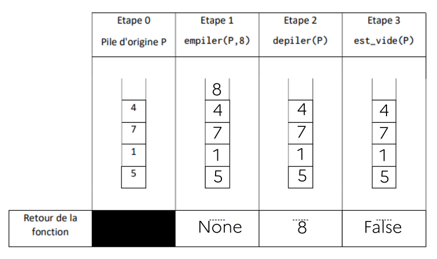

!!! example "Exercice 1"
    === "Énoncé"
        Exercice 5 du sujet [Centres Étrangers 1 - 2021](https://glassus.github.io/terminale_nsi/T6_Annales/data/2021/21_Centres_Etrangers_1.pdf){. target="blank"}

    === "Corr. Q1"
        {: .center width=50%}

    === "Corr. Q2"
        {: .center width=50%}

    === "Corr. Q3"
        ```python linenums='1'
        def maximum(P):
            if est_vide(P):
                return None
            m = depile(P)
            while not est_vide(P):
                val = depile(P)
                if val > m:
                    m = val
            return m
        ```

        Avec le code ci-dessus, la pile ```p``` est vide à la fin de l'exécution. Pour éviter cela, on peut par exemple créer une pile ```q``` temporaire qui recevra les éléments de ```p```, avant de retransférer à la fin du programme les éléments de ```q```  dans ```p```.

        ```python linenums='1'
        def maximum(P):
            Q = creer_pile()
            if est_vide(P):
                return None
            m = depile(P)
            empile(Q, m)
            while not est_vide(P):
                val = depile(P)
                empile(Q, val)
                if val > m:
                    m = val
            while not est_vide(Q):
                empile(P, depile(Q))
            return m
        ``` 

    === "Corr. Q4"
        **Q4a.** On va vider la pile ```p``` dans une pile ```q``` tout en comptant le nombre d'éléments dépilés dans une variable ```t```. 
        On redonne ensuite à ```p``` son état initial en vidant ```q``` dans ```p```.

        **Q4b**

        ```python linenums='1'
        def taille(P):
            if est_vide(P):
                return 0
            Q = creer_pile()
            t = 0
            while not est_vide(P):
                empile(Q, depile(P))
                t += 1
            while not est_vide(Q):
                empile(P, depile(Q))
            return t
        ```

!!! example "Exercice 2"
    === "Énoncé"
        Exercice 1 du sujet [La Réunion J2 - 2022](https://glassus.github.io/terminale_nsi/T6_Annales/data/2022/2022_LaReunion_J2.pdf){. target="blank"}

    === "Corr. Q1"
        {: .center width=70%}

    === "Corr. Q2a"
        La variable ```temp``` contient la valeur 25.

    === "Corr. Q2b"
        ```p1``` est identique, elle contient toujours les valeurs 25, 3 et 7. 

    === "Corr. Q3"
        ```python linenums='1'
        def addition(p):
            nb1 = depiler(p)
            nb2 = depiler(p)
            empiler(p, nb1 + nb2)
        ``` 
    === "Corr. Q4"
        ```python linenums='1'
        p = pile_vide()
        empiler(p, 3)
        empiler(p, 5)
        addition(p)
        empiler(p, 7)
        multiplication(p)
        ```

!!! example "Exercice 3"
    === "Énoncé"
        Exercice 2 du sujet [Métropole Candidats Libres J1 - 2021](https://glassus.github.io/terminale_nsi/T6_Annales/data/2021/21_Metropole_Candidats_libres_1.pdf){. target="blank"}

    === "Corr. Q1a"
        ```python linenums='1'
        pile1 = Pile()
        pile1.empiler(7)
        pile1.empiler(5)
        pile1.empiler(2)
        ```

    === "Corr. Q1b"
        L'affichage produit est ```7, 5, 5, 2```.

    === "Corr. Q2a"
        - Cas n°1 : ```3, 2``` 
        - Cas n°2 : ```3, 2, 5, 7```
        - Cas n°3 : ```3```
        - Cas n°4 : ```«pile vide»```

    === "Corr. Q2b"
        La fonction ```mystere``` permet d'obtenir la pile retournée jusqu'à un élément particulier (s'il existe).

    === "Corr. Q3"
        ```python linenums='1'
        def etendre(pile1, pile2):
            while not pile2.est_vide():
                val = pile2.depiler()
                pile1.empiler(val)
        ```
    === "Corr. Q4"
        ```python linenums='1'
        def supprime_toutes_occurences(pile, element):
            p_temp = Pile()
            while not pile.est_vide():
                val = pile.depiler()
                if val != element:
                    p_temp.empiler(val)
            while not p_temp.est_vide():
                val = p_temp.depiler()
                pile.empiler(val)
        ```

!!! example "Exercice 4"
    === "Énoncé"
        Exercice 5 du sujet [Amérique du Nord J1 - 2021](https://glassus.github.io/terminale_nsi/T6_Annales/data/2021/21_Am%C3%A9rique_du_Nord.pdf){. target="blank"}

    === "Corr. Q1a"
        Le contenu de la pile P sera 

        ```python
        | "rouge" |
        | "vert"  |
        | "jaune" |
        | "rouge" |
        | "jaune" |
         _________
        ```

    === "Corr. Q1b"   
        ```python linenums='1'
        def taille_file(F):
            """File -> Int"""
            F_temp = creer_file_vide()
            n = 0
            while not est_vide(F):
                enfiler(F_temp, defiler(F))
                n += 1
            while not est_vide(F_temp):
                enfiler(F, defiler(F_temp))
            return n
        ```

    === "Corr. Q2"   
        ```python linenums='1'
        def former_pile(F):
            """File -> Pile"""
            P_temp = creer_pile_vide()
            P = creer_pile_vide()
            while not est_vide(F):
                empiler(P_temp, defiler(F))
            while not est_vide(P_temp):
                empiler(P, depiler(P_temp))
            return P
        ```

    === "Corr. Q3"   
        ```python linenums='1'
        def nb_elements(F, elt):
            """File, Int -> Int"""
            F_temp = creer_file_vide()
            n = 0
            while not est_vide(F):
                val = defiler(F)
                if val == elt:
                    n += 1
                enfiler(F_temp, val)
            while not est_vide(F_temp):
                enfiler(F, deFiler(F_temp))
            return n
        ```
    === "Corr. Q4"   
        ```python linenums='1'
        def verifier_contenu(F, nb_rouge, nb_vert, nb_jaune):
            """File, Int, Int, Int -> Bool"""
            return nb_elements(F, "rouge") <= nb_rouge and \
                   nb_elements(F, "vert") <= nb_vert and \
                   nb_elements(F, "jaune") <= nb_jaune
        ```

!!! example "Exercice 5"
    === "Énoncé"
        Exercice 2 du sujet [Centres Étrangers J1 - 2022](https://glassus.github.io/terminale_nsi/T6_Annales/data/2022/2022_Centres_Etrangers_J1.pdf){. target="blank"}

    === "Corr. Q1"
        Il faut écrire l'instruction : 

        ```python
        panier_1.enfile((31002, "café noir", 1.50, 50525))
        ```
    === "Corr. Q2"
        ```python linenums='1'
        def remplir(self, panier_temp):
            while not panier_temp.est_vide():
                article = panier_temp.defile()
                self.enfile(article)
        ```
    === "Corr. Q3"
        ```python linenums='1'
        def prix_total(self):
            total = 0
            panier_temp = Panier()
            while not self.est_vide():
                article = self.defile()
                total += article[2]
                panier_temp.enfile(article)
            self.remplir(panier_temp)
            return total          
 
        ```
    === "Corr. Q4"
        ```python linenums='1'
        def duree_passage_en_caisse(self):
            if self.est_vide():
                return None
            horaire_premier = self.defile()[3]
            while not self.est_vide():
                horaire_dernier = self.defile()[3]
            return horaire_dernier - horaire_premier                 
        ```


??? example "Exercice 6"

    Cet exercice est basé sur l'[énigme n°5](https://adventofcode.com/2018/day/5){. target="_blank"} d'Advent Of Code 2018.

    Le but est de réduire le plus possible une chaîne de caractères (comme ```dabAcCaCBAcCcaDA``` ) en obéissant à la règle suivante :

    !!! tip "Règle de simplification"
        Dès que deux lettres identiques mais de casse différente (majuscule-minuscule ou minuscule-majuscule) sont côte à côte dans la chaîne, on les supprime de la chaîne.

    Exemple : 
    ```
    dabAcCaCBAcCcaDA  On enlève le premier 'cC'.
    dabAaCBAcCcaDA    Cela donne naissance à un 'Aa', qu'on enlève.
    dabCBAcCcaDA      On enlève alors 'cC' (ou 'Cc', cela revient au même).
    dabCBAcaDA        Plus aucune simplification n'est possible.
    ```

    La chaîne de caractères qu'il va falloir simplifier contient ... 50000 caractères.


    #### 1. Élaboration d'une fonction utile

    On rappelle que la fonction ```ord``` renvoie le code ASCII d'une lettre. En comparant les codes ASCII de deux lettres identiques mais de casse différentes, en déduire une fonction ```simplifiable``` qui prend en paramètres deux lettres ```l1``` et ```l2``` et qui renvoie un booléen indiquant si ces deux lettres sont simplifiables. 

    *Exemples d'utilisation :*
    ```python
    >>> simplifiable('c', 'C')
    True
    >>> simplifiable('C', 'c')
    True
    >>> simplifiable('C', 'C')
    False
    ```

    ??? aide "Correction"
        ```python linenums='1'
        def simplifiable(l1, l2):
            return abs(ord(l1) - ord(l2)) == 32
        ```

    #### 2. Une seule simplification de la chaîne de caractères

    Écrire une fonction ```simplifie``` qui prend en paramètre une chaîne de caractère ```s``` et qui renvoie cette même chaîne de caractères, ayant été simplifiée une fois au maximum.

    Principe : on parcourt la chaîne et dès qu'on trouve une simplification à faire, on simplifie la chaîne et on la renvoie immédiatement.


    *Exemples d'utilisation :*
    ```python
    >>> simplifie('dabAcCaCBAcCcaDA')
    'dabAaCBAcCcaDA'
    >>> simplifie('dabAaCBAcCcaDA')
    'dabCBAcCcaDA'
    >>> simplifie('dabCBAcCcaDA')
    'dabCBAcaDA'
    >>> simplifie('dabCBAcaDA')
    'dabCBAcaDA'
    ```

    Pour information, on rappelle la technique de *slicing* de chaîne de caractères :
    ```python
    >>> ch = 'abcde'
    >>> ch[:2]
    'ab'
    >>> ch[2:]
    'cde'
    ```


    ??? aide "Correction"
        ```python linenums='1'
        def simplifie(s):
            for i in range(len(s) - 1):
                if simplifiable(s[i+1], s[i]):
                    return s[:i] + s[i+2:]
            return s
        ```

    #### 3. Résolution du problème

    Après vous être demandé comment savoir facilement qu'une chaîne n'était plus simplifiable, proposer une fonction ```reduction``` qui prend en paramètre une chaîne ```s``` et qui renvoie cette chaîne ```s``` une fois effectuées **toutes** les simplifications possibles.

    *Exemple d'utilisation :*
    ```python
    >>> reduction('dabAcCaCBAcCcaDA')
    'dabCBAcaDA'
    ```

    ??? aide "Correction"
        ```python linenums='1'
        def reduction(s):
            fini = False
            while not fini:
                s_temp = s
                s = simplifie(s)
                if len(s_temp) == len(s):
                    fini = True
            return s
        ```

    #### 4. Le vrai énoncé d'Advent of Code

    Dans cette énigme n°5, la réponse à donner est le nombre de caractères de la chaîne une fois simplifiée. Ce qui ne devrait pas nous poser de problème.

    Par contre, la chaîne ```'dabAcCaCBAcCcaDA'``` sur laquellle nous avons travaillé n'est qu'un exemple...
    La **vraie** chaîne contient 50000 caractères : 

<!--
    ici anciennement inclusion du fichier chaine.md mais plantage ?
-->


    Anecdotique ? Pas vraiment...

    Effectuez la réduction de cette chaîne avec votre programme précédent. Que remarquez-vous ?

    ??? aide "Correction"
        ```python linenums='1'
        s = 'YyLlXxYKkbNnQqBFfxXbyYWwBhHyYTCBbCjI...'

        def simplifiable(l1, l2):
            return abs(ord(l1) - ord(l2)) == 32

        def simplifie(s):
            for i in range(len(s) - 1):
                if simplifiable(s[i+1], s[i]):
                    return s[:i] + s[i+2:]
            return s

        def reduction(s):
            fini = False
            while not fini:
                s_temp = s
                s = simplifie(s)
                if len(s_temp) == len(s):
                    fini = True
            return s

        print(len(reduction(s)))
        ```
        
        Le résultat (9370) est loooong à nous parvenir ! (30 secondes sur ma machine)
    

    #### 5. Sauvé par une pile

    Cet exercice peut être résolu **beaucoup** plus efficacement grâce à l'utilisation d'une pile... mais comment ?

    Vous pouvez utiliser l'implémentation de pile disponible [ici](https://glassus.github.io/terminale_nsi/T1_Structures_de_donnees/1.1_Listes_Piles_Files/cours/#321-a-laide-du-type-list-de-python){. target="_blank"}.


    ??? aide "Aide à la construction de l'algorithme"
        Pour chaque lettre de la chaîne :
        
        - si la pile est vide, on empile cette lettre
        - sinon, on regarde si la lettre est simplifiable avec la lettre du haut de la pile :
            - si oui, on supprime cette lettre du haut de la pile et on passe à la lettre suivante de la chaîne
            - si non, on empile cette lettre sur la pile, et on passe à la suivante.

    ??? aide "Correction"
        ```python linenums='1'
        s = 'YyLlXxYKkbNnQqBFfxXbyYWwBhHyYTCBbCjI...'

        p = Pile() # ne pas oublier de récupérer une implémentation de la classe Pile()...

        def simplifiable(l1, l2):
            return abs(ord(l1) - ord(l2)) == 32

        for lettre in s:
            if p.est_vide():
                p.empile(lettre)
            else:
                sommet = p.depile()
                if not simplifiable(sommet, lettre):
                    p.empile(sommet)
                    p.empile(lettre)

        print(p.taille())     
        ```

        Le résultat est cette fois immédiat : 0.04 secondes sur ma machine, soit environ 1000 fois plus rapide que le code précédent.

### Exercice 7
!!! example "Exercice 7"
    Exercice 3 du sujet [Centres Etrangers J1 - 2023](https://glassus.github.io/terminale_nsi/T6_Annales/data/2023/2023_Centres_Etrangers_J1.pdf){. target="blank"}

    [Jeu du Simon](https://www.memozor.com/fr/jeux-du-simon/jeu-du-simon){. target="_blank"}

    ??? tip "Correction Q1."
        ```python linenums='1' hl_lines='3 4'
        def ajout(f):
            couleurs = ("bleu", "rouge", "jaune", "vert")
            indice = randint(0, 3)
            enfiler(f, couleur[indice])
            return f
        ```

    ??? tip "Correction Q2."
        ```python
        def vider(f):
            while not est_vide(f):
                defiler(f)
        ```

    ??? tip "Correction Q3."
        ```python linenums='1' hl_lines='5 6 8-10'
        def affich_seq(sequence):
            stock = creer_file_vide()
            ajout(sequence)
            while not est_vide(sequence):
                c = defiler(sequence)
                affichage(c)
                time.sleep(0.5)
                enfiler(stock, c)
            while not est_vide(stock):
                enfiler(sequence, defiler(stock))        
        ```

    ??? tip "Correction Q4.a."
        ```python linenums='1' hl_lines='2 6 7 8 10-12'
        def tour_de_jeu(sequence):
            affich_seq(sequence)
            stock = creer_file_vide()
            while not est_vide(sequence):
                c_joueur = saisie_joueur()
                c_seq = defiler(sequence)
                if c_joueur == c_seq:
                    enfiler(stock, c_seq)
                else:
                    vider(sequence)
            while not est_vide(stock):
                enfiler(sequence, defiler(stock))
        ```

    ??? tip "Correction Q4.b."
        Question bizarre...

        ```python linenums='1'
        def tour_de_jeu_modifie(sequence):
            while True:
                affich_seq(sequence)
                stock = creer_file_vide()
                while not est_vide(sequence):
                    c_joueur = saisie_joueur()
                    c_seq = defiler(sequence)
                    if c_joueur == c_seq:
                        enfiler(stock, c_seq)
                    else:
                        vider(sequence)
                        vider(stock)
                while not est_vide(stock):
                    enfiler(sequence, defiler(stock))
        ```
        
        ou bien

        ```python linenums='1'
        def tour_de_jeu_modifie(sequence):
            affich_seq(sequence)
            stock = creer_file_vide()
            while not est_vide(sequence):
                c_joueur = saisie_joueur()
                c_seq = defiler(sequence)
                if c_joueur == c_seq:
                    enfiler(stock, c_seq)
                else:
                    vider(sequence)
                    print("Perdu ! On rejoue !")
                    tour_de_jeu_modifie(sequence)
            while not est_vide(stock):
                enfiler(sequence, defiler(stock))
            tour_de_jeu_modifie(sequence)
        ```
