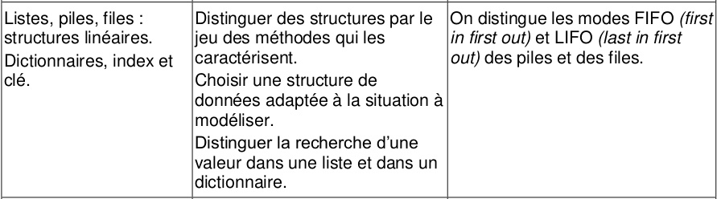
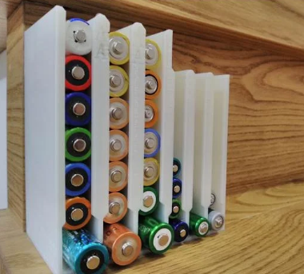
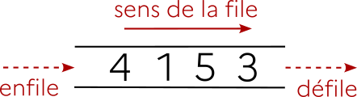

# Listes, piles, files
*Exemples de structures de données linéaires.*

{: .center width=40%}


{: .center}
{: .center}


## 0. Préambule : interface ≠ implémentation :star: :star: :star:

Les structures que nous allons voir peuvent s'envisager sous deux aspects :

- le côté utilisateur, qui utilisera une interface pour manipuler les données.
- le côté concepteur, qui aura choisi une implémentation pour construire la structure de données.

!!! note "Un exemple d'interface et d'implémentation"
    - Le volant et les pédales d'une voiture constituent une partie de son **interface**.
    - L'**implémentation** va désigner tous les mécanismes techniques qui sont mis en œuvre pour que (par exemple) le mouvement de rotation du volant aboutisse à un changement de direction des roues.
    - La standardisation des interfaces fait qu'un utilisateur peut passer sans problème d'une voiture à une autre, même si l'implémentation est complètement différente.

    {: .center width=50%}

Nous avons déjà abordé ces deux aspects lors de la découverte de la Programmation Orientée Objet. Le principe d'encapsulation fait que l'utilisateur n'a qu'à connaître l'existence des méthodes disponibles, et non pas le contenu technique de celle-ci. Cela permet notamment de modifier le contenu technique (l'implémentation) sans que les habitudes de l'utilisateur (l'interface) ne soient changées.

## 1. Structures de données linéaires 

### 1.1 À chaque donnée sa structure
En informatique comme dans la vie courante, il est conseillé d'adapter sa manière de stocker et de traiter des données en fonction de la nature de celles-ci :

- Le serveur d'un café, chargé de transporter les boissons du comptoir aux tables des clients, n'utilisera pas un sac en plastique pour faire le transport : il préfèrera un plateau. 
- Le chercheur de champignons, lui, n'utilisera pas un plateau pour stocker ses trouvailles : il préfèrera un panier.
- Pour stocker des chaussettes, on préfèrera les entasser dans un tiroir (après les avoir appairées), plutôt que de les suspendre à des cintres. 

De même en informatique, pour chaque type de données, pour chaque utilisation prévue, une structure particulière de données se revèlera (peut-être) plus adaptée qu'une autre.

#### 1.1.1 Données linéaires
Intéressons nous par exemple aux **données linéaires**. Ce sont des données qui ne comportent pas de *hiérarchie* : toutes les données sont de la même nature et ont le même rôle. 
Par exemple, un relevé mensuel de températures, la liste des élèves d'une classe, un historique d'opérations bancaires... 

Ces données sont «plates», n'ont pas de sous-domaines : la structure de **liste** paraît parfaitement adaptée. 

Lorsque les données de cette liste sont en fait des couples (comme dans le cas d'une liste de noms/numéros de téléphone), alors la structure la plus adaptée est sans doute celle du **dictionnaire**.

Les listes et les dictionnaires sont donc des exemples de structures de **données linéaires**.

#### 1.1.2 Données non-linéaires
Même si ce n'est pas l'objet de ce cours, donnons des exemples de structures adaptées aux données non-linéaires :

Si une liste de courses est subdivisée en "rayon frais / bricolage / papeterie" et que le rayon frais est lui-même séparé en "laitages / viandes / fruits & légumes", alors une structure d'**arbre** sera plus adaptée pour la représenter. Les structures arborescentes seront vues plus tard en Terminale.

Enfin, si nos données à étudier sont les relations sur les réseaux sociaux des élèves d'une classe, alors la structure de **graphe** s'imposera d'elle-même. Cette structure sera elle-aussi étudiée plus tard cette année. 

### 1.2 Comment seront traitées ces données linéaires ? Introduction des listes, des piles et des files

La nature des données ne fait pas tout. Il faut aussi s'intéresser à la manière dont on voudra les traiter :

- À quelle position les faire entrer dans notre structure ?
- À quel moment devront-elles en éventuellement en sortir ?
- Veut-on pouvoir accéder rapidement à n'importe quel élément de la structure, ou simplement au premier ? ou au dernier ?

Lorsque ces problématiques d'entrée/sortie n'interviennent pas, la structure «classique» de liste est adaptée. Mais lorsque celle-ci est importante, il convient de différencier la structure de **pile** de celle de **file**.

#### 1.2.1 Les piles (*stack*)

{: .center width=30%}


Une structure de **pile** (penser à une pile d'assiette) est associée à la méthode **LIFO** (Last In, First Out) :
les éléments sont empilés les uns au-dessus des autres, et on ne peut toujours dépiler que l'élément du haut de la pile. Le dernier élément à être arrivé est donc le premier à être sorti.


{: .center}


**Exemples de données stockées sous forme de pile** 

- lors de l'exécution d'une fonction récursive, le processeur empile successivement les appels à traiter : seule l'instruction du haut de la pile peut être traitée.

{: .center}

- dans un navigateur internet, la liste des pages parcourues est stockée sous forme de pile : la fonction «Back» permet de «dépiler» peu à peu les pages précédemment parcourues : 
{: .center}
- lors d'un Devoir Surveillé, la dernière copie remise sur le bureau du professeur est (souvent) la première corrigée.


#### 1.2.2 Les files (*queue*)

{: .center width=40%}


Une structure de **file** (penser à une file d'attente) est associée à la méthode **FIFO** (First In, First Out) :
les éléments sont enfilés les uns à la suite des autres, et on ne peut toujours défiler que l'élément du haut de la file. Le premier élément à être arrivé est donc le premier à en sortir. Sinon ça râle dans la file d'attente.
{: .center}

**Exemples de données stockées sous forme de file :** 

- les documents envoyés à l'imprimante sont traitées dans une file d'impression.
- la «queue» à la cantine est (normalement) traitée sous forme de file.

#### 1.2.3 Le problème du stockage : transformer les piles en files
Dans les entrepôts de stockage, comme dans les rayons d'un supermarché, la structure naturelle est celle de la **pile** : les gens attrapent l'élément situé devant eux («en haut de la pile»). Si les employés du supermarché remettent en rayon les produits plus récents sur le dessus de la pile, les produits au bas de la pile ne seront jamais choisis et périmeront.  
Ils doivent donc transformer la pile en file : lors de la mise en rayon de nouveaux produits, ceux-ci seront placés derrière («au bas de la file») afin que partent en priorité les produits à date de péremption plus courte.
On passe donc du LIFO au FIFO.  

Certains dispositifs permettent de le faire naturellement :  
Ci-dessous, une file... de piles (électriques). Le chargement par le haut du distributeur fait que celle qui sera sortie (en bas) sera celle qui aura été rentrée en premier (par le haut). Ce FIFO est donc provoqué naturellement par la gravité (et un peu d'astuce).
{: .center}
On notera que cette problématique est universelle : voir par exemple [ce site](https://www.mecalux.fr/blog/methode-lifo-fifo-peps){:target="_blank"}.


Après avoir présenté rapidement ces trois types de données linéaires, nous allons maintenant les étudier plus en détail, et proposer pour chacune d'elles une interface et plusieurs implémentations.

## 2. Les listes

### 2.1 Définition générale
Une liste est un ensemble ordonné d'objets. Généralement, ces données seront de même type, mais ce n'est pas structurellement obligatoire.

### 2.2 Les listes chaînées *(linked lists)*

{: .center width=40%}


Lorsque l'implémentation de la liste fait apparaître une chaîne de valeurs, chacune pointant vers la suivante, on dit que la liste est une liste **chaînée**.

{: .center}

**Implémentation choisie :**

- Une liste est caractérisée par un ensemble de cellules.
- Le lien (on dira souvent le «pointeur») de la variable est un lien vers la première cellule, qui renverra elle-même sur la deuxième, etc.
- Chaque cellule contient donc une valeur et un lien vers la cellule suivante.
- Une liste peut être vide (la liste vide est notée ```x``` ou bien ```None``` sur les schémas)

Une conséquence de cette implémentation sous forme de liste chaînée est la non-constance du temps d'accès à un élément de liste : pour accéder au 3ème élément, il faut obligatoirement passer par les deux précédents.

**À retenir :** dans une liste chaînée, le temps d'accès aux éléments n'est pas constant.


### 2.3 Exemple d'implémentation minimale d'une liste chaînée

!!! note "Exemple fondateur : implémentation d'une **liste chainée** en POO :heart:"
    ```python linenums='1'
    class Cellule :
        def __init__(self, contenu, suivante):
            self.contenu = contenu
            self.suivante = suivante
    ```

Cette implémentation rudimentaire permet bien la création d'une liste :


```python
>>> lst = Cellule(3, Cellule(5, Cellule(1,None)))
```

La liste créée est donc :   

Mais plus précisément, on a :

{: .center}

{{initexo(0)}}
!!! example "{{ exercice() }}"
    === "Énoncé"
        Retrouvez comment accéder aux éléments 3, 5 et 1.
    === "Correction"
        {{ correction(True,
        "
        ```python
        >>> lst.contenu
        3
        >>> lst.suivante.contenu
        5
        >>> lst.suivante.suivante.contenu
        1
        ``` 
        "
        ) }}


On pourra remarquer que l'interface proposée à l'utilisateur n'est pas des plus pratiques...

### 2.4 Et les listes de Python ???

Nous connaissons déjà les listes de Python :


```python
>>> maliste = [3, 1, -1, 42]
```

Et nous connaissons aussi (un peu) l'interface de ce type ```list```, notamment avec les méthodes ```append()``` ou ```reverse()```.  
Néanmoins, l'implémentation qui a été choisie par les concepteurs de Python de ce type ```list``` fait que le celui-ci se rapproche plus d'un **tableau dynamique**. 

**Dans un tableau dynamique :**

- le temps d'accès à n'importe quel élément est rapide. Ce temps d'accès est constant quelque soit l'élément : on dit que l'accès est en $O(1)$.
- l'insertion d'un élément au début ou au milieu de la liste est lente : cela oblige à décaler tous les éléments à droite de celui-ci. Le temps pris par l'insertion est proportionnel au nombre d'éléments à déplacer : on dit que l'insertion est en $O(n)$.

**Dans une liste chaînée :**

- le temps d'accès à n'importe quel élément peut être lent (proportionnel à la position de l'élément dans la liste). Le temps d'accès est en $O(n)$.
- l'insertion d'un élément à l'intérieur de la liste est rapide : il y a simplement à modifier la valeur du lien de la cellule à gauche de l'endroit d'insertion. L'action d'insérer est donc en $O(1)$. Toutefois, avant d'arriver à l'endroit d'insertion, il faut avoir parcouru toutes les cellules précédentes ! Le temps total d'insertion est donc lui aussi linéaire, en $O(n)$.

Nous nous servirons parfois du type ```list``` de Python dans la suite de ce cours, mais il ne faut pas oublier qu'il n'est pas un «vrai» type ```list```.

### 2.5 Un exemple d'interface pour les listes

Imaginons que nous possédons une interface offrant les fonctionnalités suivantes :

- ```Liste()``` : crée une liste vide.
- ```est_vide``` : indique si la liste est vide. (renvoie un booléen)
- ```ajoute_tete``` : insère un élément (passé en paramètre) en tête de liste. (ne renvoie rien)
- ```renvoie_tete``` : renvoie la valeur de l'élément en tête de liste ET le supprime de la liste.


!!! example "{{ exercice() }}"
    === "Énoncé"
        On considère l'enchaînement d'opérations ci-dessous. Écrire à chaque étape l'état de la liste ```lst``` et la valeur éventuellement renvoyée.
        ```python
        1. lst = Liste()      
        2. lst.ajoute_tete(3)
        3. lst.ajoute_tete(5) 
        4. lst.ajoute_tete(1) 
        5. lst.renvoie_tete() 
        6. lst.est_vide()     
        7. lst.ajoute_tete(2) 
        8. lst.renvoie_tete() 
        9. lst.renvoie_tete() 
        10. lst.renvoie_tete()
        11. lst.est_vide()    
        ```
    === "Correction"
        {{ correction(True,
        "
        ```python
        1. lst = Liste()      # lst = None
        2. lst.ajoute_tete(3) # lst = 3
        3. lst.ajoute_tete(5) # lst = 3 5 
        4. lst.ajoute_tete(1) # lst = 3 5 1
        5. lst.renvoie_tete() # lst = 3 5 valeur renvoyée : 1
        6. lst.est_vide()     # valeur renvoyée : False
        7. lst.ajoute_tete(2) # lst = 3 5 2
        8. lst.renvoie_tete() # lst = 3 5 valeur renvoyée : 2
        9. lst.renvoie_tete() # lst = 3 valeur renvoyée : 5
        10. lst.renvoie_tete()# lst = None valeur renvoyée : 3
        11. lst.est_vide()    #  valeur renvoyée : True
        ```
        "
        ) }}


## 3. Les piles

{: .center}

Comme expliqué précédemment, une pile travaille en mode LIFO (Last In First Out).
Pour être utilisée, l'interface d'une pile doit permettre a minima :

- la création d'une pile vide
- l'ajout d'un élément dans la pile (qui sera forcément au dessus). On dira qu'on **empile**.
- le retrait d'un élément de la pile (qui sera forcément celui du dessus) et le renvoi de sa valeur. On dira qu'on **dépile**.


### 3.1 Utilisation d'une interface de pile

!!! example "{{ exercice() }}"
    === "Énoncé"
        On considère l'enchaînement d'opérations ci-dessous. Écrire à chaque étape l'état de la pile ```p``` et la valeur éventuellement renvoyée.

        Bien comprendre que la classe ```Pile()``` et ses méthodes n'existent pas vraiment. Nous *jouons* avec son interface.

        On prendra pour convention que la tête de la pile est à droite.

        ```python
        1. p = Pile() 
        2. p.empile(3)   
        3. p.empile(5)  
        4. p.est_vide()  
        4. p.empile(1)  
        5. p.depile()  
        6. p.depile() 
        7. p.empile(9)  
        8. p.depile()  
        9. p.depile() 
        10. p.est_vide() 
        ```
    === "Correction"
        {{ correction(True,
        "
        ```python
        1. p = Pile()  # p = None
        2. p.empile(3)   # p = 3
        3. p.empile(5)  # p = 3 5 par convention
        4. p.est_vide()  #  False
        4. p.empile(1)  # p = 3 5 1
        5. p.depile()  # p = 3 5    valeur renvoyée : 1
        6. p.depile()  # p = 3      valeur renvoyée : 5
        7. p.empile(9)  # p = 3 9
        8. p.depile()  # p = 3       valeur renvoyée :9
        9. p.depile()  # p est vide      valeur renvoyée : 3
        10. p.est_vide() # True
        ```
        "
        ) }}


### 3.2 Implémentation(s) d'une pile

L'objectif est de créer une classe ```Pile```. L'instruction  ```Pile()```  créera une pile vide. Chaque objet ```Pile``` disposera des méthodes suivantes :

- ```est_vide``` : indique si la pile est vide (renvoie un booléen)
- ```empile``` : insère un élément (passé en paramètre) en haut de la pile. Ne renvoie rien.
- ```depile``` : renvoie la valeur de l'élément en haut de la pile ET le supprime de la pile.

Ces 3 méthodes sont essentielles et se retrouveront systématiquement dans chaque interface. Nous y ajouterons, uniquement par commodité, la méthode suivante :

- ```__repr__``` : permet d'afficher la pile sous forme agréable (par ex : ```|3|6|2|5|```)

#### 3.2.1 À l'aide du type ```list``` de Python 


!!! example "{{ exercice() }}"
    === "Énoncé"
        Créer la classe ```Pile```   ci-dessus. 
        
        Le type ```list``` de Python est parfaitement adapté. Des renseignements intéressants à son sujet peuvent être trouvés [ici](https://docs.python.org/fr/3/tutorial/datastructures.html#more-on-lists).
    === "Correction :heart:"
        {{ correction(True,
        "
        ```python linenums='1'
        class Pile:
            def __init__(self):
                self.data = []
            
            def est_vide(self):
                return len(self.data) == 0 
            
        
            def empile(self,x):
                self.data.append(x)

            def depile(self):
                if self.est_vide():
                    print('Vous avez essayé de dépiler une pile vide !')
                    return None
                else :
                    return self.data.pop() 

            def __repr__(self):       # Hors-Programme : pour afficher 
                s = '|'              # convenablement la pile avec p
                for k in self.data :
                    s = s + str(k) + '|'
                return s  
        ```
        Test de l'implémentation :
        ```python
        >>> p = Pile()
        >>> p.empile(5)
        >>> p.empile(3)
        >>> p.empile(7)
        >>> p
        |5|3|7|
        ```
        
        "
        ) }}


#### 3.2.2 À l'aide d'une liste chaînée et de la classe  ```Cellule``` créée au 2.3

Au **2.3** nous avons créé la classe  ```Cellule``` :


```python linenums='1'
class Cellule :
    def __init__(self, contenu, suivante):
        self.contenu = contenu
        self.suivante = suivante
```

!!! example "{{ exercice() }}"
    === "Énoncé"
        À l'aide cette classe, re-créer une classe ```Pile``` disposant exactement de la même interface que dans l'exercice précédent.

    === "Correction"
        {{ correction(True,
        "
        ```python linenums='1'
        class Cellule :
        def __init__(self, contenu, suivante):
            self.contenu = contenu
            self.suivante = suivante

        class Pile:
            def __init__(self):
                self.data = None
            
            def est_vide(self):
                return self.data == None
            
            def empile(self, val):
                self.data = Cellule(val, self.data)
            
            def depile(self):
                v = self.data.contenu #on récupère la valeur à renvoyer
                self.data = self.data.suivante  # on supprime la 1ère cellule  
                return v
            
            def __repr__(self):
                s = '|'
                c = self.data
                while c != None :
                    s += str(c.contenu) + '|'
                    c = c.suivante
                return s

        ```
        
        Test de l'implémentation :
        ```python
        >>> p = Pile()
        >>> p.empile(5)
        >>> p.empile(3)
        >>> p.empile(7)
        >>> print(p)
        |7|3|5|
        ```
        "
        ) }}


**À retenir :** 
pour l'utilisateur, les interfaces du 3.2.1 et 3.2.2 sont strictement identiques. Il ne peut pas savoir, en les utilisant, l'implémentation qui est derrière. 
{: .center}

### 3.3 Application des piles

!!! example "{{ exercice() }}"
    === "Énoncé"
        Simulez une gestion de l'historique de navigation internet, en créant une classe ```Nav``` qui utilisera une pile.
        Attention, il ne faut pas réinventer la classe ```Pile```, mais uniquement s'en servir !
        
        Exemple d'utilisation :
        ```python 
        >>> n = Nav()
        >>> n.visite('lemonde.fr')
        page actuelle : lemonde.fr
        >>> n.visite('google.fr')
        page actuelle : google.fr
        >>> n.visite('lyceemauriac.fr')
        page actuelle : lyceemauriac.fr
        >>> n.back()
        page quittée : lyceemauriac.fr
        >>> n.back()
        page quittée : google.fr
        ```

    === "Correction"
        {{ correction(False,
        "
        ```python linenums='1'
        class Nav:
            def __init__(self):
                self.pile = Pile()
            
            def visite(self, page):
                self.pile.empile(page)
                print('page actuelle :', page)
            
            def back(self):
                page_quittee = self.pile.depile()
                print('page quittée :', page_quittee)
        ```      
        "
        ) }}


## 4. Les files

{: .center}

Comme expliqué précédemment, une file travaille en mode FIFO (First In First Out).
Pour être utilisée, une interface de file doit proposer a minima :

- la création d'une file vide
- l'ajout d'un élément dans la file. On dira qu'on **enfile**.
- le retrait d'un élément de la file et le renvoi de sa valeur. On dira qu'on **défile**.


La représentation la plus courante d'une file se fait horizontalement, en enfilant par la gauche et en défilant par la droite :

{: .center}


### 4.1 Utilisation d'une interface de file

!!! example "{{ exercice() }}"
    === "Énoncé"
        On considère l'enchaînement d'opérations ci-dessous. Écrire à chaque étape l'état de la file ```f``` et la valeur éventuellement renvoyée.
        Par convention, on enfilera **à gauche** et on défilera **à droite**.
        ```python
        1. f = File()
        2. f.enfile(3) 
        3. f.enfile(5)
        4. f.est_vide()
        5. f.enfile(1) 
        6. f.defile() 
        7. f.defile()
        8. f.enfile(9) 
        9. f.defile() 
        10. f.defile()
        11. f.est_vide() 
        ```
    === "Correction"
        {{ correction(False,
        "
        ```python
        1. f est vide
        2. f = 3
        3. f = 5 3
        4. val renvoyée : False
        5. f  = 1 5 3
        6. val renvoyée : 3 , f = 1 5
        7. val renvoyée : 5 , f =  1 
        8. f =  9 1
        9. val renvoyée : 1 , f =  9 
        10. val renvoyée : 9 , f est vide  
        11. val renvoyée : True
        ```
        "
        ) }}


### 4.2 Implémentation d'une file
L'objectif est de créer une classe ```File```, disposant des méthodes suivantes :

- ```est_vide``` : indique si la file est vide. (renvoie un booléen)
- ```enfile``` : insère un élément (passé en paramètre) en queue de file. (ne renvoie rien)
- ```defile``` : renvoie la valeur de l'élément en tête de la file ET le supprime de la file.

Nous y ajouterons comme précédemment la méthode facultative suivante :

- ```__repr__``` : permet d'afficher la file sous forme agréable (par ex : ```|3|6|2|5|```)


!!! example "Exercice"
    === "Énoncé"
        Créer la classe ci-dessus. Là encore, le type ```list```  de Python est peut être utilisé.
        
        Penser à aller voir [ici](https://docs.python.org/fr/3/tutorial/datastructures.html#more-on-lists) les méthodes des objets de types ```list```, notamment la méthode ```insert```.

    === "Correction"
        {{ correction(False,
        "
        ```python linenums='1'
        class File:
            def __init__(self):
                self.data = []
            
            def est_vide(self):
                return len(self.data) == 0 
                    
            def enfile(self, x):
                self.data.insert(0, x)

            def defile(self):
                if self.est_vide():
                    print('Vous avez essayé de défiler une file vide !')
                    return None
                else :
                    return self.data.pop() 

            def __str__(self):       # Hors-Programme : pour afficher 
                s = '|'              # convenablement la file avec print(p)
                for k in self.data:
                    s = s + str(k) + '|'
                return s
        ```

        ```python
        >>> f = File()
        >>> f.enfile(5)
        >>> f.enfile(8)
        >>> print(f)
        |8|5|
        >>> f.defile()
        5
        ```


        "
        ) }}


**Remarque :**  
Notre implémentation répond parfaitement à l'interface qui était demandée. Mais si le «cahier des charges» obligeait à ce que les opérations ```enfile()``` et ```defile()``` aient lieu en temps constant (en $O(1)$), notre implémentation ne conviendrait pas.  

En cause : notre méthode ```enfile()``` agit en temps linéaire  ($O(n)$) et non pas en temps constant. L'utilisation de la structure de «liste» de Python (les *tableaux dynamiques*) provoque, lors de l'instruction ```self.data.insert(0, x)``` un redimensionnement de la liste. Le tableau doit être agrandi et chaque élément doit être recopié dans la case suivante. Ceci nous coûte un temps linéaire.

### 4.3 Implémentation d'une file avec deux piles

Comment créer une file avec 2 piles ?  
L'idée est la suivante : on crée une pile d'entrée et une pile de sortie. 

- quand on veut enfiler, on empile sur la pile d'entrée.
- quand on veut défiler, on dépile sur la pile de sortie.
- si celle-ci est vide, on dépile entièrement la pile d'entrée dans la pile de sortie.


<center>
<gif-player src="https://glassus.github.io/terminale_nsi/T1_Structures_de_donnees/1.1_Listes_Piles_Files/data/2piles1file.gif" speed="1" play></gif-player>
</center>


```python linenums='1'
# il est impératif de comprendre qu'on peut choisir l'implémentation
# de la classe Pile qu'on préfère parmi les deux traitées plus haut.
# Comme elles ont la MÊME INTERFACE et qu'on ne va se servir que
# de cette interface, leur mécanisme interne n'a aucune influence
# sur le code de la classe File que nous ferons ensuite.

# Par exemple, on choisit celle avec la liste chaînée :

class Cellule :
    def __init__(self, contenu, suivante):
        self.contenu = contenu
        self.suivante = suivante


class Pile:
    def __init__(self):
        self.data = None
    
    def est_vide(self):
        return self.data == None
    
    def empile(self, x):
        self.data = Cellule(x, self.data)
    
    def depile(self):
        v = self.data.contenu #on récupère la valeur à renvoyer
        self.data = self.data.suivante  # on supprime la 1ère cellule  
        return v
    
    def __str__(self):
        s = "|"
        c = self.data
        while c != None :
            s += str(c.contenu)+"|"
            c = c.suivante
        return s

# -------------------------------------------------------    
# Implémentation d'une file à l'aide de deux piles 

class File:
    def __init__(self):
        self.entree = Pile()
        self.sortie = Pile()
   
    def est_vide(self):
        return self.entree.est_vide() and self.sortie.est_vide()

    def enfile(self,x):
        self.entree.empile(x)

    def defile(self):
        if self.est_vide():
            print("File vide !")
            return None

        if self.sortie.est_vide():
            while not self.entree.est_vide():
                self.sortie.empile(self.entree.depile())

        return self.sortie.depile()
    
    
```


```python
>>> f = File()
>>> f.enfile(5)
>>> f.enfile(8)
>>> f.defile()
5
```


---
## Bibliographie
- Numérique et Sciences Informatiques, Terminale, T. BALABONSKI, S. CONCHON, J.-C. FILLIATRE, K. NGUYEN, éditions ELLIPSES.
- Prépabac NSI, Terminale, G.CONNAN, V.PETROV, G.ROZSAVOLGYI, L.SIGNAC, éditions HATIER.
- Cours du DIU-EIL, David RENAULT, Université de Bordeaux.


---

