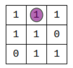

# Exercices sur les dictionnaires

{{initexo(0)}}

!!! example "{{ exercice() }}"
    On considère la liste suivante :
    ```lst = ['5717', '1133', '5545', '4031', '6398', '2734', '3070', '1346', '7849', '7288', '7587', '6217', '8240', '5733', '6466', '7972', '7341', '6616', '5061', '2441', '2571', '4496', '4831', '5395', '8584', '3033', '6266', '2452', '6909', '3021', '5404', '3799', '5053', '8096', '2488', '8519', '6896', '7300', '5914', '7464', '5068', '1386', '9898', '8313', '1072', '1441', '7333', '5691', '6987', '5255']``` 

    Quel est le **chiffre** qui revient le plus fréquemment dans cette liste ?

     
    {{
    correction(True,
    """
    ??? success \"Correction\" 
        ```python linenums='1'
        lst = ['5717', '1133', '5545', '4031', '6398', '2734', '3070', '1346', '7849', '7288', '7587', '6217', '8240', '5733', '6466', '7972', '7341', '6616', '5061', '2441', '2571', '4496', '4831', '5395', '8584', '3033', '6266', '2452', '6909', '3021', '5404', '3799', '5053', '8096', '2488', '8519', '6896', '7300', '5914', '7464', '5068', '1386', '9898', '8313', '1072', '1441', '7333', '5691', '6987', '5255']

        occ = {}
        maxi = 0
        for nombre in lst:
            for chiffre in nombre:
                if chiffre in occ:
                    occ[chiffre] += 1
                else:
                    occ[chiffre] = 1
                if occ[chiffre] > maxi:
                    maxi = occ[chiffre]
                    chiffre_max = chiffre

        print(chiffre_max, 'est le chiffre le plus fréquent')
        print('il apparait', maxi, 'fois')

        ```        
    """
    )
    }}


!!! example "{{ exercice() }}"
    Exercice 2 du sujet [Centres Etrangers J1 2021](https://glassus.github.io/terminale_nsi/T6_Annales/data/2021/21_Centres_Etrangers_1.pdf){. target="_blank"}

    {{
    correction(True,
    """
    ??? success \"Correction Q1.a. \" 
        ```flotte[26]``` renvoie  ```{'type' : 'classique', 'etat' : 1, 'station' : 'Coliseum'}```
    """
    )
    }}

    {{
    correction(True,
    """
    ??? success \"Correction Q1.b. \" 
        ```flotte[80]['etat']``` renvoie la valeur ```0```. 
    """
    )
    }}

    {{
    correction(True,
    """
    ??? success \"Correction Q1.c. \" 
        ```flotte[99]['etat']``` renverra une erreur car la clé 99 n'existe pas. 
    """
    )
    }}


    {{
    correction(True,
    """
    ??? success \"Correction Q2.a. \" 
        Les valeurs possibles pour ```choix``` sont ```electrique``` ou ```classique```. 
    """
    )
    }}

    {{
    correction(True,
    """
    ??? success \"Correction Q2.b. \" 
        En fonction du choix (```electrique``` ou ```classique```), cette fonction va renvoyer le nom de la première station où un vélo est disponible (à l'```etat``` 1).  
        Seule la première station sera renvoyée, à cause du ```return```. Si aucun vélo n'est disponible, la fonction ne renverra rien. 
    """
    )
    }}

    {{
    correction(True,
    """
    ??? success \"Correction Q3.a. \" 
        ```python linenums='1'
        for id_velo in flotte:
            if flotte[id_velo]['station'] == 'Citadelle' and flotte[id_velo]['etat'] == 1:
                print(id_velo)
        ``` 
    """
    )
    }}


    {{
    correction(True,
    """
    ??? success \"Correction Q3.b. \" 
        ```python linenums='1'
        for id_velo in flotte:
            if flotte[id_velo]['type'] == 'electrique' and flotte[id_velo]['etat'] != -1:
                print(id_velo, flotte[id_velo]['station'])
        ``` 
    """
    )
    }}

    {{
    correction(True,
    """
    ??? success \"Correction Q4. \" 
        ```python linenums='1'
        def velo_finder(coordonnees):
            velo_dispo = []
            for id_velo in flotte:
                d = distance(coordonnees, stations[flotte[id_velo]['station']])
                if d < 800 and flotte[id_velo]['etat'] == 1:
                    velo_dispo.append((flotte[id_velo]['station'], d, id_velo))
            return velo_dispo
        ```        
    """
    )
    }}

!!! example "{{ exercice() }} : création d'une rainbow table :rainbow:"
    Créer une fonction ```inverse_md5``` qui va chercher dans un dictionnaire (construit préalablement) le mot correspondant au hash donné en paramètre.

    À quel mot de passe correspond le hash ```33da7a40473c1637f1a2e142f4925194``` ?

    **Exemple :** 
    ```
    >>> inverse_md5('0571749e2ac330a7455809c6b0e7af90')
    >>> 'sunshine'
    ```


    **Aide :**

    - liste de 1000 mots de passe fréquents : [ici](http://glassus1.free.fr/extraitrockyou.txt)
    - comment lire / convertir le contenu d'un fichier dans une liste de ```string``` :
    ```python
    lst = open("monfichier.txt").read().splitlines()
    ```
    - comment calculer du MD5 en Python : 
    ```python
    import hashlib
    result = hashlib.md5('azerty'.encode())
    print(result.hexdigest())
    ```

    {{
    correction(True,
    """
    ??? success \"Correction\" 
        ```python linenums='1'
        import hashlib

        lst = open('extraitrockyou.txt').read().splitlines()
        inv_hash = {}
        for mdp in lst:
            hsh = hashlib.md5(mdp.encode()).hexdigest()
            inv_hash[hsh] = mdp


        def inverse_md5(hsh):
            return inv_hash[hsh]
        ```
    """
    )
    }}

!!! example "{{ exercice() }}"
    Le nombre d’occurrences d’un caractère dans une chaîne de caractère est le nombre
    d’apparitions de ce caractère dans la chaîne.

    Exemples :

    - le nombre d’occurrences du caractère `‘o’` dans `‘bonjour’` est 2 ;
    - le nombre d’occurrences du caractère `‘b’` dans `‘Bébé’` est 1 ;
    - le nombre d’occurrences du caractère `‘B’` dans `‘Bébé’` est 1 ;
    - le nombre d’occurrences du caractère `‘ ‘` dans `‘Hello world !’` est 2.

    On cherche les occurrences des caractères dans une phrase. On souhaite stocker ces
    occurrences dans un dictionnaire dont les clefs seraient les caractères de la phrase et
    les valeurs le nombre d’occurrences de ces caractères.

    Par exemple : avec la phrase `'Hello world !'` le dictionnaire est le suivant :

    `{'H': 1,'e': 1,'l': 3,'o': 2,' ': 2,'w': 1,'r': 1,'d': 1,'!': 1}`

    *L’ordre des clefs n’a pas d’importance.*

    Écrire une fonction `nbr_occurrences` prenant comme paramètre une chaîne de
    caractères `chaine` et renvoyant le dictionnaire des nombres d’occurrences des
    caractères de cette chaîne.    

    {{
    correction(True,
    """
    ??? success \"Correction\" 
        ```python linenums='1'
        def nbr_occurrences(chaine):
            nb_occ = {}
            for caractere in chaine:
                if caractere in nb_occ:
                    nb_occ[caractere] += 1
                else:
                    nb_occ[caractere] = 1
            return nb_occ
        ```
    """
    )
    }}

!!! example "{{ exercice() }}"
    Écrire une fonction `ajoute_dictionnaires` qui prend en paramètres deux
    dictionnaires `d1` et `d2` dont les clés sont des nombres et renvoie le dictionnaire `d` défini de
    la façon suivante :

    - Les clés de `d` sont celles de `d1` et celles de `d2` réunies.
    - Si une clé est présente dans les deux dictionnaires `d1` et `d2`, sa valeur associée
    dans le dictionnaire `d` est la somme de ses valeurs dans les dictionnaires `d1` et `d2`.
    - Si une clé n’est présente que dans un des deux dictionnaires, sa valeur associée
    dans le dictionnaire `d` est la même que sa valeur dans le dictionnaire où elle est
    présente.

    Exemples :

    ```python
    >>> ajoute_dictionnaires({1: 5, 2: 7}, {2: 9, 3: 11})
    {1: 5, 2: 16, 3: 11}
    >>> ajoute_dictionnaires({}, {2: 9, 3: 11})
    {2: 9, 3: 11}
    >>> ajoute_dictionnaires({1: 5, 2: 7}, {})
    {1: 5, 2: 7}
    ```

    {{
    correction(True,
    """
    ??? success \"Correction\" 
        ```python linenums='1'
        def ajoute_dictionnaires(d1, d2):
            d = {}
            for cle in d1:
                d[cle] = d1[cle]
            for cle in d2:
                if cle in d:
                    d[cle] += d2[cle]
                else:
                    d[cle] = d2[cle]
            return d
        ```
    """
    )
    }}
        

!!! example "{{ exercice() }} <i id="ex1J2AN2025"></i>"

    Exercice 1 du sujet [Amérique du Nord J2 2025](https://glassus.github.io/terminale_nsi/T6_Annales/data/2025/25_NSIJ2AN1.pdf){. target="_blank"}

    **Partie A**

    {{
    correction(True,
    """
    ??? success \"Correction Q1 \"
        ```01100001```  
        
    """
    )
    }}    

    {{
    correction(True,
    """
    ??? success \"Correction Q2 \"
        ```replique([0,0,1,0,1])``` renvoie ```[0,0,0,0,0,0,1,1,1,0,0,0,1,1,1]```   
        
    """
    )
    }}    

    ```python linenums='1'
    def nb_occurrences(tab, i):
        '''
        Renvoie un dictionnaire qui associe, à chaque élément
        apparaissant dans tab entre la position 3i
        incluse et la position 3(i + 1) exclue,
        son nombre d'occurrences.
        >>> nb_occurrences([0, 0, 1, 1, 0, 1, 0, 1, 1], 1)
        {1: 2, 0: 1}
        '''
        nb_occ = {}
        for j in range(3 * i, 3 * (i + 1)):
            x = tab[j]
            if x in nb_occ:
                ...
            else:
                ...
        return nb_occ

    ```


    {{
    correction(True,
    """
    ??? success \"Correction Q3 \"
        ```python linenums='1'
        def nb_occurrences(tab, i):
            '''
            Renvoie un dictionnaire qui associe, à chaque élément
            apparaissant dans tab entre la position 3i
            incluse et la position 3(i + 1) exclue,
            son nombre d'occurrences.
            >>> nb_occurrences([0, 0, 1, 1, 0, 1, 0, 1, 1], 1)
            {1: 2, 0: 1}
            '''
            nb_occ = {}
            for j in range(3 * i, 3 * (i + 1)):
                x = tab[j]
                if x in nb_occ:
                    nb_occ[x] += 1
                else:
                    nb_occ[x] = 1
            return nb_occ

        ```
        
    """
    )
    }} 

    ```python linenums='1'
    def majorite(dict):
        '''
        Renvoie une clé du dictionnaire dict pour laquelle la
        valeur associée est la plus grande.
        Précondition : dict est un dictionnaire dont toutes
        les valeurs sont positives.
        '''
        cle_max = None
        valeur_max = -1
        for cle in dict.keys():
            ...
                ...
                ...
        return cle_max
    ```


    {{
    correction(True,
    """
    ??? success \"Correction Q4 \"
        ```python linenums='1'
        def majorite(dict):
            '''
            Renvoie une clé du dictionnaire dict pour laquelle la
            valeur associée est la plus grande.
            Précondition : dict est un dictionnaire dont toutes
            les valeurs sont positives.
            '''
            cle_max = None
            valeur_max = -1
            for cle in dict.keys():
                if dict[cle] > valeur_max:
                    cle_max = cle
                    valeur_max = dict[cle]
            return cle_max
        ```
        
    """
    )
    }} 

    **Partie B**


    {{
    correction(True,
    """
    ??? success \"Correction Q5 \"
        {: .center .autolight}
           
        
    """
    )
    }}  

    

    {{
    correction(True,
    """
    ??? success \"Correction Q6 \"
        ```python linenums='1'
        def erreur_colonne(mat):
            for j in range(3):
                n = 0
                for i in range(3):
                    n += mat[i][j]
                if n % 2 != 0:
                    return j
            return None
        ```
           
        
    """
    )
    }}  

    **Partie C**


    {{
    correction(True,
    """
    ??? success \"Correction Q7 \"
        Le mot de 4 bits initial est ```1000```. 
           
        
    """
    )
    }}  


    ```python linenums='1'

    hamming_4_7 = [
    [0,0,0,0,0,0,0], [1,1,0,1,0,0,1],
    [0,1,0,1,0,1,0], [1,0,0,0,0,1,1],
    [1,0,0,1,1,0,0], [0,1,0,0,1,0,1],
    [1,1,0,0,1,1,0], [0,0,0,1,1,1,1],
    [1,1,1,0,0,0,0], [0,0,1,1,0,0,1],
    [1,0,1,1,0,1,0], [0,1,1,0,0,1,1],
    [0,1,1,1,1,0,0], [1,0,1,0,1,0,1],
    [0,0,1,0,1,1,0], [1,1,1,1,1,1,1]]

    def corriger_erreur(code_recu):
        if code_recu in hamming_4_7:
            return code_recu
        else:
            # Copie du code reçu créée par compréhension
            code = ...
            for indice in range(7):
                # Inversion du bit d'indice courant
                code[indice] = (code[indice] + 1) ...
                if code in hamming_4_7:
                    return code
                else:
                    # Réinit. du bit d'indice courant
                    code[indice] = ...
    ```

    Tests :
    ```python
    >>> corriger_erreur([1,1,0,1,0,0,1])
    [1, 1, 0, 1, 0, 0, 1]
    >>> corriger_erreur([1,0,1,0,0,0,0])
    [1, 1, 1, 0, 0, 0, 0]
    ```

    {{
    correction(True,
    """
    ??? success \"Correction Q8 \"
        ```python linenums='1'
        def corriger_erreur(code_recu):
            if code_recu in hamming_4_7:
                return code_recu
            else:
                # Copie du code reçu créée par compréhension
                code = [c for c in code_recu]
                for indice in range(7):
                    # Inversion du bit d'indice courant
                    code[indice] = (code[indice] + 1) % 2
                    if code in hamming_4_7:
                        return code
                    else:
                        # Réinit. du bit d'indice courant
                        code[indice] = code_recu[indice] 
        ``` 
           
        
    """
    )
    }} 

    {{
    correction(False,
    """
    ??? success \"Correction Q9 \"
        Le nombre de feuilles d'un arbre binaire complet de hauteur 7 est $2^7$, soit 128.
           
        
    """
    )
    }}  

    ```python linenums='1'
    def decode(arbre, code, i):
        '''
        Descend dans l'arbre binaire arbre en lisant le
        tableau code à partir de l'indice i et renvoie
        le mot étiquetant la feuille atteinte.
        Précondition : arbre est un arbre binaire
        de hauteur len(code) - i
        '''
        if i == len(code):
            return arbre.etiquette
        if code[i] == 0:
            return ...
        if code[i] == 1:
            return ...
    ```


    {{
    correction(False,
    """
    ??? success \"Correction Q10 \"
        ```python linenums='1'
        def decode(arbre, code, i):
            '''
            Descend dans l'arbre binaire arbre en lisant le
            tableau code à partir de l'indice i et renvoie
            le mot étiquetant la feuille atteinte.
            Précondition : arbre est un arbre binaire
            de hauteur len(code) - i
            '''
            if i == len(code):
                return arbre.etiquette
            if code[i] == 0:
                return decode(arbre.gauche, code, i+1)
            if code[i] == 1:
                return decode(arbre.droit, code, i+1) 
        ```
           
        
    """
    )
    }}  