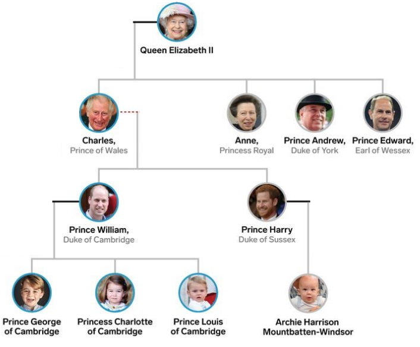
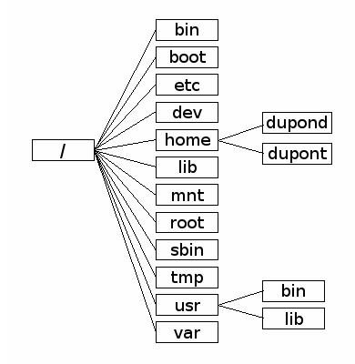
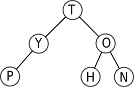
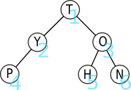
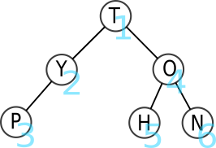
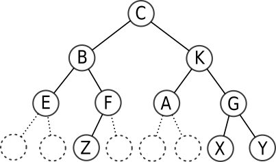
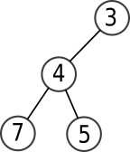
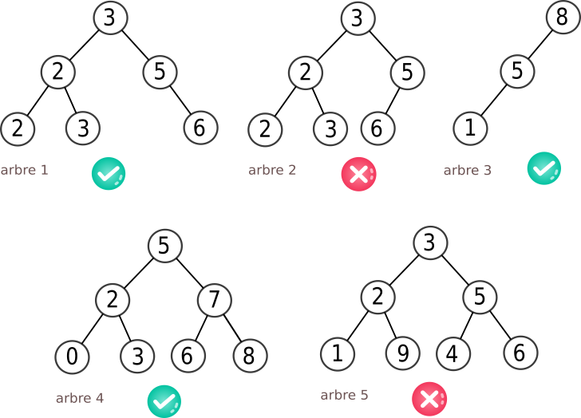

# Arbres

{: .center width=70%}

{: .center}

{: .center}

{{ initexo(0) }}

## 1. Terminologie

### 1.1 Vocabulaire
Un arbre est une structure hiérarchique de données, composée de nœuds. Si on adopte le vocabulaire des graphes, un arbre est un graphe non orienté, connexe, sans cycle, et dans lequel un nœud joue le rôle de racine.

{: .center  .autolight}


- Chaque **nœud** a exactement un seul **nœud père**, à l'exception du nœud **racine** qui est le seul nœud à ne pas avoir de père. (oui, **la** racine d'une arbre est **en haut**)
{: .center width=30%}

- Chaque nœud peut avoir un nombre quelconque de **fils**, dont il est le père.
- Les nœuds qui n'ont pas de fils sont appelés les **feuilles** (ou nœuds externes).
- Les nœuds qui ne sont pas des feuilles sont des **nœuds internes**.
- Le nom de chaque nœud est appelé son **étiquette**.

**Exemples :**
dans l'arbre ci-dessus,

- C est la racine, E, Z A et G sont les feuilles.
- K est le père de A et G.
- F est le père de Z.
- C est le père de B et K
- B est le père de E et F.

### 1.2 Exemples d'arbres

#### 1.2.1 La famille royale britannique (avant le 08 septembre 2022)

{: .center width=60%}

Redessinez de manière plus schématique cet arbre. Pour quelle raison cet arbre a-t-il été modifié par rapport à sa version orginale (voir [ici](https://i.pinimg.com/originals/e8/d1/c7/e8d1c7b2834ce2c368848cf7fc91a057.jpg){. target="_blank"} ), qui laissait apparaître les parents de chaque enfant ?

#### 1.2.2 Le DOM d'une page web
DOM : Document Object Model

{: .center width=40%}


#### 1.2.3 L'arborescence d'un disque dur
Les systèmes Unix (MacOS ou GNU/Linux) organisent leur disque dur suivant l'arborescence ci-dessous :
{: .center width=40%}


!!! example "{{ exercice() }}"
    Quelque part à l'intérieur des dossiers contenus dans l'archive [dossiers.zip](data/dossiers.zip) se trouve un fichier ```tresor.txt```. Quel secret renferme-t-il ?

    Attention, cette recherche est à faire uniquement en ligne de commande :

    - ```ls``` : pour lister les dossiers et fichiers d'un répertoire
    - ```cd Dossier``` : pour se rendre dans le repértoire ```Dossier```
    - ```cd ..``` : pour remonter d'un niveau dans l'arborescence
    - ```unzip monarchive.zip``` : pour décompresser une archive
    - ```cat monfichier.txt``` : pour lire le contenu d'un fichier dans le terminal 
    - ```tree``` : pour __repr__r l'arborescence du répertoire courant
    - ```sudo apt install monprog``` : pour installer le programme ```monprog``` si celui-ci est manquant.

### 1.3 Caractéristiques d'un arbre

#### 1.3.1 Outils numériques de description

{: .center width=30% .autolight}

!!! note "Définitions :heart:"

    - la **taille** d'un arbre est son nombre total de nœuds. Ici, elle vaut 8.


    - l'**arité** d'un nœud est son nombre de fils. Ici, l'arité de B vaut 2, celle de F vaut 1, celle de Z vaut 0.


    - la **profondeur** d'un nœud est le nombre de nœuds de son chemin le plus court vers la racine. 
    Ici, la profondeur de G est 3 (G-K-C), la profondeur de B est 2 (B-C), la profondeur de Z est 4 (Z-F-B-C), la profondeur de C est 1.


    - la **hauteur** d'un arbre est la profondeur de son nœud le plus profond. 
    Ici, la hauteur de l'arbre est 4.  
        Nous prendrons comme **convention** que :  
        - si un arbre est réduit à **un seul nœud-racine**, sa hauteur sera **1**.
        - si un arbre est **vide**, sa hauteur est **0**.

*Cette convention est celle adoptée dans le sujet 0 publié le 15/12/2020. Attention, dans certains ouvrages, l'arbre vide a pour hauteur -1, et donc l'arbre réduit à un seul nœud a pour hauteur 0, donc notre arbre aurait avec cette convention une hauteur 3.*


#### 1.4 Arbres binaires

{: .center width=50%}


!!! note "Définition :heart:"
    Un arbre binaire est un arbre dont chaque nœud possède **au plus** deux fils.

L'arbre généalogique de la famille royale britannique n'est pas un arbre binaire. 

L'arbre ci-dessous est lui un arbre binaire.

{: .center .autolight}

#### 1.4.1 Sous-arbres d'un arbre binaire

Chaque nœud d'un arbre binaire ne pouvant pas avoir plus de 2 fils, il est possible de séparer le «dessous» de chaque nœud en deux sous-arbres (éventuellement vides) : le **sous-arbre gauche** et le **sous-arbre droit**.

{: .center .autolight}


- Les deux sous-arbres représentés ici sont les sous-arbres du nœud-racine T. 
- Le nœud O admet comme sous-arbre gauche le nœud H et comme sous-arbre droit le nœud N.
- Les feuilles P, H et N ont pour sous-arbre gauche et pour sous-arbre droit l'**arbre vide**.


#### 1.4.3 Cas des arbres binaires complets

On rencontre très souvent des arbres binaires dits **complets** parce qu'aucun des fils gauche ou droit n'est manquant.

{: .center .autolight}


**Taille d'un arbre complet de hauteur $h$ :**
$1 + 2 + 2^2 + 2^3 + \dots + 2^{h-1} = 2^{h} - 1$

*preuve* : ceci est la somme $S$ des $h$ premiers termes d'une suite géométrique de raison 2 et de premier terme 1, d'où $S= \frac{1-2^{h}}{1-2} = 2^{h} -1$.


Un arbre complet de hauteur $h$ (en prenant la convention que l'arbre vide a pour hauteur 0) a donc une taille égale à $2^{h}-1$.

**Remarque :** On en déduit une inégalité classique sur l'encadrement de la taille $t$ d'un arbre binaire (non nécessairement complet) de hauteur $h$ :

$$h \leqslant t \leqslant 2^{h}-1$$

## 2. Parcours d'arbres
Les arbres étant une structure hiérarchique, leur utilisation implique la nécessité d'un **parcours** des valeurs stockées. Par exemple pour toutes les récupérer dans un certain ordre, ou bien pour en chercher une en particulier.  

Il existe plusieurs manières de parcourir un arbre.


### 2.1 Parcours en largeur d'abord (BFS)
*BFS : Breadth First Search*

!!! note "Méthode du parcours en largeur (BFS) :heart:" 
    Le parcours en largeur d'abord est un parcours étage par étage (de haut en bas) et de gauche à droite.

{: .center .autolight}

L'ordre des lettres parcourues est donc T-Y-O-P-H-N.

Les trois parcours que nous allons voir maintenant sont des parcours en **profondeur d'abord**, ou **DFS** (*Depth First Search*). Ce qui signifie qu'un des deux sous-arbres sera totalement parcouru avant que l'exploration du deuxième ne commence. 

### 2.2 Parcours préfixe
Le parcours **préfixe** est un parcours **en profondeur d'abord**. 

!!! note "Méthode du parcours préfixe :heart:"
    (parfois aussi appelé *préordre*)

    - Chaque nœud est visité **avant** que ses fils le soient.
    - On part de la racine, puis on visite son fils gauche (et éventuellement le fils gauche de celui-ci, etc.) avant de remonter et de redescendre vers le fils droit.

{: .center .autolight}

L'ordre des lettres parcourues est donc T-Y-P-O-H-N.

### 2.3 Parcours infixe
Le parcours **infixe** est aussi un parcours en profondeur d'abord.

!!! note "Méthode du parcours infixe :heart:" 
    (parfois aussi appelé *en ordre*)

    - Chaque nœud est visité **après son fils gauche mais avant son fils droit**.
    - On part donc de la feuille la plus à gauche et on remonte par vagues sucessives. Un nœud ne peut pas être visité si son fils gauche ne l'a pas été.

{: .center .autolight}

L'ordre des lettres parcourues est donc P-Y-T-H-O-N.

### 2.4 Parcours postfixe
Le parcours **postfixe** est aussi un parcours en profondeur d'abord.

!!! note "Méthode du parcours postfixe :heart:"
    (parfois aussi appelé **post-ordre** ou encore **suffixe**)

    - Chaque nœud est visité **après** ses fils le soient.
    - On part donc de la feuille la plus à gauche, et on ne remonte à un nœud père que si ses fils ont tous été visités. 

{: .center .autolight}

L'ordre des lettres parcourues est donc P-Y-H-N-O-T.

### 2.5 Comment ne pas se mélanger entre le pré / in / post fixe ?

- *pré* veut dire *avant*
- *in* veut dire *au milieu*
- *post* veut dire *après*

Ces trois mots-clés parlent de la place du **père** par rapport à ses fils. 
Ensuite, il faut toujours se souvenir qu'on traite le fils gauche avant le fils droit.

- préfixe : le père doit être le premier par rapport à ses fils.
- infixe : le père doit être entre son fils gauche (traité en premier) et son fils droit.
- postfixe : le père ne doit être traité que quand ses deux fils (gauche d'abord, droite ensuite) l'ont été.

Un parcours préfixe commencera toujours par la racine, alors qu'un parcours postfixe finira toujours par la racine. Dans un parcours infixe, la racine sera «au milieu» (pas nécessairement parfaitement).


!!! example "{{ exercice() }}"
    {: .center .autolight}
    === "Énoncé"
        Donner le rendu de chaque parcours :

        1. Parcours en largeur 
        2. Parcours préfixe
        3. Parcours infixe
        4. Parcours postfixe
    === "Corr. largeur"
        largeur : 1 2 3 4 5 6 7 8 9
    === "Corr. préfixe"
        préfixe : 1 2 4 5 7 8 3 6 9
    === "Corr. infixe"
        infixe : 4 2 7 5 8 1 3 9 6
    === "Corr. postfixe"
        postfixe : 4 7 8 5 2 9 6 3 1


!!! example "{{ exercice() }}"
    {: .center .autolight}
    === "Énoncé"
        Donner le rendu de chaque parcours :

        1. Parcours en largeur 
        2. Parcours préfixe
        3. Parcours infixe
        4. Parcours postfixe
    === "Corr. largeur"
        largeur : 9 8 7 6 2 5 1 4 3
    === "Corr. préfixe"
        préfixe : 9 8 6 2 1 7 5 4 3
    === "Corr. infixe"
        infixe : 6 8 1 2 9 7 4 5 3
    === "Corr. postfixe"
        postfixe : 6 1 2 8 4 3 5 7 9


## 3. Implémentations d'un arbre binaire
### 3.1 En utilisant la Programmation Orientée Objet
Le but est d'obtenir l'interface ci-dessous.

Il est à remarquer que ce que nous allons appeler «Arbre» est en fait un nœud et ses deux fils gauche et droit.

!!! abstract "interface souhaitée"
    ```python
    >>> a = Arbre(4) # pour créer l'arbre dont le nœud a pour valeur 4,
                # et dont les sous-arbres gauche et droit sont None
    >>> a.left = Arbre(3) # pour donner la valeur 3 au nœud du sous-arbre gauche de a
    >>> a.right = Arbre(1) # pour donner la valeur 1 au nœud du sous-arbre droit de a
    >>> a.right.data # pour accéder à la valeur du fils droit de a
    ```


!!! example "{{ exercice() }}"

    Dessinez l'arbre créé par les instructions suivantes :
    ```python
    >>> a = Arbre(4)
    >>> a.left = Arbre(3)
    >>> a.right = Arbre(1)
    >>> a.right.left = Arbre(2)
    >>> a.right.right = Arbre(7)
    >>> a.left.left = Arbre(6)
    >>> a.right.right.left = Arbre(9)
    ```

    {{
    correction(True,
    """
    ??? success \"Correction\" 
        {: .center .autolight} 
    """
    )
    }}

        


**:star: Implémentation :star:**

⯈ **Principe** : nous allons créer une classe ```Arbre```, qui contiendra 3 attributs : 

- ```data``` : la valeur du nœud (de type ```Int```)
- ```left``` : le sous-arbre gauche (de type ```Arbre```)
- ```right``` : le sous-arbre droit (de type ```Arbre```).

Par défaut, les attributs ```left ``` et ```right``` seront à ```None```, qui représentera l'arbre vide (ce qui n'est pas très rigoureux, car ```None``` n'est pas de type ```Arbre```...).

⯈ **Encapsulation ou pas ???** : 

Afin de respecter le paradigme de la Programmation Orientée Objet, nous devrions jouer totalement le jeu de l'**encapsulation** en nous refusant d'accéder directement aux attributs.

Pour cela  il faut construire des méthodes permettant d'accéder à ces attributs (avec des **getters**, ou **accesseurs** en français) ou de les modifier (avec des **setters**, ou **mutateurs** en français) .

#### 3.1.1 Implémentation avec encapsulation

!!! note "Classe `Arbre` avec encapsulation"
    ```python linenums='1'
    class Arbre:
        def __init__(self, data):
            self.data = data
            self.left = None
            self.right = None

        def set_left(self, sousarbre): # mutateur
            self.left = sousarbre

        def set_right(self, sousarbre): # mutateur
            self.right = sousarbre  

        def get_left(self): # accesseur
            return self.left

        def get_right(self): # accesseur
            return self.right

        def get_data(self): # accesseur
            return self.data
    ```

L'implémentation précédente permet d'utiliser les instructions de l'exercice précédent et de vérifier que l'arbre a bien été créé.


```python
>>> a = Arbre(4)
>>> a.set_left(Arbre(3))
>>> a.set_right(Arbre(1))
>>> a.get_right().set_left(Arbre(2))
>>> a.get_right().set_right(Arbre(7))
>>> a.get_left().set_left(Arbre(6))
>>> a.get_right().get_right().set_left(Arbre(9))
```


```python
>>> a
   <__main__.Arbre at 0x7f0100361f40>
```


```python
>>> a.get_right().get_left().get_data()
   2
```


#### 3.1.1 Implémentation sans encapsulation

!!! note "Classe `Arbre` sans encapsulation :heart:"
    ```python linenums='1'
    class Arbre:
        def __init__(self, data):
            self.data = data
            self.left = None
            self.right = None
    ```

C'est déjà fini !


```python
a = Arbre(4)
a.left = Arbre(3)
a.right = Arbre(1)
a.right.left = Arbre(2)
a.right.right = Arbre(7)
a.left.left = Arbre(6)
a.right.right.left = Arbre(9)
```


```python
>>> a
   <__main__.Arbre at 0x7f0100361f40>
```


```python
>>> a.right.left.data
   2
```


On voit que l'implémentation avec accès direct aux attributs est beaucoup plus simple et rapide. Néanmoins, elle peut être considérée comme incorrecte dans certains langages qui obligent à passer par des accesseurs ou mutateurs pour lire ou modifier les attributs.

#### 3.1.2 Représentation graphique en console

La méthode ```__repr__``` suivante (qui n'est pas à connaître) permet d'avoir un semblant de représentation graphique de l'arbre en console :

```python linenums='1'
def __repr__(self, indent = 0):
    val = self.data
    s = ' '*2*indent + '|' + '_' + str(val) + '\n'
    if self.left is not None:
        s += self.left.__repr__(indent + 1)
    if self.left is None and self.right is not None:
        s += ' '*(2*indent+2) + '|' + '_' + 'None' + '\n'     

    if self.right is not None:
        s += self.right.__repr__(indent + 1)
    if self.right is None and self.left is not None:
        s += ' '*(2*indent+2) + '|' + '_' + 'None' + '\n'  
   
    return s
```

La représentation de cet arbre :
{: .center}
donnera alors :

```python
>>> a
|_4
  |_3
    |_6
    |_None
  |_1
    |_2
    |_7
      |_9
      |_None
```


### 3.2 Implémentation à partir de tuples imbriqués


!!! note "`Arbre` sous forme de tuples imbriqués :heart:"
    Un arbre peut se représenter par le tuple ```(valeur, sous-arbre gauche, sous-arbre droit)```.
    L'arbre ci-dessous :
    {: .center}
    est représenté par le tuple :


    ```python
    >>> a = (2, (8, (6,(),()), (9,(),())), (1, (7, (),()), ()))
    ```

Le sous-arbre gauche est alors ```a[1]``` et le sous-arbre droit est ```a[2]```.


```python
>>> a[1]
(8, (6, (), ()), (9, (), ()))
>>> a[2]
(1, (7, (), ()), ())
```

!!! example "{{ exercice() }}"
    {: .center .autolight}

    Écrire le tuple représentant l'arbre ci-dessous.       

    {{
    correction(True,
    """
    ??? success \"Correction\" 
        ```python
        a = (T,(Y,(P,(),()),()),(O,(H,(),()),(N,(),())))
        ```        
    """
    )
    }}        


### 3.3 Implémentation à partir d'une «simple» liste
De manière plus surprenante, il existe une méthode pour implémenter un arbre binaire (qui est une structure hiérarchique) avec une liste (qui est une structure linéaire). 
Ceci peut se faire par le biais d'une astuce sur les indices :

**Les fils du nœud d'indice i sont placés aux indice 2i+1 et 2i+2**.

Cette méthode est connue sous le nom de «méthode d'Eytzinger», et utilisée notamment en [généalogie](https://fr.wikipedia.org/wiki/Num%C3%A9rotation_de_Sosa-Stradonitz){. target="_blank"} pour numéroter facilement les individus d'un arbre généalogique.


**Exemple :**

{: .center .autolight}


Pour comprendre facilement la numérotation, il suffit de s'imaginer l'arbre complet (en rajoutant les fils vides) et de faire une numérotation en largeur, niveau par niveau :

{: .center .autolight}


!!! example "{{ exercice() }}"

    Si on note Δ le sous-arbre vide, dessiner l'arbre représenté par la liste :
    ```python
    a = [3, 4, Δ, 7, 5]
    ```       
        
    {{
    correction(False,
    """
    ??? success \"Correction\" 
        {: .center}        
    """
    )
    }}


**Remarque :** parfois (comme dans le sujet 0...) la racine de l'arbre est placée à l'indice 1. Dans ce cas, les fils du nœud d'indice i sont placés aux indice 2i et 2i+1.

## 4. Utilisation de l'implémentation : parcours, taille...

Dans toute la suite, sauf mention contraire, on utilisera l'implémentation en Programmation Orientée Objet, en version sans encapsulation (la plus simple).
Nous allons créer des fonctions renvoyant les différents parcours d'un arbre, ou encore sa taille, sa hauteur, son nombre de feuilles... Toutes ses fonctions exploiteront la structure **récursive** d'un arbre.


**Rappel de l'implémentation :**

```python linenums='1'
class Arbre:
    def __init__(self, data):
        self.data = data
        self.left = None
        self.right = None

```

### 4.1 Parcours préfixe, infixe, postfixe

Dans un premier temps nous allons écrire ces parcours de manière récursive. Nous souhaitons *__repr__r* les sommets, donc nous utiliserons ```print```. Et deux appels récursifs... 

#### 4.1.1 Parcours préfixe

!!! note "Parcours préfixe :heart:"
    ```python
    def prefixe(arbre):
        ...
    ```

{#
!!! note "Parcours préfixe :heart:"

    ```python linenums='1'
    def prefixe(arbre):
        if arbre is None :
            return None
        print(arbre.data, end = '-')
        prefixe(arbre.left)
        prefixe(arbre.right)

    ```
#}

Exemple avec l'arbre 
{: .center .autolight}


```python linenums='1'
a = Arbre(9)
a.left = Arbre(8)
a.right = Arbre(7)
a.left.left = Arbre(6)
a.left.right = Arbre(2)
a.right.right = Arbre(5)
a.left.right.left = Arbre(1)
a.right.right.left = Arbre(4)
a.right.right.right = Arbre(3)
```


```python
>>> prefixe(a)
9-8-6-2-1-7-5-4-3-
```

#### 4.1.2 Parcours infixe

!!! note "Parcours infixe :heart:"
    ```python
    def infixe(arbre):
        ...
    ```

{#
!!! note "Parcours infixe :heart:"

    ```python
    def infixe(arbre):
        if arbre is None :
            return None
        infixe(arbre.left)
        print(arbre.data, end = '-')
        infixe(arbre.right)
    ```

#}

```python
>>> infixe(a)
6-8-1-2-9-7-4-5-3-
```

#### 4.1.3 Parcours postfixe

!!! note "Parcours postfixe :heart:"
    ```python
    def postfixe(arbre):
        ...
    ```
{#
!!! note "Parcours postfixe :heart:"

    ```python
    def postfixe(arbre):
        if arbre is None :
            return None
        postfixe(arbre.left)
        postfixe(arbre.right)
        print(arbre.data, end = '-')
    ```
#}


```python
>>> postfixe(a)
6-1-2-8-4-3-5-7-9-
```

!!! aide "Pause vidéo" 
    - Regardez et appréciez [cette vidéo](https://youtu.be/OTfp2_SwxHk){. target="_blank"}
    - À l'aide de la vidéo, codez le parcours infixe en itératif.  
    {{
    correction(False,
    """

    ??? success \"Correction\" 
        ```python linenums='1'
        def infixe(arbre):
            pile = []
            while pile != [] or arbre is not None:
                if arbre is not None:
                    pile.append(arbre)
                    arbre = arbre.left
                else:
                    arbre = pile.pop()
                    print(arbre.data)
                    arbre = arbre.right

        ```   
        ou
        ```python linenums='1'
        def infixe_avec_liste(arbre):
            parcours = []
            pile = []

            current = arbre

            while pile != [] or current is not None:
                if current is not None:
                    pile.append(current)
                    current = current.left
                else:
                    current = pile.pop()
                    parcours.append(current.data)
                    current = current.right

            return parcours
        ```        
    """
    )
    }}


### 4.2 Calcul de la taille d'un arbre
Rappel : la taille d'un arbre est le nombre de ses nœuds.

!!! note "Taille d'un arbre :heart:"

    ```python
    def taille(arbre):
        ...
    ```

{#
!!! note "Taille d'un arbre :heart:"

    ```python
    def taille(arbre):
        if arbre is None:
            return 0
        return 1 + taille(arbre.left) + taille(arbre.right)
    ```
#}


Exemple avec l'arbre 
{: .center .autolight}


```python linenums='1'
a = Arbre(9)
a.left = Arbre(8)
a.right = Arbre(7)
a.left.left = Arbre(6)
a.left.right = Arbre(2)
a.right.right = Arbre(5)
a.left.right.left = Arbre(1)
a.right.right.left = Arbre(4)
a.right.right.right = Arbre(3)
```

```python
>>> taille(a)
9
```

### 4.3 Calcul de la hauteur d'un arbre
Rappel : on prendra comme convention que l'arbre vide a pour hauteur 0.


!!! note "Hauteur d'un arbre :heart:"

    ```python
    def hauteur(arbre):
        ...
    ```

{#
!!! note "Hauteur d'un arbre :heart:"

    ```python
    def hauteur(arbre):
        if arbre is None:
            return 0
        else:
            return 1 + max(hauteur(arbre.left), hauteur(arbre.right))
    ```
#}


```python
>>> hauteur(a)
4
```


### 4.4 Calcul du nombre de feuilles d'un arbre
Rappel : une feuille est un nœud d'arité 0, autrement dit sans fils gauche ni fils droit.


!!! note "Nombre de feuilles d'un arbre :heart:"
    ```python
    def nb_feuilles(arbre):
        ...
    ```


{#
!!! note "Nombre de feuilles d'un arbre :heart:"

    ```python
    def nb_feuilles(arbre):
        if arbre is None:
            return 0
        if (arbre.left is None) and (arbre.right is None):
            return 1
        return nb_feuilles(arbre.left) +  nb_feuilles(arbre.right)
    ```

#}

```python
>>> nb_feuilles(a)
4
```


### 4.5 Recherche d'une valeur dans un arbre
On renverra ```True``` ou ```False``` en fonction de la présence ou non de la valeur dans l'arbre.

!!! note "Recherche d'une valeur dans un arbre :heart:"
    ```python
    def recherche(arbre, valeur):
        ...
    ```
    

{#
!!! note "Recherche d'une valeur dans un arbre :heart:"
    ```python
    def recherche(arbre, valeur):
        if arbre is None:
            return False
        if arbre.data ==  valeur:
            return True
        return recherche(arbre.left, valeur) or recherche(arbre.right, valeur)
    ```
#}
    


```python
>>> recherche(a, 2)
True
>>> recherche(a, 45)
False
```

### 4.6 Parcours en largeur
Le parcours en largeur (BFS) est le plus simple à faire visuellement : mais il est plus difficile à coder que les parcours préfixe, infixe, postfixe.  
Il est nécessaire d'utiliser une **file**  :

- On place l'arbre dans la file.
- Tant que la file n'est pas vide, on procède comme suit :
    - On défile, donc on récupère l'arbre situé en haut de la file.  
    - Si cet arbre n'est pas vide :
        - On garde son étiquette.
        - On enfile son sous-arbre gauche, puis son sous-arbre droit.

{: .center .autolight}

On importera l'objet ```Queue()``` du module ```queue``` de Python, qui permet de  :

- créer une file vide avec ```file = Queue()```
- défiler un élément par ```file.get()```
- enfiler l'élément ```a``` par ```file.put(a)```
- savoir si la file est vide par le booléen ```file.empty()```


```python
# arbre-test
# ne pas oublier de remonter plus haut dans le document pour relancer la classe Arbre
a = Arbre(8)
a.left = Arbre(4)
a.right = Arbre(5)
a.left.left = Arbre(2)
a.left.right = Arbre(1)
a.right.right = Arbre(3)
```

!!! note "Parcours en largeur (BFS) "
    ```python
    from queue import Queue

    def BFS(arbre):        
        file = Queue()
        file.put(arbre)
        sol = []
        while not file.empty():
            a = file.get()
            if a is not None :
                sol.append(a.data)
                file.put(a.left)
                file.put(a.right)
        return sol
    ```


```python
>>> BFS(a)
[8, 4, 5, 2, 1, 3]
```


## 5. Arbres binaires de recherche (ABR)

!!! abstract "Définition d'un ABR :heart:"
    Un **arbre binaire de recherche** est un arbre binaire dont les valeurs des nœuds (valeurs qu'on appelle étiquettes, ou clés) vérifient la propriété suivante :

    - l'étiquette d'un nœud est **supérieure ou égale** à celle de **chaque** nœud de son **sous-arbre gauche**.
    - l'étiquette d'un nœud est **strictement inférieure** à celle du **chaque** nœud de son **sous-arbre droit**.

{: .center .autolight}

À noter que l'arbre 3 (qui est bien un ABR) est appelé **arbre filiforme**. 

L'arbre 5 n'est pas un ABR à cause de la feuille 9, qui fait partie du sous-arbre gauche de 3 sans lui être inférieure.

**Remarque :** on pourrait aussi définir un ABR comme un arbre dont le parcours infixe est une suite croissante.

### 5.1 Déterminer si un arbre est un ABR

Employer une méthode récursive imposerait de garder en mémoire dans l'exploration des sous-arbres la valeur maximale ou minimale. Nous allons plutôt utiliser la remarque précédente, et nous servir du parcours infixe.

Méthode : récupérer le parcours infixe dans une liste, et faire un test sur cette liste.


!!! note "Être ou ne pas être un ABR"
    ```python linenums='1'
    def infixe(arbre, s = None):
        if s is None:
            s = []
        if arbre is None :
            return None
        infixe(arbre.left, s)
        s.append(arbre.data)
        infixe(arbre.right, s)
        return s


    def est_ABR(arbre):
        '''renvoie un booléen indiquant si arbre est un ABR'''
        parcours = infixe(arbre)
        return parcours == sorted(parcours) # on regarde si le parcours est égal au parcours trié 

    ```


```python
# arbres-tests 

#arbre n°4
a = Arbre(5)
a.left = Arbre(2)
a.right = Arbre(7)
a.left.left = Arbre(0)
a.left.right = Arbre(3)
a.right.left = Arbre(6)
a.right.right = Arbre(8)

#arbre n°5
b = Arbre(3)
b.left = Arbre(2)
b.right = Arbre(5)
b.left.left = Arbre(1)
b.left.right = Arbre(9)
b.right.left = Arbre(4)
b.right.right = Arbre(6)


```


```python
>>> est_ABR(a)
True
>>> est_ABR(b)
False
```


### 5.2 Rechercher une clé dans un ABR

Un arbre binaire de taille $n$ contient $n$ clés (pas forcément différentes). Pour savoir si une valeur particulière fait partie des clés, on peut parcourir tous les nœuds de l'arbre, jusqu'à trouver (ou pas) cette valeur dans l'arbre. Dans le pire des cas, il faut donc faire $n$ comparaisons.

Mais si l'arbre est un ABR, le fait que les valeurs soient «rangées» va considérablement améliorer la vitesse de recherche de cette clé, puisque la moitié de l'arbre restant sera écartée après chaque comparaison.


!!! note "Recherche d'une clé dans un ABR :heart:"
    
    ```python
    def recherche_ABR(arbre, valeur):
        ...

    ```

{#
!!! note "Recherche d'une clé dans un ABR :heart:"
    
    ```python
    def recherche_ABR(arbre, valeur):
        if arbre is None :
            return False
        if arbre.data == valeur :
            return True
        if valeur < arbre.data :
            return recherche_ABR(arbre.left, valeur)
        else:
            return recherche_ABR(arbre.right, valeur)

    ```
#}

**Exemple** 

L'arbre ```a``` contient la valeur 8, mais pas la valeur 12.


```python
>>> recherche_ABR(a, 8)
True
>>> recherche_ABR(a, 12)
False
```


### 5.3  Coût de la recherche dans un ABR équilibré
{: .center .autolight}

Imaginons un arbre équilibré de taille $n$. Combien d'étapes faudra-t-il, dans le pire des cas, pour trouver (ou pas) une clé particulière dans cet arbre ?

Après chaque nœud, le nombre de nœuds restant à explorer est divisé par 2. On retrouve là le principe de recherche dichotomique, vu en classe de Première (voir [ici](https://github.com/glassus/nsi/blob/master/Premiere/Theme05_Algorithmique/05_Dichotomie.ipynb)).

S'il faut parcourir tous les étages de l'arbre avant de trouver (ou pas) la clé recherchée, le nombre de nœuds parcourus est donc égal à la hauteur $h$ de l'arbre.

Pour un arbre complet, cette hauteur vérifie la relation $2^h -1= n$. et donc $2^h = n+1$.

$h$ est donc le «nombre de puissance de 2» que l'on peut mettre dans $n+1$. Cette notion s'appelle le logarithme de base 2 et se note $\log_2$.

Par exemple, $\log_2(64)=6$ car $2^6=64$.

Le nombre maximal de nœuds à parcourir pour rechercher une clé dans un ABR équilibré de taille $n$ est donc de l'ordre de $\log_2(n)$, ce qui est très performant !

Pour arbre contenant 1000 valeurs, 10 étapes suffisent.

Cette **complexité logarithmique** est un atout essentiel de la structure d'arbre binaire de recherche.

### 5.4  Insertion dans un ABR
L'insertion d'une clé va se faire au niveau d'une feuille, donc au bas de l'arbre. Dans la version récursive de l'algorithme d'insertion, que nous allons implémenter, il n'est pourtant pas nécessaire de descendre manuellement dans l'arbre jusqu'au bon endroit : il suffit de distinguer dans lequel des deux sous-arbres gauche et droit doit se trouver la future clé, et d'appeler récursivement la fonction d'insertion dans le sous-arbre en question.

**Algorithme :**

- Si l'arbre est vide, on renvoie un nouvel objet Arbre contenant la clé.
- Sinon, on compare la clé à la valeur du nœud sur lequel on est positionné :
    - Si la clé est inférieure à cette valeur, on va modifier le sous-arbre gauche en le faisant pointer vers ce même sous-arbre une fois que la clé y aura été injectée, par un appel récursif.
    - Si la clé est supérieure, on fait la même chose avec l'arbre de droite.
    - on renvoie le nouvel arbre ainsi créé.

!!! note "Insertion dans un ABR :heart:"

    ```python
    def insertion(arbre, cle):
        ...
    ```


{#
!!! note "Insertion dans un ABR :heart:"

    ```python
    def insertion(arbre, cle):
        if arbre is None :
            return Arbre(cle)
        else :
            val = arbre.data
            if cle <= val :
                arbre.left = insertion(arbre.left, cle)
            else:
                arbre.right = insertion(arbre.right, cle)
            return arbre
    ```
#}

**Exemple :** Nous allons insérer la valeur 4 dans l'arbre ```a``` et vérifier par un parcours infixe (avant et après l'insertion) que la valeur 4 a bien été insérée au bon endroit.

{: .center .autolight}


```python
a = Arbre(5)
a.left = Arbre(2)
a.right = Arbre(7)
a.left.left = Arbre(0)
a.left.right = Arbre(3)
a.right.left = Arbre(6)
a.right.right = Arbre(8)
```


```python
>>> infixe(a)
0-2-3-5-6-7-8-
>>> a = insertion(a,4)
<__main__.Arbre at 0x7f46f0507e80>
>>> infixe(a)
0-2-3-4-5-6-7-8-
```


La valeur 4 a donc bien été insérée au bon endroit.


---

!!! quote "Bibliographie"

    - Numérique et Sciences Informatiques, Terminale, T. BALABONSKI, S. CONCHON, J.-C. FILLIATRE, K. NGUYEN, éditions ELLIPSES.


