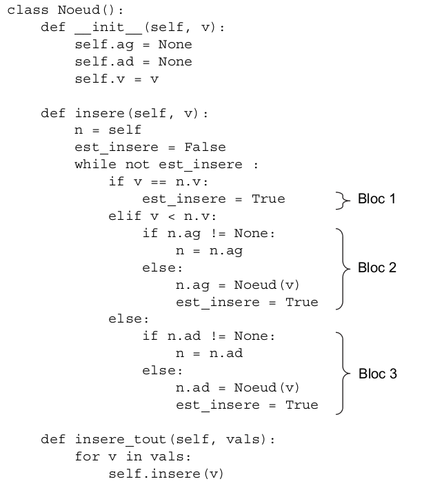
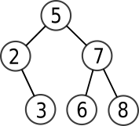
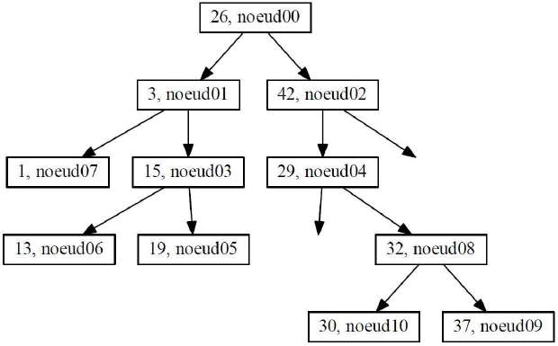
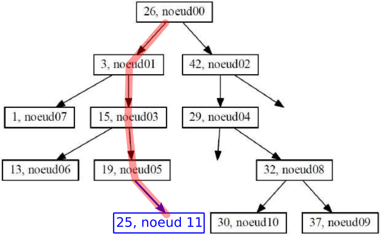
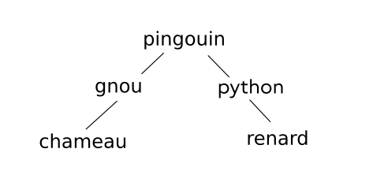
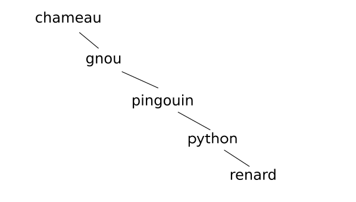

{{initexo(0)}}

!!! example "{{ exercice() }}"
    Exercice 2 du sujet [Nouvelle-Calédonie J2 2022](https://glassus.github.io/terminale_nsi/T6_Annales/data/2022/2022_Nouvelle-Caledonie_J2.pdf){. target="_blank"}  

    {{
    correction(True,
    """
    ??? success \"Correction 1.\" 
        C'est un arbre binaire car chaque nœud possède au maximum deux fils.
    """
    )
    }}

    {{
    correction(True,
    """
    ??? success \"Correction 2.a\" 
        ```V``` est un dictionnaire. 
    """
    )
    }}

    {{
    correction(True,
    """
    ??? success \"Correction 2.b\" 
        ```python
        V['J']
        ```
    """
    )
    }}

    {{
    correction(True,
    """
    ??? success \"Correction 2.c\" 
        ```python linenums='1'
        def somme(W):
            s = 0
            for cle in W:
                s += W[cle]
            return s
        ```        
    """
    )
    }}


    {{
    correction(True,
    """
    ??? success \"Correction 2.d\" 
        ```python linenums='1'
        def VMax(W):
            val_max = 0
            for cle in W:
                if W[cle] > val_max:
                    val_max = W[cle]
                    cle_max = cle
            return cle_max
        ```        
    """
    )
    }}

    {{
    correction(True,
    """
    ??? success \"Correction 3.\" 
        Cet algorithme calcule le nombre total de nœuds de l'arbre, donc la taille de l'arbre.
        C'est un algorithme récursif qui va renvoyer, si on n'est pas positionné sur un arbre vide, la valeur 1 (correspond au nœud racine sur lequel on est positionné), plus la taille des deux sous-arbres gauche et droits.         
    """
    )
    }}

    {{
    correction(True,
    """
    ??? success \"Correction 4.a\" 
        Le parcours est ```A-B-C-E-D-F-G-I-H-J```         
    """
    )
    }}

    {{
    correction(True,
    """
    ??? success \"Correction 4.b\" 
        C'est un parcours préfixe.           
    """
    )
    }}


!!! example "{{ exercice() }}"
    *2020, sujet 0*

    **Question  1**

    Déterminer la taille et la hauteur de l’arbre binaire suivant :
    {: .center}

    {{
    correction(False,
    """
    ??? success \"Correction\" 
        La taille est 9, la hauteur est 4.        
    """
    )
    }}

    **Question 2**  

    On décide de numéroter en binaire les nœuds d’un arbre binaire de la façon suivante :  

    - la racine correspond à 1 ;
    - la numérotation pour un fils gauche s’obtient en ajoutant le chiffre 0 à droite au numéro de son
    père ;
    - la numérotation pour un fils droit s’obtient en ajoutant le chiffre 1 à droite au numéro de son
    père ;  


    Par exemple, dans l’arbre ci-dessous, on a utilisé ce procédé pour numéroter les nœuds A, B, C, E et
    F .

    {: .center}

    **a**. Dans l’exemple précédent, quel est le numéro en binaire associé au nœud G ?
    {{
    correction(False,
    """
    ??? success \"Correction\" 
        G est associé à 1010.  
    """
    )
    }}
    **b**. Quel est le nœud dont le numéro en binaire vaut 13 en décimal ?
    {{
    correction(False,
    """
    ??? success \"Correction\" 
        13 s'écrit 1101 en binaire, c'est donc le nœud I.          
    """
    )
    }}
    **c**. En notant $h$ la hauteur de l’arbre, sur combien de bits seront numérotés les nœuds les plus en
    bas ?
    {{
    correction(False,
    """
    ??? success \"Correction\" 
        Les nœuds les plus en bas sont notés sur $h$ bits.      
    """
    )
    }}
    **d**. Justifier que pour tout arbre de hauteur $h$ et de taille $n \geqslant 2$, on a :
    $h\leqslant n \leqslant 2^h-1$
    {{
    correction(False,
    """
    ??? success \"Correction\" 
        L'arbre de hauteur $h$ de taille minimale est l'arbre filiforme, qui est de taille $h$.  
        L'arbre de hauteur $h$ de taille maximale est l'arbre complet, qui est de taille $2^h-1$. Si $n$ est la taille d'un arbre quelconque de taille $h$, on a donc bien    $h \leqslant n \leqslant 2^h-1$.
    """
    )
    }}

    **Question 3**  
    Un arbre binaire est dit complet si tous les niveaux de l’arbre sont remplis.
    {: .center}

    On décide de représenter un arbre binaire complet par un tableau de taille n + 1, où n est la taille de
    l’arbre, de la façon suivante :  

    - La racine a pour indice 1 ;
    - Le fils gauche du nœud d’indice i a pour indice $2 \times i$ ;
    - Le fils droit du nœud d’indice i a pour indice $2 \times i + 1$ ;
    - On place la taille $n$ de l’arbre dans la case d’indice 0.

    Répondre aux questions suivantes :  

    **a**. Déterminer le tableau qui représente l’arbre binaire complet de l’exemple précédent.
    {{
    correction(False,
    """
    ??? success \"Correction\" 
        Tableau : ```[15, A, B, C, D, E, F, G, H, I, J, K, L, M, N, O]``` .     
    """
    )
    }}
    **b**. On considère le père du nœud d’indice $i$ avec $i \geqslant 2$. Quel est son indice dans le tableau ?
    {{
    correction(False,
    """
    ??? success \"Correction\" 
        Le père du nœud d'indice ```i``` a pour indice ```i//2```.       
    """
    )
    }}

    **Question 4**  

    On se place dans le cas particulier d’un arbre binaire de recherche complet où les nœuds
    contiennent des entiers et pour lequel la valeur de chaque noeud est supérieure à celles des
    noeuds de son fils gauche, et inférieure à celles des noeuds de son fils droit.


    Écrire une fonction `recherche` ayant pour paramètres un arbre `arbre` et un élément `element`. Cette
    fonction renvoie `True` si `element` est dans l’arbre et `False` sinon. L’arbre sera représenté par un tableau
    comme dans la question précédente.

    {{
    correction(False,
    """
    ??? success \"Correction\" 
        ```python
        def recherche(arbre, element):
            i = 1
            while i < len(arbre):
                if arbre[i] == element:
                    return True
                if element < arbre[i]:
                    i = 2*i # on se place sur le fils gauche
                else:
                    i = 2*i +  1 # on se place sur le fils droit
            return False
        ```    
    """
    )
    }}


!!! example "{{ exercice() }}"
    *2021, Métropole sujet 1*

    Dans cet exercice, les arbres binaires de recherche ne peuvent pas comporter plusieurs fois la
    même clé. De plus, un arbre binaire de recherche limité à un nœud a une hauteur de 1.
    On considère l’arbre binaire de recherche représenté ci-dessous (figure 1), où `val` représente un entier :

    {: .center}

    **1.a** Donner le nombre de feuilles de cet arbre et préciser leur valeur (étiquette).  
    {{
    correction(True,
    """
    ??? success \"Correction\" 
        **1.a.** Il y a 4 feuilles, d'étiquette 12, `val`, 21 et 32. 
    """
    )
    }}

    **1.b** Donner le sous arbre-gauche du nœud 23.
    {{
    correction(True,
    """
    ??? success \"Correction\" 
        **1.b.** Le sous-arbre gauche du nœud 23 est 19-21. 
    """
    )
    }}

    **1.c** Donner la hauteur et la taille de l’arbre.
    {{
    correction(True,
    """
    ??? success \"Correction\" 
        **1.c.** La hauteur de l'arbre est 4. Sa taille est 9.
    """
    )
    }}
    **1.d** Donner les valeurs entières possibles de `val` pour cet arbre binaire de recherche.
    {{
    correction(True,
    """
    ??? success \"Correction\" 
        **1.d.** Les valeurs possibles de ```val``` sont 16 et 17.
    """
    )
    }}
    On suppose, pour la suite de cet exercice, que `val` est égal à 16.

    **2.** On rappelle qu’un parcours infixe depuis un nœud consiste, dans l’ordre, à faire un parcours
    infixe sur le sous arbre-gauche, afficher le nœud puis faire un parcours infixe sur le sous-arbre
    droit.    
    Dans le cas d’un parcours suffixe, on fait un parcours suffixe sur le sous-arbre gauche puis un
    parcours suffixe sur le sous-arbre droit, avant d’afficher le nœud.

    **a.** Donner les valeurs d’affichage des nœuds dans le cas du parcours infixe de l’arbre.  
    {{
    correction(True,
    """
    ??? success \"Correction\" 
        **2.a.** Parcours infixe : 12-13-15-16-18-19-21-23-32  
    """
    )
    }}
    **b**. Donner les valeurs d’affichage des nœuds dans le cas du parcours suffixe de l’arbre.
    {{
    correction(True,
    """
    ??? success \"Correction\" 
        **2.b.** Parcours suffixe : 12-13-16-15-21-19-32-23-18  
    """
    )
    }}

    **3.** On considère la classe `Noeud` définie de la façon suivante en Python :

    {: .center}


    **a.** Représenter l’arbre construit suite à l’exécution de l’instruction suivante :

    ```python 
    racine = Noeud(18)
    racine.insere_tout([12, 13, 15, 16, 19, 21, 32, 23])
    ```
    {{
    correction(True,
    """
    ??? success \"Correction\" 
        **3.a.** {: .center}
    """
    )
    }}
    **b.** Écrire les deux instructions permettant de construire l’arbre de la figure 1. On rappelle que
    le nombre `val` est égal à 16.
    {{
    correction(True,
    """
    ??? success \"Correction\" 
        **3.b.**   
        ```python
        racine = Noeud(18)
        racine.insere([15, 13, 12, 16, 23, 32, 19, 21])
        ```
        (d'autres solutions sont possibles)        
    """
    )
    }}
    **c.** On considère l’arbre tel qu’il est présenté sur la figure 1. Déterminer l’ordre d’exécution des
    blocs (repérés de 1 à 3) suite à l’application de la méthode `insere(19)` au nœud racine
    de cet arbre.
    {{
    correction(True,
    """
    ??? success \"Correction\" 
        **3.c.** Bloc 3 - Bloc 2 - Bloc 1  
    """
    )
    }}    

    **4.** Écrire une méthode `recherche(self, v)` qui prend en argument un entier `v` et renvoie la
    valeur `True` si cet entier est une étiquette de l’arbre, `False` sinon.


    {{
    correction(True,
    """
    ??? success \"Correction\" 
        **4.**  

        ```python linenums='1'
        class Noeud():
            def __init__(self, v):
                self.ag = None
                self.ad = None
                self.v = v

            def insere(self, v):
                n = self
                est_insere = False
                while not est_insere:
                    if v == n.v:
                        est_insere = True
                    elif v < n.v:
                        if n.ag != None:
                            n = n.ag
                        else:
                            n.ag = Noeud(v)
                            est_insere = True
                    else:
                        if n.ad != None:
                            n = n.ad
                        else:
                            n.ad = Noeud(v)
                            est_insere = True

            def insere_tout(self, vals):
                for v in vals:
                    self.insere(v)

            def recherche(self, v):
                arbre = self
                while not arbre is None:
                    if arbre.v == v:
                        return True
                    if v < arbre.v:
                        arbre = arbre.ag
                    else:
                        arbre = arbre.ad
                return False


        racine = Noeud(18)
        racine.insere_tout([12, 13, 15, 14, 19, 21, 32, 23])
        print(racine.recherche(149))
        print(racine.recherche(12))


        ```        
    """
    )
    }}
         
         
          
          

        
        

        
        


        


!!! example "{{ exercice() }}"
    *2021, Métropole Candidats Libres 2*

    On rappelle qu’un arbre binaire est composé de nœuds, chacun des nœuds possédant
    éventuellement un sous-arbre gauche et éventuellement un sous-arbre droit. Un nœud
    sans sous-arbre est appelé feuille. La taille d’un arbre est le nombre de nœuds qu’il
    contient ; sa hauteur est le nombre de nœuds du plus long chemin qui joint le nœud racine
    à l’une des feuilles. Ainsi la hauteur d’un arbre réduit à un nœud, c’est-à-dire la racine,
    est 1.


    Dans un arbre binaire de recherche, chaque nœud contient une clé, ici un nombre entier,
    qui est :

    - strictement supérieure à toutes les clés des nœuds du sous-arbre gauche ;
    - strictement inférieure à toutes les clés des nœuds du sous-arbre droit.


    Un arbre binaire de recherche est dit « bien construit » s’il n’existe pas d’arbre de hauteur
    inférieure qui pourrait contenir tous ses nœuds.


    On considère l’arbre binaire de recherche ci-dessous.

    {: .center}

    **1.a.** Quelle est la taille de l’arbre ci-dessus ?  

    **1.b.** Quelle est la hauteur de l’arbre ci-dessus ?

    {{
    correction(True,
    """
    ??? success \"Correction\" 
        **1.a.** La taille de l'arbre est 7.  
        **1.b.** La hauteur de l'arbre est 4.  
        
    """
    )
    }}

    **2.** Cet arbre binaire de recherche n’est pas « bien construit ». Proposer un arbre
    binaire de recherche contenant les mêmes clés et dont la hauteur est plus petite
    que celle de l’arbre initial.

    {{
    correction(False,
    """
    ??? success \"Correction\" 
        **2.** {: .center}        
    """
    )
    }}
    

    **3.** Les classes Noeud et Arbre ci-dessous permettent de mettre en œuvre en Python
    la structure d’arbre binaire de recherche. La méthode `insere` permet d’insérer
    récursivement une nouvelle clé.

    ```python linenums='1'
    class Noeud :
        
        def __init__(self, cle):
            self.cle = cle
            self.gauche = None
            self.droit = None
            
        def insere(self, cle):
            if cle < self.cle :
                if self.gauche == None :
                    self.gauche = Noeud(cle)
                else :
                    self.gauche.insere(cle)
            elif cle > self.cle :
                if self.droit == None :
                    self.droit = Noeud(cle)
                else :
                    self.droit.insere(cle)
                    
    class Arbre :
        
        def __init__(self, cle):
            self.racine = Noeud(cle)

        def insere(self, cle):
            self.racine.insere(cle)

    ```

    Donner la représentation de l’arbre codé par les instructions ci-dessous.

    ```python
    a = Arbre(10)
    a.insere(20)
    a.insere(15)
    a.insere(12)
    a.insere(8)
    a.insere(4)
    a.insere(5)
    ```
    {{
    correction(False,
    """
    ??? success \"Correction\" 
        **3.** {: .center}        
    """
    )
    }}


    **4.** Pour calculer la hauteur d’un arbre non vide, on a écrit la méthode ci-dessous dans
    la classe Noeud.

    ```python
    def hauteur(self):
        if self.gauche == None and self.droit == None:
            return 1
        if self.gauche == None:
            return 1 + self.droit.hauteur()
        elif self.droit == None:
            return 1 + self.gauche.hauteur()
        else:
            hg = self.gauche.hauteur()
            hd = self.droit.hauteur()
            if hg > hd:
                return hg + 1
            else:
                return hd + 1

    ```
    Écrire la méthode `hauteur` de la classe `Arbre` qui renvoie la hauteur de
    l’arbre.

    {{
    correction(False,
    """
    ??? success \"Correction\" 
        **4.**
        ```python linenums='1'
        def hauteur(self):
            return self.racine.hauteur()
        ```        
    """
    )
    }}


    **5.** Écrire les méthodes `taille` des classes `Noeud` et `Arbre` permettant de calculer
    la taille d’un arbre.

    {{
    correction(False,
    """
    ??? success \"Correction\" 
        **5.**
        Méthode ```taille```    de la classe ```Noeud``` :  
        ```python linenums='1'
        def taille(self):
            if self == None:
                return 0
            else:
                return 1 + self.gauche.taille() + self.droit.taille()
        ```
        Méthode ```taille```    de la classe ```Arbre``` : 
        ```python linenums='1'
        def taille(self):
            return self.racine.taille()
        ```        
    """
    )
    }}


    **6.** On souhaite écrire une méthode `bien_construit` de la classe `Arbre` qui
    renvoie la valeur `True` si l’arbre est « bien construit » et `False` sinon.

    On rappelle que la taille maximale d’un arbre binaire de recherche de hauteur $ℎ$
    est $2^h - 1$.

    **6.a** Quelle est la taille minimale, notée `min` d’un arbre binaire de recherche
    « bien construit » de hauteur $ℎ$ ?

    {{
    correction(False,
    """
    ??? success \"Correction\" 
        **6.a.** La configuration minimale d'un arbre bien construit de hauteur $h$ peut être :

        {: .center}
        
        La taille minimale ```min``` est donc égale à $2^{h-1}$.
        
    """
    )
    }}
 


    **6.b** Écrire la méthode ```bien_construit``` demandée.

    {{
    correction(False,
    """
    ??? success \"Correction\" 
        **6.b.** Intuitivement, un arbre est *mal construit* si sa hauteur est trop grande par rapport à sa taille (trop *étiré*).

        Donc un arbre est *mal construit* si sa taille est trop petite par rapport à sa hauteur.

        Donc un arbre de taille $t$ et de hauteur $h$ est *mal construit* si $t < 2^{h-1}$, puisqu'on a démontré que $2^{h-1}$ était la taille minimale.

        Pour tester si un arbre est *bien construit*, on va donc juste vérifier que $t \\geqslant 2^{h-1}$ :

        ```python linenums='1'
        def bien_construit(self):
            h = self.taille()
            return self.taille() >= 2**(h-1)
        ```        
    """
    )
    }}


        


!!! example "{{ exercice() }}"
    *2021, Polynésie*

    Cet exercice traite principalement du thème « algorithmique, langages et
    programmation » et en particulier les arbres binaires de recherche. La première partie
    aborde les arbres en mode débranché via l'application d'un algorithme sur un exemple.
    La suivante porte sur la programmation orientée objet. La dernière partie fait le lien avec
    les algorithmes de tri.

    **Partie A : Étude d'un exemple**

    Considérons l'arbre binaire de recherche ci-dessous :

    {: .center}

    **Q1.** Indiquer quelle valeur a le nœud racine et quels sont les fils de ce nœud.

    {{
    correction(False,
    """
    ??? success \"Correction\" 
        Le nœud racine est 5 et ses fils sont 2 et 7.        
    """
    )
    }}

    **Q2.** Indiquer quels sont les nœuds de la branche qui se termine par la feuille qui a pour
    valeur 3.

    {{
    correction(False,
    """
    ??? success \"Correction\" 
        La branche qui se termine par la feuille 3 a pour nœuds 5, 2 et 3.
        
    """
    )
    }}


    **Q3.** Dessiner l’arbre obtenu après l’ajout de la valeur 6.

    {{
    correction(False,
    """
    ??? success \"Correction\" 
        {: .center}
        
    """
    )
    }}

        
    **Partie B : Implémentation en Python**

    Voici un extrait d’une implémentation en Python d'une classe modélisant un arbre binaire
    de recherche.

    ```python linenums='1'
    class ABR:
        """Implémentation d’un arbre binaire de recherche (ABR)"""
        def __init__(self, valeur=None):
            self.valeur = valeur
            self.fg = None
            self.fd = None

        def estVide(self):
            return self.valeur == None

        def insererElement(self, e):
            if self.estVide():
                self.valeur = e
            else:
                if e < self.valeur:
                    if self.fg:
                        self.fg.insererElement(e)
                    else:
                        self.fg = ABR(e)
                if e > self.valeur:
                    if self.fd:
                        self.fd.insererElement(e)
                    else:
                        self.fd = ABR(e)
    ```

    **Q1.** Expliquer le rôle de la fonction `__init__`.

    {{
    correction(False,
    """
    ??? success \"Correction\" 
        La fonction `__init__` est appelée «méthode constructeur», c'est elle qui crée l'objet et le dote de tous les attributs nécessaires.
        
    """
    )
    }}


    **Q2.** Dans cette implémentation, expliquer ce qui se passe si on ajoute un élément déjà
    présent dans l’arbre.

    {{
    correction(False,
    """
    ??? success \"Correction\" 
        Si on ajoute un élément déjà présent dans l'arbre, la valeur ```e``` sera égale à ```self.valeur``` (éventuellement après quelques appels récursifs). Or ce cas d'égalité n'est pas prévu par les tests : il ne se passera donc RIEN. Ceci est le comportement souhaité puisqu'on ne veut pas avoir deux valeurs identiques dans notre ABR, ainsi qu'il est rappelé au début de l'énoncé.         
    """
    )
    }}


    **Q3.** Recopier et compléter les pointillés ci-dessous permettant de
    créer l’arbre de la partie A.
    ```python
    arbre = ABR(.......... )
    arbre.insererElement(2)
    arbre.insererElement(.......... )
    arbre.insererElement(7)
    arbre.insererElement(.......... )
    ```

    {{
    correction(False,
    """
    ??? success \"Correction\" 
        ```python
        arbre = ABR(5)
        arbre.insererElement(2)
        arbre.insererElement(3)
        arbre.insererElement(7)
        arbre.insererElement(8)
        ```        
    """
    )
    }}
   

    **Partie C : Tri par arbre binaire de recherche**

    On souhaite trier un ensemble de valeurs entières distinctes grâce à un arbre binaire de
    recherche. Pour cela, on ajoute un à un les éléments de l’ensemble dans un arbre
    initialement vide. Il ne reste plus qu’à parcourir l’arbre afin de lire et de stocker dans un
    tableau résultat les valeurs dans l’ordre croissant.

    **Q1.** Donner le nom du parcours qui permet de visiter les valeurs d’un arbre binaire de
    recherche dans l’ordre croissant.

    {{
    correction(False,
    """
    ??? success \"Correction\" 
        Le parcours qui permet de visiter les valeurs d'un ABR dans l'ordre croissant est le parcours infixe.        
    """
    )
    }}


    **Q2.** Comparer la complexité de cette méthode de tri avec celle du tri par insertion ou
    du tri par sélection.

    {{
    correction(False,
    """
    ??? success \"Correction\" 
        *question difficile*
        Pour créer l'ABR, il faut d'abord insérer chacune des valeurs. La fonction ```insertion``` reposant sur une division par 2 à chaque étape de la taille de l'espace de recherche, on peut dire qu'elle a une complexité logarithmique. Mais cette opération est à effectuer autant de fois qu'il y a d'éléments à insérer : il faut donc multiplier la complexité logarithmique par ```n```, ce qui fera donc une complexité en $n \\log(n)$.
        L'algorithme de parcours infixe est lui aussi linéraire, ce qui ne change pas la complexité totale.
        Cette complexité est meilleure que le tris par insertion ou sélection, qui sont de complexité quadratique.        
    """
    )
    }}


!!! example "{{ exercice() }}"
    *2021, Centres Étrangers, sujet 1*

    Un arbre binaire est soit vide, soit un nœud qui a une valeur et au plus deux fils (le
    sous-arbre gauche et le sous-arbre droit).

    {: .center}


    - X est un nœud, sa valeur est X.valeur
    - G1 est le fils gauche de X, noté X.fils_gauche
    - D1 est le fils droit de X, noté X.fils_droit

    Un arbre binaire de recherche est ordonné de la manière suivante :

    Pour chaque nœud X,

    - les valeurs de tous les nœuds du sous-arbre gauche sont **strictement
    inférieures** à la valeur du nœud X
    - les valeurs de tous les nœuds du sous-arbre droit sont **supérieures ou égales** à
    la valeur du nœud X.

    Ainsi, par exemple, toutes les valeurs des nœuds G1, G2 et G3 sont strictement
    inférieures à la valeur du nœud X et toutes les valeurs des nœuds D1, D2 et D3 sont
    supérieures ou égales à la valeur du nœud X.

    Voici un exemple d'arbre binaire de recherche dans lequel on a stocké dans cet ordre
    les valeurs : ```[26, 3, 42, 15, 29, 19, 13, 1, 32, 37, 30]``` 

    L'étiquette d'un nœud indique la valeur du nœud suivie du nom du nœud.
    Les nœuds ont été nommés dans l'ordre de leur insertion dans l'arbre ci-dessous.

    `'29, noeud04'` signifie que le nœud nommé `noeud04` possède la valeur 29.

    {: .center}

    **Q1.** On insère la valeur 25 dans l'arbre, dans un nouveau nœud nommé nœud11.

    Recopier l'arbre binaire de recherche étudié et placer la valeur 25 sur cet arbre
    en coloriant en rouge le chemin parcouru.

    Préciser sous quel nœud la valeur 25 sera insérée et si elle est insérée en fils
    gauche ou en fils droit, et expliquer toutes les étapes de la décision.

    {{
    correction(False,
    """
    ??? success \"Correction\" 
        {: .center width=50%}
        
        25 étant plus petit que 26, on part dans son sous-arbre gauche.  
        25 étant plus grand que 3, on part dans son sous-arbre droit.  
        25 étant plus grand que 15, on part dans son sous-arbre droit.  
        25 étant plus grand que 19, on insère 25 en tant que fils droit de 19. 
    
    """
    )
    }}


    **Q2.** Préciser toutes les valeurs entières que l’on peut stocker dans le nœud fils
    gauche du nœud04 (vide pour l'instant), en respectant les règles sur les arbres
    binaires de recherche.

    {{
    correction(False,
    """
    ??? success \"Correction\" 
        Les valeurs acceptables doivent être strictement inférieures à 29, et supérieures ou égales à 26. Ces valeurs sont donc : 26, 27 et 28.
    """
    )
    }}


    **Q3.** Voici un algorithme récursif permettant de parcourir et d'afficher les valeurs de
    l'arbre :

    ```python
    Parcours(A)  # A est un arbre binaire de recherche
        Afficher(A.valeur)
        Parcours(A.fils_gauche)
        Parcours(A.fils_droit)
    ```

    **Q3.a.** Écrire la liste de toutes les valeurs dans l'ordre où elles seront affichées.
    {{
    correction(False,
    """
    ??? success \"Correction\" 
        Les valeurs seront affichées dans l'ordre suivant : 26-3-1-15-13-19-25-42-29-32-30-37        
    """
    )
    }}


    **Q3.b.** Choisir le type de parcours d'arbres binaires de recherche réalisé parmi les
    propositions suivantes : Préfixe, Suffixe ou Infixe.

    {{
    correction(False,
    """
    ??? success \"Correction\" 
        On reconnait un parcours préfixe.        
    """
    )
    }}


    **Q4.** En vous inspirant de l’algorithme précédent, écrire un algorithme Parcours2
    permettant de parcourir et d'afficher les valeurs de l'arbre A dans l'ordre
    croissant.

    {{
    correction(False,
    """
    ??? success \"Correction\" 
        Pour afficher les valeurs d'un ABR dans un ordre croissant, il faut utiliser un parcours infixe. Un algorithme récursif de parcours infixe peut être celui-ci:

        ```python
        Parcours2(A)  # A est un arbre binaire de recherche
            Parcours2(A.fils_gauche)
            Afficher(A.valeur)
            Parcours2(A.fils_droit)
        ```   
    """
    )
    }}


!!! example "{{ exercice() }}"
    

    Exercice 3 du sujet [Centres Etrangers J2 - 2023](https://glassus.github.io/terminale_nsi/T6_Annales/data/2023/2023_Centres_Etrangers_J2.pdf){. target="blank"}


    {{
    correction(False,
    """
    ??? success \"Correction Q1.a.\" 
        ```'Bonjour Alan !'```    
    """
    )
    }}


    {{
    correction(False,
    """
    ??? success \"Correction Q1.b.\" 
        Ce sont des booléens. ```x``` vaut ```False```, ```y``` vaut ```True```.        
    """
    )
    }}

    {{
    correction(False,
    """
    ??? success \"Correction Q1.c.\" 
        ```python linenums='1'
        def occurences_lettre(une_chaine, une_lettre):
            nb = 0
            for lettre in une_chaine:
                if lettre == une_lettre:
                    nb += 1
            return nb
        ```    
    """
    )
    }}

    {{
    correction(False,
    """
    ??? success \"Correction Q2.a\" 
        {: .center}
        
    """
    )
    }}

    {{
    correction(False,
    """
    ??? success \"Correction Q2.b\" 
        {: .center}
    """
    )
    }}


    {{
    correction(False,
    """
    ??? success \"Correction Q3.a\" 
        L'exécution de ```mystere(abr_mots_francais)``` va renvoyer le nombre 336531. En effet cette fonction renvoie la taille d'un arbre. Il y a 336531 dans la liste ```liste_mots_francais```, et donc dans l'arbre ``` abr_mots_francais```. 
    """
    )
    }}


    {{
    correction(False,
    """
    ??? success \"Correction Q3.b.\" 
        ```python linenums='1'
        def hauteur(un_abr):
            if un_abr.est_vide():
                return 0
            else:
                return 1 + max(hauteur(un_abr.sous_arbre_gauche, hauteur(un_abr.sous_arbre_droit)
        ```   
    """
    )
    }}


    {{
    correction(False,
    """
    ??? success \"Correction Q4.a.\" 
        ```python linenums='1'
        def chercher_mots(liste_mots, longueur, lettre, position):
            res = []
            for i in range(len(liste_mots)):
                if len(liste_mots[i]) == longueur and liste_mots[i][position] == lettre:
                    res.append(liste_mots[i])
            return res
        ```
    """
    )
    }}


    {{
    correction(False,
    """
    ??? success \"Correction Q4.b.\" 
        Cette commande va **d'abord** chercher dans la liste tous les mots de 3 lettres qui comportent un ```x``` en dernière position (indice 2).

        Ensuite, parmi les mots trouvés, on va chercher ceux qui ont un ```a``` en deuxième position (indice 1).

        Donc on cherche les mots de 3 lettres finissant par ```ax```. 
    """
    )
    }}


    {{
    correction(False,
    """
    ??? success \"Correction Q4.c.\" 
        ```python
        chercher_mots(chercher_mots(chercher_mots(liste_mots_francais,5,'r',4),5,'e',3),5,'t',2)
        ```
    """
    )
    }}

    - Fichier des mots français : [gutenberg.txt](./data/gutenberg.txt)
    - Instruction pour créer une liste à partir du fichier :
    ```python
    liste_mots_francais = open('gutenberg.txt').read().splitlines()
    ```

        
        
