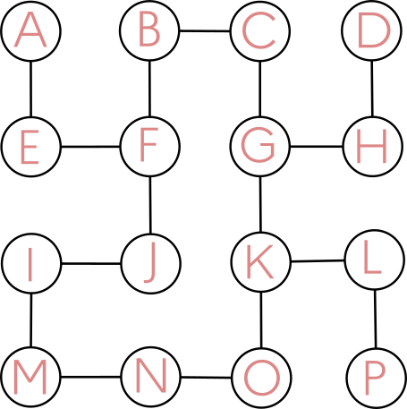
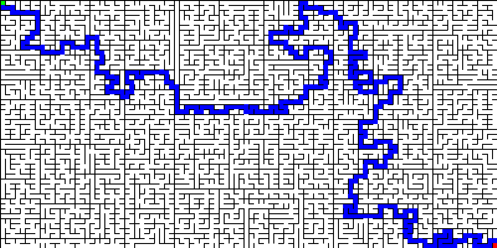
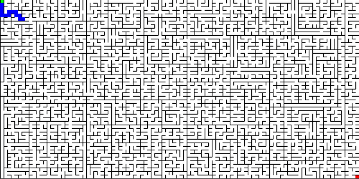

# Résolution d'un labyrinthe

## 1. Présentation du problème
Considérons le labyrinthe suivant :
{: .center width=35%}

Affectons une lettre à chaque case de ce labyrinthe.

{: .center width=35%}

Notre objectif est de trouver comment aller **de A en P**.


## 2. Modélisation par un graphe

Dessiner le graphe (dont les noeuds seront des lettres) qui modélise ce labyrinthe.

Proposer deux «formes» possibles pour ce graphe.

{#
??? tip "Correction"
    
    {: .center width=35%}


    {: .center width=35%}
#}

## 3. Implémentation du graphe en Python

En utilisant la classe ```Graphe``` créée en cours, implémenter le graphe de ce labyrinthe.

{#
??? tip "Correction"
    ```python linenums='1'
    class Graphe:
        def __init__(self, liste_sommets):
            self.liste_sommets = liste_sommets
            self.adjacents = {sommet : [] for sommet in liste_sommets}

        def ajoute_arete(self, sommetA, sommetB):
            self.adjacents[sommetA].append(sommetB)
            self.adjacents[sommetB].append(sommetA)

        def voisins(self, sommet):
            return self.adjacents[sommet]

        def sont_voisins(self, sommetA, sommetB):
            return sommetB in self.adjacents[sommetA]

    g = Graphe(['A', 'B', 'C', 'D', 'E', 'F', 'G', 'H', 'I', 'J', 'K', 'L', 'M', 'N', 'O', 'P'])
    g.ajoute_arete('A', 'E')
    g.ajoute_arete('E', 'F')
    g.ajoute_arete('F', 'B')
    g.ajoute_arete('B', 'C')
    g.ajoute_arete('C', 'G')
    g.ajoute_arete('G', 'H')
    g.ajoute_arete('H', 'D')
    g.ajoute_arete('G', 'K')
    g.ajoute_arete('F', 'J')
    g.ajoute_arete('J', 'I')
    g.ajoute_arete('I', 'M')
    g.ajoute_arete('M', 'N')
    g.ajoute_arete('N', 'O')
    g.ajoute_arete('O', 'K')
    g.ajoute_arete('K', 'L')
    g.ajoute_arete('L', 'P')
    ```
#}

## 4. Recherche du plus court chemin

En utilisant la fonction ```recherche_chemin``` du cours, établir le plus court chemin pour aller de A vers P dans ce labyrinthe.

{#
??? tip "Correction"
    ```python linenums='1'
    def recherche_chemin(g, depart, arrivee):
        '''
        Parcours en largeur du graphe g en partant du sommet depart,
        qui s'arrête dès que le sommet arrivee est atteint.
        Renvoie alors le chemin du depart vers arrivee.
        '''
        traites = []
        decouverts = [depart]
        en_attente = [depart]
        parent = {}
        while en_attente != [] :
            sommet = en_attente.pop(0)
            voisins = g.voisins(sommet)
            for voisin in voisins:
                if voisin not in decouverts:
                    decouverts.append(voisin)
                    en_attente.append(voisin)
                    parent[voisin] = sommet
                    if voisin == arrivee:
                        return remonte_chemin(depart, arrivee, parent)
            traites.append(sommet)
        return "non trouvé"  


    def remonte_chemin(depart, arrivee, parent):
        sommet = arrivee
        chemin = arrivee
        while sommet != depart:
            sommet = parent[sommet]
            chemin = sommet + chemin
        return chemin
    ```

    ```python
    >>> recherche_chemin(g, 'A', 'P')
    'AEFBCGKLP'
    ```
#}

## 5. Conclusion

Cette méthode est utilisée pour trouver la solution de labyrinthe bien plus imposants, comme celui-ci :

{: .center width=40%}

Et on peut voir souvent ce genre d'animation :

{: .center width=40%}

Si cette animation est assez satisfaisante à observer, elle n'est pas du tout fidèle à la méthode de résolution qui a permis de la trouver. Comprenez-vous pourquoi ?

jlk
{: .center}

