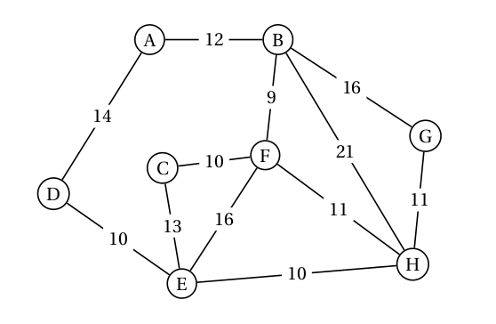

{{initexo(0)}}

!!! example "{{ exercice() }}"
    Exercice 3 du [sujet 0 version A - 2024](https://glassus.github.io/terminale_nsi/T6_Annales/data/2024/bac_nsi_2024_sujet0a.pdf){. target="_blank"}

    {{
    correction(True,
    """
    ??? success \"Correction Q1.\" 
        {: .center}
        
    """
    )
    }}

    {{
    correction(True,
    """
    ??? success \"Correction Q2.\" 
        Le chemin le plus court est A-E-D (10 km).
    """
    )
    }}

    {{
    correction(True,
    """
    ??? success \"Correction Q3.\" 
        La matrice d'adjacence de G1 est :
        $\\pmatrix{
        0 & 4 & 0 & 0 & 4 & 0 & 0  \\\\
        4 & 0 & 0 & 0 & 0 & 7 & 5  \\\\ 
        0 & 0 & 0 & 4 & 8 & 0 & 0  \\\\
        0 & 0 & 4 & 0 & 6 & 8 & 0  \\\\ 
        4 & 0 & 8 & 6 & 0 & 0 & 0  \\\\
        0 & 7 & 0 & 8 & 0 & 0 & 3  \\\\ 
        0 & 5 & 0 & 0 & 0 & 3 & 0  \\\\
        }$  
    """
    )
    }}

    {{
    correction(True,
    """
    ??? success \"Correction Q4.\" 
        ```python linenums='1'
        G2 = {'A': ['B', 'C', 'H'],
              'B': ['A', 'I'],
              'C': ['A', 'D', 'E'],
              'D': ['C', 'E'],
              'E': ['C', 'D', 'G'],
              'F': ['G', 'I'],
              'G': ['E', 'F', 'H'],
              'H': ['A', 'G', 'I'],
              'I': ['B', 'F', 'H']
             }
        ```
    """
    )
    }}

    {{
    correction(True,
    """
    ??? success \"Correction Q5.\" 
        Le parcours en largeur de ce graphe donne A-B-C-H-I-D-E-G-F.
    """
    )
    }}

    {{
    correction(True,
    """
    ??? success \"Correction Q6.\" 
        La fonction ```cherche_itineraires``` s'appelle elle-même, elle est donc récursive.
    """
    )
    }}
    {{
    correction(True,
    """
    ??? success \"Correction Q7.\" 
        La fonction ```cherche_itineraires``` sert à remplir la liste ```tab_itineraires``` (initialement vide) avec tous les chemins (uniques) partant de ```start``` et allant à ```end```. 
    """
    )
    }}

    ??? tip "Code pour tester la Q8."
        ```python linenums='1'
        G2 = {'A': ['B', 'C', 'H'],
            'B': ['A', 'I'],
            'C': ['A', 'D', 'E'],
            'D': ['C', 'E'],
            'E': ['C', 'D', 'G'],
            'F': ['G', 'I'],
            'G': ['E', 'F', 'H'],
            'H': ['A', 'G', 'I'],
            'I': ['B', 'F', 'H']
            }

        tab_itineraires = []
        def cherche_itineraires(G, start, end, chaine=[]):
            chaine = chaine + [start]
            if start == end:
                return chaine
            for u in G[start]:
                if u not in chaine:
                    nchemin = cherche_itineraires(G, u, end, chaine)
                    if len(nchemin) != 0:
                        tab_itineraires.append(nchemin)
            return []


        def itineraires_court(G, dep, arr):
            cherche_itineraires(G, dep, arr)
            tab_court = ...
            mini = float('inf')
            for v in tab_itineraires:
                if len(v) <= ...:
                    mini = ...
            for v in tab_itineraires:
                if len(v) == mini:
                    tab_court.append(...)
            return tab_court        
        ```

    {{
    correction(False,
    """
    ??? success \"Correction Q8.\" 
        ```python linenums='1' hl_lines='30 31 27 34'
        G2 = {'A': ['B', 'C', 'H'],
            'B': ['A', 'I'],
            'C': ['A', 'D', 'E'],
            'D': ['C', 'E'],
            'E': ['C', 'D', 'G'],
            'F': ['G', 'I'],
            'G': ['E', 'F', 'H'],
            'H': ['A', 'G', 'I'],
            'I': ['B', 'F', 'H']
            }

        tab_itineraires = []
        def cherche_itineraires(G, start, end, chaine=[]):
            chaine = chaine + [start]
            if start == end:
                return chaine
            for u in G[start]:
                if u not in chaine:
                    nchemin = cherche_itineraires(G, u, end, chaine)
                    if len(nchemin) != 0:
                        tab_itineraires.append(nchemin)
            return []


        def itineraires_court(G, dep, arr):
            cherche_itineraires(G, dep, arr)
            tab_court = []
            mini = float('inf')
            for v in tab_itineraires:
                if len(v) <= mini:
                    mini = len(v)
            for v in tab_itineraires:
                if len(v) == mini:
                    tab_court.append(v)
            return tab_court
        

        ```
    """
    )
    }}

    {{
    correction(True,
    """
    ??? success \"Correction Q9.\" 
        Le problème vient de la variable globale ```tab_itineraires```.
        
        - Après l'exécution de la commande ```itineraires_court(G2, 'A', 'E')```,  ```tab_itineraires``` contient tous les chemins de A à E.
        - Si le programme n'est pas re-exécuté, l'enchainement avec la commande ```itineraires_court(G2, 'A', 'F')``` va venir **rajouter** à la liste ```tab_itineraires``` tous les chemins de A à F.
        - Lors de la recherche du trajet minimum, les trajets testés seront donc à la fois les trajets de A à F mais aussi de A à E : on peut donc potentiellement avoir une réponse erronnée.


        Pour éviter cela, on pourrait faire ceci (non demandé) :

        ```python linenums='1'
        def cherche_itineraires(G, start, end, chaine=[]):
            tab_itineraires = []
            def cherche(G, start, end, chaine=[]):
                chaine = chaine + [start]
                if start == end:
                    return chaine
                for u in G[start]:
                    if u not in chaine:
                        nchemin = cherche(G, u, end, chaine)
                        if len(nchemin) != 0:
                            tab_itineraires.append(nchemin)
                return []
            cherche(G, start, end, chaine=[])
            return tab_itineraires


        def itineraires_court(G, dep, arr):
            tab_itineraires = cherche_itineraires(G, dep, arr)
            tab_court = []
            mini = float('inf')
            for v in tab_itineraires:
                if len(v) <= mini:
                    mini = len(v)
            for v in tab_itineraires:
                if len(v) == mini:
                    tab_court.append(v)
            return tab_court
        ```
    """
    )
    }}


!!! example "{{ exercice() }}"
    *extrait de la BNS 2024*

    On considère dans cet exercice un graphe orienté représenté sous forme de listes d’adjacence.

    On suppose que les sommets sont numérotés de `0` à `n-1`.

    Par exemple, le graphe suivant :

    {: .center}

    est représenté par la liste d’adjacence suivante :

    ```python
    adj = [[1, 2], [2], [0], [0]]
    ```

    Écrire une fonction `voisins_entrants(adj, x)` qui prend en paramètre le graphe
    donné sous forme de liste d’adjacence et qui renvoie une liste contenant les voisins entrants
    du sommet `x`, c’est-à-dire les sommets `y` tels qu’il existe une arête de `y` vers `x`.

    Exemples :

    ```python
    >>> voisins_entrants([[1, 2], [2], [0], [0]], 0)
    [2, 3]
    >>> voisins_entrants([[1, 2], [2], [0], [0]], 1)
    [0]
    ```

    {{
    correction(False,
    """
    ??? success \"Correction\" 
        ```python linenums='1'
        def voisins_entrants(adj, x):
            vois = []
            for i in range(len(adj)):
                if x in adj[i]:
                    vois.append(i)
            return vois        
        ```

    """
    )
    }}

!!! example "{{ exercice() }}"
    Dans cet exercice, on considère un graphe non orienté représenté sous forme de listes
    d’adjacence. On suppose que les sommets sont numérotés de 0 à n-1.

    Ainsi, le graphe suivant:

    {: .center}


    sera représenté par la liste d’adjacence suivante:

    `adj = [[1, 2], [0, 3], [0], [1], [5], [4]]`

    On souhaite déterminer les sommets accessibles depuis un sommet donné dans le graphe.
    Pour cela, on va procéder à un parcours en profondeur du graphe.

    Compléter la fonction suivante.

    ```python linenums='1'
    def parcours(adj, x, acc):
        '''Réalise un parcours en profondeur récursif
        du graphe donné par les listes d'adjacence adj 
        depuis le sommet x en accumulant les sommets
        rencontrés dans acc'''
        if x ...: 
            acc.append(x)
            for y in ...: 
                parcours(adj, ...) 

    def accessibles(adj, x):
        '''Renvoie la liste des sommets accessibles dans le
        graphe donné par les listes d'adjacence adj depuis
        le sommet x.'''
        acc = []
        parcours(adj, ...) 
        return acc
    ```

    Exemples :
    ```python
    >>> accessibles([[1, 2], [0], [0, 3], [1], [5], [4]], 0)
    [0, 1, 2, 3]
    >>> accessibles([[1, 2], [0], [0, 3], [1], [5], [4]], 4)
    [4, 5]    
    ```

    {{
    correction(False,
    """
    ??? success \"Correction\" 
        ```python linenums='1'
        adj = [[1, 2], [0, 3], [0], [1], [5], [4]]

        def parcours(adj, x, acc):
            '''Réalise un parcours en profondeur récursif
            du graphe donné par les listes d'adjacence adj
            depuis le sommet x en accumulant les sommets
            rencontrés dans acc'''
            if x not in acc:
                acc.append(x)
                for y in adj[x]:
                    parcours(adj, y, acc)

        def accessibles(adj, x):
            '''Renvoie la liste des sommets accessibles dans le
            graphe donné par les listes d'adjacence adj depuis
            le sommet x.'''
            acc = []
            parcours(adj, x, acc)
            return acc
        ```
    """
    )
    }}


!!! example "{{ exercice() }}"
    Exercice 2 du [sujet Concours GEIPI 2024](data/GEIPI_2024.pdf){. target="_blank"}.

    Codes du sujet :
    
    ```python linenums='1'
    sentiers = [('Briana', 'La Concorde', 'Grand Palais', 100),
                ('Teddy', 'Grand Palais', 'Trocadéro', 550),
                ('Elaine', 'La Concorde', 'Trocadéro', 200),
                ('Lucie', 'Grand Palais', 'Champ de Mars', 512),
                ('Sydney', 'Trocadéro', 'Champ de Mars', 100)]

    def creer_dico_arcs_sortants(sentiers):
        arcs_sortants = ...
        for (n, p1, p2, d) in sentiers:
            if ... not in arcs_sortants:
                arcs_sortants[ ... ] = []
            arcs_sortants[ ... ].append((p1, n, d))
            if ... not in ... :
                arcs_sortants[ ... ] = []
            arcs_sortants[ ... ].append( ... )
        return arcs_sortants

    from math import inf # la constante inf représente (+ infini)
    def plus_proche(a_visiter):
        min = ...
        proche = ''
        for (p, (poids, pred, sent)) in a_visiter.items():
            if ... <= ... :
                ( ... , ... ) = ( ... , ... )
        return ...

    def meilleur_chemin(base, depart, arrivee):
        arcs = creer_dico_arcs_sortants(base)
        a_visiter = {p: (inf, '', '') for p in arcs.keys()}
        a_visiter[depart] = ...
        visites = ...
        while a_visiter != ... :
            # recherche du sommet suivant à visiter
            p = ...
            (dist,precedent,sentier) = a_visiter[p]
            # m-à-j des voisins de p restant à visiter
            for (suivant, n, d) in ... :
                if ... in a_visiter:
                    (min,prec,sent) = ...
                    poids = ... + dist
                    if ... < ... :
                        a_visiter[suivant] = (..., ..., ...)
            # p passe des sommets à visiter aux sommets visités
            visites[p] = a_visiter[p]
            del a_visiter[p]
        affichage(visites, depart, arrivee)

    def affichage(visites, depart, arrivee):
        pass
        (dist, depuis, nom) = visites[arrivee]
        pass
        if dist == inf:
            pass
            return
        pass
        if depart != arrivee:
            pass  
            pass
        pass
    ```

    
    {{
    correction(False,
    """
    ??? success \"Correction Q1.\" 
        ```python linenums='1'
        def creer_dico_arcs_sortants(sentiers):
            arcs_sortants = {}
            for (n, p1, p2, d) in sentiers:
                if p2 not in arcs_sortants:
                    arcs_sortants[p2] = []
                arcs_sortants[p2].append((p1, n, d))
                if p1 not in arcs_sortants :
                    arcs_sortants[p1] = []
                arcs_sortants[p1].append((p2, n, d))
            return arcs_sortants
        ```
    """
    )
    }}

    {{
    correction(False,
    """
    ??? success \"Correction Q2.\" 
        ```python linenums='1'
        from math import inf # la constante inf représente (+ infini)
        def plus_proche(a_visiter):
            min = inf
            proche = ''
            for (p, (poids, pred, sent)) in a_visiter.items():
                if poids <= min :
                    ( min , proche ) = ( poids , p )
            return p
        ```
    """
    )
    }}

    {{
    correction(False,
    """
    ??? success \"Correction Q3.\" 
        ```python linenums='1'
        def meilleur_chemin(base, depart, arrivee):
            arcs = creer_dico_arcs_sortants(base)
            a_visiter = {p: (inf, '', '') for p in arcs.keys()}
            a_visiter[depart] = (0, '', '')
            visites = {}
            while a_visiter != {} :
                # recherche du sommet suivant à visiter
                p = plus_proche(a_visiter)
                (dist, precedent, sentier) = a_visiter[p]
                # m-à-j des voisins de p restant à visiter
                for (suivant, n, d) in arcs[p] :
                    if suivant in a_visiter:
                        (min, prec, sent) = a_visiter[suivant]
                        poids = dist + d
                        if poids < min :
                            a_visiter[suivant] = (poids, p, n)
                # p passe des sommets à visiter aux sommets visités
                visites[p] = a_visiter[p]
                del a_visiter[p]
            affichage(visites, depart, arrivee)
        ```
    """
    )
    }}

    {{
    correction(False,
    """
    ??? success \"Correction Q4.\" 
        ```python linenums='1'
        def affichage(visites, depart, arrivee):
            pass
            (dist, depuis, nom) = visites[arrivee]
            pass
            if dist == inf:
                print('aucun chemin du point', depart, 'au point', arrivee)
                return
            pass
            if depart != arrivee:
                affichage(visites, depart, depuis)  
                print('en passant par le chemin', nom)
            print('étape au point', arrivee, '(distance', dist, ')')
        ```
    """
    )
    }}


!!! example "{{ exercice() }} <i id='ex2AN2024'></i>"
    Exercice 2 du [sujet Amérique du Nord J1 2024](https://glassus.github.io/terminale_nsi/T6_Annales/data/2024/24-NSIJ1AN1.pdf){. target="_blank"}

    {{
    correction(True,
    """
    ??? success \"Correction Q1.\" 
        {: .center}
        
    """
    )
    }}

    {{
    correction(True,
    """
    ??? success \"Correction Q2.\" 
        ```python
        #                G, J, Y, E, N, M, A, L
        matrice_adj = [ [0, 1, 1, 0, 1, 1, 0, 0], #G
                        [1, 0, 1, 1, 0, 0, 0, 1], #J
                        [1, 1, 0, 1, 1, 1, 1, 0], #Y
                        [0, 1, 1, 0, 1, 0, 0, 0], #E
                        [1, 0, 1, 1, 0, 0, 0, 0], #N
                        [1, 0, 1, 0, 0, 0, 1, 0], #M
                        [0, 0, 1, 0, 0, 1, 0, 0], #A
                        [0, 1, 0, 0, 0, 0, 0, 0]] #L
        ```
        
    
    """
    )
    }}

    {{
    correction(True,
    """
    ??? success \"Correction Q3.\" 
        - ```position(sommets, 'G')``` renvoie 0
        - ```position(sommets, 'Z')``` renvoie ```None``` 
    """
    )
    }}

    {{
    correction(False,
    """
    ??? success \"Correction Q4.\" 
        ```python linenums='1' hl_lines='2 4 7 8'
        def nb_amis(L, m, s):
            pos_s = position(L, s)
            if pos_s == None:
                return None
            amis = 0
            for i in range(len(m)):
                amis += m[pos_s][i]
            return amis
        ```
    """
    )
    }}

    {{
    correction(False,
    """
    ??? success \"Correction Q5.\" 
        ```nb_amis(sommets, matrice_adj, 'G')``` renvoie 4.
    """
    )
    }}


    {{
    correction(False,
    """
    ??? success \"Correction Q6.\" 
        - ```c``` représente la clé.
        - ```v``` représente la valeur associée à cette clé. 
    """
    )
    }}

    {{
    correction(False,
    """
    ??? success \"Correction Q7.\" 
        ```python
        graphe = {
                'G' : ['J', 'Y', 'N', 'M'],
                'J': ['G', 'Y', 'E', 'L'],
                'Y': ['G', 'J', 'E', 'N', 'M', 'A'],
                'E': ['J', 'Y', 'N'],
                'N': ['G', 'Y', 'E'],
                'M': ['G', 'Y', 'A'],
                'A': ['Y', 'M'],
                'L': ['J']
                }
        ```
    """
    )
    }}

    {{
    correction(False,
    """
    ??? success \"Correction Q8.\" 
        ```python
        def nb_amis(d, s):
            return len(d[s])
        ``` 
    """
    )
    }}

    {{
    correction(False,
    """
    ??? success \"Correction Q9.\" 
        Le cercle d'amis de Lou est ```J G Y E N```. 
    """
    )
    }}

    :warning: Erreur d'énoncé sur la question 10.

    Le code à compléter est celui-ci :
    ```python linenums='1'
    visites = []
    def parcours_en_profondeur(d, s):
        ...
        for v in d[s]:
            ...
                parcours_en_profondeur(d, v)
        ...
    ```

    {{
    correction(False,
    """
    ??? success \"Correction Q10.\" 
        ```python linenums='1' hl_lines='3 5 7'
        visites = []
        def parcours_en_profondeur(d, s):
            visites.append(s)
            for v in d[s]:
                if v not in visites:
                    parcours_en_profondeur(d, v)
            return visites
        ```
    """
    )
    }}

!!! example "{{ exercice() }} : l'algorithme de Dijkstra"
    L'algorithme de Dijkstra est un algorithme de recherche de plus court chemin dans un graphe, découvert en 1959 par le mathématicien et informaticien néerlandais [Edsger Dijkstra](https://fr.wikipedia.org/wiki/Edsger_Dijkstra){. target="_blank"}.

    Cet algorithme (plus exactement son optimisation [A*](https://fr.wikipedia.org/wiki/Algorithme_A*){. target="_blank"} que nous n'aborderons pas ici) est l'algorithme utilisé couramment par toutes les interfaces de recherche d'itinéraires (GPS des voitures, Itinéraires dans GoogleMaps, etc.)

    Nous allons observer son fonctionnement sur un graphe en exemple, puis le programmer.

    {: .center}
    

    <iframe width="799" height="376" src="https://www.youtube.com/embed/rI-Rc7eF4iw" title="algorithme de Dijkstra" frameborder="0" allow="accelerometer; autoplay; clipboard-write; encrypted-media; gyroscope; picture-in-picture; web-share" referrerpolicy="strict-origin-when-cross-origin" allowfullscreen></iframe>

    ### 1. Préambule

    À chaque étape il faut choisir le sommet qui est associé à la distance la plus petite. Nous allons pour cela devoir ordonner une liste **par son deuxième élément**.

    Par exemple, vous voulons transformer la liste 

    ```python
    [["A", 3], ["B", 2], ["C", 8], ["D", 1]]
    ```

    en
    ```python
    [["D", 1], ["B", 2], ["A", 3], ["C", 8]]
    ```

    Il faut pour cela procéder en 2 étapes.

    :right_arrow: Créer une fonction ```deuxieme``` qui prend en paramètre un tableau ```lst``` de type `List` et qui renvoie le deuxième élément de ```lst```. 

    *Exemple d'utilisation*
    ```python
    >>> simpsons = ['Bart', 'Lisa', 'Maggie']
    >>> deuxieme(simpsons)
    'Lisa'
    ```

    {{
    correction(False,
    """
    ??? success \"Correction\" 
        ```python
        def deuxieme(lst) :
            return lst[1]
        ```
    """
    )
    }}


    Grâce à cette fonction ```deuxieme```, nous allons utiliser la fonction ```sorted```, qui prend en paramètre une liste à trier et une fonction de tri.

    **Exemple :**

    ```python
    >>> mylist = [["A", 3], ["B", 2], ["C", 8]]
    >>> mynewlist = sorted(mylist, key=deuxieme)
    >>> mynewlist
    [['B', 2], ['A', 3], ['C', 8]]
    ```

    ??? tip "les fonctions ```lambda```"
        Python permet en fait de faire cela de manière beaucoup plus rapide, avec les fonctions ```lambda```, qui sont comme des fonctions créées à la volée sans avoir besoin de les nommer :
        ```python
        >>> mylist = [["A", 3], ["B", 2], ["C", 8]]
        >>> mynewlist = sorted(mylist, key=lambda x:x[1])
        >>> mynewlist
        [['B', 2], ['A', 3], ['C', 8]]
        ```
    
    ### 2. Algorithme de Dijkstra

    ```python linenums='1'
    g = {
        'A': {'B': 12, 'D': 14},
        'B': {'A': 12, 'F': 9, 'G': 16},
        'C': {'E': 13, 'F': 10},
        'D': {'A': 14, 'E': 10},
        'E': {'D': 10, 'C': 13, 'F': 16, 'H': 10},
        'F': {'B': 9, 'C': 10, 'E': 16, 'H': 11},
        'G': {'B': 16, 'H': 11},
        'H': {'E': 10, 'F': 11, 'G': 11}
    }


    def deuxieme(lst):
        return ...

    def classe_file(lst):
        return ...

    def remonte_chemin(parent, start, end):
        s = end
        actuel = end
        while actuel != start:
            actuel = parent[actuel]
            s = actuel + s
        return s

    def dijkstra(g, start, end):
        distance = {k:10**6 for k in g}
        distance[start] = 0
        parent = {}
        file = [(start, 0)]
        while file != []:
            file = ... #(1)
            actuel, dist = ... #(2)
            for voisin in ... : #(3)
                new_dist = ... + ... #(4)
                if new_dist < distance[voisin]:
                    distance[voisin] = ... #(5)
                    parent[voisin] = ... #(6)
                    file.append((..., ...)) #(7)
        return remonte_chemin(parent, start, end), distance[end]


    ```

    1. On classe la file de sorte que le 1er élément soit le sommet ayant la plus petite distance.
    2. On sort de la liste ce premier élément, et on récupère le nom du sommet et sa distance associée.
    3. Les voisins du sommet ```actuel``` sont les clés du dictionnaire associé au sommet ```actuel```.
    4. La nouvelle distance (potentielle) est la somme de la distance actuelle et de la distance entre ```actuel``` et ```voisin```.
    5. On met à jour la distance.
    6. On met à jour le parent.
    7. On remet dans la file le sommet ```voisin``` ainsi que sa nouvelle distance associée.


    {{
    correction(False,
    """
    ??? success \"Correction\" 
        ```python linenums='1'
        g = {
            'A': {'B': 12, 'D': 14},
            'B': {'A': 12, 'F': 9, 'G': 16},
            'C': {'E': 13, 'F': 10},
            'D': {'A': 14, 'E': 10},
            'E': {'D': 10, 'C': 13, 'F': 16, 'H': 10},
            'F': {'B': 9, 'C': 10, 'E': 16, 'H': 11},
            'G': {'B': 16, 'H': 11},
            'H': {'E': 10, 'F': 11, 'G': 11}
        }


        def deuxieme(lst):
            return lst[1]

        def classe_file(lst):
            return sorted(lst, key=deuxieme)

        def remonte_chemin(parent, start, end):
            s = end
            actuel = end
            while actuel != start:
                actuel = parent[actuel]
                s = actuel + s
            return s

        def dijkstra(g, start, end):
            distance = {k:10**6 for k in g}
            distance[start] = 0
            parent = {}
            file = [(start, 0)]
            while file != []:
                file = classe_file(file)
                actuel, dist = file.pop(0)
                for voisin in g[actuel].keys():
                    new_dist = dist + g[actuel][voisin]
                    if new_dist < distance[voisin]:
                        distance[voisin] = new_dist
                        parent[voisin] = actuel
                        file.append((voisin, new_dist))
            return remonte_chemin(parent, start, end), distance[end]


        ```
    """
    )
    }}