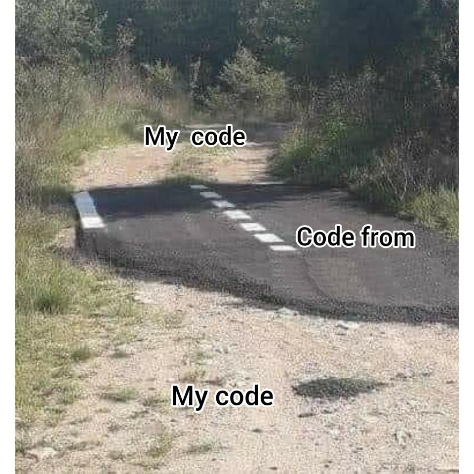

# TP : balles rebondissantes

{: .center witdh=40%}

## 1. Prise en main de Pygame

```python linenums='1'
import pygame, sys
import time
from pygame.locals import *


pygame.display.init()
fenetre = pygame.display.set_mode((640, 480))
fenetre.fill([0,0,0])

x = 300
y = 200
dx = 4
dy = -3
couleur = (45,170,250)

while True :
    fenetre.fill([0,0,0])
    pygame.draw.circle(fenetre,couleur,(x,y),10)
    
    x += dx
    y += dy
    
    pygame.display.update()
    
    # routine pour pouvoir fermer «proprement» la fenêtre Pygame
    for event in pygame.event.get():
        if event.type == pygame.QUIT:
            pygame.display.quit()
            sys.exit()
    
    
    time.sleep(0.1)
```

### 1.1  Rajout d'un rebond sur les parois
Modifiez le code précédent afin que la balle rebondisse sur chaque paroi (il suffit de modifier intelligemment les variables de vitesse ```dx``` et ```dy```).

??? info "Correction"
    ```python linenums='1'
    import pygame, sys
    import time
    from pygame.locals import *

    largeur = 64
    hauteur = 480
    taille = 20
    dx = 7
    dy = 4

    pygame.display.init()
    fenetre = pygame.display.set_mode((largeur, hauteur))
    fenetre.fill([0,0,0])

    x = largeur // 2
    y = hauteur // 2

    couleur = (45,170,250)


    while True :
        fenetre.fill([0,0,0])
        pygame.draw.circle(fenetre,couleur,(x,y),taille)

        x += dx
        y += dy
        
        # rebond en haut ou en bas
        if y < taille or y > hauteur - taille:
            dy = -dy

        # rebond à gauche ou à droite
        if x < taille or x > largeur - taille:
            dx = -dx

        

        pygame.display.update()

        # routine pour pouvoir fermer «proprement» la fenêtre Pygame
        for event in pygame.event.get():
            if event.type == pygame.QUIT:
                pygame.display.quit()
                sys.exit()


        time.sleep(0.03)
    ```

### 1.2 Rajout d'une deuxième balle
Attention au nommage des variables...

??? info "Correction"
    ```python linenums='1'
    import pygame, sys
    import time
    from pygame.locals import *

    largeur = 64
    hauteur = 480
    taille = 20
    dxA = 7
    dyA = 4
    dxB = -5
    dyB = 3


    pygame.display.init()
    fenetre = pygame.display.set_mode((largeur, hauteur))
    fenetre.fill([0,0,0])

    xA = largeur // 2
    yA = hauteur // 2
    xB = largeur // 2
    yB = hauteur // 2


    couleurA = (45,170,250)
    couleurB = (155,17,250)

    while True :
        fenetre.fill([0,0,0])
        pygame.draw.circle(fenetre,couleurA,(xA,yA),taille)
        pygame.draw.circle(fenetre,couleurB,(xB,yB),taille)
        
        xA += dxA
        yA += dyA
    
        xB += dxB
        yB += dyB
    
    
        # rebond en haut ou en bas
        if yA < taille or yA > hauteur - taille:
            dyA = -dyA

        # rebond à gauche ou à droite
        if xA < taille or xA > largeur - taille:
            dxA = -dxA

        # rebond en haut ou en bas
        if yB < taille or yB > hauteur - taille:
            dyB = -dyB

        # rebond à gauche ou à droite
        if xB < taille or xB > largeur - taille:
            dxB = -dxB   

        pygame.display.update()

        # routine pour pouvoir fermer «proprement» la fenêtre Pygame
        for event in pygame.event.get():
            if event.type == pygame.QUIT:
                pygame.display.quit()
                sys.exit()


        time.sleep(0.03)
    ```

### 1.3 Gestion de la collision entre les deux balles
1. À l'aide d'un schéma (papier-crayon !), mettez en évidence le test devant être réalisé pour détecter une collision.
2. Implémentez ce test et affichez "collision" en console lorsque les deux balles se touchent.

    ??? info "Correction"
        ```python linenums='1'
        import pygame, sys
        import time
        from pygame.locals import *

        largeur = 320
        hauteur = 480
        taille = 20
        dxA = 7
        dyA = 4
        dxB = -5
        dyB = 3


        pygame.display.init()
        fenetre = pygame.display.set_mode((largeur, hauteur))
        fenetre.fill([0,0,0])

        xA = largeur // 2
        yA = hauteur // 2
        xB = largeur // 2
        yB = hauteur // 2


        couleurA = (45,170,250)
        couleurB = (155,17,250)

        def distanceAB(xA, yA, xB, yB):
            return ((xA-xB)**2 + (yA-yB)**2)**0.5


        while True :
            fenetre.fill([0,0,0])
            pygame.draw.circle(fenetre,couleurA,(xA,yA),taille)
            pygame.draw.circle(fenetre,couleurB,(xB,yB),taille)

            xA += dxA
            yA += dyA

            xB += dxB
            yB += dyB


            # rebond en haut ou en bas
            if yA < taille or yA > hauteur - taille:
                dyA = -dyA

            # rebond à gauche ou à droite
            if xA < taille or xA > largeur - taille:
                dxA = -dxA

            # rebond en haut ou en bas
            if yB < taille or yB > hauteur - taille:
                dyB = -dyB

            # rebond à gauche ou à droite
            if xB < taille or xB > largeur - taille:
                dxB = -dxB
                
            if distanceAB(xA, yA, xB, yB) < 2*taille:
                print("collision")

            pygame.display.update()

            # routine pour pouvoir fermer «proprement» la fenêtre Pygame
            for event in pygame.event.get():
                if event.type == pygame.QUIT:
                    pygame.display.quit()
                    sys.exit()


            time.sleep(0.03)

        ```

3. Pour l'illusion du rebond, échangez les valeurs respectives de ```dx``` et ```dy``` pour les deux balles.

    ??? info "Correction"
        ```python linenums='1'
        import pygame, sys
        import time
        from pygame.locals import *

        largeur = 200
        hauteur = 200
        taille = 20
        dxA = 7
        dyA = 4
        dxB = -5
        dyB = 3


        pygame.display.init()
        fenetre = pygame.display.set_mode((largeur, hauteur))
        fenetre.fill([0,0,0])

        xA = largeur // 3
        yA = hauteur // 3
        xB = largeur // 2
        yB = hauteur // 2


        couleurA = (45,170,250)
        couleurB = (155,17,250)

        def distanceAB(xA, yA, xB, yB):
            return ((xA-xB)**2 + (yA-yB)**2)**0.5


        while True :
            fenetre.fill([0,0,0])
            pygame.draw.circle(fenetre,couleurA,(xA,yA),taille)
            pygame.draw.circle(fenetre,couleurB,(xB,yB),taille)

            xA += dxA
            yA += dyA

            xB += dxB
            yB += dyB


            # rebond en haut ou en bas
            if yA < taille or yA > hauteur - taille:
                dyA = -dyA

            # rebond à gauche ou à droite
            if xA < taille or xA > largeur - taille:
                dxA = -dxA

            # rebond en haut ou en bas
            if yB < taille or yB > hauteur - taille:
                dyB = -dyB

            # rebond à gauche ou à droite
            if xB < taille or xB > largeur - taille:
                dxB = -dxB

            if distanceAB(xA, yA, xB, yB) < 2*taille:
                dxA, dxB = dxB, dxA
                dyA, dyB = dyB, dyA

            pygame.display.update()

            # routine pour pouvoir fermer «proprement» la fenêtre Pygame
            for event in pygame.event.get():
                if event.type == pygame.QUIT:
                    pygame.display.quit()
                    sys.exit()


            time.sleep(0.03)

        ```


### 1.4 Rajout d'une troisième balle et gestion du rebond avec les deux autres.
... vraiment ? Peut-on continuer comme précédemment ?

## 2. La POO à la rescousse : création d'une classe Balle

### 2.1 la classe Balle
L'objectif est que la méthode constructeur dote chaque nouvelle balle de valeurs aléatoires : abscisse, ordonnée, vitesse, couleur...  
Créez cette classe et instanciez une balle.

??? info "Correction"
    ```python linenums='1'
    import pygame, sys
    import time
    from pygame.locals import *
    from random import randint
    # randint(0,10) -> nb aléatoire entre 0 et 10

    largeur = 400
    hauteur = 400
    taille = 20


    pygame.display.init()
    fenetre = pygame.display.set_mode((largeur, hauteur))
    fenetre.fill([0,0,0])


    class Balle:
        def __init__(self):
            self.x = randint(0, largeur)
            self.y = randint(0, hauteur)        
            self.dx = randint(2,5)
            self.dy = randint(2,5)
            self.couleur = (randint(0,255), randint(0,255), randint(0,255))
            self.taille = taille
            
        def dessine(self):
            pygame.draw.circle(fenetre,self.couleur,(self.x,self.y),self.taille)    
            
        def bouge(self):
            self.x += self.dx
            self.y += self.dy
            
    ma_balle = Balle()     
            
    while True :
        fenetre.fill([0,0,0])
        
        ma_balle.dessine()
        ma_balle.bouge()
        
        pygame.display.update()
        for event in pygame.event.get():
            if event.type == pygame.QUIT:
                pygame.display.quit()
                sys.exit()


        time.sleep(0.05)

    ```


Puis plusieurs balles ! (qui se collisionnent...)

??? info "Correction"
    ```python linenums='1'
    import pygame, sys
    import time
    from pygame.locals import *
    from random import randint


    largeur = 800
    hauteur = 600
    taille = 20
    nb_balles = 100

    pygame.display.init()
    fenetre = pygame.display.set_mode((largeur, hauteur))
    fenetre.fill([0,0,0])


    class Balle:
        def __init__(self):
            self.x = randint(0, largeur)
            self.y = randint(0, hauteur)        
            self.dx = randint(2,5)
            self.dy = randint(2,5)
            self.couleur = (randint(0,255), randint(0,255), randint(0,255))
            self.taille = taille

        def dessine(self):
            pygame.draw.circle(fenetre,self.couleur,(self.x,self.y),self.taille)    

        def bouge(self):
            self.x += self.dx
            self.y += self.dy
            
            # 1. rebond sur les parois
            if self.y < self.taille or self.y > hauteur - self.taille:
                self.dy = -self.dy
            if self.x < self.taille or self.x > largeur - self.taille:
                self.dx = -self.dx

            
            # 4. gérer la collision de toutes les balles
            # je teste la collision de self avec chacune des autres balles
            for balle in mon_sac_a_balles:
                # collision entre self et balle
                if ((self.x-balle.x)**2 + (self.y-balle.y)**2)**0.5 < self.taille + balle.taille:
                    self.dx, balle.dx = balle.dx, self.dx
                    self.dy, balle.dy = balle.dy, self.dy
                
            
            
    # 2. Créer 10 balles  (par ex)     

    mon_sac_a_balles = []
    for k in range(nb_balles):
        new_ball = Balle()
        mon_sac_a_balles.append(new_ball)


    while True :
        fenetre.fill([0,0,0])
        
        #3. Animer toutes les balles
        for balle in mon_sac_a_balles:
            balle.dessine()
            balle.bouge()


        pygame.display.update()
        for event in pygame.event.get():
            if event.type == pygame.QUIT:
                pygame.display.quit()
                sys.exit()
            
        time.sleep(0.05)
    ```


!!! capytale "Dépôt de projet sur Capytale : [fd7c-59906](https://capytale2.ac-paris.fr/web/c-auth/list?returnto=/web/code/fd7c-59906)"
    Servez-vous de cette feuille de projet pour y déposer les différentes versions de votre travail.
    Je pourrai ainsi le consulter au fur et à mesure de votre progression.

    Ce que je ne veux pas voir :
    {: .center width=40%} 


