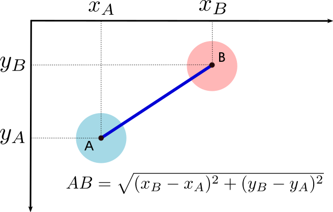

# TP : balles rebondissantes

{: .center witdh=40%}

## 1. Prise en main de Pygame

```python linenums='1'
import pygame, sys
import time
from pygame.locals import *

LARGEUR = 640
HAUTEUR = 480
RAYON = 20

pygame.display.init()
fenetre = pygame.display.set_mode((LARGEUR, HAUTEUR))
fenetre.fill([0,0,0])

x = 300
y = 200
dx = 4
dy = -3
couleur = (45, 170, 250)

while True:
    fenetre.fill([0, 0, 0])
    pygame.draw.circle(fenetre, couleur, (x, y), RAYON)

    x += dx
    y += dy

    pygame.display.update()

    # routine pour pouvoir fermer «proprement» la fenêtre Pygame
    for event in pygame.event.get():
        if event.type == pygame.QUIT:
            pygame.display.quit()
            sys.exit()

    time.sleep(0.1)


```

### 1.1  Rajout d'un rebond sur les parois
Modifiez le code précédent afin que la balle rebondisse sur chaque paroi (il suffit de modifier intelligemment les variables de vitesse ```dx``` et ```dy```).

{{
correction(True,
"""
??? success \"Correction\" 
    ```python linenums='1'
    import pygame, sys
    import time
    from pygame.locals import *

    LARGEUR = 640
    HAUTEUR = 480
    RAYON = 20

    pygame.display.init()
    fenetre = pygame.display.set_mode((LARGEUR, HAUTEUR))
    fenetre.fill([0, 0, 0])


    x = 300
    y = 200
    dx = 4
    dy = -3
    couleur = (45, 170, 250)

    while True:
        fenetre.fill([0, 0, 0])
        pygame.draw.circle(fenetre, couleur, (x, y), RAYON)

        x += dx
        y += dy

        if (y <= RAYON) or (y >= HAUTEUR - RAYON):
            dy = -dy
        if (x <= RAYON) or (x >= LARGEUR - RAYON):
            dx = -dx

        pygame.display.update()

        # routine pour pouvoir fermer «proprement» la fenêtre Pygame
        for event in pygame.event.get():
            if event.type == pygame.QUIT:
                pygame.display.quit()
                sys.exit()

        time.sleep(0.02)


    ```    
"""
)
}}


### 1.2 Rajout d'une deuxième balle
Attention au nommage des variables...

{{
correction(True,
"""
??? success \"Correction\" 
    ```python linenums='1'
    import pygame, sys
    import time
    from pygame.locals import *

    LARGEUR = 640
    HAUTEUR = 480
    RAYON = 20

    pygame.display.init()
    fenetre = pygame.display.set_mode((LARGEUR, HAUTEUR))
    fenetre.fill([0, 0, 0])


    dxA = 7
    dyA = 4
    dxB = -5
    dyB = 3


    xA = LARGEUR // 3
    yA = HAUTEUR // 2
    xB = LARGEUR // 2
    yB = HAUTEUR // 2


    couleurA = (45, 170, 250)
    couleurB = (155, 17, 250)

    while True:
        fenetre.fill([0, 0, 0])
        pygame.draw.circle(fenetre, couleurA, (xA, yA), RAYON)
        pygame.draw.circle(fenetre, couleurB, (xB, yB), RAYON)

        xA += dxA
        yA += dyA

        xB += dxB
        yB += dyB

        # rebond en haut ou en bas
        if (yA < RAYON) or (yA > HAUTEUR - RAYON):
            dyA = -dyA

        # rebond à gauche ou à droite
        if (xA < RAYON) or (xA > LARGEUR - RAYON):
            dxA = -dxA

        # rebond en haut ou en bas
        if (yB < RAYON) or (yB > HAUTEUR - RAYON):
            dyB = -dyB

        # rebond à gauche ou à droite
        if (xB < RAYON) or (xB > LARGEUR - RAYON):
            dxB = -dxB

        pygame.display.update()

        # routine pour pouvoir fermer «proprement» la fenêtre Pygame
        for event in pygame.event.get():
            if event.type == pygame.QUIT:
                pygame.display.quit()
                sys.exit()

        time.sleep(0.03)


    ```    
"""
)
}}


### 1.3 Gestion de la collision entre les deux balles
**Q1.** À l'aide d'un schéma (papier-crayon !), mettez en évidence le test devant être réalisé pour détecter une collision.

??? tip "indice"
    {: .center}
    

**Q2.** Implémentez ce test (en créant pour cela une fonction ```distance``` )  et affichez "collision" en console lorsque les deux balles se touchent.

{{
correction(True,
"""
??? success \"Correction\" 
    ```python linenums='1'
    import pygame, sys
    import time
    from pygame.locals import *

    LARGEUR = 640
    HAUTEUR = 480
    RAYON = 20

    pygame.display.init()
    fenetre = pygame.display.set_mode((LARGEUR, HAUTEUR))
    fenetre.fill([0, 0, 0])


    dxA = 7
    dyA = 4
    dxB = -5
    dyB = 3


    xA = LARGEUR // 3
    yA = HAUTEUR // 2
    xB = LARGEUR // 2
    yB = HAUTEUR // 2


    couleurA = (45, 170, 250)
    couleurB = (155, 17, 250)


    def distanceAB(xA, yA, xB, yB):
        return ((xA-xB)**2 + (yA-yB)**2)**0.5


    while True:
        fenetre.fill([0, 0, 0])
        pygame.draw.circle(fenetre, couleurA, (xA, yA), RAYON)
        pygame.draw.circle(fenetre, couleurB, (xB, yB), RAYON)

        xA += dxA
        yA += dyA

        xB += dxB
        yB += dyB

        # rebond en haut ou en bas
        if (yA < RAYON) or (yA > HAUTEUR - RAYON):
            dyA = -dyA

        # rebond à gauche ou à droite
        if (xA < RAYON) or (xA > LARGEUR - RAYON):
            dxA = -dxA

        # rebond en haut ou en bas
        if (yB < RAYON) or (yB > HAUTEUR - RAYON):
            dyB = -dyB

        # rebond à gauche ou à droite
        if (xB < RAYON) or (xB > LARGEUR - RAYON):
            dxB = -dxB

        if distanceAB(xA, yA, xB, yB) < 2 * RAYON:
            print('collision')

        pygame.display.update()

        # routine pour pouvoir fermer «proprement» la fenêtre Pygame
        for event in pygame.event.get():
            if event.type == pygame.QUIT:
                pygame.display.quit()
                sys.exit()

        time.sleep(0.03)


    ```    
"""
)
}}


**Q3.** Pour donner l'illusion physique du rebond, échangez les valeurs respectives de ```dx``` et ```dy``` pour les deux balles.

{{
correction(True,
"""
??? success \"Correction\" 
    ```python linenums='1'
    import pygame, sys
    import time
    from pygame.locals import *

    LARGEUR = 640
    HAUTEUR = 480
    RAYON = 20

    pygame.display.init()
    fenetre = pygame.display.set_mode((LARGEUR, HAUTEUR))
    fenetre.fill([0, 0, 0])


    dxA = 7
    dyA = 4
    dxB = -5
    dyB = 3


    xA = LARGEUR // 3
    yA = HAUTEUR // 2
    xB = LARGEUR // 2
    yB = HAUTEUR // 2


    couleurA = (45, 170, 250)
    couleurB = (155, 17, 250)


    def distanceAB(xA, yA, xB, yB):
        return ((xA-xB)**2 + (yA-yB)**2)**0.5


    while True:
        fenetre.fill([0, 0, 0])
        pygame.draw.circle(fenetre, couleurA, (xA, yA), RAYON)
        pygame.draw.circle(fenetre, couleurB, (xB, yB), RAYON)

        xA += dxA
        yA += dyA

        xB += dxB
        yB += dyB

        # rebond en haut ou en bas
        if (yA < RAYON) or (yA > HAUTEUR - RAYON):
            dyA = -dyA

        # rebond à gauche ou à droite
        if (xA < RAYON) or (xA > LARGEUR - RAYON):
            dxA = -dxA

        # rebond en haut ou en bas
        if (yB < RAYON) or (yB > HAUTEUR - RAYON):
            dyB = -dyB

        # rebond à gauche ou à droite
        if (xB < RAYON) or (xB > LARGEUR - RAYON):
            dxB = -dxB

        if distanceAB(xA, yA, xB, yB) < 2 * RAYON:
            dxA, dxB = dxB, dxA
            dyA, dyB = dyB, dyA

        pygame.display.update()

        # routine pour pouvoir fermer «proprement» la fenêtre Pygame
        for event in pygame.event.get():
            if event.type == pygame.QUIT:
                pygame.display.quit()
                sys.exit()

        time.sleep(0.03)


    ```    
"""
)
}}


### 1.4 Rajout d'une troisième balle et gestion du rebond avec les deux autres.
... vraiment ? Peut-on continuer comme précédemment ?

{: .center width=30%}


## 2. La POO à la rescousse : création d'une classe Balle

### 2.1 la classe Balle
L'objectif est que la méthode constructeur dote chaque nouvelle balle de valeurs aléatoires : abscisse, ordonnée, vitesse, couleur...  

- Pour l'aléatoire, on pourra utiliser ```randint(a, b)``` qui renvoie un nombre pseudo-aléatoire entre ```a``` et ```b```.
Il faut pour cela importer la fonction, par ```from random import randint``` 

- Vous pouvez aussi doter votre classe ```Balle``` d'une méthode ```dessine``` (qui affiche la balle), ainsi qu'une méthode ```bouge``` qui la fait bouger. 

Créez cette classe et instanciez une balle.

{{
correction(True,
"""
??? success \"Correction\" 
    ```python linenums='1'
    import pygame, sys
    import time
    from pygame.locals import *
    from random import randint

    # randint(0,10) -> nb aléatoire entre 0 et 10

    LARGEUR = 640
    HAUTEUR = 480
    RAYON = 20

    pygame.display.init()
    fenetre = pygame.display.set_mode((LARGEUR, HAUTEUR))
    fenetre.fill([0, 0, 0])


    class Balle:
        def __init__(self):
            self.x = randint(0, LARGEUR)
            self.y = randint(0, HAUTEUR)
            self.dx = randint(2, 5)
            self.dy = randint(2, 5)
            self.couleur = (randint(0, 255), randint(0, 255), randint(0, 255))
            self.taille = RAYON

        def dessine(self):
            pygame.draw.circle(fenetre, self.couleur, (self.x, self.y), self.taille)

        def bouge(self):
            self.x += self.dx
            self.y += self.dy

            if self.y < self.taille or self.y > HAUTEUR - self.taille:
                self.dy = -self.dy
            if self.x < self.taille or self.x > LARGEUR - self.taille:
                self.dx = -self.dx


    ma_balle = Balle()

    while True:
        fenetre.fill([0, 0, 0])

        ma_balle.dessine()
        ma_balle.bouge()

        pygame.display.update()
        for event in pygame.event.get():
            if event.type == pygame.QUIT:
                pygame.display.quit()
                sys.exit()

        time.sleep(0.05)

    ```    
"""
)
}}

    

### 2.2 Plusieurs balles

L'idée est de stocker dans une liste ```sac_a_balles``` un nombre déterminé de balles... 

{{
correction(True,
"""
??? success \"Correction\" 
    ```python linenums='1'
    import pygame, sys
    import time
    from pygame.locals import *
    from random import randint

    # randint(0,10) -> nb aléatoire entre 0 et 10

    LARGEUR = 640
    HAUTEUR = 480
    RAYON = 20
    NB_BALLES = 10

    pygame.display.init()
    fenetre = pygame.display.set_mode((LARGEUR, HAUTEUR))
    fenetre.fill([0, 0, 0])


    class Balle:
        def __init__(self):
            self.x = randint(0, LARGEUR)
            self.y = randint(0, HAUTEUR)
            self.dx = randint(2, 5)
            self.dy = randint(2, 5)
            self.couleur = (randint(0, 255), randint(0, 255), randint(0, 255))
            self.taille = RAYON

        def dessine(self):
            pygame.draw.circle(fenetre, self.couleur, (self.x, self.y), self.taille)

        def bouge(self):
            self.x += self.dx
            self.y += self.dy

            if self.y < self.taille or self.y > HAUTEUR - self.taille:
                self.dy = -self.dy
            if self.x < self.taille or self.x > LARGEUR - self.taille:
                self.dx = -self.dx


    mon_sac_a_balles = [Balle() for _ in range(NB_BALLES)]

    while True:
        fenetre.fill([0, 0, 0])

        for balle in mon_sac_a_balles:
            balle.dessine()
            balle.bouge()

        pygame.display.update()
        for event in pygame.event.get():
            if event.type == pygame.QUIT:
                pygame.display.quit()
                sys.exit()

        time.sleep(0.05)


    ```    
"""
)
}}


    

    

### 2.3 Collision de toutes les balles

Il «suffit» , dans la méthode constructeur, de tester la collision de la balle ```self``` avec chacune des balles de notre ```sac_a_balles```. 

{{
correction(True,
"""
??? success \"Correction\" 
    ```python linenums='1'
    import pygame, sys
    import time
    from pygame.locals import *
    from random import randint

    # randint(0,10) -> nb aléatoire entre 0 et 10

    LARGEUR = 640
    HAUTEUR = 480
    RAYON = 20
    NB_BALLES = 10

    pygame.display.init()
    fenetre = pygame.display.set_mode((LARGEUR, HAUTEUR))
    fenetre.fill([0, 0, 0])


    class Balle:
        def __init__(self):
            self.x = randint(0, LARGEUR)
            self.y = randint(0, HAUTEUR)
            self.dx = randint(2, 5)
            self.dy = randint(2, 5)
            self.couleur = (randint(0, 255), randint(0, 255), randint(0, 255))
            self.taille = RAYON

        def dessine(self):
            pygame.draw.circle(fenetre, self.couleur, (self.x, self.y), self.taille)

        def bouge(self):
            self.x += self.dx
            self.y += self.dy

            if self.y < self.taille or self.y > HAUTEUR - self.taille:
                self.dy = -self.dy
            if self.x < self.taille or self.x > LARGEUR - self.taille:
                self.dx = -self.dx

            for balle in mon_sac_a_balles:
                if (
                    (self.x - balle.x) ** 2 + (self.y - balle.y) ** 2
                ) ** 0.5 < self.taille + balle.taille:
                    self.dx, balle.dx = balle.dx, self.dx
                    self.dy, balle.dy = balle.dy, self.dy


    mon_sac_a_balles = []
    for _ in range(NB_BALLES):
        new_ball = Balle()
        mon_sac_a_balles.append(new_ball)

    # ces 4 dernières lignes peuvent s'écrire par une seule ligne en compréhension :
    # mon_sac_a_balles = [Balle() for _ in range(NB_BALLES)]

    while True:
        fenetre.fill([0, 0, 0])

        for balle in mon_sac_a_balles:
            balle.dessine()
            balle.bouge()

        pygame.display.update()
        for event in pygame.event.get():
            if event.type == pygame.QUIT:
                pygame.display.quit()
                sys.exit()

        time.sleep(0.05)


    ```    
"""
)
}}


## 3. Extensions

- Vous pouvez créer des balles de couleurs identiques, sauf une. Cette balle diffusera sa couleur à toutes les balles avec qui elle rentrera en collision.
- En la supprimant de la liste ```sac_a_balles```, vous pouvez faire disparaitre une balle.
- Vous pouvez créer une balle que vous déplacerez au clavier (voir [ici](https://glassus.github.io/premiere_nsi/T6_Mini-projets/05_Initiation_Pygame/){. target="_blank"} pour la gestion des déplacements)
- ...
- Ce que je ne veux pas voir : 
{: .center width=40%} 


## 4. Organisation du projet

!!! tip "Calendrier du projet"
    - 15/09/2025 : démarrage du projet et constitution des groupes
    - à 15h (Groupe 1) ou à 17h (Groupe 2) les lundi 22/09, 29/09, 06/10 et 13/10 : travail sur le projet
    - remise du projet sur Capytale : **jeudi 16/10/2025 à 18h dernier délai**

!!! capytale "Dépôt de projet sur Capytale "

    Cliquez [ici](https://capytale2.ac-paris.fr/web/c/1923-3932584){. target="_blank"}.
    Servez-vous de cette feuille de projet pour y déposer les différentes versions de votre travail.
    Je pourrai ainsi le consulter au fur et à mesure de votre progression.

!!! abstract "Évaluation du projet"
    - sur 10 points : note globale du projet.
    - sur 10 points : entretien individuel autour du code du projet. 


!!! abstract "Groupes de projet"
    - Groupe 1:
        - groupe A : Mykhaïlo - Andgel - Normann
        - groupe B : Ethan -  Sohel
        - groupe C : Tidiane - Mathis
        - groupe D : Vitor - Nina - Alexandre
        - groupe E : Fortuné - Rizgar - Mathys

    - Groupe 2:
        - groupe A : Maël - Noham
        - groupe B : Lana -  Kayna
        - groupe C : Gift - Alice - Eliott
        - groupe D : Yacine - Victor
        - groupe E : Hugo - Alexis - Gabriel
        - groupe F : Timéo - Raphaël