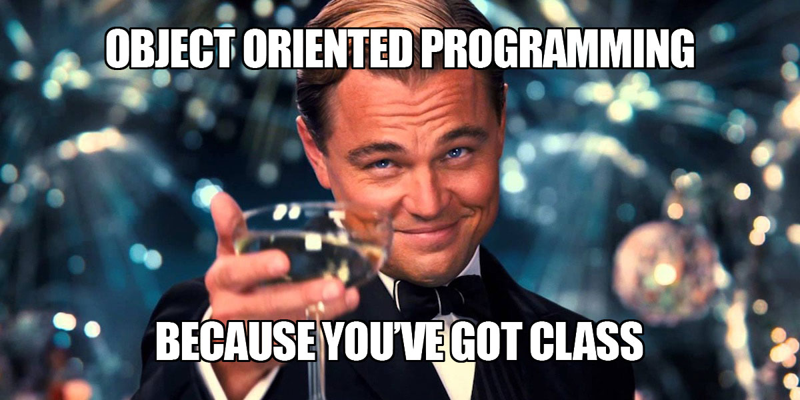
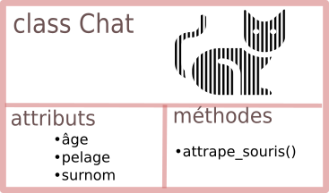

# Programmation orientée objet 
{: .center}

_abrégée par POO en français, OOP en anglais (ne pas confondre)_

{: .center width='50%'}


## 0. Introduction
La POO est un **paradigme** de programmation, au même titre que la programmation impérative (que nous pratiquons déjà) ou la programmation fonctionnelle (qui sera étudiée cette année en Terminale), ou encore d'autres paradigmes (la liste est longue).  
Un paradigme de programmation pourrait se définir comme une _philosophie_ dans la manière de programmer : c'est un parti-pris revendiqué dans la manière d'aborder le problème à résoudre. Une fois cette décision prise, des outils spécifiques au paradigme choisi sont utilisés. 

!!! info "Métaphore"
    Imaginons 3 menuisiers qui ont pour mission de fabriquer chacun un meuble. 

    - Le premier pourra décider d'utiliser du collé-pointé : il assemblera les morceaux de bois en les collant puis utilisera des pointes. Ses outils seront le marteau et le pistolet à colle.
    - Le deuxième pourra décider de visser les morceaux de bois entre eux : son outil principal sera une visseuse.
    - Le troisième pourra décider de faire de l'assemblage par [tenons et mortaises](https://www.fraise-defonceuse.fr/tenon-mortaise-defonceuse/) : son outil principal sera une défonceuse.

    Pour la réalisation de sa mission, chaque menuisier utilise un paradigme différent. 
    Qui utilise la meilleure méthode ? Cette question n'a pas vraiment de réponse : certaines méthodes sont plus rapides que d'autres, d'autres plus robustes, d'autres plus esthétiques...  
    Et pourquoi ne pas mélanger les paradigmes ? Rien n'interdit d'utiliser des pointes ET des vis dans la fabrication d'un meuble. 

La Programmation Orientée Objet sera (surtout à notre niveau) mélangée avec de la programmation impérative, de la programmation fonctionnelle... d'ailleurs vous avez déjà manipulé des objets sans le savoir :

## 1. Des objets déjà autour de nous


```python
>>> m = [4,5,2]
>>> type(m)
list
```

```m``` est une liste, ou plus précisément un **objet** de type ```list```. Et en tant qu'objet de type ```list```, il est possible de lui appliquer certaines fonctions prédéfinies (qu'on appelera **méthodes**) :


```python
>>> m.reverse()
```

La syntaxe utilisée (le . après le nom de l'objet) est spécifique à la POO. Chaque fois que vous voyez cela, c'est que vous êtes en train de manipuler des objets.  
Mais qu'a donc fait cette méthode ```reverse()``` ?   


```python
>>> m
[2, 5, 4]
```

Nous ne sommes pas surpris par ce résultat car la personne qui a programmé la méthode ```reverse()``` lui a donné un nom explicite.  
Comment a-t-elle programmé cette inversion des valeurs de la liste ? Nous n'en savons rien et cela ne nous intéresse pas. Nous sommes juste utilisateurs de cette méthode. 
L'objet de type ```list``` nous a été livré avec sa méthode ```reverse()``` (et bien d'autres choses) et nous n'avons pas à démonter la boîte pour en observer les engrenages : on parle de principe d'**encapsulation**.

On peut obtenir la liste de toutes les fonctions disponibles pour un objet de type ```list```, par la fonction ```dir``` :


```python
>>> dir(m)
['__add__',
'__class__',
'__contains__',
'__delattr__',
...
'clear',
'copy',
'count',
'extend',
'index',
'insert',
'pop',
'remove',
'reverse',
'sort']
```


Les méthodes encadrées par un double underscore __ sont des méthodes **privées**, a priori non destinées à l'utilisateur. Les méthodes **publiques**, utilisables pour chaque objet de type ```list```, sont donc ```append```, ```clear```, ...  

Comment savoir ce que font les méthodes ? Si elles ont été correctement codées (et elles l'ont été), elles possèdent une _docstring_, accessible par :


```python
>>> m.append.__doc__
'Append object to the end of the list.'
>>> m.reverse.__doc__
'Reverse *IN PLACE*.'
```


## 2. Créer ~~son propre objet~~ sa propre classe
### 2.1 Vocabulaire : classe,  objet, instance de classe
Jusqu'ici nous avons employé uniquement le mot «objet». Il convient maintenant d'être plus précis.  

- On désignera par **classe** la structure de données définissant une catégorie générique d'objets. Dans le monde animal, _chat_ est une classe (nommée en réalité _félidé_ ). 
- Chaque élement de la classe _chat_ va se distinguer par des caractéristiques : un âge, une couleur de pelage, un surnom... (on appelera ces caractéristiques des **attributs**) et des fonctionnalités, comme la **méthode** ```attrape_souris()```.  
- Lorsqu'on désigne un chat en particulier, on désigne alors un **objet** (bien réel) qui est une **instance** de la **classe** (abstraite) _chat_. 

Par exemple, 
l'**objet** <a href="https://fr.wikipedia.org/wiki/Larry_(chat)">Larry</a> est une **instance** de la **classe** _chat_ . 

{: .center width='30%'}


D'après Wikipedia, 


```python
larry.pelage = "blanc et tabby"
larry.surnom = "Chief Mouser to the Cabinet Office"
```

Toujours d'après Wikipedia, la méthode ```larry.attrape_souris()``` est plutôt efficace.

### 2.2 Création d'une classe

#### 2.2.1 (mauvaise) manière minimale
Créons une classe «voiture». Il suffit d'écrire :


```python
class Voiture :
    pass   #pass, car pour l'instant il n'y a rien dans la déclaration de la classe (et c'est mal)
```

La classe ```Voiture``` est créée.  
Notez que par convention, le nom d'une classe commence toujours par une majuscule.  
Pour créer une instance de cette classe, on écrit :


```python
>>> titine = Voiture()
```

```titine``` est un objet, instance de la classe ```Voiture```.


```python
>>> type(titine)
__main__.Voiture
```

On peut alors donner des attributs à cette instance :


```python
>>> titine.annee = 2018
>>> titine.couleur = "verte"
>>> titine.vitesse_max = 162
```

Mais arrêtons-là cette mauvaise méthode. Si on désire créer une classe «voiture», c'est pour créer un concept générique de voiture et d'en spécifier des caractéristiques communes  : l'année, la couleur, la vitesse maximale... 

L'idée est donc qu'à la création (on dira plutôt à la **construction**) de chaque objet voiture, on va lui spécifier directement ses attributs :

#### 2.2.2 (bonne) manière : la méthode constructeur :heart:

La **méthode constructeur**, toujours appelée ```__init__()```, est une méthode (une «def») qui sera automatiquement appelée à la création de l'objet. Elle va donc le doter de tous les attributs de sa classe.


```python linenums="1"
class Voiture :
    def __init__(self, annee, coul, vmax) :
        self.annee = annee
        self.couleur = coul
        self.vitesse_max = vmax
        self.age = 2021 - self.annee
```

- le mot-clé ```self```, omniprésent en POO (d'autres langages utilisent ```this```), fait référence à l'objet lui-même, qui est en train d'être construit.
- pour construire l'objet, 3 paramètres seront nécessaires : ```annee```, ```coul``` et ```vmax```. Ils donneront respectivement leur valeur aux attributs ```annee```, ```couleur``` et ```vitesse_max```.
- dans cet exemple, les noms ```coul``` et ```vmax``` ont été utilisés pour abréger ```couleur``` et ```vitesse_max```, mais il est recommandé de garder les mêmes noms, même si ce n'est pas du tout obligatoire.

Construisons donc notre première voiture !


```python
>>> mon_bolide = Voiture(2012, "rouge", 190)
```


```python
>>> type(mon_bolide)
__main__.Voiture
```


```mon_bolide``` possède 4 attributs : 

- ```annee```, ```couleur``` et ```vitesse_max``` ont été donnés par l'utilisateur lors de la création.
- ```age``` s'est créé «tout seul» par l'instruction ```self.age = 2021 - self.annee```.


```python
>>> mon_bolide.annee
2012
>>> mon_bolide.couleur
'rouge'
>>> mon_bolide.vitesse_max
190
>>> mon_bolide.age
9
```

Observons les différentes étapes grâce à PythonTutor :
<iframe width="1000" height="450" frameborder="0" src="https://pythontutor.com/iframe-embed.html#code=%0Aclass%20Voiture%20%3A%0A%20%20%20%20def%20__init__%28self,%20annee,%20coul,%20vmax%29%20%3A%0A%20%20%20%20%20%20%20%20self.annee%20%3D%20annee%0A%20%20%20%20%20%20%20%20self.couleur%20%3D%20coul%0A%20%20%20%20%20%20%20%20self.vitesse_max%20%3D%20vmax%0A%20%20%20%20%20%20%20%20self.age%20%3D%202021%20-%20self.annee%0A%20%20%20%20%20%20%20%20%0A%0Amon_bolide%20%3D%20Voiture%282012,%20%22rouge%22,%20190%29%0Aprint%28mon_bolide.couleur%29&codeDivHeight=400&codeDivWidth=350&cumulative=false&curInstr=0&heapPrimitives=nevernest&origin=opt-frontend.js&py=3&rawInputLstJSON=%5B%5D&textReferences=false"> </iframe>


Bien sûr, on peut créer une autre voiture en suivant le même principe :


```python
>>> batmobile = Voiture(2036, "noire", 325)
>>> batmobile.couleur
'noire'
```


!!! example "{{ exercice() }}"
    === "Énoncé"
        Créer une classe ```Point``` permettant de créer un objet ```A``` , dont on récupèrera l'abscisse par la variable ```A.x``` et l'ordonnée par ```A.y```.
        

        ??? info "Exemple d'utilisation de la classe"
            ```python
            >>> A = Point(3,5)
            >>> A.x
            3
            >>> A.y
            5
            ```

    === "Correction"
        ```python linenums='1'
        class Point :
            def __init__(self,x,y):
                self.x = x
                self.y = y
          ```

#### 2.2.4 Créer une méthode pour notre objet


```python linenums="1"
class Voiture :
    def __init__(self, annee, coul, vmax) :
        self.annee = annee
        self.couleur = coul
        self.vitesse_max = vmax
        self.age = 2021 - self.annee
    
    def petite_annonce(self) :
        "À vendre voiture", self.couleur, "de", self.annee,\
             ", vitesse maximale", self.vitesse_max, "km/h.")
```

Remarque : le symbole ```\``` est utilisé ici pour couper une ligne trop longue.

```python
>>> batmobile = Voiture(2036, "noire", 325)
>>> batmobile.petite_annonce()
À vendre voiture noire de 2036 , vitesse maximale 325 km/h.
```

Nous aurions pu (ou dû) en profiter pour écrire une docstring pour notre méthode ```petite_annonce()``` :


```python
class Voiture :
    def __init__(self, annee, coul, vmax) :
        self.annee = annee
        self.couleur = coul
        self.vitesse_max = vmax
        self.age = 2021 - self.annee
    
    def petite_annonce(self) :
        """ Rédige automatiquement une petite annonce concernant le véhicule"""
        print("À vendre voiture", self.couleur, "de", self.annee,\
             ", vitesse maximale", self.vitesse_max, "km/h.")
```


```python
>>> batmobile = Voiture(2036, "noire", 325)
>>> batmobile.petite_annonce.__doc__
    ' Rédige automatiquement une petite annonce concernant le véhicule'
```


Que donne la commande ```dir``` pour notre objet ?


```python
dir(batmobile)
```


    ['__class__',
     '__delattr__',
     '__dict__',
     '__dir__',
     '__doc__',
     '__eq__',
     '__format__',
     '__ge__',
     '__getattribute__',
     '__gt__',
     '__hash__',
     '__init__',
     '__init_subclass__',
     '__le__',
     '__lt__',
     '__module__',
     '__ne__',
     '__new__',
     '__reduce__',
     '__reduce_ex__',
     '__repr__',
     '__setattr__',
     '__sizeof__',
     '__str__',
     '__subclasshook__',
     '__weakref__',
     'age',
     'annee',
     'couleur',
     'petite_annonce',
     'vitesse_max']


On y retrouve donc à la fois les 4 attributs et l'unique méthode que nous avons créés pour notre objet.


!!! example "{{ exercice() }}"
    === "Énoncé"
        Reprendre la classe de l'exercice précédent et rajouter une méthode ```distance()``` qui renvoie la distance du point par rapport à l'origine du repère (dans un repère orthonormé).

        ??? info "Exemple d'utilisation de la classe"
            ```python
            >>> A = Point(3,5)
            >>> A.distance()
            5.830951894845301
            ```

    === "Correction"
        ```python linenums='1'
        class Point:
            def __init__(self,x,y):
                self.x = x
                self.y = y
            
            def distance(self) :
                return (self.x**2+self.y**2)**0.5
        ```

### 3. Compléments


#### 3.1 Hors-Programme : la méthode ```__str__()``` 
La méthode ```__str__()``` (les doubles underscores traduisent le fait que la méthode est *privée*) peut redéfinir la manière dont l'objet doit s'afficher lors qu'on le passe en paramètre à la fonction ```print()```.

Observons comment s'affiche un objet de type ```Fraction``` lorsque rien n'a été spécifié sur son affichage.


```python linenums='1'
class Fraction :
    def __init__(self, den, num) :
        self.denominateur = den
        self.numerateur = num
```


```python
>>> a = Fraction(3,4)
>>> print(a)
 <__main__.Fraction object at 0x7f470445c828>
```

C'est un peu décevant. Rajoutons donc une méthode ```__str__()``` .


```python linenums='1'
class Fraction :
    def __init__(self, den, num) :
        self.denominateur = den
        self.numerateur = num
    
    def __str__(self):
        return str(self.denominateur)+"/"+str(self.numerateur)
```


```python
>>> a = Fraction(3,4)
>>> print(a)
  3/4
```
Ce qui est nettement plus agréable !

#### 3.2 L'encapsulation poussée à bout : les ```getters``` et les ```setters```

Imaginons la classe suivante :

```python linenums='1'
class Joueur :
    def __init__(self, nom, club, age):
        self.nom = nom
        self.club = club
        self.age = age
```

Instancions le joueur Nans Ducuing
```python
>>> nducuing = Joueur("Nans DUCUING", "UBB", 27)
```

{: .center width=15%}
<p style="text-align: center;">
<i>notre cobaye</i>
</p>

##### 3.2.1 Les ```setters``` 

Supposons maintenant que ce joueur change de club, pour aller de l'UBB à Perpignan.

Il serait naturel de faire ceci :
```python
>>> nducuing.club = "Perpignan"
```

Cela marche bien, mais... C'est contraire à l'esprit de la Programmation Orientée Objet. Ce paradigme milite pour une encapsulation des objets, qui interdisent le plus possible l'accès direct à leurs attributs. 

Comment faire alors ? En proposant une méthode dont l'unique travail est d'aller effectuer une modification sur l'attribut :

```python linenums='1'
class Joueur :
    def __init__(self, nom, club, age):
        self.nom = nom
        self.club = club
        self.age = age
    
    def mutation(self, nouveau_club):
        self.club = nouveau_club
```

Le changement de club se fera maintenant par l'appel :
```python
>>> nducuing.mutation("Perpignan")
```

Ce type de méthode s'appelle un ```setter```. 

##### 3.2.2 Les ```getters``` 

Nous avons vu qu'aller modifier directement un attribut était défendu... mais peut-on simplement aller le *consulter* ?

Là encore, le concept d'encapsulation -poussé à l'extrême- peut nous l'interdire. 

Mais si 
```nducuing.club``` est interdit, comment savoir dans quel club joue notre joueur préféré ?

Une fois de plus, en construisant une méthode qui va nous renvoyer l'état actuel de son attribut ```club``` :

```python
class Joueur :
    def __init__(self, nom, club, age):
        self.nom = nom
        self.club = club
        self.age = age
    
    def mutation(self, nouveau_club):
        self.club = nouveau_club
        
    def get_club(self):
        return self.club
```

L'accès à l'attribut ```club``` de notre instance se fera donc maintenant par :

```python
>>> nducuing.get_club()
```

Ce type de méthode s'appelle un ```getter```. 

---
??? Abstract "Sources et bibliographie"
    - Numérique et Sciences Informatiques, Terminale, T. BALABONSKI, S. CONCHON, J.-C. FILLIATRE, K. NGUYEN, éditions ELLIPSES.


