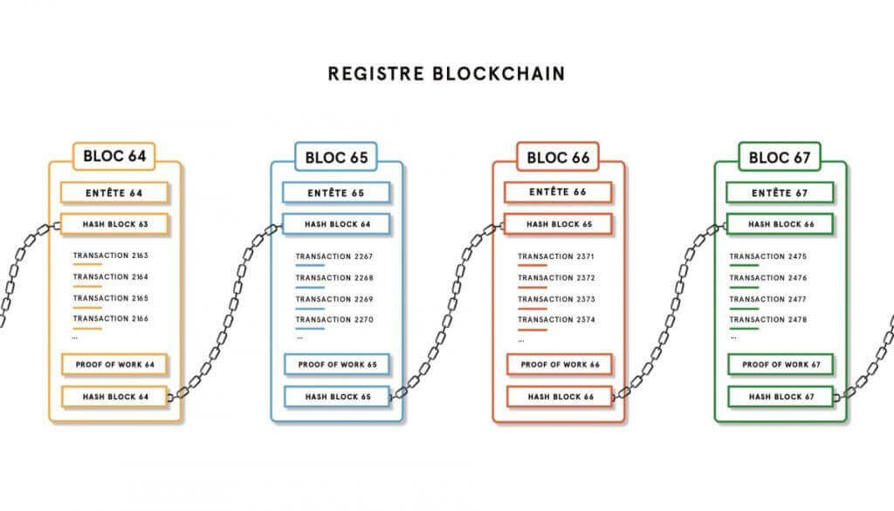

# Exercices


         
{{ initexo(0) }}


!!! example "{{ exercice() }}"
    **Q1.** Écrire une classe ```Eleve``` qui contiendra les attributs ```nom```, ```classe``` et ```note```.
    {{
    correction(True,
    """
    ??? success \"Correction\" 
        ```python linenums='1'
        class Eleve:
            def __init__(self, nom, classe, note):
                self.nom = nom
                self.classe = classe
                self.note = note
 
        ```   
    """
    )
    }}

    **Q2.** Instancier trois élèves de cette classe.
    {{
    correction(True,
    """
    ??? success \"Correction\" 
        ```python
        riri = Eleve('Henri', 'TG2', 12)
        fifi = Eleve('Philippe', 'TG6', 15)
        loulou = Eleve('Louis', 'TG1', 8)
        ```     
    """
    )
    }}

    **Q3.**  Écrire une fonction ```compare``` qui prend en paramètres deux élèves ```eleve1``` et ```eleve2``` qui renvoie le nom de l'élève ayant la meilleure note (on ne traitera pas à part le cas d'égalité).

    {{
    correction(True,
    """
    ??? success \"Correction\" 
        ```python
        class Eleve:
            def __init__(self, nom, classe, note):
                self.nom = nom
                self.classe = classe
                self.note = note
                
        def compare(eleve1, eleve2):
            if eleve1.note > eleve2.note:
                return eleve1.nom
            else:
                return eleve2.nom   
        ``` 
    """
    )
    }}

    !!! info "Exemple d'utilisation de la classe"
        ```python
        >>> riri = Eleve("Henri", "TG2", 12)
        >>> fifi = Eleve("Philippe", "TG6", 15)
        >>> loulou = Eleve("Louis", "TG1", 8)
        >>> compare(riri, fifi)
        'Philippe'
        ```


        


!!! example "{{ exercice() }}"
    
    Écrire une classe ```TriangleRect``` qui contiendra les attributs ```cote1```, ```cote2``` et ```hypotenuse```.

    La méthode constructeur ne prendra en paramètres que ```cote1``` et ```cote2```, l'attribut ```hypotenuse``` se calculera automatiquement.

    !!! info "Exemple d'utilisation de la classe"

        ```python
        >>> mon_triangle = TriangleRect(3,4)
        >>> mon_triangle.cote1
        3
        >>> mon_triangle.cote2
        4
        >>> mon_triangle.hypotenuse
        5.0
        ```


    {{
    correction(True,
    """
    ??? success \"Correction\" 
        ```python linenums='1'
        class TriangleRect:
            def __init__(self, c1, c2):
                self.cote1 = c1
                self.cote2 = c2
                self.hypotenuse = (self.cote1**2 + self.cote2**2)**0.5
        ```        
    """
    )
    }}

        

        

!!! example "{{ exercice() }}"

    **Q1.** Écrire une classe ```Chrono``` qui contiendra les attributs ```heures```, ```minutes``` et ```secondes```.
    {{
    correction(True,
    """
    ??? success \"Correction\" 
        ```python
        class Chrono:
            def __init__(self, h, m, s):
                self.heures = h
                self.minutes = m
                self.secondes = s        
        ```
    """
    )
    }}

    **Q2.** Doter la classe d'une méthode ```affiche``` qui affichera le temps ```t```.
    {{
    correction(True,
    """
    ??? success \"Correction\" 
        ```python
        class Chrono:
            def __init__(self, h, m, s):
                self.heures = h
                self.minutes = m
                self.secondes = s   

            def affiche(self):
                print('Il est {} heures, {} minutes et {} secondes'.format(self.heures, self.minutes, self.secondes))   
        ```
    """
    )
    }}    

    **Q3.** Doter la classe d'une méthode ```avance``` qui prend en paramètre un temps ```s``` en secondes et qui fait avancer le temps ```t``` de ```s``` secondes.

    {{
    correction(True,
    """
    ??? success \"Correction\" 
        ```python
        class Chrono:
            def __init__(self, h, m, s):
                self.heures = h
                self.minutes = m
                self.secondes = s   

            def affiche(self):
                print('Il est {} heures, {} minutes et {} secondes'.format(self.heures, self.minutes, self.secondes))   

            def avance(self, s):
                self.secondes += s

                # il faut ajouter les minutes supplémentaires si les secondes
                # dépassent 60
                self.minutes += self.secondes // 60

                # il ne faut garder des secondes que ce qui n'a pas servi
                # à fabriquer des minutes supplémentaires
                self.secondes = self.secondes % 60

                # il faut ajouter les heures supplémentaires si les minutes
                # dépassent 60
                self.heures += self.minutes // 60

                # il ne faut garder des minutes que ce qui n'a pas servi
                # à fabriquer des heures supplémentaires
                self.minutes = self.minutes % 60
        ```
    """
    )
    }}  


    !!! info "Exemple d'utilisation de la classe"

        ```python
        >>> t = Chrono(17, 25, 38)
        >>> t.heures
        17
        >>> t.minutes
        25
        >>> t.secondes
        38
        >>> t.affiche()
        'Il est 17 heures, 25 minutes et 38 secondes'
        >>> t.avance(27)
        >>> t.affiche()
        'Il est 17 heures, 26 minutes et 5 secondes'
        ```

    ??? tip "Aide"
        On pourra utiliser les opérateurs :
        
        - ```%```, qui calcule le reste d'une division euclidienne.
        - ```//```, qui calcule le quotient d'une division euclidienne.

        
  

!!! example "{{ exercice() }}"

    Écrire une classe ```Player``` qui :

    - ne prendra aucun argument lors de son instanciation.
    - affectera à chaque objet créé un attribut ```energie``` valant 3 par défaut. 
    - affectera à chaque objet créé un attribut ```alive``` valant ```True``` par défaut.
    - fournira à chaque objet une méthode ```blessure``` qui diminue l'attribut ```energie``` de 1.
    - fournira à chaque objet une méthode ```soin``` qui augmente l'attribut ```energie``` de 1.
    - si l'attribut ```energie``` passe à 0, l'attribut ```alive``` doit passer à ```False``` et ne doit plus pouvoir évoluer.

    !!! info "Exemple d'utilisation de la classe"

        ```python
        >>> mario = Player()
        >>> mario.energie
        3
        >>> mario.soin()
        >>> mario.energie
        4
        >>> mario.blessure()
        >>> mario.blessure()
        >>> mario.blessure()
        >>> mario.alive
        True
        >>> mario.blessure()
        >>> mario.alive
        False
        >>> mario.soin()
        >>> mario.alive
        False
        >>> mario.energie
        0
        ```

    {{
    correction(True,
    """
    ??? success \"Correction\" 
        ```python linenums='1'
        class Player:
            def __init__(self):
                self.energie = 3
                self.alive = True
            
            def blessure(self):
                self.energie -= 1
                if self.energie == 0:
                    self.alive = False
                
            def soin(self):
                if self.alive:
                    self.energie += 1
        ```        
    """
    )
    }}
        

        

!!! capytale "À faire sur Capytale : [activité 2ef0-54279](https://capytale2.ac-paris.fr/web/c/2ef0-54279){. target="_blank"}"
    !!! example "{{ exercice() }}"
        
        Créer une classe ```CompteBancaire``` dont la méthode constructeur recevra en paramètres :

        - un attribut ```titulaire``` stockant le nom du propriétaire.
        - un attribut ```solde``` contenant le solde disponible sur le compte.  
        
        Cette classe contiendra deux méthodes ```retrait``` et ```depot``` qui permettront de retirer ou de déposer de l'argent sur le compte. 
    
        !!! info "Exemple d'utilisation de la classe"
            ```python
            >>> compteGL = CompteBancaire("G.Lassus", 1000)
            >>> compteGL.retrait(50)
            Vous avez retiré 50 euros
            Solde actuel du compte : 950 euros
            >>> compteGL.retrait(40000)
            Retrait impossible
            >>> compteGL.depot(10000000)
            Vous avez déposé 10000000 euros
            Solde actuel du compte : 10000950 euros
            ```
                
        {{
        correction(True,
        """
        ??? success \"Correction\" 
            ```python linenums='1'
            class CompteBancaire:
                def __init__(self, titulaire, solde):
                    self.titulaire = titulaire
                    self.solde = solde
                    
                def retrait(self, somme):
                    if somme > self.solde:
                        print('Retrait impossible')
                    else :
                        self.solde -= somme
                        print('Vous avez retiré {} euros'.format(somme))
                        print('Solde actuel du compte : {} euros'.format(self.solde))

                def depot(self, somme):
                    self.solde += somme
                    print('Vous avez déposé {} euros'.format(somme))
                    print('Solde actuel du compte : {} euros'.format(self.solde))
            ```            
        """
        )
        }}
            

            


!!! example "{{ exercice() }}"
    [Exercice 14.2](../../../T6_6_Epreuve_pratique/BNS_2024/#exercice-142){. target="_blank"} de la BNS 2024.


!!! example "{{ exercice() }}"
    Exercice 2 Partie A du sujet [Métropole Septembre 2022](../../T6_Annales/data/2022/2022_Metropole_Septembre.pdf){. target="_blank"}

    {{
    correction(True,
    """
    ??? success \"Correction Q1.a\" 
        La liste ```v``` contient 5 éléments.
    """
    )
    }}

    {{
    correction(True,
    """
    ??? success \"Correction Q1.b\" 
        ```v[1].nom()``` renvoie ```Les goélands```.

        :warning: la classe ```Villa``` possède un attribut ```nom```  ET une méthode ```nom()```. Ceci est affreux et provoquerait une erreur lors de l'appel à la méthode ```nom()```.         
    """
    )
    }}

    {{
    correction(True,
    """
    ??? success \"Correction Q1.c\" 
        ```python
        def surface(self):
            return self.sejour.sup + self.ch1.sup + self.ch2.sup
        ```        
    """
    )
    }}

    {{
    correction(True,
    """
    ??? success \"Correction Q2\" 
        ```python
        for villa in v:
            if villa.eqCuis == 'eq':
                print(villa.nom)
        ```

        ou bien, en utilisant les getters, 

        ```python
        for villa in v:
            if villa.equip() == 'eq':
                print(villa.nom())
        ```        
    """
    )
    }}
    


!!! example "{{ exercice() }}"
    Exercice 5 du sujet [Métropole J1 2022](../../T6_Annales/data/2022/2022_Metropole_J1.pdf){. target="_blank"}

    {{
    correction(True,
    """
    ??? success \"Correction Q1\" 
        Instruction 3 : ```joueur1 = Joueur('Sniper', 319, 'A')``` 

    """
    )
    }}

    {{
    correction(True,
    """
    ??? success \"Correction Q2.a\" 
        ```python linenums='1'
        def redevenir_actif(self):
            if self.est_actif == False:
                self.est_actif = True
        ```         
        ou mieux : 
        ```python linenums='1'
        def redevenir_actif(self):
            if not self.est_actif:
                self.est_actif = True
        ```         
    """
    )
    }}
        
    {{
    correction(True,
    """
    ??? success \"Correction Q2.b\" 
        ```python linenums='1'
        def nb_tirs_recus(self):
            return len(self.liste_id_tirs_recus)
        ```        
    """
    )
    }}
    
    {{
    correction(True,
    """
    ??? success \"Correction Q3.a\" 
        Le test est le **test 1**.
    """
    )
    }}
    
    {{
    correction(True,
    """
    ??? success \"Correction Q3.b\" 
        Si un joueur a été touché par un tir allié, son score diminue de 20 points.    
    """
    )
    }}
        

    {{
    correction(True,
    """
    ??? success \"Correction Q4\" 
        ```python linenums='1'
        if participant.est_determine() == True:
            self.incremente_score(40)
        ```
        ou mieux :
        ```python linenums='1'
        if participant.est_determine():
            self.incremente_score(40)
        ```           
    """
    )
    }}
        

    
        
        
!!! example "{{ exercice() }}"
    Exercice 2 du sujet [La Réunion J1 2022](../../T6_Annales/data/2022/2022_LeReunion_J1.pdf){. target="_blank"}

    {{
    correction(True,
    """
    ??? success \"Correction Q1.a\" 
        ```python linenums='1'
        i = 0
        while i < len(Mousse) and Mousse[i] != None:
            i += 1
        return i
        ```           
    """
    )
    }}
    
    {{
    correction(True,
    """
    ??? success \"Correction Q1.b\" 
        ```python linenums='1'
        def placeBulle(B):
            i = donnePremierIndiceLibre(Mousse)
            if i != 6:
                Mousse[i] = B 
        ```        
    """
    )
    }}

    {{
    correction(True,
    """
    ??? success \"Correction Q2\" 
        ```python linenums='1'
        def bullesEnContact(B1,B2):
            return distanceEntreBulles(B1, B2) <= B1.rayon + B2.rayon
        ```        
    """
    )
    }}
    
    {{
    correction(True,
    """
    ??? success \"Correction Q3\" 
        ```python linenums='1' hl_lines='10 14 15 18'
        def collision(indPetite, indGrosse, Mousse) :
            \"\"\"
            Absorption de la plus petite bulle d’indice indPetite
            par la plus grosse bulle d’indice indGrosse. Aucun test
            n’est réalisé sur les positions.
            \"\"\"
            # calcul du nouveau rayon de la grosse bulle
            surfPetite = pi * Mousse[indPetite].rayon**2
            surfGrosse = pi * Mousse[indGrosse].rayon**2
            surfGrosseApresCollision = surfPetite + surfGrosse
            rayonGrosseApresCollision = sqrt(surfGrosseApresCollision/pi)
            
            #réduction de 50% de la vitesse de la grosse bulle
            Mousse[indGrosse].dirx = 0.5 * Mousse[indGrosse].dirx
            Mousse[indGrosse].diry = 0.5 * Mousse [indGrosse].diry
            
            #suppression de la petite bulle dans Mousse
            Mousse[indPetite] = None
        ```        
    """
    )
    }}


!!! example "{{ exercice() }} <i id="ex3J1ME2024"></i>"
    Exercice 3 (partie A et B) du [sujet Métropole J1 2024](../../T6_Annales/data/2024/24-NSIJ1ME.pdf){. target="_blank"}   

    **Partie A**

    {{
    correction(True,
    """
    ??? success \"Correction Q1 \" 
        ```python
        chien40 = Chien(40, 'Duke', 'wheel dog', 10)
        ```  
    """
    )
    }}

    {{
    correction(True,
    """
    ??? success \"Correction Q2 \" 
        ```python linenums='1'
        def changer_role(self, nouveau_role):
            self.role = nouveau_role
        ``` 
    """
    )
    }}

    {{
    correction(True,
    """
    ??? success \"Correction Q3 \" 
        ```python 
        chien40.changer_role('leader')
        ``` 
    """
    )
    }}  


    **Partie B**

    {{
    correction(True,
    """
    ??? success \"Correction Q4 \" 
        ```python linenums='1'
        def retirer_chien(self, numero):
            nouvelle_liste = []
            for chien in self.liste_chiens:
                if chien.id_chien != numero:
                    nouvelle_liste.append(chien)
            self.liste_chiens = nouvelle_liste
        ``` 
    """
    )
    }}

    {{
    correction(True,
    """
    ??? success \"Correction Q5 \" 
        ```python 
        eq11.retirer_chien(46)
        ``` 
    """
    )
    }}  

    {{
    correction(True,
    """
    ??? success \"Correction Q6 \" 
        ```convert('4h36')``` va renvoyer le nombre ```4.6```  
    """
    )
    }} 

    {{
    correction(True,
    """
    ??? success \"Correction Q7 \" 
        ```python linenums='1'
        def temps_course(equipe):
            total = 0
            for temps in equipe.liste_temps:
                total += convert(temps)
            return total
        ```  
        ou mieux :
        ```python linenums='1'
        def temps_course(equipe):
            return sum([convert(t) for t in equipe.liste_temps])        
        ```

    """
    )
    }} 


!!! example "{{ exercice() }} <i id="ex3J2AN2024"></i>"
    Exercice 3 du [sujet Amérique du Nord J2 2024](https://glassus.github.io/terminale_nsi/T6_Annales/data/2024/24-NSIJ2AN1.pdf){. target="_blank"}   

    {{
    correction(True,
    """
    ??? success \"Correction Q1 \" 
        Une adresse possible est ```192.168.1.17```. 
        Comme le masque de sous-réseau est ```255.255.255.0```, les adresses IP de ce sous-réseau sont de la forme ```192.168.1.X```, où ```X``` est un nombre entre 1 et 254 (inclus), et qui ne peut pas être égal à 1 ou 2 (adresses déjà prises par Alice et Bob).   
    """
    )
    }}

    {{
    correction(True,
    """
    ??? success \"Correction Q2 \" 
        La liste correspondant à ces transactions est ```[Transaction(Alice, Charlie, 10), Transaction(Bob, Alice, 5)]``` 
    """
    )
    }}


    {{
    correction(True,
    """
    ??? success \"Correction Q3 \" 
        Le ```bloc0``` est le tout premier bloc, il n'a pas de bloc précédent. Dans la méthode ```creer_bloc_0``` de la classe ```Blockchain```, l'attribut ```bloc_precedent``` est donc mis à ```None```. 
    """
    )
    }}

    {{
    correction(True,
    """
    ??? success \"Correction Q4 \" 
        L'attribut ```bloc_precedent``` de ```bloc1``` est égal à ```bloc0```.
    """
    )
    }}

    {{
    correction(True,
    """
    ??? success \"Correction Q5 \" 
        ```python linenums='1'
        ma_blockchain = Blockchain()        
        b1 = Bloc([Transaction('Alice', 'Charlie', 50), Transaction('Charlie', 'Bob', 50)], ma_blockchain.tete)
        ma_blockchain.tete = b1
        b2 = Bloc([Transaction('Bob', 'Charlie', 20), Transaction('Bob', 'Charlie', 20), Transaction('Charlie', 'Alice', 30)], ma_blockchain.tete)
        ma_blockchain.tete = b2
        ```


    """
    )
    }}

    {{
    correction(True,
    """
    ??? success \"Correction Q6 \" 
        Solde de Bob = 100 + 30 - 20 - 20 = 90 nsicoins.
    """
    )
    }}

    {{
    correction(True,
    """
    ??? success \"Correction Q7 \" 
        ```python linenums='1'
        def ajouter_blocs(self, liste_transactions):
            new_bloc = Bloc(liste_transactions, self.tete)
            self.tete = new_bloc
        ```
    """
    )
    }}


    {{
    correction(True,
    """
    ??? success \"Correction Q8 \" 
        L'adresse IP à utiliser pour envoyer simultanément la blockchain à tous les membres du réseau est l'adresse de broadcast, soit ```192.168.1.255```.
    """
    )
    }}


    :warning: À la question 9, le code à utiliser est celui-ci (erreur d'énoncé à la ligne 6):
    ```python linenums='1'
    def calculer_solde(self, utilisateur):
        if self.bloc_precedent is None:
            solde = 0
        else:
            solde = ...
            for transaction in self.liste_transactions:
                if ... == utilisateur:
                    solde = solde - ...
                elif ...:
                    ...
            return solde    
    ```

    ??? abstract "Blockchain"
        {: .center}
        

    {{
    correction(True,
    """
    ??? success \"Correction Q9 \" 
        ```python linenums='1' hl_lines='6 7-10'
        def calculer_solde(self, utilisateur):
            if self.bloc_precedent is None:
                solde = 0
            else:
                solde = self.bloc_precedent.calculer_solde(utlisateur)
                for transaction in self.liste_transactions:
                    if transaction.expediteur == utilisateur:
                        solde = solde - transaction.montant
                    elif transaction.destinataire == utilisateur:
                        solde = solde + transaction.montant
                return solde
        ```
    """
    )
    }}


    {{
    correction(True,
    """
    ??? success \"Correction Q10 \" 
        L'appel est ```ma_blockchain.tete.calculer_solde('Alice')``` 
    """
    )
    }}

    {{
    correction(True,
    """
    ??? success \"Correction Q11 \" 
        Un recherche exhaustive est une recherche par force brute, on teste toutes les valeurs jusqu'à trouver la bonne
    """
    )
    }}

    {{
    correction(True,
    """
    ??? success \"Correction Q12 \" 
        D'après le code de la classe ```Bloc```, si le bloc est ```bloc0```, il n'a pas de bloc précédent et son hash sera donc ```'0'```. 
    """
    )
    }}

    {{
    correction(True,
    """
    ??? success \"Correction Q13 \" 
        Chaque bit peut prendre la valeur 0 ou 1, soit 2 possibilités. Le nombre de hashs possibles est donc $2^{256}$.
    """
    )
    }}

    {{
    correction(True,
    """
    ??? success \"Correction Q14 \"
        ```python linenums='1'
        def minage_bloc(self):
            self.nonce = 0
            self.hash = self.calculer_hash()
            while self.hash[:2] != '00':
                self.nonce = self.nonce + 1
                self.hash = self.calculer_hash()
        ``` 
        
    """
    )
    }}


!!! example "{{ exercice() }} <i id="ex1J2G12024"></i>"
    Exercice 1 du [sujet Centres Étrangers J2 2024](https://glassus.github.io/terminale_nsi/T6_Annales/data/2024/24-NSIJ2G1.pdf){. target="_blank"}   


    ```python linenums='1'
    class Chemin:

        def __init__(self, itineraire):
            self.itineraire = itineraire
            longueur, largeur = 0, 0
            for direction in self.itineraire:
                if direction == "D":
                    longueur = longueur + 1
                if direction == "B":
                    largeur = largeur +1
            self.longueur = longueur
            self.largeur = largeur
            self.grille = [['.' for i in range(longueur+1)] for j in range(largeur+1)]

        def remplir_grille(self):
            i, j = 0, 0 
            self.grille[0][0] = 'S' 
            for direction in ...:
                if direction == 'D':
                    ... = ... 
                elif direction == 'B':
                    ... = ... 
                self.grille[i][j] = '*' 
            self.grille[self.largeur][self.longueur] = 'E'

    ```

    Pour la question 6 :

    ```python linenums='1'
    from random import choice

    def itineraire_aleatoire(m, n):
        itineraire = ''
        i, j = 0, 0
        while i != m and j != n:
            ...
            ...
            ...
            ...
            ...
            ...
        if i == m:
            itineraire = itineraire + 'D'*(n-j)
        if j == n:
            itineraire = itineraire + 'B'*(m-i)
        return itineraire
    ```


{{
    correction(True,
    """
    ??? success \"Correction Q1 \" 
        Un attribut est ```itineraire``` et une méthode est ```remplir_grille```.
    """
    )
    }}

    {{
    correction(True,
    """
    ??? success \"Correction Q2 \" 
        ```a``` vaut 4 et ```b``` vaut 7.
    """
    )
    }}


    {{
    correction(True,
    """
    ??? success \"Correction Q3 \" 
        ```python linenums='1'
        def remplir_grille(self):
            i, j = 0, 0 
            self.grille[0][0] = 'S' 
            for direction in self.itineraire:
                if direction == 'D':
                    j = j + 1 
                elif direction == 'B':
                    i = i + 1 
                self.grille[i][j] = '*' 
            self.grille[self.largeur][self.longueur] = 'E'
        ```
    """
    )
    }}

    {{
    correction(True,
    """
    ??? success \"Correction Q4 \" 
        ```python linenums='1'
        def get_dimensions(self):
            return (self.longueur, self.largeur)
        ```
    """
    )
    }}

    {{
    correction(True,
    """
    ??? success \"Correction Q5 \" 
        ```python linenums='1'
        def tracer_chemin(self):
            self.remplir_grille()
            for i in range(self.largeur+1):
                s = ''
                for j in range(self.longueur+1):
                    s += self.grille[i][j]
                print(s)
        ```

    """
    )
    }}

    {{
    correction(True,
    """
    ??? success \"Correction Q6 \" 
        ```python linenums='1'
        from random import choice

        def itineraire_aleatoire(m, n):
            itineraire = ''
            i, j = 0, 0
            while i != m and j != n:
                dep = choice(['D', 'B'])
                itineraire += dep
                if dep == 'D':
                    j += 1
                else:
                    i += 1
            if i == m:
                itineraire = itineraire + 'D'*(n-j)
            if j == n:
                itineraire = itineraire + 'B'*(m-i)
            return itineraire
        ```
    """
    )
    }}

    {{
    correction(True,
    """
    ??? success \"Correction Q7 \" 
        Si la largeur de la grille est 1, il n'y a qu'un seul mouvement possible (```D```) donc il n'y a qu'un seul chemin. 
        
        Donc $\\forall n \\in \\mathbb{N}, N(1,n) = 1$
    """
    )
    }}


    {{
    correction(True,
    """
    ??? success \"Correction Q8 \" 
        $N(m,n)$ est le nombre de trajets d'une grille de taille $m \\times n$.

        Si on se place au point de départ et qu'on part vers la droite, on se trouve alors avec une grille de taille $m \\times (n-1)$ à parcourir, qui possède $N(m, n-1)$ chemins différents.

        De même, si on part vers le bas, on se trouve alors avec une grille de taille $(m-1) \\times n$ à parcourir, qui possède $N(m-1, n)$ chemins différents.

        Donc $N(m,n) = N(m-1,n) + N(m,n-1)$.
    """
    )
    }}


    {{
    correction(True,
    """
    ??? success \"Correction Q9 \" 
        ```python linenums='1'
        def nombre_chemins(m, n):
            if m == 1 or n == 1:
                return 1
            return nombre_chemins(m-1, n) + nombre_chemins(m, n-1)
        ```
    """
    )
    }}


!!! example "{{ exercice() }} <i id="ex2J1AN2025"></i>"
    Exercice 2 du [sujet Amérique du Nord J1 2025](https://glassus.github.io/terminale_nsi/T6_Annales/data/2025/25_NSIJ1AN1.pdf){. target="_blank"}   

    ```python
    class Colis:
        def __init__(self, id, poids, adresse):
            self.id = id
            self.poids = poids
            self.adresse = adresse
            self.etat = 'préparé'
    
    colisA = Colis('AC12', 5.0, '20 rue de la paix 57000 Metz')
    colisB = Colis('AF34', 10.25, '32 rue du centre 57000 Metz')
    ```

    {{
    correction(True,
    """
    ??? success \"Correction Q1 \" 
        ```python 
        def passer_transit(self):
            self.etat = 'transit'
        ```
    """
    )
    }}


    ```python
    def ajouter_colis(liste, colis):
        # ajoute le colis à la fin de la liste
        liste.append(colis)
    ```

    {{
    correction(True,
    """
    ??? success \"Correction Q2 \" 
        ```python 
        def ajouter_colis(liste, colis):
            if colis.poids <= 25:
                liste.append(colis)
            else :
                print('Dépassement du poids maximum autorisé')
        ```
    """
    )
    }}


    {{
    correction(True,
    """
    ??? success \"Correction Q3 \" 
        ```python 
        def nb_colis(liste):
            return len(liste)
        ```
    """
    )
    }}

    ```python
    def poids_total(liste):
        total = ...
        for c in liste :
            total = ...
        return total
    ```

    {{
    correction(True,
    """
    ??? success \"Correction Q4 \" 
        ```python 
        def poids_total(liste):
            total = 0
            for c in liste :
                total = total + c.poids
            return total
        ```
    """
    )
    }}

    {{
    correction(True,
    """
    ??? success \"Correction Q5 \" 
        ```python 
        def liste_colis_etat(liste, statut):
            lst = []
            for c in liste :
                if c.etat == statut:
                    lst.append(c)
            return lst
        ```
    """
    )
    }}

    ```python
    def tri_decroissant(liste):
        n = len(liste)
        for i in range(n - 1):
            min_pos = i
            for j in range(i + 1, n):
                if liste[j].poids > liste[min_pos].poids:
                    min_pos = j
            # Échanger les éléments
            temp = liste[i]
            liste[i] = liste[min_pos]
            liste[min_pos] = temp
        return liste
    ```

    {{
    correction(True,
    """
    ??? success \"Correction Q6 \" 
        La fonction ```tri_decroissant``` réalise un tri par sélection. Sa complexité dans le pire des cas est quadratique ($O(n^2)$).
    """
    )
    }}

    {{
    correction(True,
    """
    ??? success \"Correction Q7 \" 
        On aurait aussi pu utiliser un tri par insertion, qui est aussi de complexité quadratique. Ou bien encore le tri fusion, qui a une meilleure complexité, en $O(n \log n)$.
    """
    )
    }}

    ```python
    def chargement_glouton(liste, rang, capacite):
        if rang == len(liste):
            return ...
        elif liste[rang].poids <= ...:
            return ... + chargement_glouton(liste, ..., ...)
        else:
            return chargement_glouton(liste, ..., ...) 
    ```

    Pour faire des tests :
    ```python
    colisA = Colis('AC12', 5.0, '20 rue de la paix 57000 Metz')
    colisB = Colis('AF34', 10.25, '32 rue du centre 57000 Metz')
    colisC = Colis('AZ14', 12, '33 rue des 3 bornes 75011 Paris')
    colisD = Colis('AB56', 15, '18 rue des feuillantines 75005 Paris')
    colisE = Colis('BF22', 17, '49 avenue Alsace-Lorraine 38000 Grenoble')
    colisF = Colis('KV12', 11, '155 rue du Molinel 59000 Lille')

    lst = []
    ajouter_colis(lst, colisA)
    ajouter_colis(lst, colisB)
    ajouter_colis(lst, colisC)
    ajouter_colis(lst, colisD)
    ajouter_colis(lst, colisE)
    ajouter_colis(lst, colisF)

    lst = tri_decroissant(lst)
    ```

    {{
    correction(True,
    """
    ??? success \"Correction Q8 \" 
        ```python
        def chargement_glouton(liste, rang, capacite):
            if rang == len(liste):
                return []
            elif liste[rang].poids <= capacite:
                return [liste[rang]] + chargement_glouton(liste, rang+1, capacite-liste[rang].poids)
            else:
                return chargement_glouton(liste, rang+1, capacite)
        ```
    """
    )
    }}

    {{
    correction(True,
    """
    ??? success \"Correction Q9 \" 
        Ce problème apparait lorsqu'il y a eu trop d'appels récursifs, et qui la pile du processeur a débordé (*stack overflow*).
    """
    )
    }}

    {{
    correction(True,
    """
    ??? success \"Correction Q10 \" 
        ```python
        def chargement_glouton2(liste, capacite):
            colis_a_charger = []
            for c in liste :
                if c.poids <= capacite :
                    colis_a_charger.append(c)
                    capacite -= c.poids
            return colis_a_charger
        ```
    """
    )
    }}


!!! example "{{ exercice() }} <i id="ex3J1A2024"></i>"
    Exercice 3 du [sujet Asie J1 2024](https://glassus.github.io/terminale_nsi/T6_Annales/data/2024/24-NSIJ1JA1.pdf){. target="_blank"}   

    ```python
    class Personne():
        def __init__(self, num, n , p , a_naiss, a_entree):
            self.num_badge = num
            self.nom = n
            self.prenom = p
            self.annee_naissance = a_naiss
            self.annee_entree = a_entree
    ```

    {{
    correction(True,
    """
    ??? success \"Correction Q1 \" 
        ```python 
        personneA = Personne(112, 'LESIEUR', 'Isabelle', 1982, 2005)
        ```
    """
    )
    }}

    {{
    correction(True,
    """
    ??? success \"Correction Q2 \" 
        ```python 
        personneA.num_badge
        ```
    """
    )
    }}

    {{
    correction(True,
    """
    ??? success \"Correction Q3 \" 
        ```python 
        def annee_anciennete(self):
            return 2024 - self.annee_entree
        ```
    """
    )
    }}

    ```python 
    class Personnel:
        def __init__(self):
            self.liste = []
    ```

    {{
    correction(True,
    """
    ??? success \"Correction Q4 \" 
        ```python 
        def ajouter(self, personne):
            self.liste.append(personne)
        ```
    """
    )
    }}

    {{
    correction(True,
    """
    ??? success \"Correction Q5 \" 
        ```python 
        def effectif(self):
            return len(self.liste)
        ```
    """
    )
    }}


    ```python
    def donne_nom(..., num):
        for elt in self.liste:
            if ... == num:
                return ...
        return ...
    ```

    {{
    correction(True,
    """
    ??? success \"Correction Q6 \" 
        ```python 
        def donne_nom(self, num):
            for elt in self.liste:
                if elt.num_badge == num:
                    return elt.nom
            return None
        ```
    """
    )
    }}

    {{
    correction(True,
    """
    ??? success \"Correction Q7 \" 
        ```python 
        def nb_personne_honneur(self, annee):
            nb = 0
            for pers in self.liste:
                if annee - pers.annee_entree == 10:
                    nb += 1
            return nb
        ```
    """
    )
    }}


    {{
    correction(True,
    """
    ??? success \"Correction Q8 \" 
        ```python
        def plus_anciens(self):
            maxi = self.liste[0].annee_anciennete()
            for pers in self.liste:
                if pers.annee_anciennete() > maxi:
                    maxi = pers.annee_anciennete()
            lst = []
            for pers in self.liste:
                if pers.annee_anciennete() == maxi:
                    lst.append(pers.num_badge)            
            return lst

        ```
        ou bien :
        
        ```python 
        def plus_anciens(self):
            maxi = self.liste[0].annee_anciennete()
            lst = []
            for pers in self.liste:
                if pers.annee_anciennete() > maxi:
                    maxi = pers.annee_anciennete()
                    lst = [pers.nom]
                elif pers.annee_anciennete() == maxi:
                    lst.append(pers.nom)
            return lst
        ```
    """
    )
    }}

    {{
    correction(True,
    """
    ??? success \"Correction Q9\" 
        La requête renvoie le nom et le prénom de toutes les personnes qui travaillent dans le centre n°2.
    """
    )
    }}

    {{
    correction(True,
    """
    ??? success \"Correction Q10 \" 
        ```sql
        UPDATE Personnel
        SET num_centre = 3
        WHERE num_badge = 135
        ```
    """
    )
    }}


    {{
    correction(True,
    """
    ??? success \"Correction Q11 \" 
        L'intérêt d'avoir deux tables est de ne pas mélanger les informations sur le personnel et les informations sur les centres.
    """
    )
    }}

    {{
    correction(True,
    """
    ??? success \"Correction Q12 \" 
        L'attribut ```num```, qui est clé primaire de la table ```Centre```, se retrouve en tant que clé étrangère ```num_centre``` dans la table ```Personnel```.
    """
    )
    }}


    {{
    correction(False,
    """
    ??? success \"Correction Q13 \" 
        ```sql
        SELECT Personnel.nom
        FROM Personnel
        JOIN Centre ON Centre.num = Personnel.num_centre
        WHERE Centre.ville = 'Lille' AND Personnel.annee_debut >= 2015 AND Personnel.annee_debut <= 2020
        ```
    """
    )
    }}

    {{
    correction(False,
    """
    ??? success \"Correction Q14 \" 
        La requête 
        ```sql
        DELETE *
        FROM Centre
        WHERE nom = 'Normandie';
        ```
        renvoie une erreur car ```DELETE``` ne marche pas comme cela, il aurait fallu écrire :
        ```sql
        DELETE FROM Centre
        WHERE nom = 'Normandie';
        ```

        Ceci dit, cette question évoque sans doute le fait qu'on ne peut pas supprimer un enregistrement de la table ```Centre``` si des enregistrements de la table ```Personnel``` y font référence. 

        Il faudrait donc dans un premier temps réaffecter tous les personnels de la table ```Personnel``` qui ont un ```num_centre``` à 1. Ensuite on peut supprimer ce centre dans la table ```Centre```.


    """
    )
    }}


!!! example "{{ exercice() }} <i id="ex3J1ME2023"></i>"
    Exercice 3 du [sujet Métropole J1 2023](https://glassus.github.io/terminale_nsi/T6_Annales/data/2023/2023_Metropole_J1.pdf){. target="_blank"}

    ```python
    class Region:
        '''Modélise une région d'un pays sur une carte.'''
        def __init__(self, nom_region):
            '''
            initialise une région
            : param nom_region (str) le nom de la région
            '''
            self.nom = nom_region
            # tableau des régions voisines, vide au départ
            self.tab_voisines = []
            # tableau des couleurs disponibles pour colorier la région
            self.tab_couleurs_disponibles = ['rouge', 'vert', 'bleu', 'jaune', 'orange', 'marron']
            # couleur attribuée à la région et non encore choisie au départ
            self.couleur_attribuee = None

    ```
    {{
    correction(False,
    """
    ??? success \"Correction Q1\" 
        ```nom```, ```tab_voisines```, ```tab_couleurs_disponibles``` et ```couleur_attribuee``` sont des attributs.
    """
    )
    }}

    {{
    correction(False,
    """
    ??? success \"Correction Q2\" 
        ```nom_region``` est une chaîne de caractères, de type ```String```.
    """
    )
    }}

    {{
    correction(False,
    """
    ??? success \"Correction Q3\" 
        ```python
        ge = Region('Grand Est')
        ```
    """
    )
    }}

    {{
    correction(False,
    """
    ??? success \"Correction Q4\" 
        ```python
        
        def renvoie_premiere_couleur_disponible(self):
            '''
            Renvoie la première couleur du tableau des couleurs
            disponibles supposé non vide.
            : return (str)
            '''
            return self.tab_couleurs_disponibles[0]
        ```
    """
    )
    }}

    {{
    correction(False,
    """
    ??? success \"Correction Q5\" 
        ```python
        def renvoie_nb_voisines(self) :
            '''
            Renvoie le nombre de régions voisines.
            : return (int)
            '''
            return len(self.tab_voisines)
        ```
    """
    )
    }}

    {{
    correction(False,
    """
    ??? success \"Correction Q6\" 
        ```python
        def est_coloriee(self):
            '''
            Renvoie True si une couleur a été attribuée à cette
            région et False sinon.
            : return (bool)
            '''
            return self.couleur_attribuee != None
        ```
    """
    )
    }}

    {{
    correction(False,
    """
    ??? success \"Correction Q7\" 
        ```python
        def retire_couleur(self, couleur):
            '''
            Retire couleur du tableau de couleurs disponibles de
            la région si elle est dans ce tableau. Ne fait rien
            sinon.
            : param couleur (str)
            : ne renvoie rien
            : effet de bord sur le tableau des couleurs disponibles
            '''
            if couleur in self.tab_couleurs_disponibles:
                self.tab_couleurs_disponibles.remove(couleur)
        ```
    """
    )
    }}


    {{
    correction(False,
    """
    ??? success \"Correction Q8\" 
        ```python
        def est_voisine(self, region):
            '''
            Renvoie True si la region passée en paramètre est une
            voisine et False sinon.
            : param region (Region)
            : return (bool)
            '''
            for r in self.tab_voisines:
                if r == region:
                    return True
            return False
        ```
    """
    )
    }}

    {{
    correction(False,
    """
    ??? success \"Correction Q9\" 
        ```python
        def renvoie_tab_regions_non_coloriees(self):
            '''
            Renvoie un tableau dont les éléments sont les régions
            du pays sans couleur attribuée.
            : return (list) tableau d’instances de la classe
            Region
            '''
            lst = []
            for region in self.tab_regions:
                if not region.est_coloriee():
                    lst.append(region)
            return lst
        ```
    """
    )
    }}

    {{
    correction(False,
    """
    ??? success \"Correction Q10.a\" 
        Cette méthode renvoie ```None``` lorsque toutes les régions sont coloriées.
    """
    )
    }}


    {{
    correction(False,
    """
    ??? success \"Correction Q10.b\" 
        Quand cette méthode ne renvoie pas ```None```, elle renvoie la région non coloriée qui a le plus de voisins.
    """
    )
    }}

    {{
    correction(False,
    """
    ??? success \"Correction Q11\" 
        ```python
        def colorie(self):
            r_max = self.renvoie_max()
            while r_max != None:
                couleur = r_max.renvoie_premiere_couleur_disponible()
                r_max.couleur_attribuee = couleur
                for r in r_max.tab_voisines :
                    r.retire_couleur(couleur)
                r_max = self.renvoie_max()
        ```
    """
    )
    }}


{#

!!! abstract 'DS02'
    === 'Sujet'
        ## Gestion d'une bibliothèque

        Il s'agit de gérer les livres d'une bibliothèque, à l'aide de deux classes, la classe `Livre` et la classe `Bibliotheque`.

        Le cahier des charges ci-dessous comporte la description des deux classes, ainsi qu'un exemple concret de leur utilisation.

        ### ▸ classe `Livre` 
        Elle comporte 3 attributs :

        - `titre` : le titre du livre
        - `auteur` : le nom de l'auteur
        - `etat` : un nombre entier entre 0 et 5. Si l'état vaut 0, le livre est trop abîmé et doit être retiré de la bibliothèque. L'état d'un livre ne peut pas être négatif.

        Elle comporte 2 méthodes :

        - `degrade` : enlève 1 à l'état du livre.
        - `description` : affiche les renseignements sur le livre


        ### ▸ classe `Bibliotheque`

        Elle comporte 1 attribut :

        - `livres` : une liste (vide à la création de l'objet)

        Elle comporte 3 méthodes :

        - `ajoute` : prend un livre en paramètre et l'ajoute à la bibliothèque.
        - `supprime_livres_abimes` : enlève de la bibliothèque les livres trop abîmés.
        - `inventaire` : affiche le contenu de la bibliothèque


        ### ▸ Exemple d'utilisation des classes 

        ```python
        >>> ma_bibli = Bibliotheque()
        >>> livre1 = Livre('Les Misérables', 'Victor Hugo', 3)
        >>> livre2 = Livre('Les fleurs du mal', 'Charles Baudelaire', 1)
        >>> ma_bibli.ajoute(livre1)
        >>> ma_bibli.ajoute(livre2)
        >>> livre1.description()
        Titre : Les Misérables
        Auteur : Victor Hugo
        Etat : 3
        >>> livre2.degrade()
        >>> livre2.description()
        Titre : Les fleurs du mal
        Auteur : Charles Baudelaire
        Etat : 0
        >>> ma_bibli.inventaire()
        -------------------------------
        contenu de ma bibliothèque :
        -------------------------------

        Titre : Les Misérables
        Auteur : Victor Hugo
        Etat : 3

        Titre : Les fleurs du mal
        Auteur : Charles Baudelaire
        Etat : 0

        >>> ma_bibli.supprime_livres_abimes()
        >>> ma_bibli.inventaire()
        -------------------------------
        contenu de ma bibliothèque :
        -------------------------------

        Titre : Les Misérables
        Auteur : Victor Hugo
        Etat : 3

        ```

        ### ▸ Question

        Proposer un code pour la classe `Livre` et la classe `Bibliotheque` répondant au cahier des charges.

    === 'Correction'

        ```python linenums='1'
        class Livre():
            def __init__(self, titre, auteur, etat):
                self.titre = titre
                self.auteur = auteur
                self.etat = etat

            def degrade(self):
                if self.etat > 0:
                    self.etat -= 1

            def description(self):
                print('Titre :', self.titre)
                print('Auteur :',self.auteur)
                print('Etat :', self.etat)

        class Bibliotheque:
            def __init__(self):
                self.livres = []

            def ajoute(self, livre):
                self.livres.append(livre)

            def supprime_livres_abimes(self):
                for livre in self.livres:
                    if livre.etat == 0:
                        self.livres.remove(livre)

            def inventaire(self):
                print('---------------')
                print('contenu de ma bibliothèque :')
                print('---------------')
                for livre in self.livres:
                    livre.description()
                    print()

        ma_bibli = Bibliotheque()
        livre1 = Livre('Les Misérables', 'Victor Hugo', 3)
        livre2 = Livre('Les fleurs du mal', 'Charles Baudelaire', 1)
        livre1.description()
        ma_bibli.ajoute(livre1)
        ma_bibli.ajoute(livre2)
        ma_bibli.inventaire()


        ```
#}