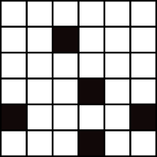

{{initexo(0)}}

# À la recherche du plus grand carré blanc
L'objectif est de trouver la taille du plus grand carré intégralement blanc que l'on peut dessiner dans l'image ci-dessous :
{: .center}

### 1. Prise en main 

!!! tip "Préambule"
    Télécharger l'image, puis creér une variable ```img``` grâce au package ```PIL```:

    ```python linenums='1'
    from PIL import Image
    img = Image.open('pgcb.bmp')
    ``` 

    On peut dès lors avoir accès à quelques informations :

    ```python
    >>> img.size
    (600, 600)
    ```
    L'image est donc de taille 600x600.

    ```python
    >>> img.getpixel((0, 0))
    (255, 255, 255)
    >>> img.getpixel((0, 358))
    (0, 0, 0)
    ```

    Le pixel de coordonnées (0, 0) est donc blanc, et le pixel (0, 358) est noir. 


!!! example "{{ exercice() }}"
    Écrire une fonction ```est_noir``` qui prend en paramètre les coordonnées d'un pixel ```x``` et ```y```   et qui renvoie ```True``` si ce pixel est noir, ```False``` sinon.

    *Exemple :*
    ```python
    >>> est_noir(0, 0)
    False
    >>> est_noir(0, 358)
    True
    ```

    {{
    correction(True,
    """
    ??? success \"Correction\" 
        ```python linenums='1'
        from PIL import Image
        img = Image.open('pgcb.bmp')

        def est_noir(x, y):
            return img.getpixel((x,y)) == (0, 0, 0)
        ```
    """
    )
    }}


### 1.2 Recherche manuelle

Considérons le damier ci-dessous :

{: .center}


Pour chaque case, on va inscrire à l'intérieur la taille du plus grand carré blanc possible **dont la case est le coin inférieur droit**.

Par exemple :

{: .center}

Sur une case noire, on écrira le nombre 0.

!!! example "{{ exercice() }}"
    Recopier le damier et compléter toutes les cases, **en commençant en haut à gauche**.

    {{
    correction(True,
    """
    ??? success \"Correction\" 
        {: .center}
        
    """
    )
    }}

Imaginons maintenant la situation suivante, sur un autre damier que vous ne pouvez pas voir en intégralité :

{: .center}

!!! example "{{ exercice() }}"
    Quelle est la valeur qu'il faut écrire à la place du point d'interrogation ?

    {{
    correction(True,
    """
    ??? success \"Correction\" 
        Il faut écrire la valeur 3, qui est égale à 1 + le minimum des trois cases situées au Nord, Ouest et Nord-Ouest.
    """
    )
    }}


## 2. La fonction ```pgcb```
*pgcb -> plus grand carré blanc*

### 2.1 Première écriture
On va écrire la fonction récursive ```pgcb```, qui prend en paramètre un tuple ```(x,y)``` et qui renvoie la taille du plus grand carré blanc dont le pixel de coordonnées ```(x,y)``` est le coin inférieur droit.

Les cas de base seront :

- le pixel est noir : on renvoie 0
- le pixel est sur la ligne du haut ou la colonne de gauche : on renvoie 1

Pour le cas général, on s'inspirera de la partie précédente...

!!! example "{{ exercice() }}"
    Écrire le code de la fonction ```pgcb```. 

    *Exemples d'utilisation :*
    ```python
    >>> pgcb(0,0)
    1
    >>> pgcb(3,2)
    3
    >>> pgcb(0,358)
    0
    ```

    {{
    correction(True,
    """
    ??? success \"Correction\" 
        ```python linenums='1'
        def pgcb(x, y):
            if est_noir(x, y):
                return 0
            
            if x == 0 or y == 0:
                return 1
            
            return 1 + min(pgcb(x-1, y), pgcb(x, y-1), pgcb(x-1, y-1))
        ```
    """
    )
    }}

### 2.2 Amélioration de la fonction ```pgcb``` 
Si on teste la fonction avec le pixel de coordonnées ```(300, 300)```, le code ne renvoie aucun résultat et semble parti dans des calculs interminables.

La structure récursive du code doit nous pousser à la méfiance : ne saurions-nous pas en train de lui demander de calculer plusieurs fois la même chose ?

La réponse est oui : si on ne regarde par exemple que les pixels diagonaux, l'appel  ```pgcb(1, 1)``` aura lieu pour  ```pgcb(2, 2)```, mais aussi pour ```pgcb(3, 3)```, pour ```pgcb(4, 4)```, pour ```pgcb(5, 5)```... entre autres !

Pour éviter de refaire ces calculs, on va donc faire appel à la technique de ```mémoïsation```.

!!! example "{{ exercice() }}"
    Écrire la fonction ```pgcb_memo```, identique à la fonction ```pgcb``` mais qui mémoïse ses résultats. On pourra se servir d'une [fonction englobante](https://glassus.github.io/terminale_nsi/T3_Algorithmique/3.2_Programmation_dynamique/cours/#132-suppression-de-la-variable-globale){. target="_blank"} comme dans le cours sur Fibonacci.

    *Exemple :*
    ```python
    >>> pgcb_memo(300,300)
    21
    ```

    {{
    correction(True,
    """
    ??? success \"Correction\" 
        ```python linenums='1'
        def pgcb_memo(x, y):
            dict_memo = {}
            def pgcb(x, y):
                if est_noir(x, y):
                    return 0
                if x == 0 or y == 0:
                    return 1
                if (x, y) not in dict_memo:
                    dict_memo[(x, y)] = 1 + min(pgcb(x-1, y), pgcb(x, y-1), pgcb(x-1, y-1))
                return dict_memo[(x, y)]
            return pgcb(x, y)
        ```
    """
    )
    }}


## 3. Recherche du plus grand carré

Maintenant que notre fonction est efficace, nous pouvons partir à la recherche du pixel de l'image d'où peut se construire le plus grand carré blanc.

!!! example "{{ exercice() }}"
    Écrire une fonction ```total_pgcb``` qui va parcourir tous les pixels de l'image et renvoyer la taille du plus grand carré blanc qu'on puisse y inscrire, ainsi que les coordonnées du pixel inférieur droit de ce carré.

    *Exemple :*
    ```python
    >>> total_pgcb()
    (51, (370, 461))
    ``` 

    :warning: dans la structure de votre code, penser à réutiliser le dictionnaire de mémoïsation...

    {{
    correction(True,
    """
    ??? success \"Correction\" 
        ```python linenums='1'
        def total_pgcb():
            dict_memo = {}
            def pgcb(x, y):
                if est_noir(x, y):
                    return 0
                
                if x == 0 or y == 0:
                    return 1
                
                if (x, y) not in dict_memo:
                    dict_memo[(x, y)] = 1 + min(pgcb(x-1, y), pgcb(x, y-1), pgcb(x-1, y-1))
                return dict_memo[(x, y)]
            
            maxi = 0
            for x in range(600):
                for y in range(600):
                    taille_pgcb = pgcb(x, y)
                    if taille_pgcb > maxi:
                        maxi = taille_pgcb
                        best_pixel = (x, y)
            return maxi, best_pixel
        ```
    """
    )
    }}