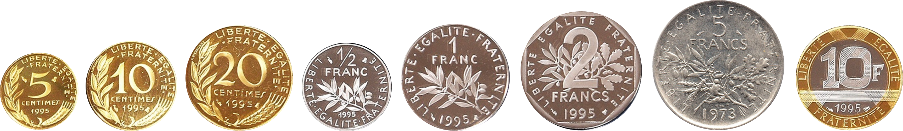

# Optimisation de rendu de monnaie

!!! question "Problème"
    {: .center}

    Nous allons nous intéresser au problème suivant :

    Étant donnés une liste de pièces ```pieces``` et une somme à rendre ```somme```, peut-on calculer le nombre minimal de pièces pour réaliser cette somme ?

**Remarque importante :**

Dans toute la suite, on considérera que la somme à rendre est un nombre entier positif, et que dans la liste de pièces se trouve la pièce de valeur 1. Ainsi, il est **toujours possible** de rendre la monnaie.

## 1. Retour sur l'algorithme glouton

Nous avons vu [en Première](https://glassus.github.io/premiere_nsi/T4_Algorithmique/4.6_Algorithmes_gloutons/cours/#2-le-probleme-du-rendu-de-monnaie){. target="_blank"} un algorithme capable de donner une combinaison de pièces pour rendre la somme ```somme```.

Cet algorithme fonctionnait de manière gloutonne : on cherche à rendre à chaque fois la plus grosse pièce possible.

{{initexo(0)}}

!!! example "{{ exercice() }}"
    Compléter la fonction ```rendu_glouton``` qui prend en paramètres une liste de pièces ```pieces``` (classées dans l'ordre croissant) et la somme à rendre ```somme``` et qui renvoie **le nombre minimal** de pièces qu'il faut rendre.


    ```python linenums='1'
    def rendu_glouton(pieces, somme):
        i =  ... # (1)
        nb_pieces = ...
        while ... > ...:
            if ... <= somme:
                nb_pieces += ... 
                somme -= ...
            else :
                i -= ...   
        return ...
    ```
    1. Attention, les pièces sont classées dans l'ordre **croissant**.

    *Exemple d'utilisation :*
    ```python
    >>> rendu_glouton([1, 2, 5], 12)
    3
    ``` 

    {{
    correction(True,
    """
    ??? success \"Correction\" 
        ```python linenums='1'
        def rendu_glouton(pieces, somme):
            i =  len(pieces) - 1
            nb_pieces = 0
            while somme > 0:
                if pieces[i] <= somme:
                    nb_pieces += 1 
                    somme -= pieces[i] 
                else :
                    i -= 1   
            return nb_pieces
        ```        
    """
    )
    }}

Nous savons que cet algorithme est optimal sous certaines conditions sur la composition des pièces. Par exemple le système des euros (1, 2, 5, 10, 20, 50, 100, 200) rend l'algorithme glouton optimal (on dit que le système est *canonique*).

Mais si le système n'est pas canonique, l'algorithme glouton peut ne pas donner la meilleure solution :

```python
>>> rendu_glouton([1, 6, 10], 12)
3
```

Notre algorithme va trouver que $12 = 10 + 1 + 1$ et donc rendre 3 pièces, alors qu'il est possible de faire $12 = 6+6$ et ne rendre que 2 pièces.


## 2. Algorithme récursif

Il est possible de construire un algorithme optimal de manière récursive.

Il faut pour cela faire les observations suivantes :

- pour rappel, le rendu est toujours possible : dans le pire des cas, le nombre de pièces à rendre est égal à la somme de départ (rendu effectué à coups de pièces de 1)
- :star: Si ```p``` est une pièce de ```pieces```, le nombre minimal de pièces nécessaires pour rendre la somme ```somme```   est égal à 1 + le nombre minimal de pièces nécessaires (contenant ```p```)    pour rendre la somme ```somme - p```. :star: 

Cette dernière observation est cruciale. Elle repose sur le fait qu'il suffit de ajouter 1 pièce (la pièce de valeur ```p```) à la meileure combinaison qui rend ```somme - p``` pour avoir la meilleure combinaison qui rend ```somme``` (meilleure combinaison parmi celles contenant ```p```). 

On va donc passer en revue toutes les pièces ```p``` et mettre à jour à chaque fois le nombre minimal de pièces.

!!! example "{{ exercice() }}"
    Compléter la fonction ```rendu_recursif``` qui prend en paramètres une liste de pièces ```pieces``` et la somme à rendre ```somme``` et qui renvoie **le nombre minimal** de pièces qu'il faut rendre.

    ```python linenums='1'
    def rendu_recursif(pieces, somme):
        nb_pieces = ... # (1)
        if somme == 0:
            return ... # (2)
        for p in pieces:
            if ... <= ...: # (3)
                nb_pieces = min(nb_pieces, ... + rendu_recursif(pieces, ...))
        return ...   
    ```        

    1. Nombre de pièces dans le pire des cas
    2. Cas de base
    3. Peut-on rendre la pièce ```p``` ? 


    {{
    correction(True,
    """
    ??? success \"Correction\" 
        ```python linenums='1'
        def rendu_recursif(pieces, somme):
            nb_pieces = somme
            if somme == 0:
                return 0
            for p in pieces:
                if p <= somme:
                    nb_pieces = min(nb_pieces, 1 + rendu_recursif(pieces, somme-p))
            return nb_pieces    
        ```

    """
    )
    }}

Testons notre algorithme :

```python
>>> rendu_recursif([1, 2, 5], 12)
3
>>> rendu_recursif([1, 6, 10], 12)
2
```

Il ne se laisse pas pièger comme l'algorithme glouton et rend bien en 2 pièces la somme 12.

Mais...

```python
>>> rendu_recursif([1, 6, 10], 107)
RecursionError: maximum recursion depth exceeded in comparison
```

:cry:

Le nombre d'appels récursifs de notre algorithme augmente exponentiellement avec la valeur de la somme à rendre : on se retrouve très rapidement avec des milliards d'appels récursifs, ce qui n'est pas gérable.

Ces appels récursifs ont lieu sur un nombre limité de valeurs : par construction de notre algorithme, si la somme à rendre est 100, il y aura (beaucoup) d'appels vers 99, vers 98, vers 97... jusqu'à 0. 

On peut donc légitimement penser à **mémoïser** notre algorithme, en stockant les valeurs pour éviter de les recalculer.


## 3. Algorithme récursif memoïsé

!!! example "{{ exercice() }}"
    Compléter la fonction ```rendu_recursif_memoise``` qui prend en paramètres une liste de pièces ```pieces``` et la somme à rendre ```somme``` et qui renvoie **le nombre minimal** de pièces qu'il faut rendre.

    On utilisera le dictionnaire ```memo_rendu``` dans lequel on associera à somme ```somme``` son nombre de pièces minimal. 
    
    ```python linenums='1'
    memo_rendu = {}
    def rendu_recursif_memoise(pieces, somme):
        nb_pieces = somme
        if somme == 0:
            return 0
        for p in pieces:
            if p <= somme:
                if ... not in memo_rendu:
                    memo_rendu[...] = ...
                nb_pieces = ...
        return nb_pieces        
    ```


    {{
    correction(True,
    """
    ??? success \"Correction\" 
        ```python linenums='1'
        memo_rendu = {}
        def rendu_recursif_memoise(pieces, somme):
            nb_pieces = somme
            if somme == 0:
                return 0
            for p in pieces:
                if p <= somme:
                    if somme-p not in memo_rendu:
                        memo_rendu[somme-p] = rendu_recursif_memoise(pieces, somme-p)
                    nb_pieces = min(nb_pieces, 1 + memo_rendu[somme-p])
            return nb_pieces        
        ```

    """
    )
    }}


Notre algorithme est maintenant beaucoup (beaucoup) plus efficace :

```python
>>> rendu_recursif_memoise([1, 6, 10], 107)
16
```


## 4. Algorithme *bottom-up*

Nous avions calculé le $F_n$, n-ième terme de la suite de Fibonacci en calculant d'abord $F_0$, $F_1$, $F_2$, ..., jusqu'à $F_{n-1}$ puis $F_n$.

En s'inspirant de cette méthode (*bottom-up*) nous allons ici calculer successivement tous les rendus minimaux jusqu'à ```somme``` avant de calculer le rendu minimal de ```somme```.


!!! example "{{ exercice() }}"
    Compléter la fonction ```rendu_bottom_up``` qui prend en paramètres une liste de pièces ```pieces``` et la somme à rendre ```somme``` et qui renvoie **le nombre minimal** de pièces qu'il faut rendre.    

    Nous stockerons chaque rendu dans un dictionnaire ```rendu```, initialisé à la valeur 0 pour la clé 0.

    ```python linenums='1'
    def rendu_bottom_up(pieces, somme):
        rendu = {...}
        for s in range(..., ...): # (1)
            rendu[s] = ... #(2)
            for p in pieces:
                if p <= s:
                    rendu[s] = min(..., ... + ...)
        return ...   
    ```
    1. Attention, il faut aller jusqu'à la valeur ```somme```. 
    2. Nombre de pièces dans le pire des cas.

    {{
    correction(True,
    """
    ??? success \"Correction\" 
        ```python linenums='1'
        def rendu_bottom_up(pieces, somme):
            rendu = {0:0}
            for s in range(1, somme+1):
                rendu[s] = s
                for p in pieces:
                    if p <= s:
                        rendu[s] = min(rendu[s], 1 + rendu[s-p])
            return rendu[somme]    
        ```        
    """
    )
    }}


```python
>>> rendu_bottom_up([1, 6, 10], 107)
12
```

Notre algorithme itératif est de complexité linéaire (par rapport à la variable ```somme```).


## 5. Bonus : construction d'une solution

Nos différents algorithmes avaient pour but de nous renvoyer le nombre minimal de pièces. Mais peut-on les modifier pour qu'ils renvoient la liste de pièces utilisées ?

Nous allons nous appuyer sur le dernier algorithme créé (par méthode *bottom-up*).

Il suffit de rajouter un dictionnaire *solutions* qui associera à chaque somme la liste des pièces nécessaires.

Lors du parcours de toutes les pièces, si un nouveau nombre minimal de pièces est trouvé pour la pièce ```p```, il faut rajouter la pièce ```p``` à la liste des solutions.

!!! example "{{ exercice() }}"
    Compléter la fonction ```rendu_solution``` qui prend en paramètres une liste de pièces ```pieces``` et la somme à rendre ```somme``` et qui renvoie **le nombre minimal** de pièces qu'il faut rendre.   

    ```python linenums='1'
    def rendu_solution(pieces, somme):
        rendu = {0:0}
        solution = {}
        solution[0] = []
        for s in range(1, somme+1):
            rendu[s] = s
            solution[s] = []
            for p in pieces:
                if p <= s:
                    if 1 + rendu[s-p] < rendu[s]:
                        rendu[s] = ...
                        solution[s] = ... .copy() # (1)
                        solution[s]. ...
        return ...
    ```

    1. On effectue une copie de liste avec la méthode ```copy```. 

    {{
    correction(True,
    """
    ??? success \"Correction\" 
        ```python linenums='1'
        def rendu_solution(pieces, somme):
            rendu = {0:0}
            solution = {}
            solution[0] = []
            for s in range(1, somme+1):
                rendu[s] = s
                solution[s] = []
                for p in pieces:
                    if p <= s:
                        if 1 + rendu[s-p] < rendu[s]:
                            rendu[s] = 1 + rendu[s-p]
                            solution[s] = solution[s-p].copy()
                            solution[s].append(p)
            return solution[somme]
        ```        
    """
    )
    }}

```python
>>> rendu_solution([1,6,10], 12)
[6, 6]
>>> rendu_solution([1,6,10], 107)
[10, 10, 10, 10, 10, 10, 10, 10, 10, 10, 6, 1]
```