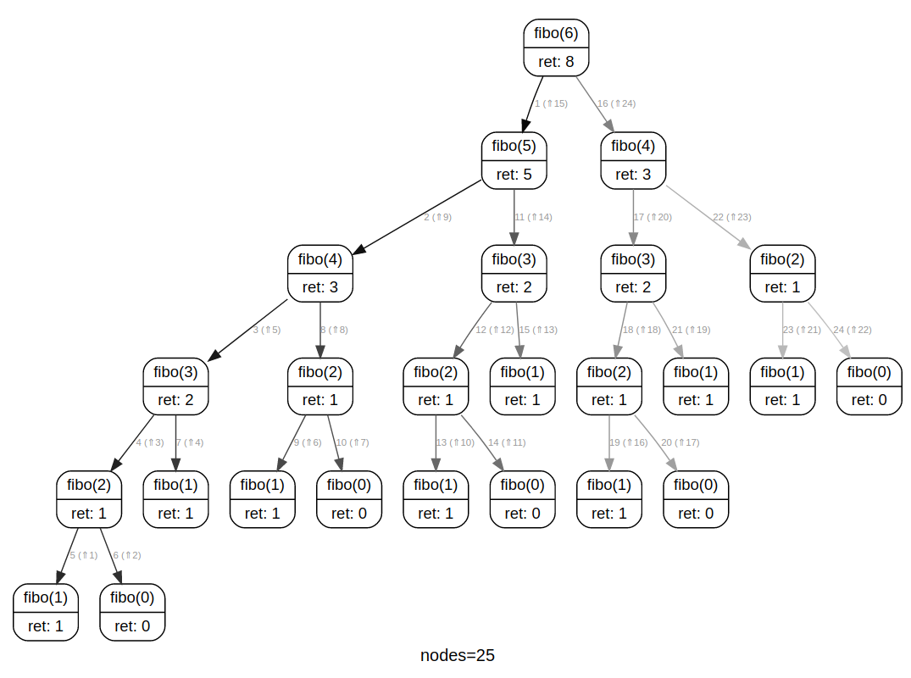
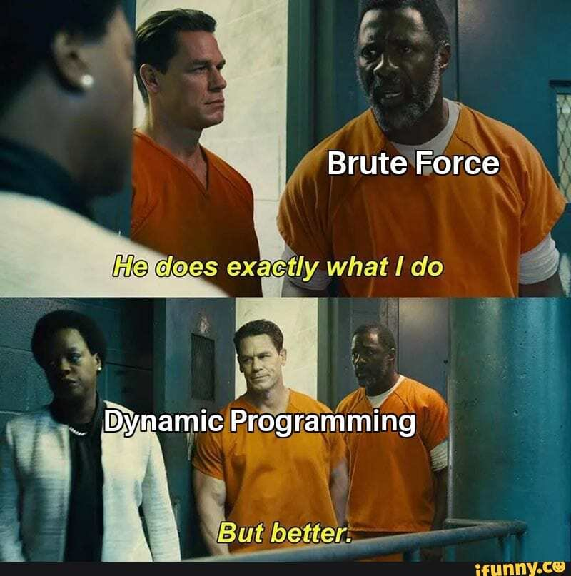

# Programmation dynamique
 
{: .center}

{: .center width=50%}

## 1. Retour sur la suite de Fibonacci

### 1.1 Simple et inefficace

Comme nous l'avons déjà vu [ici](https://glassus.github.io/terminale_nsi/T2_Programmation/2.2_Recursivite/cours/#4-exemples-de-recursivite-double){. target="_blank"},
la suite de Fibonacci définie par :

- $F_0 = 0$
- $F_1 = 1$
- $\forall n \in \mathbb{N}, F_{n+2} = F_{n+1}+F_n$

se programme récursivement par :

```python linenums='1'
def fibo(n):
    if n == 0 :
        return 0   
    elif n == 1 :
        return 1
    else :
        return fibo(n-1) + fibo(n-2)
```

Ce code, d'une grande simplicité, est malheureusement très inefficace.

{{initexo(0)}}
!!! example "{{ exercice() }}"
    Mesurer le temps de calcul de ```fibo(40)```.

    {{
    correction(False,
    """
    ??? success \"Correction\" 
        ```python linenums='1'
        import time

        def fibo(n):
            if n == 0 :
                return 0   
            elif n == 1 :
                return 1
            else :
                return fibo(n-1) + fibo(n-2)
            
        t0 = time.time()
        fibo(40)
        print(time.time() - t0)
        ```

        Le temps de calcul est de plusieurs dizaines de secondes, sur une machine récente. C'est très mauvais !
    """
    )
    }} 

En cause : la multitude des appels récursifs nous conduit à refaire des calculs déjà effectués.

Observons l'arbre d'appels de ```fibo(6)``` :

{: .center}

Le calcul de ```fibo(2)``` se retrouve ainsi 5 fois dans l'arbre.

Pour résoudre notre problème, nous l'avons divisé en problèmes plus petits, mais malheureusement pas indépendants. Une approche par [diviser pour régner](../3.1_Diviser_pour_regner/cours.md){. target="_blank"} est donc impossible.

On dit que les problèmes se **recouvrent**, ce qui nous amène à refaire des choses déjà faites. 

Dans l'algorithme de dichotomie, ou du tri-fusion, les problèmes étaient indépendants et ne se recouvraient pas : on ne refaisait jamais deux fois la même chose. Ce n'est pas le cas ici.

### 1.2 Se souvenir <strike>des belles choses</strike> des calculs : la mémoïsation

Comment éviter de recalculer (par exemple) 5 fois ```fibo(2)``` ? En se souvenant que nous l'avons déjà calculé !

L'idée générale est donc de stocker le résultat de chaque calcul, par exemple dans un dictionnaire. Ainsi, à chaque demande de calcul :

- Soit le calcul a déjà été effectué : on a donc juste à le lire dans le dictionnaire.
- Soit le calcul n'a jamais été effectué : on l'effectue, et **on stocke le résultat dans le dictionnaire**.

!!! example "{{ exercice() }}"
    Compléter le code suivant :

    ```python linenums='1'
    dict_fibo = {0:0, 1:1}
    def fibo(n):
        if n in dict_fibo:
            return ...
        dict_fibo[n] = ... + ...
        return ...
    ```

    {{
    correction(False,
    """
    ??? success \"Correction\" 
        ```python linenums='1'
        dict_fibo = {0:0, 1:1}
        def fibo(n):
            if n in dict_fibo:
                return dict_fibo[n]
            dict_fibo[n] = fibo(n-1) + fibo(n-2)
            return dict_fibo[n]
        ```        
    """
    )
    }}


!!! example "{{ exercice() }}"
    Mesurer le temps de calcul de ```fibo(40)``` et comparer avec la mesure de l'exercice 1.

    {{
    correction(False,
    """
    ??? success \"Correction\" 
        Le temps de calcul est maintenant de l'ordre de $10^{-5}$ secondes. C'est un million (!!!) de fois plus rapide qu'à l'exercice 1.
    """
    )
    }}

### 1.3 Quelques remarques

#### 1.3.1 :arrow_right: **Juste une brute-force plus efficace ?**

Notre technique de mémoïsation ne change pas vraiment la structure du programme : on continue de calculer toutes les valeurs intermédiaires, **mais on ne les calcule qu'une seule fois.**

{: .center width=40%}


#### 1.3.2 :arrow_right: **Suppression de la variable globale**

Dans le code précédent, le dictionnaire ```dict_fibo``` est à l'extérieur de la fonction. Un dictionnaire étant un type mutable, sa modification à l'intérieur de la fonction ne pose pas de problème. Toutefois, ce genre de pratique est déconseillé : si par exemple on appelle 2 fois la fonction ```fibo```, le dictionnaire n'est pas réinitialisé entre-temps (ce qui dans notre cas n'est pas problématique, mais cela pourrait l'être). Comment éviter cela ?

On peut utiliser une fonction *englobante* (appelée ici ```fibonacci``` ) :

```python linenums='1'
def fibonacci(n):
    dict_fibo = {0:0, 1:1}
    def fibo(n):
        if n in dict_fibo:
            return dict_fibo[n]
        dict_fibo[n] = fibo(n-1) + fibo(n-2)
        return dict_fibo[n]
    return fibo(n)
```

```python
>>> fibonacci(50)
12586269025
```

Remarquez la définition d'une fonction *à l'intérieur* d'une autre. Cela ne pose aucun problème, mais attention, cette fonction n'existe pas à l'extérieur de sa fonction englobante.


#### 1.3.3 :arrow_right: **Mémoïsation automatique en Python** :star: :star: :star:

La fonction ```lru_cache``` du module ```functools``` permet de mémoïser automatiquement une fonction récursive. Il suffit, juste avant d'écrire la fonction, de mettre la ligne ```@lru_cache``` (appelée *décorateur*). 

```python linenums='1'
import time
from functools import lru_cache

@lru_cache  #(1)
def fibo(n): #(2)
    if n == 0 :
        return 0   
    elif n == 1 :
        return 1
    else :
        return fibo(n-1) + fibo(n-2)
    
t0 = time.time()
fibo(35)
print(time.time() - t0)
```

1. «décorateur» de la fonction
2. Ceci est notre VIEILLE fonction ```fibo```, extrêmement lente...

Essayez en commentant / décommentant la ligne 4... c'est magique !


### 1.4 De bas en haut

La structure récursive naturelle de la suite de Fibonacci nous a conduit vers un programme qui calcule (ou plutôt *appelle*) les valeurs *de haut en bas*. (méthode *top-down*)

Et si on commençait par le bas ?

Si nous devions calculer mentalement le 6ème terme de la suite de Fibonacci, on commencerait par calculer le 3ème, puis le 4ème, puis le 5ème et enfin le 6ème.

!!! example "{{ exercice() }}"
    Compléter le code ci-dessous :

    ```python linenums='1'
    def fibo(n):
        dict_fibo = {}
        dict_fibo[0] = ...
        dict_fibo[1] = ...
        for k in range(..., ...):
            dict_fibo[k] = dict_fibo[...] + dict_fibo[...]
        return dict_fibo[...]
    ```

    {{
    correction(False,
    """
    ??? success \"Correction\" 
        ```python linenums='1'
        def fibo(n):
            dict_fibo = {}
            dict_fibo[0] = 0
            dict_fibo[1] = 1
            for k in range(2, n+1):
                dict_fibo[k] = dict_fibo[k-1] + dict_fibo[k-2]
            return dict_fibo[n]
        ```        
    """
    )
    }}

Cette méthode itérative part du bas pour aller vers le haut. On parle de méthode *bottom-up*. 
De manière plus générale, cette méthode est basée sur le fait de résoudre des problèmes de petite taille, puis de plus en plus gros, jusqu'au problème final.

### 1.5 Bilan des méthodes employées

!!! note "Principes de programmation dynamique :heart:"
    
    - Lors d'un calcul effectué de manière récursive, il peut arriver que de multiples appels récursifs soient identiques. Pour éviter de recalculer plusieurs fois la même chose, on peut stocker les résultats intermédiaires. On appelle cette technique la **mémoïsation**.  
    Cette technique minimise le nombre d'opérations et accélère grandement l'exécution du programme. Le prix à payer est l'utilisation d'une structure de stockage des valeurs intermédiaires, et donc une augmentation de la mémoire utilisée par le programme.

    - Lors d'un calcul effectué de manière itérative, il est parfois plus simple de commencer par une «petite» version du problème pour progressivement remonter vers la solution du problème global.


## 2. Programmation dynamique et optimisation

### 2.1 Optimisation d'une somme dans une pyramide

!!! question "Problème"
    Considérons la pyramide ci-dessous :

    {: .center width=20%}

    En partant du sommet et en descendant soit à gauche soit à droite, quel chemin donne la somme maximale en arrivant en bas ?

    {: .center width=75%}

La suite : [TP Pyramides](./TP_pyramides.md){.md-button }

### 2.2 Problème du plus grand carré blanc

!!! question "Problème"
    Considérons l'image ci-dessous :

    {: .center width=20%}

    Quel est la taille du plus grand carré entièrement blanc qu'on puisse dessiner à l'intérieur de cette image ?


La suite : [TP Plus Grand Carré Blanc](./TP_carre_blanc.md){.md-button }


### 2.3 Optimisation du rendu de monnaie

!!! question "Problème"

    {: .center width=75%}

    Étant donnés une liste de pièces ```pieces``` et une somme à rendre ```somme```, peut-on calculer le nombre minimal de pièces pour réaliser cette somme ?

La suite : [TP Rendu de monnaie](./TP_rendu_monnaie.md){.md-button }