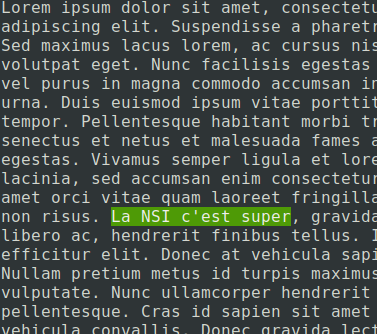

# Recherche textuelle
{: .center width=40%}

{: .center}

<!--
<gif-player src="https://glassus.github.io/terminale_nsi/T3_Algorithmique/3.3_Recherche_textuelle/data/gif_naive.gif" speed="1" play></gif-player>

-->

## 1. Recherche naïve

???+ tip "Illustration de l'algorithme"
    <gif-player src="https://glassus.github.io/terminale_nsi/T3_Algorithmique/3.3_Recherche_textuelle/data/gif_naive.gif" speed="1" play></gif-player>

    _Vous pouvez contrôler le déroulement de l'animation en la survolant avec la souris._
### 1.1 Premier algorithme

### 1.2 Exercice 1

### 1.3 Exercice 2

## 2. Algorithme de Boyer-Moore

???+ tip "Illustration de l'algorithme"
    <gif-player src="https://glassus.github.io/terminale_nsi/T3_Algorithmique/3.3_Recherche_textuelle/data/gif_BM.gif" speed="1" play></gif-player>

    _Vous pouvez contrôler le déroulement de l'animation en la survolant avec la souris._

### 2.1 Principe

### 2.2 Implémentation
