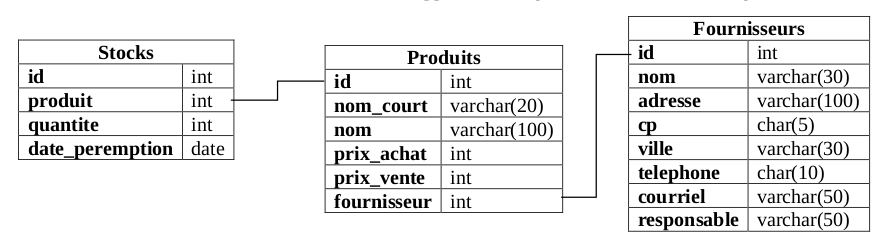

# Exercices SQL débranchés

{{initexo(0)}}


!!! example "{{ exercice() }}"

    *(d'après Prépabac NSI, Terminale, G.CONNAN, V.PETROV, G.ROZSAVOLGYI, L.SIGNAC, éditions HATIER.)*

    On veut créer une base de données ```baseHopital.db```  qui contiendra les trois tables suivantes :

    |  | Patients |
    |-----|----|
    | id | ```Int```  |
    | nom | ```Text```  |
    | prenom | ```Text```  |
    | genre | ```Text```  |
    | annee_naissance | ```Int```  |


    |  | Ordonnances |
    |-----|----|
    | code | ```Int```  |
    | id_patient | ```Int```  |
    | matricule_medecin  | ```Int```  |
    | date_ord | ```Text```  |
    | medicaments | ```Text```  |

    |  | Medecins |
    |-----|----|
    | matricule | ```Int```  |
    | nom_prenom | ```Text```  |
    | specialite | ```Text```  |
    | telephone | ```Text```  |


    On suppose que les dates sont données sous la forme ```jj-mm-aaaa```.

    On donne le diagramme relationnel de cette base :
    {: .center}
    
    **Q0.** Écrire le schéma relationnel de la table Ordonnances. On soulignera les clés primaires et marquera d'un # les clés étrangères.

    
    {{
    correction(True,
    """
    ??? success \"Correction \"
    
        Ordonnances ((<ins>code</ins>, Int), (id_patient#, Int), (matricule_medecin#, Int), (date_ord, Text), (medicaments, Text))
    
    """
    )
    }}    

    **Q1.** (HP) Donner les commandes SQL permettant de créer ces tables.

    
    {{
    correction(True,
    """
    ??? success \"Correction \"
        ```SQL
        CREATE TABLE Patients(
        id INTEGER PRIMARY KEY,
        nom TEXT,
        prenom TEXT,
        genre TEXT,
        annee_naissance INTEGER
        );

        CREATE TABLE Ordonnances(
        code INTEGER PRIMARY KEY,
        id_patient INTEGER,
        matricule_medecin INTEGER,
        date_ord TEXT,
        medicaments TEXT,
        FOREIGN KEY(id_patient) REFERENCES Patients(Id),
        FOREIGN KEY(matricule_medecin) REFERENCES Medecins(matricule)
        );

        CREATE TABLE Medecins(
        matricule INTEGER  PRIMARY KEY,
        nom_prenom TEXT,
        specialite TEXT,
        telephone TEXT
        );

        ```
    """
    )
    }}       


    **Q2.** Mme Anne Wizeunid, née en 2000 et demeurant 3 rue des Pignons Verts 12345 Avonelit doit être enregistrée comme patiente numéro 1. Donner la commande SQLite correspondante.

    
    {{
    correction(True,
    """
    ??? success \"Correction \"
        ```SQL
        INSERT INTO Patients
        VALUES (1, 'Wizeunit', 'Anne', 'F', 2000);
        ```
    """
    )
    }}       

    **Q3.** Le patient numéro 100 a changé de prénom et s'appelle maintenant "Alice". Donner la commande SQLite modifiant en conséquence ses données.


    
    {{
    correction(True,
    """
    ??? success \"Correction \"
        ```SQL
        UPDATE Patients
        SET prenom = 'Alice' 
        WHERE id = 100 ;
        ```
    """
    )
    }}       

    **Q4.** Par souci d'économie, la direction décide de se passer des médecins spécialisés en épidémiologie. Donner la commande permettant de supprimer leurs fiches.
    
    
    {{
    correction(True,
    """
    ??? success \"Correction \"
        ```SQL
        DELETE FROM Medecins 
        WHERE specialite = 'épidémiologie';
        ```
    """
    )
    }}       

    **Q5.**  Donner la liste des patient(e)s ayant été examiné(e)s par un(e) psychiatre en avril 2020.

     
    {{
    correction(True,
    """
    ??? success \"Correction \"
        ```SQL
        SELECT p.nom, p.prenom
        FROM Patients AS p
        JOIN Ordonnances AS o ON p.id = o.id_patient
        JOIN Medecins AS m ON o.matricule_medecin = m.matricule
        WHERE m.specialite = 'psychiatrie'
              AND o.date_ord LIKE '%-04-2020'

        ```
    """
    )
    }}       

!!! example "{{exercice()}}"
    _basé sur le travail de G.Viateau (Bayonne)_

    On considère ci-dessous le schéma de la base de données du stock d'un supermarché :

    

    **Q1**. Quelle requête SQL donne le prix d'achat du produit dont le ```nom_court``` est «Liq_Vaiss_1L» ?

    
    {{
    correction(True,
    """
    ??? success \"Correction \"
        ```SQL
        SELECT prix_achat
        FROM Produits 
        WHERE nom_court = 'Liq_Vaiss_1L' 
        ```
    """
    )
    }}        

    **Q2**. Quelle requête donne l'adresse, le code postal et la ville du fournisseur dont le nom est «Avenir_confiseur» ?

    
    {{
    correction(True,
    """
    ??? success \"Correction \"
        ```SQL
        SELECT adresse, cp, ville 
        FROM Fournisseurs 
        WHERE nom = 'Avenir_confiseur';
        ``` 
    """
    )
    }}    
    


    **Q3**. Quelle requête donne les produits étant en rupture de stock ?

    
    {{
    correction(True,
    """
    ??? success \"Correction \"
        ```SQL
        SELECT Produits.nom 
        FROM Produits
        JOIN Stocks ON Produits.id = Stocks.produit
        WHERE Stocks.quantite = 0;
        ```
    """
    )
    }}        

    **Q4**. Quelle requête donne la liste de toutes les ampoules vendues en magasin ? On pourra faire l'hypothèse que le nom du produit contient le mot «ampoule»

    
    {{
    correction(True,
    """
    ??? success \"Correction \"
        ```SQL
        SELECT nom 
        FROM Produits 
        WHERE nom LIKE '%ampoule%';
        ```
    """
    )
    }}        

    **Q5**. Quelle requête permet d'avoir le prix moyen de ces ampoules ?

    
    {{
    correction(True,
    """
    ??? success \"Correction \"
        ```SQL
        SELECT AVG(prix_vente) 
        FROM Produits 
        WHERE nom LIKE '%ampoule%';
        ```
    """
    )
    }}        

    **Q6**. Quelle requête permet d'identifier le produit le plus cher du magasin ?

    
    {{
    correction(True,
    """
    ??? success \"Correction \"
        ```SQL
        SELECT nom_court 
        FROM Produits 
        ORDER BY prix_vente DESC LIMIT 1;
        ```
        ou

        ```SQL
        SELECT nom 
        FROM Produits 
        WHERE prix_vente = (SELECT MAX(prix_vente) FROM Produits);
        ``` 
    """
    )
    }}        

    **Q7**. Quelle requête renvoie les noms des produits dont la date de péremption est dépassée ? _(on pourra utiliser la fonction SQL ```NOW()``` qui renvoie la date actuelle )_

    
    {{
    correction(True,
    """
    ??? success \"Correction \"
        ```SQL
        SELECT p.nom 
        FROM Produits AS p
        JOIN Stocks AS s ON s.produits = p.id
        WHERE s.date_peremption < NOW();
        ```
    """
    )
    }}        

!!! example "{{exercice()}}"
    Exercice 1 du sujet [Amérique du Nord J1 2022](https://glassus.github.io/terminale_nsi/T6_Annales/data/2022/2022_Amerique_Nord_J1.pdf){. target="_blank"}


        

        

    {{
    correction(True,
    """
    ??? success \"Correction Q1.a.\"
        La relation Sport a pour clé primaire le **couple** NomSport et nomStation, et pour clé étrangère l'attribut nomStation, clé primaire de la relation Station.
    """
    )
    }}
    
    {{
    correction(True,
    """
    ??? success \"Correction Q1.b.\"
        - Contrainte d'intégrité de domaine :  l'attribut Prix doit être un nombre entier.

        - Contrainte d'intégrité de relation :  le couple (nomSport, nomStation) ne peut pas se retrouver deux fois dans la table (car il forme une clé primaire)

        - Contrainte d'intégrité de référence :  l'attribut nomStation ne peut pas être un nom n'apparaissant pas dans la relation Station.
    """
    )
    }}
    
    {{
    correction(True,
    """
    ??? success \"Correction Q2.a.\"
        La commande INSERT ne sert que pour insérer de nouveaux enregistrements, or le couple ('planche à voile' , 'La tramontane catalane') existe déjà dans la relation (et c'est une clé primaire donc on ne peut pas la retrouver deux fois).
        Il faut donc utiliser :
        ```SQL
        UPDATE Sports 
        SET prix = 1350 
        WHERE nomSport = 'planche à voile' AND nomStation = 'La tramontane catalane'        
        ```
    """
    )
    }}
    
    {{
    correction(True,
    """
    ??? success \"Correction Q2.b.\"
        ```SQL
        INSERT INTO Station 
        VALUES ('Soleil Rouge', 'Bastia', 'Corse')  
        INSERT INTO Sport 
        VALUES ('plongée', 'Soleil Rouge', 900)        
        ```
    """
    )
    }}
    
    {{
    correction(True,
    """
    ??? success \"Correction Q3.a.\"
        ```SQL
        SELECT mail 
        FROM Client        
        ```
    """
    )
    }}
    
    {{
    correction(True,
    """
    ??? success \"Correction Q3.b.\"
        ```SQL
        SELECT nomStation 
        FROM Sport
        WHERE nomSport = 'plongee'      
        ```
    """
    )
    }}
    
    {{
    correction(True,
    """
    ??? success \"Correction Q4.a.\"
        ```SQL
        SELECT Station.ville, Station.nomStation 
        FROM Station
        JOIN Sport ON Sport.nomStation = Station.nomStation
        WHERE Sport.nomSport = 'plongée'        
        ```
    """
    )
    }}
    
    {{
    correction(True,
    """
    ??? success \"Correction Q4.b.\"
        ```SQL
        SELECT COUNT(*) 
        FROM Sejour
        JOIN Station ON Station.nomStation = Sejour.nomStation
        WHERE Sejour.annee = 2020 AND Station.region = 'Corse'
        ```
    """
    )
    }}


!!! example "{{exercice()}}"
    Exercice 4 du sujet [Centres Étrangers J1 2022](https://glassus.github.io/terminale_nsi/T6_Annales/data/2022/2022_Centres_Etrangers_J1.pdf){. target="_blank"}
    


        


    {{
    correction(True,
    """
    ??? success \"Correction Q1.a.\"
        L'attribut ```id_mesure``` semble être une clé primaire acceptable car elle semble spécifique à chaque enregistrement.
    """
    )
    }}
    
    {{
    correction(True,
    """
    ??? success \"Correction Q1.b.\"
        L'attribut ```id_centres``` semble être une clé primaire de la relation ```Centres```. On le retrouve aussi (sous le même nom) dans la relation ```Mesures```. C'est donc un attribut qui permettra de faire une jointure entre les deux relations.
    """
    )
    }}
    
    {{
    correction(True,
    """
    ??? success \"Correction Q2.a.\"
        Cette requête va afficher tous les renseignements disponibles sur les centres dont l'altitude est strictement supérieure à 500m.        
    """
    )
    }}
    
    {{
    correction(True,
    """
    ??? success \"Correction Q2.b.\"
        ```SQL
        SELECT nom_ville 
        FROM Centres 
        WHERE altitude >= 700 AND altitude <= 1200;
        ```
    """
    )
    }}
    
    {{
    correction(True,
    """
    ??? success \"Correction Q2.c.\"
        ```SQL
        SELECT longitude, nom_ville 
        FROM Centres
        WHERE longitude > 5
        ORDER BY nom_ville;
        ```
    """
    )
    }}
    
    {{
    correction(True,
    """
    ??? success \"Correction Q3.a.\"
        Cette requête va afficher tous les renseignements sur les mesures datées du 30 octobre 2021.
    """
    )
    }}
    
    {{
    correction(True,
    """
    ??? success \"Correction Q3.b.\"
        ```SQL
        INSERT INTO Mesures 
        VALUES (3650, 138, '2021-11-08', 11, 1013, 0);
        ```
    """
    )
    }}
    
    {{
    correction(True,
    """
    ??? success \"Correction Q4.a.\"
        Cette requête va renvoyer tous les renseignements sur les centres dont la latitude est la latitude minimale de tous les centres.
    """
    )
    }}
    
    {{
    correction(True,
    """
    ??? success \"Correction Q4.b.\"
        ```SQL
        SELECT DISTINCT Centres.nom_ville 
        FROM Centres
        JOIN Mesures ON Mesures.id_centre = Centres.id_centre
        WHERE Mesures.temperature < 10
        AND Mesures.date <= '2021-10-31'
        AND Mesures.date >= '2021-10-01';
        ```
    """
    )
    }}
    


!!! example "{{exercice()}}"
    Exercice 4 du sujet [Métropole J2 2022](https://glassus.github.io/terminale_nsi/T6_Annales/data/2022/2022_Metropole_J2.pdf){. target="_blank"}
 

    {{
    correction(True,
    """
    ??? success \"Correction Q1.a.\"
        ```
        Hey Jude
        I Want To Hold Your Hand
        ``` 
    """
    )
    }}

    {{
    correction(True,
    """
    ??? success \"Correction Q1.b.\"
        ```SQL
        SELECT nom 
        FROM interpretes
        WHERE pays = 'Angleterre';
        ```
    """
    )
    }}

    {{
    correction(True,
    """
    ??? success \"Correction Q1.c.\"
        ```
        I Want To Hold Your Hand, 1963
        Like a Rolling Stone, 1965
        Respect, 1967
        Hey Jude, 1968
        Imagine, 1970
        Smells Like Teen Spirit, 1991
        ``` 
    """
    )
    }}

    {{
    correction(True,
    """
    ??? success \"Correction Q1.d.\"
        ```SQL
        SELECT COUNT(*) 
        FROM morceaux;
        ```
    """
    )
    }}

    {{
    correction(True,
    """
    ??? success \"Correction Q1.e.\"
        ```SQL
        SELECT titre 
        FROM morceaux
        ORDER BY titre;
        ```
    """
    )
    }}

    {{
    correction(True,
    """
    ??? success \"Correction Q2.a.\"
        La clé étrangère de la table ```morceaux``` est l'attribut ```id_interprete``` qui fait référence à la clé primaire ```id_interprete``` de la table ```interpretes```.   
    """
    )
    }}

    {{
    correction(True,
    """
    ??? success \"Correction Q2.b.\"
        ```morceaux``` : ((<ins>id_morceau</ins>, Int), (titre, Text), (annee, Int), (id_interprete#, Int))  
        ```interpretes``` : ((<ins>id_interprete</ins>, Int), (nom, Text), (pays, Text))   
    """
    )
    }}

    {{
    correction(True,
    """
    ??? success \"Correction Q2.c.\"    
        La requête va renvoyer une erreur car la clé primaire 1 est déjà présente dans la table : il s'agit d'une violation de la contrainte de relation.
    """
    )
    }}

    {{
    correction(True,
    """
    ??? success \"Correction Q3.a.\"
        ```SQL
        UPDATE morceaux
        SET annee = 1971
        WHERE titre = 'Imagine'
        ```
    """
    )
    }}

    {{
    correction(True,
    """
    ??? success \"Correction Q3.b.\"
        ```SQL
        INSERT INTO interpretes
        VALUES (6, \"The Who\", \"Angleterre\")
        ```      
    """
    )
    }}

    {{
    correction(True,
    """
    ??? success \"Correction Q3.c.\"
        ```SQL
        INSERT INTO morceaux
        VALUES (7, \"My Generation\", 1965, 6)
        ```     
    """
    )
    }}

    {{
    correction(True,
    """
    ??? success \"Correction Q4.\"
        ```SQL
        SELECT morceaux.titre
        FROM morceaux
        JOIN interpretes ON interpretes.id_interprete = morceaux.id_interprete
        WHERE interpretes.pays = \"États-Unis\"
        ```
    """
    )
    }}

 
        


!!! example "{{exercice()}}"
    Exercice 2 du sujet [La Réunion J2 2022](https://glassus.github.io/terminale_nsi/T6_Annales/data/2022/2022_LaReunion_J2.pdf){. target="_blank"}

    {{
    correction(True,
    """
    ??? success \"Correction Q1.\"
        Le couple ```(NumClient, NumChambre)``` ne pouvait pas être une clé primaire car un même client peut revenir dans l'hôtel et avoir la même chambre qu'à un précédent séjour. Le couple ```(NumClient, NumChambre)``` ne serait donc pas unique et ne peut donc pas servir de clé primaire pour la relation ```Reservations```.
    """
    )
    }}

    {{
    correction(True,
    """

    ??? success \"Correction Q2.a.\"
        ```SQL
        SELECT Nom, Prenom 
        FROM Clients            
        ```
    """
    )
    }}

    {{
    correction(True,
    """

    ??? success \"Correction Q2.b.\"
        ```SQL
        SELECT Telephone 
        FROM Clients
        WHERE Prenom = \"Grace\" AND Nom = \"Hopper\"
        ```
    """
    )
    }}

    {{
    correction(True,
    """

    ??? success \"Correction Q3.\"
        ```SQL
        SELECT NumChambre 
        FROM Reservations
        WHERE date(DateArr) <= date('2024-12-28')
        AND date(DateDep) > date('2024-12-28')
        ```
    """
    )
    }}

    {{
    correction(True,
    """

    ??? success \"Correction Q4.a.\"
        ```SQL
        UPDATE Chambres
        SET prix = 75
        WHERE NumChambre = 404
        ```
    """
    )
    }}

    {{
    correction(True,
    """

    ??? success \"Correction Q4.b\"
        ```SQL
        SELECT Reservations.NumChambre 
        FROM Reservations
        JOIN Clients ON Clients.NumClient = Reservations.NumClient
        WHERE Clients.Nom = 'Codd' AND Clients.Prenom = 'Edgar'
        ```
    """
    )
    }}

!!! example "{{ exercice() }} <i id="ex3J1AN2024"></i>"

    Exercice 3 du [sujet Amérique du Nord J1 2024](https://glassus.github.io/terminale_nsi/T6_Annales/data/2024/24-NSIJ1AN1.pdf){. target="_blank"}    

    **Partie A**

    {{
    correction(True,
    """
    ??? success \"Correction Q1\" 
        Le séparateur utilisé est le point-virgule ```;```.
    """
    )
    }}

    {{
    correction(True,
    """
    ??? success \"Correction Q2\" 
        Ce choix a été fait pour avoir la possibilité d'utiliser la virgule à l'intérieur des champs, comme dans ```Allemagne, Italie, Japon```.
    """
    )
    }}

    {{
    correction(True,
    """
    ??? success \"Correction Q3\" 
        ```python linenums='1' hl_lines='2-4'
        def charger(nom_fichier):
            with open(nom_fichier,'r') as fichier:
                donnees = list(csv.DictReader(fichier,delimiter=';'))
            return donnees
        ```
        (la fonction renvoie une liste de dictionnaires et non un dictionnaire comme dit dans l'énoncé)
    """
    )
    }}

    {{
    correction(True,
    """
    ??? success \"Correction Q4\" 
        La méthode utilisée est la méthode ```sleep```, à la ligne 37. 
    """
    )
    }}

    {{
    correction(True,
    """
    ??? success \"Correction Q5\" 
        ```donnees[i]``` est un dictionnaire.
    """
    )
    }}

      
    Si vous souhaitez jouer avec ces flashcards, téléchargez le fichier [flashcards.csv](data/flashcards.csv){. target='_blank'} et utilisez le code ci-dessous :

    ```python linenums='1'
    import csv
    import time

    def charger(nom_fichier):
        with open(nom_fichier, 'r') as fichier:
            donnees = list(csv.DictReader(fichier, delimiter=';'))
        return donnees

    def choix_discipline(donnees):
        disciplines = []
        for i in range(len(donnees)):
            disc = donnees[i]['discipline']
            if not disc in disciplines:
                disciplines.append(disc)
        for i in range(len(disciplines)):
            print(i + 1, disciplines[i])
        num_disc = int(input('numéro de la discipline ? '))
        return disciplines[num_disc - 1]


    def choix_chapitre(donnees, disc):
        chapitres = []
        for i in range(len(donnees)):
            if donnees[i]['discipline'] == disc:
                ch = donnees[i]['chapitre']
                if not ch in chapitres:
                    chapitres.append(ch)
        for i in range(len(chapitres)):
            print(i + 1, chapitres[i])
        num_ch = int(input('numéro du chapitre ? '))
        return chapitres[num_ch - 1]


    def entrainement(donnees, disc, ch):
        for i in range(len(donnees)):
            if donnees[i]['discipline'] == disc and donnees[i]['chapitre'] == ch:
                print('QUESTION : ', donnees[i]['question'])
                time.sleep(5)
                print(donnees[i]['réponse'])
                time.sleep(1)


    flashcard = ...
    d = ...
    c = ...
    entrainement(...)


    ```

    {{
    correction(True,
    """
    ??? success \"Correction Q6\" 
        ```python linenums='1'
        flashcard = charger('flashcards.csv')
        d = choix_discipline(flashcard)
        c = choix_chapitre(flashcard, d)
        entrainement(flashcard, d, c)
        ```

        Si vous souhaitez jouer avec ces flashcards, téléchargez le fichier [flashcards.csv](data/flashcards.csv){. target='_blank'} et utilisez le code ci-dessous :

        ```python linenums='1'
        import csv
        import time

        def charger(nom_fichier):
            with open(nom_fichier, 'r') as fichier:
                donnees = list(csv.DictReader(fichier, delimiter=';'))
            return donnees

        def choix_discipline(donnees):
            disciplines = []
            for i in range(len(donnees)):
                disc = donnees[i]['discipline']
                if not disc in disciplines:
                    disciplines.append(disc)
            for i in range(len(disciplines)):
                print(i + 1, disciplines[i])
            num_disc = int(input('numéro de la discipline ? '))
            return disciplines[num_disc - 1]


        def choix_chapitre(donnees, disc):
            chapitres = []
            for i in range(len(donnees)):
                if donnees[i]['discipline'] == disc:
                    ch = donnees[i]['chapitre']
                    if not ch in chapitres:
                        chapitres.append(ch)
            for i in range(len(chapitres)):
                print(i + 1, chapitres[i])
            num_ch = int(input('numéro du chapitre ? '))
            return chapitres[num_ch - 1]


        def entrainement(donnees, disc, ch):
            for i in range(len(donnees)):
                if donnees[i]['discipline'] == disc and donnees[i]['chapitre'] == ch:
                    print('QUESTION : ', donnees[i]['question'])
                    time.sleep(5)
                    print(donnees[i]['réponse'])
                    time.sleep(1)


        flashcard = charger('flashcards.csv')
        d = choix_discipline(flashcard)
        c = choix_chapitre(flashcard, d)
        entrainement(flashcard, d, c)


        ```
    """
    )
    }}

    **Partie B**

    {{
    correction(True,
    """
    ??? success \"Correction Q7\" 
        ```sql
        INSERT INTO boite
        VALUES (5, 'tous les quinze jours', 15)
        ```
    """
    )
    }}

    {{
    correction(True,
    """
    ??? success \"Correction Q8\" 
        ```sql
        UPDATE flashcard
        SET reponse = '7 décembre 1941'
        WHERE id = 5
        ```
    """
    )
    }}

    {{
    correction(True,
    """
    ??? success \"Correction Q9\" 
        ```sql
        SELECT lib
        FROM discipline
        ```
    """
    )
    }}

    {{
    correction(True,
    """
    ??? success \"Correction Q10\" 
        ```sql
        SELECT chapitre.lib
        FROM chapitre
        JOIN discipline ON discipline.id = chapitre.id_disc
        WHERE discipline.lib = 'histoire'
        ```
    """
    )
    }}

    {{
    correction(True,
    """
    ??? success \"Correction Q11\" 
        ```sql
        SELECT flashcard.id
        FROM flashcard
        JOIN chapitre ON chapitre.id = flashcard.id_ch
        JOIN discipline ON discipline.id = chapitre.id_disc
        WHERE discipline.lib = 'histoire'
        ```
    """
    )
    }}

    {{
    correction(True,
    """
    ??? success \"Correction Q12\" 
        ```sql
        DELETE FROM flashcard
        WHERE id_boite = 3
        ```
    """
    )
    }}


!!! example "{{ exercice() }} <i id="ex2J2AN2024"></i>"

    Exercice 2 du [sujet Amérique du Nord J2 2024](https://glassus.github.io/terminale_nsi/T6_Annales/data/2024/24-NSIJ2AN1.pdf){. target="_blank"}    

    
    {{
    correction(True,
    """
    ??? success \"Correction Q1\" 
        Le résultat de la requête est :
        ```
        Dufour, Marc
        Martin, Sophie
        ```    
    """
    )
    }}

    {{
    correction(True,
    """
    ??? success \"Correction Q2\" 
        ```sql
        SELECT nom_medic
        FROM medicament
        WHERE prix < 3
        ```
    """
    )
    }}

    {{
    correction(True,
    """
    ??? success \"Correction Q3\" 
        ```sql
        INSERT INTO Clients
        VALUES (3, 'DURAND', 'Nathalie', '269054958815780')
        ```
    """
    )
    }}

    {{
    correction(True,
    """
    ??? success \"Correction Q4\" 
        Les attributs de la table ```ordonnance``` devant être déclarés clés étrangères sont :

        - ```id_client``` : qui fait référence à l'attribut ```id_client``` de la table ```client``` 
        - ```id_medic``` : qui fait référence à l'attribut ```id_medic``` de la table ```medic``` 
    """
    )
    }}

    {{
    correction(True,
    """
    ??? success \"Correction Q5\" 
        Le médicament d'```id_medic``` égale à 1 est le paracétamol. D'après l'ordonnance, il faut 6 comprimés donc 1 boite suffit.

        Le médicament d'```id_medic``` égale à 4 est l'acide ascorbique. D'après l'ordonnance, il faut 28 comprimés donc 3 boites sont nécessaires.       
    """
    )
    }}
    
    {{
    correction(True,
    """
    ??? success \"Correction Q6\" 
        ```sql
        UPDATE medicament
        SET quantite = 447
        WHERE id_medic = 4
        ``` 
    """
    )
    }}

    {{
    correction(True,
    """
    ??? success \"Correction Q7\" 
        $1 \\times 3,50 + 3 \\times 5,50 = 20$ 

        Le prix des médicaments est donc de 20 €.
    """
    )
    }}


    {{
    correction(True,
    """
    ??? success \"Correction Q8\" 
        ```sql
        SELECT nom_medic
        FROM medicament
        JOIN ordonnance ON ordonnance.id_medic = medicament.id_medic
        WHERE id_ordo = 6
        ```
    """
    )
    }}


!!! example "{{ exercice() }} <i id="ex3J2G12024"></i>"

    Exercice 3 Partie B du [sujet Centres Étrangers J2 2024](https://glassus.github.io/terminale_nsi/T6_Annales/data/2024/24-NSIJ2G1.pdf){. target="_blank"}    

    
    {{
    correction(True,
    """
    ??? success \"Correction Q6\" 
        Un clé primaire identifie de manière uniquement un enregistrement dans une table. Une clé étrangère d'une table est une clé primaire d'une autre table. Elle permet de relier ces deux tables.    
    """
    )
    }}

    {{
    correction(True,
    """
    ??? success \"Correction Q7\" 
        Cette requête pose problème car la valeur 1 de l'attribut ```idagres``` n'existe pas dans la table ```agres```.
    """
    )
    }}

    {{
    correction(True,
    """
    ??? success \"Correction Q8\" 
        ```sql
        UPDATE intervention
        SET heure = '10:44:06'
        WHERE jour = '2024-02-15' AND heure = '01:44:06'
        ```
        ou
        ```sql
        UPDATE intervention
        SET heure = '10:44:06'
        WHERE id = 3
        ```   
    """
    )
    }}

    {{
    correction(True,
    """
    ??? success \"Correction Q9\" 
        Le résultat de cette requête est 
        ```
        Charlot
        Red
        Kevin    
        ```  
    """
    )
    }}

    {{
    correction(True,
    """
    ??? success \"Correction Q10\" 
        ```sql
        SELECT nom
        FROM personnel
        WHERE qualif >= 16 AND actif = 1
        ```
    """
    )
    }}

    {{
    correction(True,
    """
    ??? success \"Correction Q11\" 
        - Requête A : compte le nombre d'agrès mobilisés le 27 mars. La réponse est 2.
        - Requête B : compte le nombre d'agrès mobilisés le 27 mars mais dont l'id est dans la table ```moyen```. La réponse est 1.

        Pour info, ```INNER JOIN``` signifie la même chose que ```JOIN``` (mais le programme officiel de NSI ne parle que de ```JOIN```...)
    """
    )
    }}


    {{
    correction(True,
    """
    ??? success \"Correction Q12\" 
        ```sql
        SELECT DISTINCT personnel.nom
        FROM personnel
        JOIN agres ON agres.idchefagres = personnel.matricule
        WHERE agres.jour = '2024-02-15'
        ```

        Pour info, ```DISTINCT``` n'a pas besoin de parenthèses (comme ```COUNT```), ce n'est pas une fonction.
    """
    )
    }}

    {{
    correction(True,
    """
    ??? success \"Correction Q13\"
        ```sql
        SELECT DISTINCT personnel.nom
        FROM personnel
        JOIN agres ON agres.idchefagres = personnel.matricule
        JOIN moyen ON moyen.idagres = agres.id
        JOIN intervention ON intervention.id = moyen.idinter        
        WHERE intervention.jour = '2024-06-11'
        ``` 

    """
    )
    }}


!!! example "{{ exercice() }} <i id="ex2J2PO2025"></i>"

    Exercice 2 du [sujet Polynésie J2 2025](https://glassus.github.io/terminale_nsi/T6_Annales/data/2025/25-NSIJ2PO1.pdf){. target="_blank"}    

    
    {{
    correction(True,
    """
    ??? success \"Correction Q1\" 
        ```sql
        SELECT nom 
        FROM champignon 
        WHERE lamelle = 'oui' and couleur = 'orange'
        ```    
    """
    )
    }}

    {{
    correction(True,
    """
    ??? success \"Correction Q2\" 
        ```sql
        SELECT nom
        FROM champignon
        WHERE pied_max = 0 AND chapeau_max = 15 AND chapeau_min = 15
        ```
    """
    )
    }}

    {{
    correction(True,
    """
    ??? success \"Correction Q3\" 
        La clé étrangère de la table ```champignon``` est ```id_ordre```. 
    """
    )
    }}

    {{
    correction(True,
    """
    ??? success \"Correction Q4\" 
        ```sql
        SELECT champignon.nom
        FROM champignon
        JOIN ordre ON champignon.id_ordre = ordre.id
        WHERE ordre.classe = 'agaricomycètes'
        ``` 
    """
    )
    }}

    {{
    correction(True,
    """
    ??? success \"Correction Q5\" 
        ```sql
        INSERT INTO champignon ​
        VALUES​ (56, 'amanite solitaire', 4,'oui','blanc', 6, 20, 4, 10)
        ```      
    """
    )
    }}
    
    {{
    correction(True,
    """
    ??? success \"Correction Q6\" 
        $\\texttt{\\underline{sdf}}$

        
        ```champignon(```$\\underline{\\texttt{id}}$```, nom, #id_ordre, lamelle, couleur, chapeau_min, chapeau_max, pied_min, pied_max, #id_toxicite)``` 

        ```ordre(```$\\underline{\\texttt{id}}$```, nom, classe)```

        ```toxicite(```$\\underline{\\texttt{id_tox}}$```, type, effet)```  
    """
    )
    }}

    {{
    correction(True,
    """
    ??? success \"Correction Q7\" 
        ```sql
        UPDATE champignon
        SET id_toxicite = 1
        WHERE nom = 'amanite citrine'
        ```
    """
    )
    }}


    {{
    correction(True,
    """
    ??? success \"Correction Q8\" 
        ```sql
        SELECT champignon.nom
        FROM champignon
        JOIN ordre ON champignon.id_ordre = ordre.id
        WHERE ordre.nom = 'amanitales' AND champignon.id_toxicite = 1
        ```
    """
    )
    }}

    {{
    correction(True,
    """
    ??? success \"Correction Q9\" 
        ```python
        for e in liste_champi:
            if e.saison == 'été':
                print(e.nom)
        ```
    """
    )
    }}

    {{
    correction(True,
    """
    ??? success \"Correction Q10\" 
        L'attribut ```cuisson``` du champignon ayant pour attribut ```nom``` ```'Lactaire délicieux'``` est ```'12 minutes à feu moyen'```.

        Il est donc normal que la ligne ```return c.cuisson == 'feu moyen'``` renvoie ```False```.
    """
    )
    }}

    {{
    correction(True,
    """
    ??? success \"Correction Q11\" 
        ```python
        for c in liste_champi:
            if c.nom == 'Lactaire délicieux':
                return recherche_textuelle(c.cuisson, 'feu moyen')
        ```     
    """
    )
    }}


!!! example "{{ exercice() }} <i id="ex3J1AN2026"></i>"

    Exercice 3 du [sujet Amérique du Nord J1 2026](https://glassus.github.io/terminale_nsi/T6_Annales/data/2026/26_NSIJ1AN1.pdf){. target="_blank"}

    {{
    correction(False,
    """
    ??? success \"Correction Q1\"
         Il peut y avoir plusieurs immeubles ayant le même numéro dans des rues différentes, donc le numéro dans la rue ne peut pas être clé primaire.
        
    """
    )
    }}  

    {{
    correction(False,
    """
    ??? success \"Correction Q2\" 
        ```sql
        SELECT id_immeuble
        FROM immeuble
        WHERE rue_immeuble = 'la mer'
        ORDER BY id_immeuble
        ```
    """
    )
    }}

    {{
    correction(False,
    """
    ??? success \"Correction Q3\" 
        ```sql
        SELECT id_appart
        FROM appartement
        WHERE id_immeuble = 16 AND etage_appart >= 5
        ```
    """
    )
    }}

    {{
    correction(False,
    """
    ??? success \"Correction Q4\"
        La table ```appartement``` est reliée à la table ```immeuble``` par la clé étrangère ```id_immeuble```. Si on supprime un immeuble dans la table ```immeuble```, cela va poser un problème pour tous les appartements qui y font référence. 
        
    """
    )
    }}  

    {{
    correction(False,
    """
    ??? success \"Correction Q5\" 
        ```sql
        INSERT INTO immeuble
        VALUES (140, 6, 13, 'Turing')
        ```
    """
    )
    }}

    {{
    correction(False,
    """
    ??? success \"Correction Q6\" 
        ```sql
        UPDATE appartement
        SET prix_appart = prix_appart * 2
        WHERE id_appart = 603
        ```
    """
    )
    }}

    {{
    correction(False,
    """
    ??? success \"Correction Q7\" 
        ```sql
        SELECT MAX(appartement.prix_appart)
        FROM appartement
        JOIN immeuble ON appartement.id_immeuble = immeuble.id_immeuble
        WHERE immeuble.rue_immeuble = 'la mer'
        ```
    """
    )
    }}

    {{
    correction(False,
    """
    ??? success \"Correction Q8\" 
        Les sous-séquences strictement croissantes de longueur 2 de la liste ```L2``` sont :

        - ```[3, 8]``` 
        - ```[3, 5]``` 
        - ```[1, 8] ```
        - ```[1, 2]``` 
        - ```[1, 5]``` 
        - ```[2, 5] ```
    """
    )
    }}

    {{
    correction(False,
    """
    ??? success \"Correction Q9\" 
        La plus longue sous-séquences strictement croissantes de longueur 2 de la liste ```L2``` est ```[1, 2, 5] ```.
    """
    )
    }}

    {{
    correction(False,
    """
    ??? success \"Correction Q10\" 
        ```python
        def est_strict_croissante(seq):
            for i in range(len(seq)-1):
                if seq[i] >= seq[i+1]:
                    return False
            return True
        ```
    """
    )
    }}

    ```python
    def llsc_fin(tab, i):
        if ...:
            return ...
        max_len = 1
        for j in range(i):
            if tab[j] < ...:
                max_len = max(max_len, llsc_fin(tab, j)+1)
        return max_len

    def llsc_rec(tab):
        n = len(tab)
        return max([llsc_fin(tab, i) for i in range(n)]) 
    ```

    {{
    correction(False,
    """
    ??? success \"Correction Q11\" 
        ```python
        def llsc_fin(tab, i):
            if i == 0:
                return 1
            max_len = 1
            for j in range(i):
                if tab[j] < tab[i]:
                    max_len = max(max_len, llsc_fin(tab, j)+1)
            return max_len

        def llsc_rec(tab):
            n = len(tab)
            return max([llsc_fin(tab, i) for i in range(n)]) 
        ```
    """
    )
    }}
    
    ```python
    def llsc_dyn(tab):
        n = len(tab)
        dyn = [1] * n
        for i in range(1, n):
            for j in range(i):
                if tab[j] < tab[i]:
                    dyn[i] = max(..., ...)
        return ...
    ```

    {{
    correction(False,
    """
    ??? success \"Correction Q12\" 
        ```python
        def llsc_dyn(tab):
            n = len(tab)
            dyn = [1] * n
            for i in range(1, n):
                for j in range(i):
                    if tab[j] < tab[i]:
                        dyn[i] = max(dyn[i], dyn[j]+1)
            return max([k for k in dyn])
        ```
        ou
        ```python
        def llsc_dyn(tab):
            n = len(tab)
            dyn = [1] * n
            for i in range(1, n):
                for j in range(i):
                    if tab[j] < tab[i]:
                        dyn[i] = max(dyn[i], dyn[j]+1)
            return max(dyn)
        ```


    """
    )
    }}

    {{
    correction(False,
    """
    ??? success \"Correction Q13\" 
        La programmation dynamique évite de recalculer plusieurs fois les mêmes valeurs, chose que ne permet pas la récursivité.
    """
    )
    }}