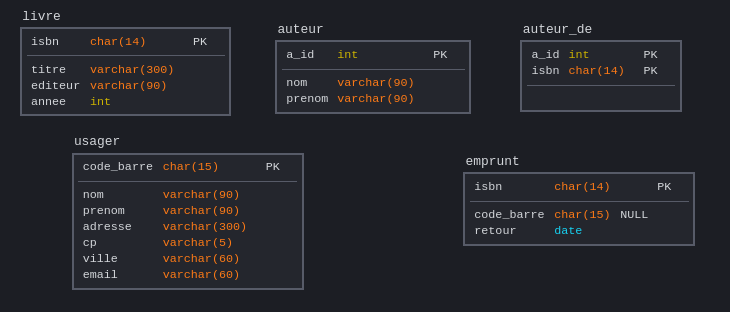
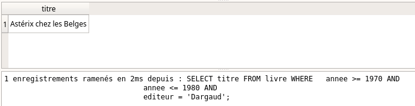
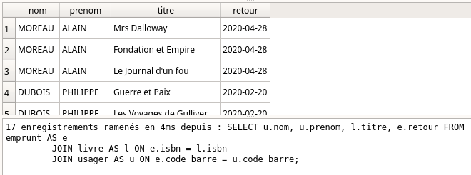

# Langage SQL

{: .center width=40%}


## 0. Du modèle relationnel au SGBD
Les considérations sur le modèle relationnel du [cours précédent](../4.1_Modele_relationnel/cours.md) traitaient plutôt de la structure mathématique des données. 

Il s'agissait de déterminer la meilleure structure pour représenter les données et les relations qui les lient. 

Il convient maintenant d'aborder la partie logicielle : les SGBD (Systèmes de Gestion de Bases de Données).

Les SGBD jouent le rôle d'interface entre l'être humain et la base de données.
Par l'intermédiaire de **requêtes**, l'utilisateur va consulter ou modifier la base de données. Le SGBD est garant de l'intégrité de cette base, et prévient notamment que les modifications (souvent appelées **transactions**) ne soient pas préjudiciables à la base de données.

Le langage utilisé pour communiquer avec le SGBD est le langage **SQL**, pour Structured  Query Langage (pour *langage de requêtes structurées*).

Les SGBD les plus utilisés sont basés sur le modèle relationnel. Parmi eux, citons Oracle, MySQL, Microsoft SQL Server, PostgreSQL, Microsoft Access, SQLite, MariaDB...

Mais de plus en plus de SGBD **non-relationnels** sont utilisés, spécialement adaptés à des données plus diverses et moins structurées. On les retrouve sous l'appelation **NoSQL**  (pour *Not only SQL*). Citons parmi eux MongoDB, Cassandra (Facebook), BigTable (Google)...

{: .center}


La quasi-totalité de ces SGBD fonctionnent avec un modèle client-serveur. 

Nous allons travailler principalement avec le langage SQLite peut lui s'utiliser directement sans démarrer un serveur : la base de données est entièrement représentée dans le logiciel utilisant SQLite (dans notre cas, DB Browser for SQLite).  
Sa simplicité d'utilisation en fera notre choix pour illustrer cette présentation du langage SQL. 


## 1. Introduction au langage SQL


Dans toute la suite, nous allons travailler avec la base de données ```livres.db``` qui provient de l'ouvrage paru chez Ellipses, cité en bibliographie.

### 1.0 Différents moyens d'interroger la base de données
**Pré-requis :** téléchargez la base de données [livres.db](data/livres.db).

??? abstract "1. En ligne avec ```sqliteonline.com``` "
    - Rendez vous sur [https://sqliteonline.com/](https://sqliteonline.com/)
    - Par File / OpenDB, ouvrez le fichier  ```livres.db``` précédemment téléchargé.
    - Écrivez votre requête plus cliquez sur Run.  
    


??? abstract "2. Au sein d'un notebook Jupyter"
    - Si nécessaire, installez via le terminal les paquets suivants :
    ```
    sudo pip3 install jupyter-sql
    sudo pip3 install ipython-sql
    sudo apt install python3-sql
    ``` 
    - Dans un notebook Jupyter, votre première cellule doit être 
    ```
    %load_ext sql
    %sql sqlite:///livres.db
    ``` 
    en ayant bien pris soin de mettre le fichier ```livres.db``` dans le même répertoire que votre fichier Jupyter.

    Ensuite, chaque requête devra être précédée de la ligne ```%% sql```.
    


!!! abstract "3. Avec un logiciel externe : DB Browser for SQLite :star: :star: :star:"
    - Installez ```DB Browser for SQLite```, téléchargeable à l'adresse [https://sqlitebrowser.org/](https://sqlitebrowser.org/)
    - Ouvrez le fichier ```livres.db```.  
    


--------

Dans toute la suite, les manipulations sont à faire en interrogeant la base de données ```livres.db```, avec l'une des méthodes indiquées ci-dessus.
Cette base de données contient les tables suivantes :
{: .center}


### 1.1. Sélection de données
 

#### 1.1.1 Exemple 1 : requête basique 🠖 SELECT, FROM, WHERE

!!! note "SELECT, FROM, WHERE :heart:"
    - **Commande :** 
    ```sql
    SELECT titre FROM livre WHERE annee >= 1990;
    ``` 
    - **Traduction :** 

    On veut les titres de la table «livre» qui sont parus après (ou en ) 1990;

    - **Résultat :**   

    

#### 1.1.2 Exemple 2 : requête basique avec booléens 🠖 AND

!!! note "AND :heart:"
    - **Commande :** 
    ```sql
    SELECT titre FROM livre WHERE   annee >= 1970 AND
                                    annee <= 1980 AND
                                    editeur = 'Dargaud';
    ``` 
    - **Traduction :** 

    On veut les titres de la table «livre» qui sont parus entre 1970 et 1980 chez l'éditeur Dargaud;

    - **Résultat :**   

    


#### 1.1.3 Exemple 3 : requête approchée 🠖 LIKE

!!! note "LIKE :heart:"
    - **Commande :** 
    ```sql
    SELECT titre FROM livre WHERE titre LIKE '%Astérix%';
    ``` 
    - **Traduction :** 

    On veut les titres de la table «livre» dont le titre contient la chaîne de caractères "Astérix".  
    Le symbole ```%``` est un joker qui peut symboliser n'importe quelle chaîne de caractères. 

    - **Résultat :**   

    

#### 1.1.4 Exemple 4 : renvoi de plusieurs colonnes

!!! note "Plusieurs colonnes :heart:"
    - **Commande :** 
    ```sql
    SELECT titre, isbn FROM livre WHERE annee >= 1990;
    ``` 
    - **Traduction :** 

    On veut les titres et les ISBN de la table «livre» qui sont parus après 1990.

    - **Résultat :**   

    

#### 1.1.5 Exemple 5 : renvoi de toutes les colonnes 

!!! note "Toutes les colonnes : * :heart:"
    - **Commande :** 
    ```sql
    SELECT * FROM livre WHERE annee >= 1990;
    ``` 
    - **Traduction :** 

    On veut toutes les colonnes disponibles de la table «livre» pour les livres qui sont parus après 1990.  
    L'astérisque ```*``` est un joker (*wildcard* en anglais).

    - **Résultat :**   

    

#### 1.1.6 Exemple 6 : renommer les colonnes 🠖 AS

!!! note "Renommer les colonnes : AS :heart:"
    - **Commande :** 
    ```sql
    SELECT titre AS titre_du_livre FROM livre WHERE annee >= 1990;
    ``` 
    - **Traduction :** 

    Lors de l'affichage du résulats et dans la suite de la requête (important), la colonne "titre" est renommée "titre_du_livre".

    - **Résultat :**   

    


### 1.2. Opérations sur les données : sélection avec agrégation

Les requêtes effectuées jusqu'ici ont juste sélectionné des données grâce à différents filtres : aucune action à partir de ces données n'a été effectuée.  
Nous allons maintenant effectuer des opérations à partir des données sélectionnées. On appelle ces opérations des **opérations d'agrégation**.

#### 1.2.1 Exemple 7 : nombre de résultats 🠖 COUNT

!!! note "Compter : COUNT :heart:"
    - **Commande :** 
    ```sql
    SELECT COUNT(*) AS total FROM livre
                                WHERE titre LIKE "%Astérix%";
    ``` 
    - **Traduction :** 

    On veut compter le nombre d'enregistrements de la tables livres comportant le mot "Astérix". Le résultat sera le seul élément d'une colonne nommée «total».

    - **Résultat :**   

    

#### 1.2.2 Exemple 8 : somme de valeurs numériques 🠖 SUM

!!! note "Additionner : SUM :heart:"
    - **Commande :** 
    ```sql
    SELECT SUM(annee) AS somme FROM livre
                                WHERE titre LIKE "%Astérix%";
    ``` 
    - **Traduction :** 

    On veut additionner les années des livres de la tables livres comportant le mot "Astérix". Le résultat sera le seul élément d'une colonne nommée «somme».
    *Attention : dans notre cas précis, ce calcul n'a aucun sens...*

    - **Résultat :**   

    

#### 1.2.3 Exemple 9 : moyenne de valeurs numériques 🠖 AVG

!!! note "Faire une moyenne : AVG :heart:"
    - **Commande :** 
    ```sql
    SELECT AVG(annee) AS moyenne FROM livre
                                WHERE titre LIKE "%Astérix%";
    ``` 
    - **Traduction :** 

    On veut calculer la moyenne des années de parution des livres de la table livres comportant le mot "Astérix". Le résultat sera le seul élément d'une colonne nommée «moyenne».

    - **Résultat :**   

    


#### 1.2.4 Exemple 10 : minimum ou maximum de valeurs numériques 🠖 MIN, MAX

!!! note "Trouver les extremums : MIN, MAX :heart:"
    - **Commande :** 
    ```sql
    SELECT MIN(annee) AS minimum FROM livre
                                WHERE titre LIKE "%Astérix%";
    ``` 
    - **Traduction :** 

    On veut trouver la pus petite valeur de la colonne «annee» parmi les livres de la tables livre comportant le mot "Astérix". Le résultat sera le seul élément d'une colonne nommée minimum. Le fonctionnement est identique avec **MAX** pour la recherche du maximum.

    - **Résultat :**   

    

#### 1.2.5 Exemple 11 : classer des valeurs 🠖 ORDER BY, ASC, DESC

!!! note "Classement : ORDER BY, ASC, DESC :heart:"
    - **Commande :** 
    ```sql
    SELECT titre, annee FROM livre
                    WHERE titre LIKE "%Astérix%"
                    ORDER BY annee DESC;
    ``` 
    - **Traduction :** 

    On veut afficher tous les albums d'Astérix, et leur année de parution, classés par année décroissante.
    
    - **Résultat :**   

    

#### 1.2.5 Exemple 12 : suppression des doublons 🠖 DISTINCT

!!! note "Suppression des doublons : DISTINCT :heart:"
    - **Commande :** 
    ```sql
    SELECT DISTINCT editeur FROM livre;
    ``` 
    - **Traduction :** 

    On veut la liste de tous les éditeurs. Sans le mot-clé ```DISTINCT```, beaucoup de doublons apparaîtraient.

    - **Résultat :**   

    

## 1.3 Des recherches croisées sur les tables : les jointures

Observons le contenu de la table «emprunt» :

```sql
SELECT * FROM emprunt;
``` 


Le contenu est peu lisible. Souvenons-nous du diagramme de la base de données.

 

 Pour que la table «emprunt» soit lisible, il faudrait (dans un premier temps) que l'on affiche à la place de l'ISBN le titre de l'ouvrage. Or ce titre est disponible dans la table «livres».  On va donc procéder à une **jointure** de ces deux tables.

#### 1.3.1 Exemple 13 : jointure de deux tables 🠖 JOIN
- **Commande :** 
```sql
SELECT livre.titre, emprunt.code_barre, emprunt.retour FROM emprunt
         JOIN livre ON emprunt.isbn = livre.isbn;
``` 
- **Traduction :** 
Comme plusieurs tables sont appelées, nous préfixons chaque colonne avec le nom de la table. Nous demandons ici l'affichage de la table «emprunt», mais où on aura remplacé l'ISBN (peu lisible) par le titre du livre.

L'expression 
```sql
JOIN livre ON emprunt.isbn = livre.isbn
``` 
doit se comprendre comme ceci : on «invite» la table «livres» (dont on va afficher la colonne «titre»). La correspondance entre la table «livres» et la table «emprunt» doit se faire sur l'attribut ISBN, qui est la clé primaire de «livres» et une clé étrangère d'«emprunts».  
Il est donc très important de spécifier ce sur quoi les deux tables vont se retrouver (ici, l'ISBN) 

- **Résultat :**  


#### 1.3.2 Exemple 14 : jointure de trois tables 🠖 JOIN

Le résultat précédemment a permis d'améliorer la visibilité de la table «emprunt», mais il reste la colonne «code_barre» qui est peu lisible. Nous pouvons la remplacer par le titre du livre, en faisant une nouvelle jointure, en invitant maintenant les deux tables «livre» et «usager».

- **Commande :** 
```sql
SELECT u.nom, u.prenom, l.titre, e.retour FROM emprunt AS e
         JOIN livre AS l ON e.isbn = l.isbn
         JOIN usager AS u ON e.code_barre = u.code_barre;
``` 
- **Traduction :** 
Il faut bien comprendre que la table principale qui nous intéresse ici est «emprunts», mais qu'on modifie les valeurs affichées en allant chercher des correspondances dans deux autres tables. 
Notez ici que des alias sont donnés aux tables (par **AS**) afin de faciliter l'écriture. 

- **Résultat :**  



### 1.4 Exercice d'application : The SQL Murder Mystery 
Cet exercice en ligne est proposé le Knight Lab de l'université américaine Northwerstern University.


**Le point de départ de l'histoire** : un meurtre a été commis dans la ville de SQL City le 15 janvier 2018.

À partir de ce point de départ et d'une base de données dont le diagramme est donné ci-dessous, il s'agit de trouver le meurtrier.


Rendez-vous sur [cette page](https://mystery.knightlab.com/walkthrough.html), et bonne enquête à coups de requêtes !

## 2. Création et modification d'une base de données

_rappel_ : 


L'objectif est de créer la table suivante :

| id | Nom | Maths | Anglais | NSI |
|:-----:|:-----:|:-------:|:----:|:----:|
| 1 | Alice | 16 | 11 | 17 |
| 2 | Bob  | 12 | 15 | 10 |
| 3 | Charles | 9 | 11 | 18 |

#### 2.1 Exemple 15 : Création d'une table 🠖 CREATE TABLE

- **Commande :** 
```sql
CREATE TABLE Table_notes (
        Id INTEGER PRIMARY KEY,
        Nom TEXT,
        Maths INTEGER,
        Anglais INTEGER,
        NSI INTEGER
        );
``` 
- **Remarques :** 

C'est l'utilisateur qui spécifie, éventuellement, quel attribut sera une clé primaire.

- **Résultat :**  
Dans DB Browser, il faut avoir au préalable créé une nouvelle base de données.


#### 2.2 Exemple 16 : Insertion de valeurs 🠖 INSERT INTO, VALUES

- **Commande :** 
```sql
INSERT INTO Table_notes VALUES  (1, 'Alice', 16, 11, 17),
		                (2, 'Bob', 12, 15, 10),
                        (3, 'Charles', 9, 11, 18);
``` 

- **Résultat :**  


#### 2.3 Exemple 17 : Intérêt de la clé primaire
Essayons d'insérer un 4ème enregistrement ayant le même ```id``` qu'un autre élève. 

- **Commande :** 
```sql
INSERT INTO Table_notes VALUES  (3, 'Denis', 18, 10, 12);
``` 

- **Résultat :**  
La contrainte de relation est violée : le SGBD «protège» la base de données en n'acceptant pas la proposition d'insertion. La base de données n'est pas modifiée.


- **Remarque :**
Il est possible de «déléguer» la gestion des valeurs de la clé primaire avec l'instruction ```AUTOINCREMENT```. 
La déclaration de la table et l'insertion des valeurs serait :
```sql
CREATE TABLE Table_notes (
        Id INTEGER PRIMARY KEY AUTOINCREMENT,
        Nom TEXT,
        Maths INTEGER,
        Anglais INTEGER,
        NSI INTEGER
        );

INSERT INTO Table_notes (Nom, Maths, Anglais, NSI) VALUES
	('Alice', 16, 11, 17),
	('Bob', 12, 15, 10),
	('Charles', 9, 11, 18);
``` 
et le résultat serait : 


L'attribut ```id``` est donc géré automatiquement par le SGBD.


#### 2.4 Exemple 18 : Modification d'une valeur 🠖 UPDATE, SET

Pour modifier la note de Maths d'Alice :

- **Commande :** 
```sql
UPDATE Table_notes SET Maths = 18 WHERE Nom = 'Alice';
``` 

#### 2.5 Exemple 19 : Suppression d'un enregistrement 🠖 DELETE

Pour supprimer totalement la ligne concernant Charles :

- **Commande :** 
```sql
DELETE FROM Table_notes WHERE Nom = 'Charles';
``` 

Si une autre table contient par exemple l'attribut ```id```  comme clé étrangère, et si l'```id```  de Charles fait partie de cette table, le SGBD refusera de supprimer cette ligne, afin de ne pas violer la contrainte de référence.


#### 2.6 Exemple 20 : Suppression totale d'une table 🠖 DROP TABLE

Pour supprimer totalement et défitivement la table :

- **Commande :** 
```sql
DROP TABLE Table_notes;
``` 

Là encore, si une autre table est reliée à ```Table_notes``` par une clé étrangère, la suppression sera bloquée par le SGBD.
