{{initexo(0)}}


!!! abstract "{{ exercice() }}"   

    **Partie A**

    Cette partie est un questionnaire à choix multiples (QCM).
    Pour chacune des questions, une seule des quatre réponses est exacte.

    1. Parmi les commandes ci-dessous, laquelle permet d’afficher les processus en cours
    d’exécution ?
        - a. ```dir```
        - b. ```ps``` 
        - c. ```man``` 
        - d.   ```ls```
    2. Quelle abréviation désigne l’identifiant d’un processus dans un système d’exploitation de type UNIX ?
        - a. PIX
        - b. SIG 
        - c. PID 
        - d. SID
    3. Comment s'appelle la gestion du partage de processeur entre les différents processus ?
        - a. L'interblocage
        - b. L'ordonnancement
        - c. La planification
        - d. La priorisation
    4. Quelle commande permet d’interrompre un processus dans un système d’exploitation de type
    UNIX ?
        - a. ```stop```
        - b. ```interrupt``` 
        - c. ```end``` 
        - d.   ```kill```

    {{
    correction(True,
    """
    ??? success \"Correction\" 
        1. b
        2. c
        3. b
        4. d
    """
    )
    }}


    **Partie B**

    **Q1.** Un processeur choisit à chaque cycle d’exécution le processus qui doit être exécuté. Le
    tableau ci-dessous donne pour trois processus P1, P2, P3 :

    - la durée d’exécution (en nombre de cycles),
    - l’instant d’arrivée sur le processeur (exprimé en nombre de cycles à partir de 0),
    - le numéro de priorité.

    Le numéro de priorité est d’autant plus petit que la priorité est grande. On suppose qu’à chaque instant, c’est le processus qui a le plus petit numéro de priorité qui est exécuté, ce qui peut provoquer la suspension d’un autre processus, lequel reprendra lorsqu’il sera le plus prioritaire.

    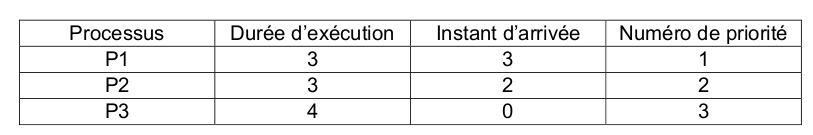{: .center}
    Reproduire le tableau ci-dessous sur la copie et indiquer dans chacune des cases le processus
    exécuté à chaque cycle.
    {: .center}

    {{
    correction(True,
    """
    ??? success \"Correction\" 
        {: .center}
    """
    )
    }}

        


    **Q2.** On suppose maintenant que les trois processus précédents s’exécutent et utilisent une ou plusieurs ressources parmi R1, R2 et R3.
    Parmi les scénarios suivants, lequel provoque un interblocage ? Justifier.

    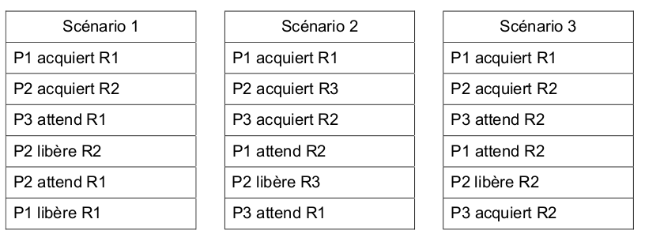{: .center}

    {{
    correction(False,
    """
    ??? success \"Correction\" 
        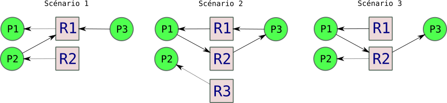{: .center}
        Seul le scenario 2 présente un cycle d'interdépendance : seul le scénario 2 va donc provoquer un interblocage.
    """
    )
    }}


!!! abstract "{{ exercice() }}" 

    _2021, Métropole Candidats Libres sujet 2_

    **Q1.** Les états possibles d’un processus sont : *prêt*, *élu*, *terminé* et *bloqué*.

    **Q1.a.** Expliquer à quoi correspond l’état *élu*.  
    **Q1.b.** Proposer un schéma illustrant les passages entre les différents états.

    {{
    correction(False,
    """
    ??? success \"Correction\" 
        **Q1a.** Élu signifie que le processus est actuellement en cours d'exécution par le processeur.

        **Q1b.** 
        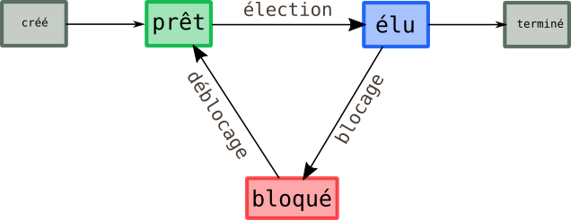{: .center}
    """
    )
    }}

       

    **Q2.** On suppose que quatre processus C₁, C₂, C₃ et C₄ sont créés sur un ordinateur,
    et qu’aucun autre processus n’est lancé sur celui-ci, ni préalablement ni pendant
    l’exécution des quatre processus.
    L’ordonnanceur, pour exécuter les différents processus prêts, les place dans une
    structure de données de type file. Un processus prêt est enfilé et un processus
    élu est défilé.
    


    **Q2.a.** Parmi les propositions suivantes, recopier celle qui décrit le fonctionnement
    des entrées/sorties dans une file :  

    - i.Premier entré, dernier sorti
    - ii. Premier entré, premier sorti
    - iii. Dernier entré, premier sorti

    {{
    correction(False,
    """
    ??? success \"Correction\" 
        **Q2a.** ii. Premier entré, premier sorti
    """
    )
    }}


    **Q2.b.** On suppose que les quatre processus arrivent dans la file et y sont placés
    dans l’ordre C₁, C₂, C₃ et C₄.

    - Les temps d’exécution totaux de C₁, C₂, C₃ et C₄ sont respectivement
    100 ms, 150 ms, 80 ms et 60 ms.
    - Après 40 ms d’exécution, le processus C₁ demande une opération d’écriture
    disque, opération qui dure 200 ms. Pendant cette opération d’écriture, le
    processus C₁ passe à l’état bloqué.
    - Après 20 ms d’exécution, le processus C₃ demande une opération d’écriture
    disque, opération qui dure 10 ms. Pendant cette opération d’écriture, le
    processus C₃ passe à l’état bloqué.


    Sur la frise chronologique ci-dessous, les
    états du processus C₂ sont donnés. Compléter la frise avec les états des
    processus C₁, C₃ et C₄.

    {: .center}

    {{
    correction(False,
    """
    ??? success \"Correction\" 
        {: .center} 
    """
    )
    }}


!!! abstract "{{ exercice() }}"


    _2021, sujet Amérique du Nord_

    Un constructeur automobile utilise des ordinateurs pour la conception de ses véhicules.
    Ceux-ci sont munis d'un système d'exploitation ainsi que de nombreuses applications parmi lesquelles on peut citer :

    - un logiciel de traitement de texte ;
    - un tableur ;
    - un logiciel de Conception Assistée par Ordinateur (CAO) ;
    - un système de gestion de base de données (SGBD)

    Chaque ordinateur est équipé des périphériques classiques : clavier, souris, écran et est relié à une imprimante réseau.

    1. *(question System On Chip)*
    2. Un ingénieur travaille sur son ordinateur et utilise les quatre applications citées au début de l'énoncé.  
    Pendant l'exécution de ces applications, des processus mobilisent des données et sont en attente d'autres données mobilisées par d'autres processus.  
    On donne ci-dessous un tableau indiquant à un instant précis l'état des processus en cours d'exécution et dans lequel D1, D2, D3, D4 et D5 sont des données.

    La lettre M signifie que la donnée est mobilisée par l'application ; la lettre A signifie que l'application est en attente de cette donnée.

    Lecture du tableau : le logiciel de traitement de texte mobilise (M) la donnée D1 et est en attente (A) de la donnée D2.

    | | D1 | D2 | D3 | D4 | D5|
    |:---:|:---:|:---:|:---:|:---:|:---:|
    | Traitement de texte | M | A |-|-|-|
    | Tableur | A | - |-|-|M|
    | SGBD | - | M |A|A|-|
    | CAO | - | - |A|M|A|

    Montrer que les applications s'attendent mutuellement. Comment s'appelle cette situation ?

    {{
    correction(False,
    """
    ??? success \"Correction\" 
        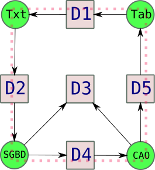{: .center}
        Le cycle en pointillés montre que les applications s'attendent mutuellement : cette situation s'appelle un interblocage. 
    """
    )
    }}


        

!!! abstract "{{ exercice() }}"   

    _2021, Métropole sujet 2_

    **Partie A**

    Dans un bureau d’architectes, on dispose de certaines ressources qui ne peuvent être utilisées
    simultanément par plus d’un processus, comme l’imprimante, la table traçante, le modem.
    Chaque programme, lorsqu’il s’exécute, demande l’allocation des ressources qui lui sont
    nécessaires. Lorsqu’il a fini de s’exécuter, il libère ses ressources.

    {: .center}

    On appelle p1, p2 et p3 les processus associés respectivement aux programmes 1, 2 et 3

    **Q1.** Les processus s'exécutent de manière concurrente.
    Justifier qu'une situation d'interblocage peut se produire.

    {{
    correction(False,
    """
    ??? success \"Correction\" 
        Supposons que chaque ligne de chaque programme s'effectue consécutivement (d'abord la ligne 1 de P1, puis celle de P2, puis celle de P3, puis la ligne 2 de P1, etc.). Dans ce cas-là, le diagramme de dépendance serait :
        {: .center}
        On voit apparaître un cycle d'interdépendance : il peut donc y avoir une situation d'interblocage. 
    """
    )
    }}

        

    **Q2**. Modifier l'ordre des instructions du programme 3 pour qu'une telle situation ne puisse pas se produire. Aucune justification n'est attendue.

    {{
    correction(False,
    """
    ??? success \"Correction\" 
        On peut par exemple inverser la demande d'imprimante et de table traçante.
    """
    )
    }}
 
        


    3. Supposons que le processus p1 demande la table traçante alors qu'elle est en cours
    d'utilisation par le processus p3. Parmi les états suivants, quel sera l'état du processus p1
    tant que la table traçante n'est pas disponible :
        - a. élu
        - b. bloqué
        - c. prêt
        - d. terminé

    {{
    correction(False,
    """
    ??? success \"Correction\" 
        Il sera à l'état bloqué.
    """
    )
    }}
       

    **Partie B**

    Avec une ligne de commande dans un terminal sous Linux, on obtient l'affichage suivant :

    {: .center}

    La documentation Linux donne la signification des différents champs :

    - `UID` : identifiant utilisateur effectif ;
    - `PID` : identifiant de processus ;
    - `PPID` : `PID` du processus parent ;
    - `C` : partie entière du pourcentage d'utilisation du processeur par rapport au temps de vie
    des processus ;
    - `STIME` : l'heure de lancement du processus ;
    - `TTY` : terminal de contrôle
    - `TIME` : temps d'exécution
    - `CMD` : nom de la commande du processus


    **Q1.** Parmi les quatre commandes suivantes, laquelle a permis cet affichage ?

    - a. ```ls -l``` 
    - b. ```ps -ef``` 
    - c. ```cd ..``` 
    - d. ```chmod 741 processus.txt``` 

    **Q2.** Quel est l'identifiant du processus parent à l'origine de tous les processus concernant le
    navigateur Web (chromium-browser) ?

    **Q3.** Quel est l'identifiant du processus dont le temps d'exécution est le plus long ?

    {{
    correction(False,
    """
    ??? success \"Correction\" 
        **Q1.** b.

        **Q2.** 6211

        **Q3.** 6211 
    """
    )
    }}


!!! abstract "{{ exercice() }}"        


    Exercice 2 du sujet [Amérique du Nord J2 2022](https://glassus.github.io/terminale_nsi/T6_Annales/data/2022/2022_Amerique_Nord_J2.pdf){. target="_blank"}

    {{
    correction(False,
    """
    ??? success \"Correction Q1.a.\" 
        proposition 2
    """
    )
    }}

    {{
    correction(False,
    """
    ??? success \"Correction Q1.b.\" 
        ```cd lycee```
    """
    )
    }}

    {{
    correction(False,
    """
    ??? success \"Correction Q1.c.\" 
        ```mkdir algorithmique```
    """
    )
    }}

    {{
    correction(False,
    """
    ??? success \"Correction Q1.d.\" 
        ```rm image1.jpg``` 
    """
    )
    }}

    {{
    correction(False,
    """
    ??? success \"Correction Q2.a.\" 
        927
    """
    )
    }}

    {{
    correction(False,
    """
    ??? success \"Correction Q2.b.\" 
        1058 (ou 927)
    """
    )
    }}

    {{
    correction(False,
    """
    ??? success \"Correction Q2.c.\" 
        1153 et 1154
    """
    )
    }}

    {{
    correction(False,
    """
    ??? success \"Correction Q2.d.\" 
        923 et 1036
    """
    )
    }}

    {{
    correction(False,
    """
    ??? success \"Correction Q3.a.\" 
        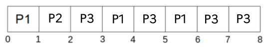{: .center}
    """
    )
    }}

    {{
    correction(False,
    """
    ??? success \"Correction Q3.b.\" 
        {: .center}
    """
    )
    }}

    {{
    correction(False,
    """
    ??? success \"Correction Q4.a.\" 
        Un processus peut être Prêt, Elu, ou Bloqué.
        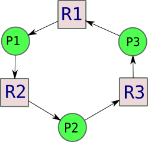{: .center}
        Si chaque ligne de chaque processus est exécutée à tour de rôle, un cycle d'interdépendance apparait, et donc un interblocage.
    """
    )
    }}

    {{
    correction(False,
    """
    ??? success \"Correction Q4.b.\" 
        En inversant la demande de R3 et R1 pour le processus P3, le risque d'interblocage disparaît.
        [Fichier svg d'explication](data/ANJ2_last.svg){. target='_blank'}
    """
    )
    }}


!!! abstract "{{ exercice() }}"        


    Exercice 2 du sujet [Polynésie J1](https://glassus.github.io/terminale_nsi/T6_Annales/data/2023/2023_Polynesie_J1.pdf){. target="_blank"}

    {{
    correction(False,
    """
    ??? success \"Correction Q1.a.\" 
        11, 20, 32, 11, 20, 32, 11, 32, 11
    """
    )
    }}

    {{
    correction(False,
    """
    ??? success \"Correction Q1.b.\" 
        11, 11, 20, 20, 32, 32, 11, 11, 32
    """
    )
    }}


    {{
    correction(False,
    """
    ??? success \"Correction Q2.a.\" 
        ```python
        liste_attente = [Processus(11, 4), Processus(20, 2), Processus(32, 3)]
        ```
    """
    )
    }}

    {{
    correction(False,
    """
    ??? success \"Correction Q2.b.\" 
        ```python
        def execute_un_cycle(self):
            self.reste_a_faire = self.reste_a_faire - 1
        
        def change_etat(self, nouvel_etat):
            self.etat = nouvel_etat
        
        def est_termine(self):
            return self.reste_a_faire == 0
        ```
    """
    )
    }}


    {{
    correction(False,
    """
    ??? success \"Correction Q2.c.\" 
        ```python linenums='1'
        def tourniquet(liste_attente, quantum):
            ordre_execution = []
            while liste_attente != []:
                processus = liste_attente.pop(0)
                processus.change_etat('En cours d exécution')
                compteur_tourniquet = 0
                while compteur_tourniquet < quantum and not processus.est_termine():
                    ordre_execution.append(processus.pid)
                    processus.execute_un_cycle()
                    compteur_tourniquet = compteur_tourniquet + 1
                if not processus.est_termine():
                    processus.change_etat('Suspendu')
                    liste_attente.append(processus)
                else:
                    processus.change_etat('Terminé')
            return ordre_execution
        ```

    """
    )
    }}


!!! abstract "{{ exercice() }}"        


    Exercice 2 du [sujet 0 version B 2024](https://glassus.github.io/terminale_nsi/T6_Annales/data/2024/bac_nsi_2024_sujet0b.pdf){. target="_blank"}

    {{
    correction(False,
    """
    ??? success \"Correction Q1\" 
        Dans un logiciel libre, le code-source est disponible, peut être amélioré et redistribué par les utilisateurs (voir [ici](https://www.gnu.org/philosophy/free-sw.fr.html){. target='_blank'}).

        Dans un logiciel propriétaire le code-source n'est pas disponible.

    """
    )
    }}

    {{
    correction(False,
    """
    ??? success \"Correction Q2\" 
        Le rôle d'un système d'exploitation est de permettre à l'utiliseur des stocker ses données et d'exploiter les ressources du processeur. *question très difficile car beaucoup trop vaste*
    """
    )
    }}


    {{
    correction(False,
    """
    ??? success \"Correction Q3\" 
        Le chemin absolu est ```/home/elsa/documents/boulot/rapport.odt``` 
    """
    )
    }}

    {{
    correction(False,
    """
    ??? success \"Correction Q4\" 
        Le chemin relatif est ```../max/images/photo_vac/photo_1.jpg``` 
    """
    )
    }}


    {{
    correction(False,
    """
    ??? success \"Correction Q5\" 
        Le répertoire ```documents``` n'as pas changé, il contient toujours les mêmes fichiers.

        Le répertoire ```boulot``` contient maintenant, en plus du fichier ```rapport.odt```, le fichier ```fiche.ods```. 
    """
    )
    }}


    {{
    correction(False,
    """
    ??? success \"Correction Q6\" 
        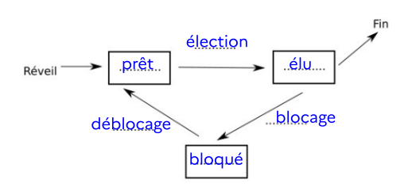{: .center}
    """
    )
    }}

    {{
    correction(False,
    """
    ??? success \"Correction Q7\" 
        Par exemple, une écriture sur le disque dur alors que celui-ci est déjà en cours d'écriture peut entraîner un passage à l'état bloqué.
    """
    )
    }}

    {{
    correction(False,
    """
    ??? success \"Correction Q8\" 
        La structure de pile est une structure LIFO.
    """
    )
    }}

    {{
    correction(False,
    """
    ??? success \"Correction Q9\" 
        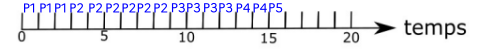{: .center}
    """
    )
    }}

    {{
    correction(False,
    """
    ??? success \"Correction Q10\" 
        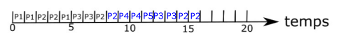{: .center}
    """
    )
    }}

    {{
    correction(False,
    """
    ??? success \"Correction Q11\" 
        Imaginons par exemple cette situation :

        - P1 réclame et obtient la ressource R1.
        - P2 réclame et obtient la ressource R2.
        - P1 réclame la ressource R2.
        - P2 réclame la ressource R1.

        La situation amènera donc à un cycle d'interdépendance et donc un interblocage :

        {: .center}
        
    """
    )
    }}


!!! abstract "{{ exercice() }} <i id='ex1AN2024'></i>"        


    Exercice 1 du [sujet Amérique du Nord J1 2024](https://glassus.github.io/terminale_nsi/T6_Annales/data/2024/24-NSIJ1AN1.pdf){. target="_blank"}

    {{
    correction(False,
    """
    ??? success \"Correction Q1\" 
        Les 3 états sont : Prêt, Élu, Bloqué.

    """
    )
    }}

 

    {{
    correction(False,
    """
    ??? success \"Correction Q2\" 
        Le processus ne peut plus être bloqué, les deux seuls états restants sont donc Prêt et Élu.
    """
    )
    }}


    
    ```python linenums='1'
        class File:
            def __init__ (self):
                """ Crée une file vide """
                self.contenu = []
            
            def enfile(self, element):
                """ Enfile element dans la file """
                self.contenu.append(element)
            
            def defile (self):
                """ Renvoie le premier élément de la file et l'enlève de la file """
                return self.contenu.pop(0)

            def est_vide(self):
                """ Renvoie True si la file est vide, False sinon """
                return self.contenu == []
    ```

    {{
    correction(False,
    """
    ??? success \"Correction Q3\" 
        ```python linenums='1'
            class File:
                def __init__ (self):
                    \"\"\" Crée une file vide \"\"\"
                    self.contenu = []
                
                def enfile(self, element):
                    \"\"\" Enfile element dans la file \"\"\"
                    self.contenu.append(element)

                def defile (self):
                    \"\"\" Renvoie le premier élément de la file et l'enlève de la file \"\"\"
                    if self.est_vide():
                        return None
                    return self.contenu.pop(0)

                def est_vide(self):
                    \"\"\" Renvoie True si la file est vide, False sinon \"\"\"
                    return self.contenu == []
        ```
    """
    )
    }}

    {{
    correction(False,
    """
    ??? success \"Correction Q4\" 
        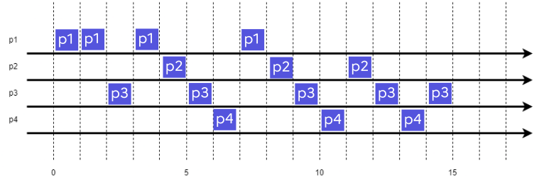{: .center}
        
    """
    )
    }}


    {{
    correction(False,
    """
    ??? success \"Correction Q5\" 
        ```python linenums='1'
        class Ordonnanceur:
	
            def __init__ (self):
                self.temps = 0
                self.file = File()
                
            def ajoute_nouveau_processus (self, proc):
                \"\"\"Ajoute un nouveau processus dans la file de l'ordonnanceur. \"\"\"
                self.file.enfile(proc)
                
            def tourniquet (self) :
                \"\"\"Effectue une étape d'ordonnancement et renvoie le nom du processus élu.\"\"\"
                self.temps += 1
                if not self.file.est_vide():
                    proc = self.file.defile()
                    proc.execute_un_cycle()

                    if not proc.est_fini():
                        self.file.enfile(proc)
                    return proc.nom
                else:
                    return None
        ```
    """
    )
    }}

    Pour tester votre code de la question Q6, vous pouvez utiliser le code suivant (qui propose une implémentation de la classe ```Processus```, qui n'est pas donnée dans l'énoncé)

    ```python linenums='1'

    class Ordonnanceur:	
        def __init__(self):
            self.temps = 0
            self.file = File()
            
        def ajoute_nouveau_processus(self, proc):
            """Ajoute un nouveau processus dans la file de l'ordonnanceur. """
            ...
            
        def tourniquet (self) :
            """Effectue une étape d'ordonnancement et renvoie le nom du processus élu."""
            self.temps += 1
            if not self.file.est_vide():
                proc = ...
                ...
                if not proc.est_fini ():
                    ...
                return proc.nom
            else:
                return None


    class Processus:
        def __init__(self, nom, duree):
            self.nom = nom
            self.duree = duree
            self.exectime = 0
        
        def execute_un_cycle(self):
            self.exectime += 1
        
        def est_fini(self):
            return self.exectime == self.duree


    p1 = Processus("p1", 4)
    p2 = Processus("p2", 3)
    p3 = Processus("p3", 5)
    p4 = Processus("p4", 3)
    depart_proc = {0: p1, 1: p3, 2: p2, 3: p4}
    ```


    {{
    correction(False,
    """
    ??? success \"Correction Q6\" 
        ```python linenums='1'
        ordo = Ordonnanceur()
        ordo.ajoute_nouveau_processus(depart_proc[0])
        print(ordo.tourniquet()) 
        while not ordo.file.est_vide():
            t = ordo.temps
            if t in depart_proc:
                ordo.ajoute_nouveau_processus(depart_proc[t])
            print(ordo.tourniquet()) 
        ```
    """
    )
    }}

    {{
    correction(False,
    """
    ??? success \"Correction Q7\" 
        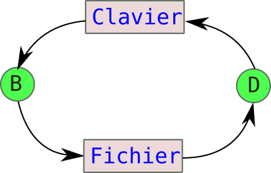{: .center}
        La situation présente un cycle et donc un risque d'interblocage.
    """
    )
    }}

  