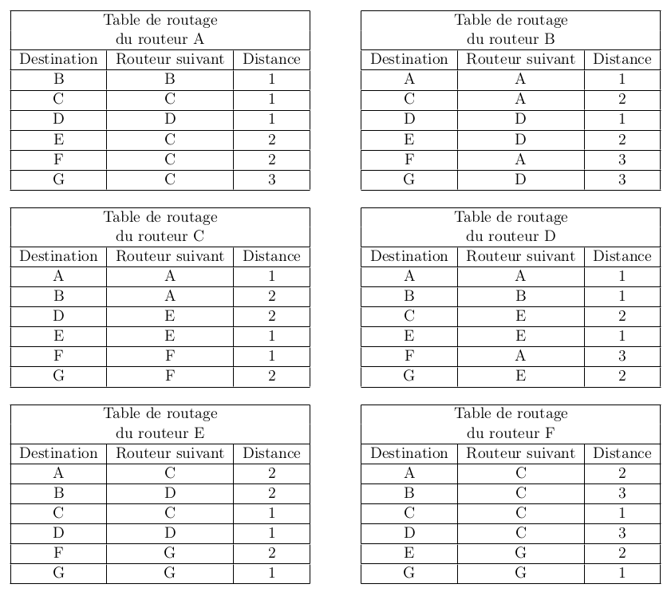
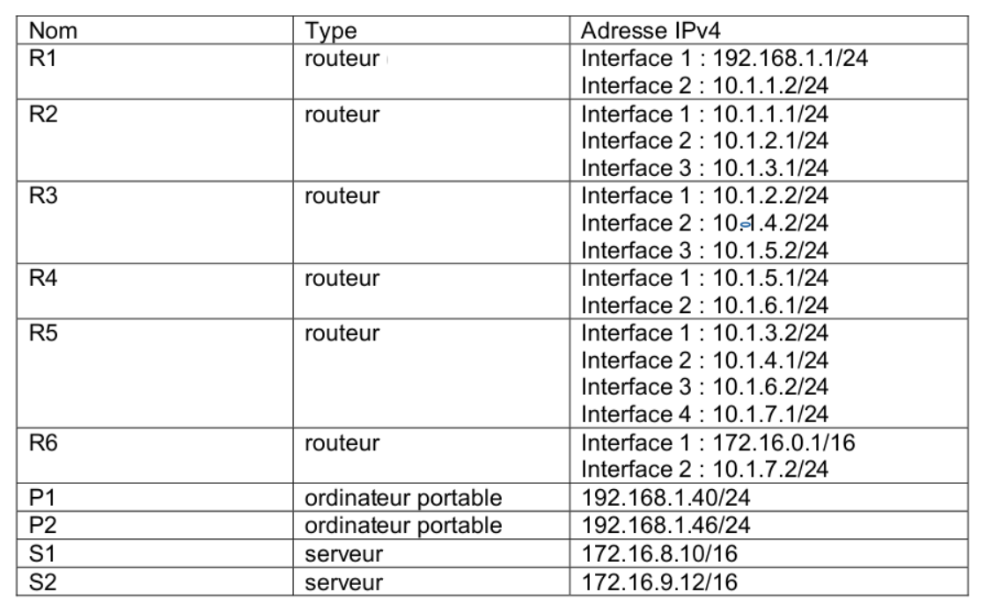
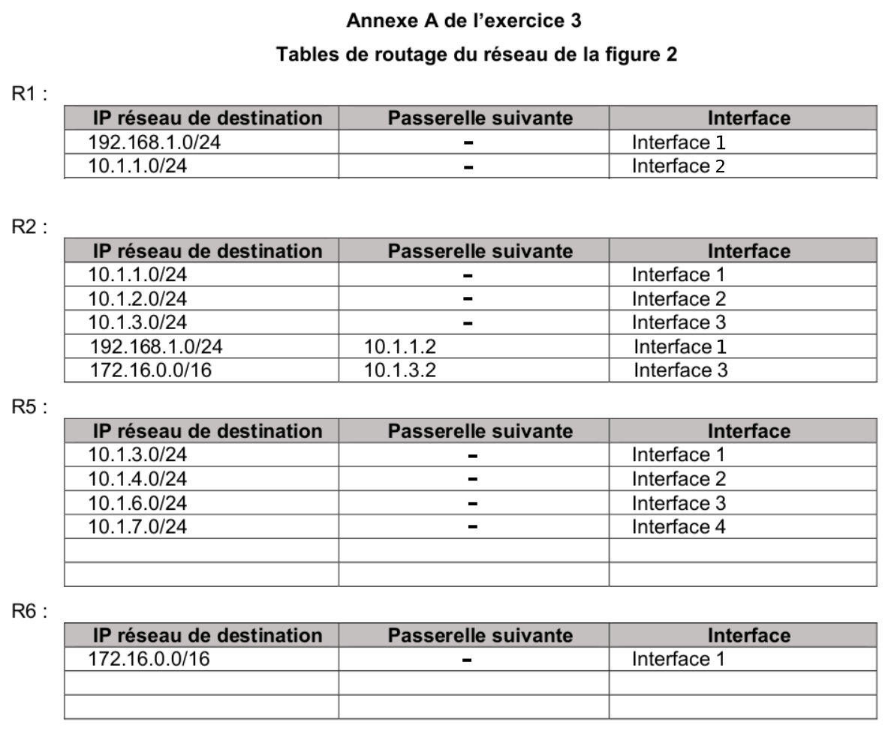
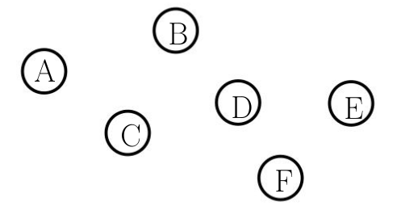
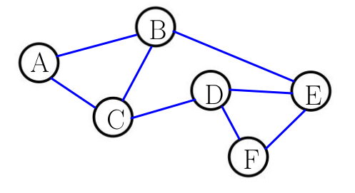
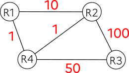

{{initexo(0)}}

{#
!!! abstract "{{ exercice() }}"

    Dans un réseau quelconque, le coût de chaque liaison se calcule par la formule :

    $$ \text{coût} = \frac{10^8}{d} $$

    où le débit $d$ est exprimé en bits/s.

    Calculer le coût si la liaison a un débit de :

    **A.** 10 Mb/s

    **B.** 1 Gb/s

    **C.** 1 Mb/s

    **D.** 50 Mb/s
#}

!!! abstract "{{ exercice() }}"

    Exercice 5 du sujet [La Réunion J1 2022](https://glassus.github.io/terminale_nsi/T6_Annales/data/2022/2022_LeReunion_J1.pdf){. target="_blank"}

    {{
    correction(True,
    """
    ??? success \"Correction Q1.a.\" 
        Une adresse IPv4 se code à l'aide de 4 octets.
    """
    )
    }}

 
        

    {{
    correction(True,
    """
    ??? success \"Correction Q1.b.\" 
        Le PC3 a pour adresse ```172.150.4.30 / 24```. Cela signfie que son masque, en notation CIDR, est 24. Ses 24 premiers bits sont donc à 1. Cela correspond au masque ```255.255.255.0``` en notation décimale.
    """
    )
    }}

        
    {{
    correction(True,
    """
    ??? success \"Correction Q2.\" 
        {: .center}
    """
    )
    }}

        
    {{
    correction(True,
    """
    ??? success \"Correction Q3.a.\" 
        Pour être dans le réseau 1, il faut que le & logique entre l'IP de la machine et l'adresse du masque donne l'adresse réseau (```172.150.4.0``` ).

        Le réseau étant en ```/24``` (équivalent au masque ```255.255.255.0```), cela signifie que l'adresse IP de la machine soit de la forme ```172.150.4.???```.

        Attention, il faut en plus s'assurer que l'adresse ne soit pas déjà utilisée, et qu'elle ne soit pas l'adresse du réseau (```172.150.4.0```) ou de broadcast (```172.150.4.255```).

        Il reste alors les adresses 4) et 6). (```172.150.4.11``` et ```172.150.4.200```)
    """
    )
    }}

        
    {{
    correction(True,
    """
    ??? success \"Correction Q3.b.\" 
        La commande permettant de connaître son adresse IP est ```ifconfig``` ou ```ip addr``` sous Linux / MacOS. Ou bien ```ipconfig``` sous Windows.
    """
    )
    }}

    {{
    correction(True,
    """
    ??? success \"Correction Q4.\" 
        La solution de relier les switchs entre eux n'est pas satisfaisante. Les deux réseaux ne pourront pas communiquer entre eux, à moins d'élargir (beaucoup) leur masque de sous-réseau.

        La meilleure solution est d'installer un routeur entre les deux switchs, de lui attribuer une adresse IP dans chaque sous-réseau, et de renseigner cette adresse IP comme adresse de passerelle sur chacun des PCs des deux sous-réseaux. 
    """
    )
    }}
 
        
    {{
    correction(False,
    """
    ??? success \"Correction Q5.\" 
        ```python linenums='1'
        def adresse(IP, liste_IP):
            if IP in liste_IP:
                print('trouvée')
            else:
                liste_IP.append(IP)
                print('pas trouvée, ajoutée')
        ``` 
    """
    )
    }}
    
        


!!! abstract "{{ exercice() }}"

    _2020, sujet 0_

    On considère un réseau composé de plusieurs routeurs reliés de la façon suivante :

    {: .center width=40%}


    Le protocole RIP permet de construire les tables de routage des différents routeurs, en indiquant pour chaque routeur la distance, en nombre de sauts, qui le sépare d’un autre routeur. Pour le réseau ci-dessus, on dispose des tables de routage suivantes :

    {: .center width=80%}

    **Question 1**

    1.1 Le routeur A doit transmettre un message au routeur G, en effectuant un nombre minimal de
    sauts. Déterminer le trajet parcouru.
    {{
    correction(False,
    """
    ??? success \"Correction\" 
        **Q1.1.** Le trajet parcouru de A à G est A-C-F-G  
    """
    )
    }}
    1.2. Déterminer une table de routage possible pour le routeur G obtenue à l’aide du protocole RIP.
    {{
    correction(False,
    """
    ??? success \"Correction\" 
        **Q1.2.** 
        Table de routage de G :  

        | Destination | Routeur suivant | Distance |
        |:--:|:--:|:--:|
        |A|F|3|    
        |B|E|3|
        |C|E|2|
        |D|E|2|
        |E|E|1|
        |F|F|1|

    """
    )
    }}

    **Question 2**

    Le routeur C tombe en panne. Reconstruire la table de routage du routeur A en suivant le
    protocole RIP.

    {{
    correction(False,
    """
    ??? success \"Correction\" 
        Nouvelle table de routage de A :  

        | Destination | Routeur suivant | Distance |
        |:--:|:--:|:--:|
        |B|B|1|
        |D|D|1|
        |E|D|2|
        |G|D|3|
        |F|D|4|
    """
    )
    }}
 
        
        


!!! abstract "{{ exercice() }}"

    _2021, sujet Métropole 1_

    On représente ci-dessous un réseau dans lequel R1, R2, R3, R4, R5 et R6 sont des
    routeurs. Le réseau local L1 est relié au routeur R1 et le réseau local L2 au routeur R6.

    {: .center width=70%}


    Dans cet exercice, les adresses IP sont composées de 4 octets, soit 32 bits. Elles sont notées X1.X2.X3.X4, où X1, X2, X3 et X4 sont les valeurs des 4 octets, convertis en notation décimale.
    La notation X1.X2.X3.X4/n signifie que les n premiers bits de poids forts de l’adresse IP représentent la partie « réseau », les bits suivants représentent la partie « hôte ».
    Toutes les adresses des hôtes connectés à un réseau local ont la même partie réseau et peuvent donc communiquer directement. L’adresse IP dont tous les bits de la partie « hôte » sont à 0 est appelée « adresse du réseau ».

    On donne également des extraits de la table de routage des routeurs R1 à R5 dans le
    tableau suivant :

    {: .center width=70%}

    1/ Un paquet part du réseau local L1 à destination du réseau local L2.

    1.a. En utilisant l’extrait de la table de routage de R1, vers quel routeur R1 envoie-t-il ce paquet : R2 ou R3 ? Justifier.
    {{
    correction(False,
    """
    ??? success \"Correction\" 
        1.a. D'après la table, R1 doit passer par la passerelle 86.154.10.1 qui correspond au routeur R2. 
    """
    )
    }}

    1.b. A l’aide des extraits de tables de routage ci-dessus, nommer les routeurs traversés par ce paquet, lorsqu’il va du réseau L1 au réseau L2.
    {{
    correction(False,
    """
    ??? success \"Correction\" 
        1.b. Le paquet va traverser R1, R2, R6 avant d'arriver à L2. 
    """
    )
    }}
    2/ La liaison entre R1 et R2 est rompue.

    2.a. Sachant que ce réseau utilise le protocole RIP (distance en nombre de sauts), donner l’un des deux chemins possibles que pourra suivre un paquet allant de L1 vers L2.
    {{
    correction(False,
    """
    ??? success \"Correction\" 
        2.a. RIP doit minimiser le nombre de sauts, donc les deux chemins minimaux possibles sont R1-R3-R4-R6 et R1-R3-R2-R6. 
    """
    )
    }}
    2.b. Dans les extraits de tables de routage ci-dessus, pour le chemin de la question 2.a, quelle(s) ligne(s) sera (seront) modifiée(s) ?
    {{
    correction(False,
    """
    ??? success \"Correction\" 
        2.b. La ligne R1 sera modifiée, il faudra partir vers R3 (et son réseau 112.44.65.0/24). Les autres lignes n'ont pas à être modifiées puisque R3 amène en R4 qui amène en R6.
    """
    )
    }}
    3/ On a rétabli la liaison entre R1 et R2.
    Par ailleurs, pour tenir compte du débit des liaisons, on décide d’utiliser le
    protocole OSPF (distance liée au coût minimal des liaisons) pour effectuer le
    routage. Le coût des liaisons entre les routeurs est donné par le tableau suivant :

    {: .center width=90%}

    a. Le coût _C_ d’une liaison est donné ici par la formule
    $C = \dfrac{10^9}{BP}$

    où $BP$ est la bande passante de la connexion en bps (bits par seconde).
    Sachant que la bande passante de la liaison R2-R3 est de 10 Mbps, calculer le coût correspondant.
    {{
    correction(False,
    """
    ??? success \"Correction\" 
        3.a $\\dfrac{10^9}{10 \\times 10^6}=100$ donc le coût R2-R3 est 100.  
    """
    )
    }}

    b. Déterminer le chemin parcouru par un paquet partant du réseau L1 et arrivant au réseau L2, en utilisant le protocole OSPF.
    {{
    correction(False,
    """
    ??? success \"Correction\" 
        3.b. Avec OSPF, le chemin qui minimise le coût est le chemin R1-R2-R4-R5-R6 (coût 103) :
        {: .center width=50%}
    """
    )
    }}
    c. Indiquer pour quel(s) routeur(s) l’extrait de la table de routage sera modifié pour un paquet à destination de L2, avec la métrique OSPF.
    {{
    correction(False,
    """
    ??? success \"Correction\" 
        3.c. Dans la table de routage initiale, il faut modifier R2 pour qu'elle envoie sur R4 (et non sur R6), mais aussi R4 pour qu'elle envoie sur R5 (et non sur R6).
         
    """
    )
    }}

         
         
         
          
        
        
        


!!! abstract "{{ exercice() }}"

    _2021, sujet Métropole 2_ (sujet modifié, correction d'erreurs sur les adresses passerelles)

    |  | 
    |:--:| 
    | *Figure 1* |

    La figure 1 ci-dessus représente le schéma d’un réseau d’entreprise. Il y figure deux réseaux locaux L1 et L2. Ces deux réseaux locaux sont interconnectés par les routeurs R2, R3, R4 et R5. Le réseau local L1 est constitué des PC portables P1 et P2 connectés à la passerelle R1 par le switch Sw1. Les serveurs S1 et S2 sont connectés à la passerelle R6 par le switch Sw2.

    Le tableau 1 suivant indique les adresses IPv4 des machines constituants le réseau de l’entreprise.


    |   | 
    |:--:| 
    | *Tableau 1 : adresses IPv4 des machines* |

    **Rappels et notations**

    Rappelons qu’une adresse IP est composée de 4 octets, soit 32 bits. Elle est notée
    X1.X2.X3.X4, où X1, X2, X3 et X4 sont les valeurs des 4 octets. Dans le tableau 1, les valeurs des 4 octets ont été converties en notation décimale.

    La notation X1.X2.X3.X4/n signifie que les n premiers bits de poids forts de l’adresse IP représentent la partie « réseau », les bits suivants de poids faibles représentent la partie « machine ».

    Toutes les adresses des machines connectées à un réseau local ont la même partie réseau.
    L’adresse IP dont tous les bits de la partie « machine » sont à 0 est appelée « adresse du réseau ».
    L’adresse IP dont tous les bits de la partie « machine » sont à 1 est appelée « adresse de diffusion ».

    1/ 
    1.a. Quelles sont les adresses des réseaux locaux L1 et L2 ?
    {{
    correction(False,
    """
    ??? success \"Correction\" 
        1.a L'adresse du réseau L1 est 192.168.1.0/24. L'adresse de L2 est 175.6.0.0/16. 
    """
    )
    }}
    1.b. Donner la plus petite et la plus grande adresse IP valides pouvant être attribuées à un ordinateur portable ou un serveur sur chacun des réseaux L1 et L2 sachant que l’adresse du réseau et l’adresse de diffusion ne peuvent pas être attribuées à une machine.
    {{
    correction(False,
    """
    ??? success \"Correction\" 
        1.b Pour le réseau L1 (192.168.1.0/24), l'adresse min est 192.168.1.1/24, l'adresse max est 192.168.1.254/24.  
        Pour le réseau L2 (175.6.0.0/16), l'adresse min est 175.6.0.1/16 et l'adresse max est 175.6.255.254/16   
    """
    )
    }}
    1.c. Combien de machines peut-on connecter au maximum à chacun des réseaux locaux L1
    et L2 ? 
    {{
    correction(False,
    """
    ??? success \"Correction\" 
        1.c. Pour le réseau L1, il y a donc 254 adresses (256 moins les deux interdites)  
        Pour le réseau L2, il y en a $256^2-2$, soit 65534.
    """
    )
    }}
    2/ 
    2.a. Expliquer l’utilité d’avoir plusieurs chemins possibles reliant les réseaux L1 et L2.
    {{
    correction(False,
    """
    ??? success \"Correction\" 
        2.a Il est utile d'avoir plusieurs chemins en cas de panne d'un routeur.  
    """
    )
    }}
    2.b. Quel est le chemin le plus court en nombre de sauts pour relier R1 et R6 ? Donner le nombre de sauts de ce chemin et préciser les routeurs utilisés.
    {{
    correction(False,
    """
    ??? success \"Correction\" 
        2.b En nombres de sauts (protocole RIP), le chemin le plus court est R1-R2-R5-R6, qui contient 3 sauts.   
    """
    )
    }}
    2.c. La bande passante d’une liaison Ether (quantité d’information qui peut être transmise en bits/s) est de $10^7$ bits/s et celle d’une liaison FastEther est de $10^8$ bits/s. Le coût d’une liaison est défini par $\frac{10^8}{d}$ , où $d$ est sa bande passante en bits/s.

    |   | 
    |:--:| 
    | *Tableau 2 : type des liaisons entre les routeurs* |

    Quel est le chemin reliant R1 et R6 qui a le plus petit coût ? Donner le coût de ce chemin et préciser les routeurs utilisés.
    {{
    correction(False,
    """
    ??? success \"Correction\" 
        2.c Les liaisons Ether ont un coût de 10, les liaisons FastEther ont un coût de 1. Ce qui donne :
        {: .center width=50%}
        Le chemin le plus court est donc R1-R2-R3-R4-R5-R6, avec un coût total de 23.
 
    """
    )
    }}
    3/ Dans l’annexe A figurent les tables de routages des routeurs R1, R2, R5 et R6 au
    démarrage du réseau. Indiquer sur votre copie ce qui doit figurer dans les lignes laissées vides des tables de routage des routeurs R5 et R6 pour que les échanges entre les ordinateurs des réseaux L1 et L2 se fassent en empruntant le chemin le plus court en nombre de sauts.

    
    {{
    correction(False,
    """
    ??? success \"Correction\" 
        On veut que le chemin soit le plus court en nombre de sauts, donc il faut que le chemin soit R1-R2-R5-R6.
        {: .center width=70%}
        Dans la table R5, il manque les lignes :

        | IP destination | Passerelle | Interface|
        |:--:|:--:|:--:|
        |192.168.1.0/24|10.1.3.1|Interface 1|
        |172.16.0.0/16|10.1.7.2|Interface 4|  
        

        Dans la table R6, on peut compléter comme ceci (il faudrait des lignes supplémentaires pour y inscrire tous les réseaux)

        | IP destination | Passerelle | Interface|
        |:--:|:--:|:--:|
        |10.1.7.0/24| |Interface 2|
        |192.168.1.0/24|10.1.7.1|Interface 2|
    
    """
    )
    }}
    
    
          
        
        

        
        
        
        

!!! abstract "{{ exercice() }}"

    _2021, sujet Amérique du Nord_

    Un constructeur automobile possède six sites de production qui échangent des documents entre eux. Les sites de production sont reliés entre eux par six routeurs A, B, C, D, E et F.  
    On donne ci-dessous les tables de routage des routeurs A à F obtenues avec le protocole RIP.

    {: .center}

    1. Déterminer à l'aide de ces tables le chemin emprunté par un paquet de données envoyé du routeur A vers le routeur F.
        {{
        correction(False,
        """
        ??? success \"Correction\" 
            1. A-B-E-F  
        """
        )
        }}
    2. On veut représenter schématiquement le réseau de routeur à partir des tables de routage. 
    Recopier sur la copie le schéma ci-dessous : 

    {: .center}

    En s'appuyant sur les tables de routage, tracer les liaisons entre les routeurs.

    {{
    correction(False,
    """
    ??? success \"Correction\" 
        {: .center}
    """
    )
    }}
                                           
        
    

!!! abstract "{{ exercice() }}"
    Exercice 4 du sujet [Nouvelle-Calédonie J2 2022](https://glassus.github.io/terminale_nsi/T6_Annales/data/2022/2022_Nouvelle-Caledonie_J2.pdf){. target="_blank"}.

    {{
    correction(False,
    """
    ??? success \"Correction Q1.a.\" 
        ```195.168.1.0/24```
    """
    )
    }}

    {{
    correction(False,
    """
    ??? success \"Correction Q1.b.\" 
        ```195.168.1.17/24```
    """
    )
    }}
    {{
    correction(False,
    """
    ??? success \"Correction Q1.c\" 
        Le réseau T2 a pour adresse ```172.162.1.0/24```. Sur ce réseau, 254 adresses sont initialement disponibles (de ```172.162.1.1```  à ```172.162.1.254```, puisque l'adresse ```172.162.1.255``` est réservée pour le *broadcast* sur le réseau). Comme le routeur R2 et le portable 5 prennent chacun une adresse IP, il en reste donc 252 pour le portable 4.
    """
    )
    }}

    {{
    correction(False,
    """
    ??? success \"Correction Q2.\" 
        - côté R4 : ```200.158.4.1```
        - côté R2 : ```198.164.3.2``` (car la ```198.164.3.1``` est déjà prise par R2)
        - côté S3 : ```199.160.1.1```
    """
    )
    }}

    {{
    correction(False,
    """
    ??? success \"Correction Q3.a.\" 
        Parcours possibles :  

        - S1-R1-R2-S2
        - S1-R1-R4-R2-S2
        - S1-R1-R4-R3-R2-S2
    """
    )
    }}

    {{
    correction(False,
    """
    ??? success \"Correction Q3.b.\" 
        Suivant le protocole RIP, le parcours le plus court est celui passant par R1 puis R2. Il comporte 2 sauts. 

    """
    )
    }}
    {{
    correction(False,
    """
    ??? success \"Correction Q3.c\" 
        Si la liaison R1-R2 est rompue, le protocole RIP sera emprunter le chemin R1-R4-R2, qui est le nouveau meilleur chemin, comportant 3 sauts.
    """
    )
    }}

    {{
    correction(False,
    """
    ??? success \"Correction Q4.\" 
        Le câble utilisé est le cable c) Ethernet.  

        (le câble «Internet» n'existe pas, les câbles VGA et HDMI servent à relier un ordinateur à un écran).
    """
    )
    }}

    {{
    correction(False,
    """
    ??? success \"Correction Q5.a.\" 
        $10=\\dfrac{10^9}{d}$ donc $d=\\dfrac{10^9}{10}=10^8$.

        Le débit de cette liaison est donc de $10^8$ bits par seconde, soit 100 Mbps.
    """
    )
    }}

    {{
    correction(False,
    """
    ??? success \"Correction Q5.b.\" 
         {: .center}
        Le parcours de coût minimal est le parcours R1-R4-R2, qui a un coût total de 2.

        Coût des autres parcours :

        - R1-R2 : 10
        - R1-R4-R3-R2 : 151

        Le parcours R1-R4-R2 est donc bien le parcours minimal.
    """
    )
    }}


!!! abstract "{{ exercice() }}"
    Parties 2, 3 et 4 de l'exercice 2 du sujet [Nouvelle-Calédonie J1 2022](https://glassus.github.io/terminale_nsi/T6_Annales/data/2022/2022_Nouvelle-Caledonie_J1.pdf){. target="_blank"}.

    **Correction Partie 2**

    {{
    correction(False,
    """
    ??? success \"Correction Q1.\" 
        Le réseau services a pour adresse IP ```195.168.254.0```.
    """
    )
    }}

    {{
    correction(False,
    """
    ??? success \"Correction Q2.\" 
        Le réseau Services a pour adresse ```195.168.254.0```. Comme le masque de sous-réseau utilisé est ```255.255.255.0```, 254 adresses sont initialement disponibles (```195.168.254.1```  à ```195.168.254.254```, puisque l'adresse ```195.168.254.255``` est réservée pour le *broadcast* sur le réseau). Comme deux adresses sont déjà prises par le routeur 1 et le routeur 2, il en reste 252.
    """
    )
    }}

    {{
    correction(False,
    """
    ??? success \"Correction Q3.\" 
        Le serveur web accède à internet via le routeur 2, dont l'adresse sur le réseau services est ```192.168.254.2```. C'est donc cette adresse qui joue est l'adresse de passerelle pour le serveur web.
    """
    )
    }}


    **Correction Partie 3**

    {{
    correction(False,
    """
    ??? success \"Correction Q1.\" 
       La ligne 2 montre que l'adresse MAC du serveur DNS est ```8A:FD:54:49:D0:CC```.  
    """
    )
    }}

    {{
    correction(False,
    """
    ??? success \"Correction Q2.\" 
        La couche Transport montre que le protocole utilisé est le protocole UDP.
    """
    )
    }}

    {{
    correction(False,
    """
    ??? success \"Correction Q3.\" 
        Le commentaire de la couche Application indique que l'adresse IP du serveur web est ```192.168.254.201```. 
    """
    )
    }}


    **Correction Partie 4**

    {{
    correction(False,
    """
    ??? success \"Correction Q1.\" 
        Table de routage du routeur R4 :

        | Destination | Routeur suivant | Distance | 
        |:-----:|:-----:|:-------:|
        | R1 | R2 | 2 | 
        | R2 | R2 | 1 | 
        | R3 | R2 | 2 | 
        | R5 | R6 | 2 | 
        | R6 | R6 | 1 | 
 
    """
    )
    }}

    {{
    correction(False,
    """
    ??? success \"Correction Q2.\" 
        Pour minimiser le nombre de sauts (protocole RIP), le trajet sera ```R1-R2-R4-R6```. 

    """
    )
    }}


!!! abstract "{{ exercice() }}"
    === "Énoncé"
        Créer une fonction ```meme_sous_reseau(ip_a, ip_b, masque)``` qui renvoie un booléen indiquant si A et B sont partie du même sous-réseau.

        Exercice (difficile) à réaliser en Test Driven Developpement à partir du squelette de code ci-dessous, en testant chaque fonction après sa réalisation, jusqu'à la fonction finale.

        ```python
        def convert_ip_to_list(ip):
            """
            entrée : ip (string) 
            sortie : liste d'entiers
            """
            # à vous

        def test_convert_ip_to_list():
            assert convert_ip_to_list('192.168.0.1') == [192, 168, 0, 1]
            

        def nb_to_binary_word(masque):
            """
            entrée : masque (int)
            sortie : string
            """
            # à vous
            
        def test_nb_convert_to_binary_word():
            assert nb_to_binary_word(24) == '11111111111111111111111100000000'


        def binary_word_to_list(word):
            """
            entrée : word (string de 32 caractères)
            sortie : liste de 4 entiers
            """
            # à vous


        def test_binary_word_to_list():
            assert binary_word_to_list('11111111111111111111111100000000') == [255, 255, 255, 0]


        def meme_sous_reseau(ip_a, ip_b, masque):
            """
            ip_a:  string contenant une IP (ex "192.168.0.1")
            ip_b : string contenant une IP
            masque : entier du masque en notation CIDR (ex : 24)
            renvoie un booléen indiquant si ip_a et ip_b sont dans
            le même sous-réseau
            """
            # à vous
            

        def test_meme_sous_reseau():
            assert meme_sous_reseau("192.168.0.1", "192.168.1.3", 24) == False
            assert meme_sous_reseau("192.168.0.1", "192.168.1.3", 20) == True
            assert meme_sous_reseau("192.168.0.1", "192.168.0.3", 30) == True
        ```


    === "Correction"
        Exercice difficile, il n'est pas à savoir faire mais c'est bien de le comprendre !
        ```python
        def convert_ip_to_list(ip):
            """
            entrée : ip (string) 
            sortie : liste d'entiers
            """
            return [int(k) for k in ip.split(".")]

        def test_convert_ip_to_list():
            assert convert_ip_to_list('192.168.0.1') == [192, 168, 0, 1]


        def nb_to_binary_word(masque):
            """
            entrée : masque (int)
            sortie : string
            """
            return '1'*masque + '0'*(32-masque)

        def test_nb_convert_to_binary_word():
            assert nb_to_binary_word(24) == '11111111111111111111111100000000'


        def binary_word_to_list(word):
            """
            entrée : word (string de 32 caractères)
            sortie : liste de 4 entiers
            """
            decoupe = [word[8*i:8*(i+1)] for i in range(4)]
            return [int(k,2) for k in decoupe]

        def test_binary_word_to_list():
            assert binary_word_to_list('11111111111111111111111100000000') == [255, 255, 255, 0]

        def meme_sous_reseau(ip_a, ip_b, masque):
            lstA = convert_ip_to_list(ip_a)
            lstB = convert_ip_to_list(ip_b)
            mask = binary_word_to_list(nb_to_binary_word(masque))
            resA = [lstA[i] & mask[i] for i in range(4)]
            resB = [lstB[i] & mask[i] for i in range(4)]
            return resA == resB

        def test_meme_sous_reseau():
            assert meme_sous_reseau("192.168.0.1", "192.168.1.3", 24) == False
            assert meme_sous_reseau("192.168.0.1", "192.168.1.3", 20) == True
            assert meme_sous_reseau("192.168.0.1", "192.168.0.3", 30) == True

        ```