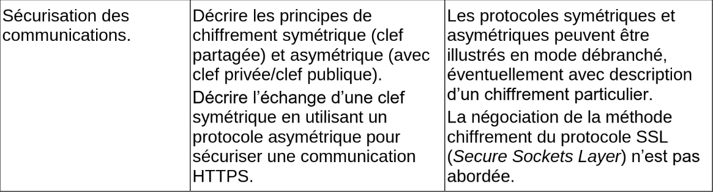

<p align="center">

</p>


# Cryptographie

<p align="center">

</p>

## 1. Chiffrement symétrique

### 1.1 Activité du masque jetable

On considère la variable suivante :

```python
masque = "CETTEPHRASEESTVRAIMENTTRESTRESLONGUEMAISCESTFAITEXPRES"
```

- Créer une fonction ```chiffre(message_clair, masque)``` qui chiffre ```message ``` en le XORant avec ```masque```.
- Créer une fonction ```dechiffre(message_chiffre, masque)``` qui réalise l'opération inverse.

### 1.2 Principe du chiffrement symétrique

> Dans un chiffrement symétrique, c'est **la même clé** qui va servir au chiffrement et au déchiffrement.


<p align="center">
 
</p>


#### Qu'appelle-t-on une clé ?
La clé est un renseignement permettant de chiffrer ou déchiffrer un message. Cela peut être :
- un nombre (dans un simple décalage des lettres de l'alphabet, comme [le chiffre de César](https://fr.wikipedia.org/wiki/Chiffrement_par_d%C3%A9calage))
- une phrase (dans la méthode du [masque jetable](https://fr.wikipedia.org/wiki/Masque_jetable))
- une image (imaginez un chiffrement où on effectue un XOR par les pixels d'une image, comme dans [cette énigme](https://github.com/glassus/nsi/blob/master/Premiere/DM/DM1/enonce.md))

Un chiffrement est dit symétrique lorsque la connaissance de la clé ayant servi au chiffrement permet de déchiffrer le message. Par exemple, Alice chiffre son message en décalant les lettres de 3 rangs vers la droite dans l'alphabet, Bob saura qu'il doit les décaler de 3 rangs vers la gauche pour retrouver le message initial.

#### Quel est l'avantage d'un chiffrement symétrique ?
Les chiffrements symétriques sont souvent rapides, consommant peu de ressources et donc adaptés au chiffrement de flux important d'informations.

Comme nous le verrons, la sécurisation des données transitant par le protocole ```https``` est basée sur un chiffrement symétrique.

#### Quel est l'inconvénient d'un chiffrement symétrique ?
La clé ! Si Alice et Bob ont besoin d'utiliser un chiffrement pour se parler, comment peuvent-ils échanger leurs clés  puisque leur canal de transmission n'est pas sûr ?

Le chiffrement symétrique impose qu'Alice et Bob aient pu se rencontrer physiquement au préalable pour convenir d'une clé secrète, ou bien qu'ils aient réussi à établir une connexion sécurisée pour s'échanger cette clé.

#### Un chiffrement symétrique est-il un chiffrement de mauvaise qualité ?
Pas du tout ! S'il est associé naturellement à des chiffrements simples et faibles (comme le décalage de César), un chiffrement symétrique peut être très robuste... voire inviolable.

C'est le cas du masque jetable. Si le masque avec lequel on effectue le XOR sur le message est aussi long que le message, alors il est **impossible** de retrouver le message initial. Pourquoi ?

Imaginons qu'Alice veuille transmettre le message clair "LUNDI".
Elle le chiffre avec un masque jetable (que connait aussi Bob), et Bob reçoit donc "KHZOK". 
Si Marc a intercepté le message "KHZOK", *même s'il sait que la méthode de chiffrement utilisée est celle du masque jetable* (principe de Kerckhoffs), il n'a pas d'autre choix que de tester tous les masques de 5 lettres possibles.
Ce qui lui donne 26^5 possibilités (plus de 11 millions) pour le masque, et par conséquent (propriété de bijectivité du XOR) 26^5 possibilités pour le message «déchiffré»...

Cela signifie que Marc verra apparaître, dans sa tentative de déchiffrage, les mots "MARDI", "JEUDI", "JOUDI", "STYLO", "FSDJK", "LUNDI, "LUNDA"... 
Il n'a aucune possibilité de savoir où est le bon message original parmi toutes les propositions (on parle de *sécurité sémantique*).


> Principe de Kerckhoffs : la sécurité d'un système de chiffrement ne doit reposer que sur la sécurité de la clé, et non pas sur la connaissance de l'algorithme de chiffrement. Cet algorithme peut même être public (ce qui est pratiquement toujours le cas).


#### Quels sont les chiffrements symétriques modernes ?
L'algorithme de chiffrement symétrique le plus utilisé actuellement est le chiffrement [AES](https://fr.wikipedia.org/wiki/Advanced_Encryption_Standard), pour Advanced Encryption Standard.
- chiffrement par bloc de 128 bits, répartis dans une matrice de 16 octets (matrice carrée de taille 4).
- ces 128 bits sont transformés par des rotations, multiplications, transpositions, [...] de la matrice initiale, en faisant intervenir dans ces transformations une clé de 128, 192 ou 256 bits.
- pour l'AES-256 (avec une clé de 256 bits), l'attaque par force brute nécessiterait 2^256 opérations, soit un nombre à 78 chiffres...
- il n'existe pas d'attaque connue efficace à ce jour. Les seules attaques sont des attaques sur des faiblesses d'implémentation, ou par [canal auxiliaire](https://fr.wikipedia.org/wiki/Attaque_par_canal_auxiliaire).


## 2. Chiffrement asymétrique

Inventé par Whitfield Diffie et Martin Hellman en 1976, le chiffrement asymétrique vient résoudre l'inconvénient essentiel du chiffrement symétrique : le nécessaire partage d'un secret (la clé) avant l'établissement de la communication sécurisée.

### 2.1 Principe du chiffrement asymétrique

Le principe de base est l'existence d'une **clé publique**, appelée à être distribuée largement, et d'une **clé privée**, qui ne quitte jamais son propriétaire. 

<p align="center">
 
</p>


### 2.2 Le rôle interchangeable des clés publiques et privées

L'illustration précédente associe :
- une image de cadenas à la clé publique (car on s'en sert pour chiffrer les messages)
- une image de clé à la clé privée (car on s'en sert pour déchiffrer les messages)

Concrètement, (nous le verrons dans l'applciation par le chiffrement RSA), la clé privée et la clé publique sont **deux nombres** aux rôles identiques. Appelons-les A et B :
- il est impossible de trouver A en fonction de B. Réciproquement, si on connaît A, il est impossible d'en déduire B.
- si on chiffre un message avec A, on peut le déchiffrer avec B. Réciproquement, si on chiffre avec B, on peut déchiffrer le message grâce à A.
- on peut donc chiffrer avec une clé publique et déchiffrer avec la clé privée associée (ce qui est fait dans l'exemple précédent). Mais on peut aussi chiffrer avec la clé privée, et déchiffrer avec la clé publique associée.

A et B ont donc des rôles interchangeables (chacun peut être un cadenas, chacun peut être une clé), et ce n'est qu'en connaissant A **et** B qu'on peut déchiffrer le message.

Nous allons donc maintenant adopter une nouvelle convention infographique :

- Considérons ce message :
<p align="center">
 
</p>

- Si ce message est chiffré avec la clé publique d'Alice, le message sera :
<p align="center">
 
</p>

- Si on déchiffre ce message avec la clé privée d'Alice, il deviendra
<p align="center">
 
</p>
et donc
<p align="center">
 
</p>

puisque l'application de la clé privée sur la clé publique, ou bien de la clé publique sur la clé privée, permet de retrouver le message en clair.

De manière graphique, la connaissance des deux moitiés du disque qui s'assemblent permet de les faire disparaitre, qu'importe qu'on ait commencé par chiffrer avec la clé publique ou avec la clé privée.
<p align="center">
 
</p>

### 2.3 Communication authentifiée.

Dans la situation du 2.1, Alice (qui a distribué largement sa clé publique) ne peut pas s'assurer que le message vient bien de Bob. Il peut avoir été créé par Marc, qui signe «Bob» et usurpe ainsi son identité. 

Le protocole que nous allons décrire ci-dessous permet :
- d'empêcher qu'un message intercepté soit déchiffré (ce qui était déjà le cas dans le 2.1)
- mais aussi de s'assurer que chaque personne est bien celle qu'elle prétend être : on résout le **problème d'authentification**.

<p align="center">
 
</p>

**En résumé :**
- Alice est sûre que seul Bob pourra déchiffrer le message qu'elle envoie.
- Bob est sûr que le message qu'il reçoit vient bien d'Alice.

### 2.3 Un exemple de chiffrement asymétrique : le chiffrement RSA

Lorsqu'en 1976 Diffie et Hellman présentent le concept de chiffrement asymétrique (souvent appelé _cryptographie à clés publiques_), ils en proposent uniquement un modèle théorique, n'ayant pas trouvé une réelle implémentation de leur protocole.

Trois chercheurs du MIT (Boston), Ron **R**ivest, Adi **S**hamir et Len **A**dleman se penchent alors sur ce protocole, convaincus qu'il est en effet impossible d'en trouver une implémentation pratique. En 1977, au cours de leurs recherches, ils démontrent en fait l'inverse de ce qu'ils cherchaient : ils créent le premier protocole concret de chiffrement asymétrique : le chiffrement **RSA**.

<p align="center">
 
</p>

Le chiffrement RSA est basé sur *l'arithmétique modulaire*. Faire des calculs *modulo* un entier *n*, c'est ne garder que le reste de la division euclidienne par *n*.

Le fait que 15 soit égal à 1 modulo 7 (car 15=2*7+1) s'écrira 15 ≡ 1 [7].

De même, 10 ≡  3 [7], 25 ≡ 4 [7], 32 ≡ 2 [10], etc.


##### Étape 1
Alice choisit 2 grands nombres premiers *p* et *q*. Dans la réalité ces nombres seront vraiment très grands (plus de 100 chiffres). Dans notre exemple, nous prendrons *p = 3* et *q = 11*.

##### Étape 2
Alice multiplie ces deux nombres *p* et *q* et obtient ainsi un nombre *n*.
>Il est très facile pour Alice de calculer *n* en connaissant *p* et *q*, mais il  extrêmement difficile pour Marc de faire le travail inverse : trouver *p* et *q* en connaissant *n* prend un temps exponentiel avec la taille de *n*.  
C'est sur cette difficulté (appelée difficulté de *factorisation*) que repose la robustesse du système RSA.

##### Étape 3
Alice choisit un nombre *e* qui doit être premier avec *(p-1)(q-1)*.  On note *φ(n)* le nombre *(p-1)(q-1)*.

Dans notre exemple, *(p-1)(q-1) = 20*, Alice choisit donc *e = 3*. (mais elle aurait pu aussi choisir 7, 9, 13...).

Le couple **(e, n)** sera **la clé publique** d'Alice. Elle la diffuse à qui veut lui écrire.

Dans notre exemple, la clé publique d'Alice est *(3, 33)*.

##### Étape 4
Alice calcule maintenant sa clé privée : elle doit trouver un nombre *d* qui vérifie l'égalité *e.d ≡ 1 [φ(n)]*.

Dans notre exemple, comme *7 x 3  ≡ 1 [20]*, ce nombre *d* est égal à 7.

En pratique, il existe un algorithme simple (algorithme d'[Euclide étendu](https://fr.wikipedia.org/wiki/Algorithme_d%27Euclide_%C3%A9tendu)) pour trouver cette valeur *d*, appelée *inverse de e*.

Le couple **(d, n)** sera **la clé privée** d'Alice. Elle ne la diffuse à personne.

Dans notre exemple, la clé privée d'Alice est *(7, 33)*.

##### Étape 5
Supposons que Bob veuille écrire à Alice pour lui envoyer le nombre 4. 
Il possède la clé publique d'Alice, qui est *(3, 33)*.

Il calcule donc 4**3 modulo 33, qui vaut 31. C'est cette valeur 31 qu'il transmet à Alice.

> Si Marc intercepte cette valeur 31, même en connaissant la clé publique d'Alice (3,33), il ne peut pas résoudre l'équation x**3 ≡ 31 [33] de manière efficace.

##### Étape 6
Alice reçoit la valeur 31.  
Il lui suffit alors d'élever 31 à la puissance 7 (sa clé privée), et de calculer le reste modulo 33 :

31**7 = 27512614111

27512614111 ≡ 4 [33]

Elle récupère la valeur 4, qui est bien le message original de Bob.

> **Comment ça marche ?**
Grâce au [Petit Théorème de Fermat](https://fr.wikipedia.org/wiki/Petit_th%C3%A9or%C3%A8me_de_Fermat), on démontre (voir [ici](https://fr.wikipedia.org/wiki/Chiffrement_RSA)) assez facilement que M**ed ≡ M [n].

Il faut remarquer que M **ed = M **de. On voit que les rôles de la clé publique et de la clé privée sont symétriques : un message chiffré avec la clé publique se déchiffrera en le chiffrant avec la clé privée, tout comme un message chiffré avec la clé privée se déchiffrera en le chiffrant avec la clé publique.

**Animation interactive**
voir https://animations.interstices.info/interstices-rsa/rsa.html


#### RSA, un système inviolable ?
Le chiffrement RSA a des défauts (notamment une grande consommation des ressources, due à la manipulation de très grands nombres).
Mais le choix d'une clé publique de grande taille (actuellement 1024 ou 2048 bits) le rend pour l'instant inviolable. 

Actuellement, il n'existe pas d'algorithme efficace pour factoriser un nombre ayant plusieurs centaines de chiffres.

Deux évènements pourraient faire s'écrouler la sécurité du RSA :
- la découverte d'un algorithme efficace de factorisation, capable de tourner sur les ordinateurs actuels. Cette annonce est régulièrement faite, et tout aussi régulièrement contredite par la communauté scientifique. (voir, le 05/03/2021,  [https://www.schneier.com/blog/archives/2021/03/no-rsa-is-not-broken.html](https://www.schneier.com/blog/archives/2021/03/no-rsa-is-not-broken.html))
- l'avènement d'[ordinateurs quantiques](https://fr.wikipedia.org/wiki/Calculateur_quantique), dont la vitesse d'exécution permettrait une factorisation rapide. Il est à noter que l'algorithme de factorisation destiné à tourner sur un ordinateur quantique existe déjà : [l'algorithme de Schor](https://fr.wikipedia.org/wiki/Algorithme_de_Shor).

## 3. HTTPS : exemple d'utilisation conjointe d'un chiffrement asymétrique et d'un chiffrement symétrique.

 ### 3.1 Principe général
Aujourd'hui, plus de 90 % du trafic sur internet est chiffré : les données ne transitent plus en clair (protocole ```http```) mais de manière chiffrée (protocole ```https```), ce qui empêche la lecture de paquets éventuellements interceptés.


Le protocole ```https``` est la réunion de deux protocoles :
-  le protocole ```TLS``` (Transport Layer Security, qui a succédé au SSL) : ce protocole, basé sur du **chiffrement asymétrique**, va conduire à la génération d'une clé identique chez le client et chez le serveur.
- le (bon vieux) protocole  ```http```, mais qui convoiera maintenant des données chiffrées avec la clé générée à l'étape précédente. Les données peuvent toujours être interceptées, mais sont illisibles. Le **chiffrement symétrique** utilisé est actuellement le chiffrement AES.

**Pourquoi ne pas utiliser que le chiffrement asymétrique, RSA par exemple ?**
Car il est très gourmand en ressources ! Le chiffrement/déchiffrement doit être rapide pour ne pas ralentir les communications ou l'exploitation des données.
Le chiffrement asymétrique est donc réservé à l'échange de clés (au début de la communication).
Le chiffrement symétrique, bien plus rapide, prend ensuite le relais pour l'ensemble de la communication.


<p align="center">
 
</p>


 ### 3.2 (HP) Fonctionnement du TLS : explication du *handshake*

 Observons en détail le fonctionnement du protocole ```TLS```, dont le rôle est de générer de manière sécurisée une clé dont disposeront à la fois le client et le serveur, leur permettant ainsi d'appliquer un chiffrement symétrique à leurs échanges.

<p align="center">
 
</p>

- **étape 1** : le «client Hello». Le client envoie sa version de TLS utilisée. 

- **étape 2** : le «server Hello». Le serveur répond en renvoyant son certificat prouvant son identité, ainsi que sa clé publique.

- **étape 3** : le client interroge l'autorité de certification pour valider le fait que le certificat est bien valide et que le serveur est bien celui qu'il prétend être. Cette vérification est faite grâce à un mécanisme de chiffrement asymétrique.

> La présentation du certificat à l'autorité de certification peut se représenter comme le scan d'une pièce d'identité dans un aéroport. L'autorité de certification est alors l'État (dont la base de données est interrogée par un logiciel) qui valide que la pièce d'identité est bien un document officiel.


- **étape 4** : une fois vérifiée l'authenfication du serveur et que son certificat est valide, le client calcule ce qui sera la future clé de chiffrement symétrique (appelée «clé AES» dans l'infographie). Cette clé est chiffrée avec la clé publique du server (transmise à l'étape 1), ce qui assure la sécurité de son transfert. Le serveur déchiffre cette clé grâce à sa clé privée, et dispose ainsi lui aussi de la clé. 

Le transmission par protocole ```http``` de données chiffrées au préalable avec la clé AES peut commencer. 

>Remarque : en réalité, ce n'est pas la clé AES qui est transmise à l'étape 4, mais un nombre choisi par le client, qui permettra, avec deux autres nombres choisis par le client (étape 1) et le serveur (étape 2) de reconstituer la clé AES, qui sera donc identique côté client et côté serveur.


---
## Bibliographie
- Numérique et Sciences Informatiques, Terminale, T. BALABONSKI, S. CONCHON, J.-C. FILLIATRE, K. NGUYEN, éditions ELLIPSES.
- Prépabac NSI, Terminale, G. CONNAN, V. PETROV, G. ROZSAVOLGYI, L. SIGNAC, éditions HATIER.
- https://www.cloudflare.com/fr-fr/learning/ssl/what-happens-in-a-tls-handshake/


---

 G.Lassus, Lycée François Mauriac --  Bordeaux  
