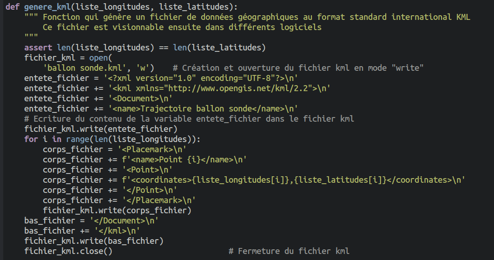

# Épreuve Pratique BNS 2026

Vous pouvez retrouver ici les sujets  publiés le 26/03/2026.

!!! example "Sujet 1"
    - [Sujet](data/EP_sujets0_3/EP-BAC-NSI-Sujet3.pdf){. target="_blank"}
    - [rle.py](data/EP_sujets0_3/rle.py){. target="_blank"}
    - [bac_nsi_32.png](data/EP_sujets0_3/bac_nsi_32.png){. target="_blank"}
    - [bac_nsi_256.png](data/EP_sujets0_3/bac_nsi_256.png){. target="_blank"}
    

    {{
    correction(True,
    """
    ??? success \"Correction **Q1**\" 
        Si la liste originale est ```[3, 5, 0, 6]```, la liste obtenue par codage RLE est ```[1, 3, 1, 5, 1, 0, 1, 6]```, qui est 2 fois plus longue. Donc non, la liste obtenue par codage RLE n'est pas forcément de longueur inférieure ou égale.  
    """
    )
    }}

    {{
    correction(True,
    """
    ??? success \"Correction **Q2**\" 
        ```python
        def decodage_rle(liste_rle):
            '''Renvoie la liste d'octets obtenue à partir de la liste liste_rle obtenue
            par compression RLE'''
            lst = []
            for i in range(0, len(liste_rle), 2):
                for k in range(liste_rle[i]):
                    lst.append(liste_rle[i+1])
            return lst

        def test_codage():
            assert codage_rle([255, 255, 0, 255, 255, 255]) == [2, 255, 1, 0, 3, 255]
            assert decodage_rle([2, 255, 1, 0, 3, 255]) == [255, 255, 0, 255, 255, 255]
            assert decodage_rle([4, 85]) == [85, 85, 85, 85]
            assert decodage_rle([1, 9, 1, 250, 1, 128]) == [9, 250, 128]
            assert decodage_rle([1, 0]) == [0]
        ```
    """
    )
    }}

    {{
    correction(True,
    """
    ??? success \"Correction **Q3**\" 
        On constate que, si tout se passe bien pour l'image ```bac_nsi_32.png```, l'image ```bac_nsi_256.png.dec.png``` obtenue après encodage/décodage de l'image ```bac_nsi_256.png``` présente un décalage de l'écriture.
    """
    )
    }}


    {{
    correction(True,
    """
    ??? success \"Correction **Q4**\" 
        Il faut modifier la fonction ```codage_rle``` pour faire en sorte qu'elle prenne en compte les valeurs dont le nombre dépasse 255. Il suffit de faire plusieurs «paquets» de 255 de cette valeur.
        ```python
        def codage_rle(liste_octets):
            '''Renvoie une liste d'octets obtenue par compression RLE'''
            liste_rle = []
            i = 0
            while i < len(liste_octets):
                c = liste_octets[i]
                k = 1
                while i+k < len(liste_octets) and liste_octets[i+k] == c:
                    k += 1
                q = k // 255
                r = k % 255
                for _ in range(q):
                    liste_rle.append(255)
                    liste_rle.append(c)
                if r != 0:
                    liste_rle.append(r)
                    liste_rle.append(c)
                i += k
            return liste_rle
        ```

        Autre solution (plus simple !) proposée par Franck Chambon :
        ```python
        def codage_rle(liste_octets):
            '''Renvoie une liste d'octets obtenue par compression RLE'''
            liste_rle = []
            i = 0
            while i < len(liste_octets):
                c = liste_octets[i]
                k = 1
                while i+k < len(liste_octets) and liste_octets[i+k] == c and k < 255:
                    k += 1
                liste_rle.append(k)
                liste_rle.append(c)
                i += k
            return liste_rle
        ```


    """
    )
    }}


!!! example "Sujet 2"
    - [Sujet](data/EP_sujets0_2/EP-BAC-NSI-Sujet2.pdf){. target="_blank"}
    - [analyse.py](data/EP_sujets0_2/analyse.py){. target="_blank"}
    - [donnees.py](data/EP_sujets0_2/donnees.py){. target="_blank"}
    - [donnees_completes.py](data/EP_sujets0_2/donnees_completes.py){. target="_blank"}

    {{
    correction(True,
    """
    ??? success \"Correction **Q1**\" 
        ```python
        def salaire_moyen_condition(employes, champ, valeur):
            '''Renvoie le salaire moyen des employes ayant val comme valeur associée
            au champ donné en argument.
            Si le nombre d'employés considéré est nul, cette fonction renvoie None'''
            s = 0
            n = 0
            for employe in employes:
                if employe[champ] == valeur:
                    s += employe['salaire']
                    n += 1
            if n == 0:
                return None
            return s/n
        ```
    """
    )
    }}

    {{
    correction(True,
    """
    ??? success \"Correction **Q2**\" 
        ```python
        def effectif_par_sexe(employes):
            nf, nh = 0, 0
            for employe in employes:
                if employe['sexe'] == 'F':
                    nf += 1
                else:
                    nh += 1
            return {'F':nf, 'M':nh}
        ```
    """
    )
    }}

    {{
    correction(True,
    """
    ??? success \"Correction **Q3**\" 
        - Le calcul de ```moy_f``` va renvoyer une erreur car ```employes``` est mis entre guillements.
        - De plus, le calcul final est faux puisqu'il fait simplement la différence entre ```moy_h``` et ```moy_f```.

        ```python
        def calcul_ecart_sexe(employes):
            '''Renvoie l'écart de salaire en pourcentage pour les femmes 
            par rapport aux hommes'''
            if effectif_par_sexe(employes)['F'] == 0 or effectif_par_sexe(employes)['M'] == 0:
                return None
            moy_h = salaire_moyen_condition(employes, 'sexe', 'M')
            moy_f = salaire_moyen_condition(employes, 'sexe', 'F')
            return (moy_h - moy_f) / moy_h * 100

        def test_calcul_ecart_sexe():
            assert calcul_ecart_sexe([{'experience': 5, 'etudes': 3, 'sexe': 'F', 'salaire': 2400}]) == None
            assert calcul_ecart_sexe(donnees.employes) >= 0 and calcul_ecart_sexe(donnees.employes) <= 100


        ```
        Avec les données complètes, cet écart est d'environ 8,6%.

    """
    )
    }}


    {{
    correction(True,
    """
    ??? success \"Correction **Q4**\" 
        ```python
        >>> salaire_par_proximite(donnees_completes.employes, {'experience': 3, 'etudes': 3, 'sexe': 'F'})
        2229.6666666666665
        >>> salaire_par_proximite(donnees_completes.employes, {'experience': 3, 'etudes': 3, 'sexe': 'M'})
        2406.0
        ``` 
        Il y a un problème dans le code dans le calcul de la distance. En effet, si deux personnes sont de sexe différent, leur distance sera augmentée de 4 par rapport à si elles étaient de même sexe. Ceci n'a pas de raison d'être alors qu'on cherche justement à mesurer les écarts selon le sexe.

        Une bonne fonction ```distance```  serait donc :
        ```python
        def distance(e1, e2):
            '''Renvoie la mesure de distance entre deux personnes.'''
            s = 0
            s = s + (e1['experience'] - e2['experience'])**2
            s = s + (e1['etudes'] - e2['etudes'])**2
            return sqrt(s)
        ```

        

    """
    )
    }}


!!! example "Sujet 3"

    - [Sujet](data/EP_sujets0_1/EP-BAC-NSI-Sujet1.pdf){. target="_blank"}
    - [cycle_menstruel.py](data/EP_sujets0_1/cycle_menstruel.py){. target="_blank"}

    {{
    correction(True,
    """
    ??? success \"Correction **Q1**\" 
        ```python
        def est_bissextile(n):
            if n % 400 == 0:
                return True
            elif n % 4 == 0 and n % 100 != 0:
                return True
            else:
                return False
        ```
    """
    )
    }}

    {{
    correction(True,
    """
    ??? success \"Correction **Q2**\" 
        ```python
        def determiner_phase(n):
            assert n <= 28 and n >= 1
            if n <= 5:
                return 1
            elif n <= 13:
                return 2
            elif n == 14:
                return 3
            else:
                return 4
        ```
    """
    )
    }}

    {{
    correction(True,
    """
    ??? success \"Correction **Q3**\" 
        ```python
        def test_ajouter_jours():
            assert ajouter_jours((7, 9, 2025), 3) == (10, 9, 2025)

            assert ajouter_jours((29, 8, 2025), 3) == (1, 9, 2025)
            #pour tester le changement de mois sur un mois à 31 jours

            assert ajouter_jours((29, 9, 2025), 3) == (2, 10, 2025)
            #pour tester le changement de mois sur un mois à 30 jours

            assert ajouter_jours((31, 12, 2025), 1) == (1, 1, 2026)
            #pour tester un changement d'année

            assert ajouter_jours((28, 2, 2024), 3) == (2, 3, 2024)
            #pour tester le changement de mois sur une année bissextile

            assert ajouter_jours((28, 2, 2025), 3) == (3, 3, 2025)
            #pour tester le changement de mois sur une année non-bissextile
        ```
    """
    )
    }}


    {{
    correction(True,
    """
    ??? success \"Correction **Q4**\" 
        L'erreur qui apparait 
        ```python
         datetime(
        ValueError: month must be in 1..12
        ``` 
        semble nous indiquer que la date n'est pas au bon format.
        
        En effet la documentation de ```iCalendar``` nous dit que la date doit être écrite au format ```AAAAMMJJ```.

        Or, la ligne de code
        ```python
        date = str(annee)+str(mois) +str(jour)
        ``` 
        va produire 202535 pour le 05 mars 2025, au lieu de 20250305.

        Pour résoudre ce problème, il faut remplacer cette ligne par :
        ```python
        date = str(annee)+'{:02d}'.format(mois) + '{:02d}'.format(jour)
        ```

        *Remarque : le formatage des chaînes de caractères n'est pas au programme...*


    """
    )
    }}


!!! example "sujet 4"
    - [Sujet](data2026/26_BCG_NSI_4/sujet.pdf){. target="_blank"}
    - [culture.py](data2026/26_BCG_NSI_4/culture.py){. target="_blank"}
    - [plantes.py](data2026/26_BCG_NSI_4/plantes.py){. target="_blank"}
    - [mesures.py](data2026/26_BCG_NSI_4/mesures.py){. target="_blank"}

    {{
    correction(True,
    """
    ??? success \"Correction Q1\" 
        ```python
        def croissance_moyenne(plantes):
            if plantes == []:
                return None
            s = 0
            for plante in plantes:
                s += plante.croissance
            return s / len(plantes)

        def test_croissance_moyenne():
            assert croissance_moyenne([]) == None
            assert croissance_moyenne(plantes) == 79.0
        ```
        
    """
    )
    }}

    {{
    correction(True,
    """
    ??? success \"Correction Q2\" 
        ```python
        def dictionnaire_mesure(plantes, mesures):
            d = {}
            for m in mesures:
                if m['plante'] in d:
                    d[m['plante']].append(m)
                else:
                    d[m['plante']] = [m]
            for p in plantes:
                if p.nom not in d:
                    d[p.nom] = []            
            return d

        def test_dictionnaire_mesure():
            assert dictionnaire_mesure(plantes, mesures)['Fougère'] == []
        ```
        
    """
    )
    }}   

    {{
    correction(True,
    """
    ??? success \"Correction Q3\" 
        Le problème vient de l'instruction ```remove``` qui est utilisée dans la boucle et qui modifie la liste en cours de parcours.

        Par exemple, le code :
        ```python
        lst = [11, 13, 8, 4, 11, 3]

        for k in lst:
            if k > 10:
                lst.remove(k)

        print(lst)
        ```
        renverra la liste ```[13, 8, 4, 3]``` car la suppression du 11 a créé un décalage.
        
    """
    )
    }} 

    {{
    correction(True,
    """
    ??? success \"Correction Q4\" 
        Pour éviter le problème précédent, il faut parcourir une copie de ```liste_mesures```. 
        ```python
        def purger_mesures_extremes(liste_mesures):
            '''
            Supprime de la liste toutes les mesures dont la température 
            n'est pas comprise entre 20 et 25°C inclus.
            '''
            copy_liste_mesures = liste_mesures.copy()
            for mesure in copy_liste_mesures:
                if mesure['temperature'] < 20 or mesure['temperature'] > 25:
                    liste_mesures.remove(mesure)
            return liste_mesures
        ```
        
    """
    )
    }} 


!!! example "sujet 5"
    - [Sujet](data2026/26_BCG_NSI_5/sujet.pdf){. target="_blank"}
    - [empreinte.py](data2026/26_BCG_NSI_5/empreinte.py){. target="_blank"}
    - [empreinte_ada.json](data2026/26_BCG_NSI_5/empreinte_ada.json){. target="_blank"}
    - [empreinte_ada_agr.json](data2026/26_BCG_NSI_5/empreinte_ada_agr.json){. target="_blank"}

    {{
    correction(True,
    """
    ??? success \"Correction Q1\" 
        ```python
        def total_simple(empreinte):
            '''Fonction qui renvoie l'empreinte carbone totale d'un dictionnaire associant
            une empreinte carbone à des noms de catégories'''
            d = chargement_json(empreinte)
            total = 0
            for key in d:
                total += d[key]
            return total

        def empreinte_totale_ada():
            print(total_simple('empreinte_ada_agr.json'))
        ```
        
    """
    )
    }}


    {{
    correction(True,
    """
    ??? success \"Correction Q2\" 
        ```python
        def total_rec(empreinte):
            '''Fonction récursive qui renvoie l'empreinte carbone totale représentée
            par un dictionnaire dont les valeurs peuvent aussi être des dictionnaires'''
            total = 0
            for key in empreinte:
                if not est_dictionnaire(empreinte[key]):
                    total += empreinte[key]
                else:
                    total += total_rec(empreinte[key])
            return total
        ```
        
    """
    )
    }}


    {{
    correction(True,
    """
    ??? success \"Correction Q3\" 
        *Il y a une erreur dans l'énoncé, la fonction renvoie bien ```True```.*

        Ceci dit la fonction n'est pas correcte, car sa structure récursive empêche de parcourir la totalité du dictionnaire. Si un valeur supérieure à 1000 est à la fin du dictionnaire, elle n'est pas détectée.

        Version corrigée *(code de Cédric Gouygou)*:
        ```python
        def alerte_valeur_aberrante(empreinte, limite):
            '''
            Fonction censée déterminer si au moins une valeur du dictionnaire
            dépasse strictement la limite donnée.
            '''
            valeur_aberrante = False
            for categorie, valeur in empreinte.items():
                if est_dictionnaire(valeur):
                    valeur_aberrante = valeur_aberrante or alerte_valeur_aberrante(valeur, limite)
                else:
                    if valeur > limite:
                        valeur_aberrante = True
            return valeur_aberrante
        ```

        
    """
    )
    }}

!!! example "sujet 6"
    - [Sujet](data2026/26_BCG_NSI_6/sujet.pdf){. target="_blank"}
    - [smoothie.py](data2026/26_BCG_NSI_6/smoothie.py){. target="_blank"}

    {{
    correction(True,
    """
    ??? success \"Correction Q1\" 
        ```python
        def smoothie_possible(self, nom_smoothie):
            '''Retourne True si le smoothie peut être préparé avec les fruits disponibles, False sinon.'''
            for fruit in self.db_smoothies[nom_smoothie]:
                if fruit not in self.liste_fruits_disponibles:
                    return False
            return True
        ```
        
    """
    )
    }}

    {{
    correction(True,
    """
    ??? success \"Correction Q2\" 
        ```python
        def smoothie_possible(self, nom_smoothie):
            '''Retourne True si le smoothie peut être préparé avec les fruits disponibles, False sinon.'''
            for fruit in self.db_smoothies[nom_smoothie]:
                if fruit not in self.liste_fruits_disponibles:
                    return False
            return True
        ```
        
    """
    )
    }}

    {{
    correction(True,
    """
    ??? success \"Correction Q3\" 
        ```python
        def test_score_proximité():
            b = Boutique_smoothie(['Mangue', 'Ananas', 'Banane', 'Fraise'])
            assert b.score_proximité('Tropical', 'Rouge') == 0
            assert b.score_proximité('Agrume', 'Tropical citron') == 1
            assert b.score_proximité('Tropical', 'Tropical citron') == 2
        ```
        
    """
    )
    }}

    {{
    correction(True,
    """
    ??? success \"Correction Q4\" 
        Le smoothie renvoyé par la méthode ```plus_proche_possible``` n'est pas le bon car il correspond exactement au smoothie passé en paramètre. En effet nulle part dans la fonction on teste si le smoothie n'est pas celui d'origine. Or c'est forcément lui qui aura le plus gros score car il a exactement les mêmes ingrédients.

        Correction de la fonction :

        ```python
        def plus_proche_possible(self, nom_smoothie_ref):
            '''Retourne le nom du smoothie le plus proche de nom_smoothie_ref en termes de fruits communs parmi les smoothies possibles.
            En cas d'égalité, retourne le premier trouvé.
            '''
            max_communs = 0
            smoothie_proche = None
            for nom_smoothie in self.db_smoothies:
                if nom_smoothie == nom_smoothie_ref:
                    continue
                nb_communs = self.score_proximité(nom_smoothie_ref, nom_smoothie)
                if nb_communs > max_communs:
                    max_communs = nb_communs
                    smoothie_proche = nom_smoothie
            return smoothie_proche
        ```
        
        *À noter que la fonction ```test_plus_proche_possible``` présente une erreur. Le deuxième assert devrait être ```Exotique rouge``` et non pas ```None```.*  

    """
    )
    }}

    {{
    correction(True,
    """
    ??? success \"Correction Q5\" 
        ```python
        boutique = Boutique_smoothie(['Mangue', 'Ananas', 'Banane', 'Fraise', 'Citron', 'Kiwi', 'Pomme verte'])
        boutique.affichage_possibles()
        ```
        
    """
    )
    }}


!!! example "sujet 7"
    - [Sujet](data2026/26_BCG_NSI_7/sujet.pdf){. target="_blank"}
    - [coccinnelles.py](data2026/26_BCG_NSI_7/coccinnelles.py){. target="_blank"}


    {{
    correction(True,
    """
    ??? success \"Correction Q1\" 
        ```python
        c1 = Coccinelle('femelle', 10, 2)
        c2 = Coccinelle('femelle', 10, 2)
        c3 = Coccinelle('male', 10, 2)
        cocci = [c1, c2, c3]
        proies = 200
        for k in range(5):
            cocci, proies = evolution(cocci, proies)
            print('jour : ', k+1)
            print('nombre de coccinelles :', len(cocci))
            print('nombre de proies :', proies)
            print('-------------')
        ```
        
    """
    )
    }}


    {{
    correction(True,
    """
    ??? success \"Correction Q2\" 
        ```python
        def simulation_simple(population, nb_proies):
            for k in range(30):
                population, nb_proies = evolution(population, nb_proies)
                if len(population) == 0:
                    return (len(population), nb_proies, k+1)
                if nb_proies == 0:
                    return (len(population), nb_proies, k+1)
            return (len(population), nb_proies, k+1)
        ```
        Lorsqu'on exécute ce code avec les 3 coccinelles précédentes et 1000 pucerons, il renvoie :
        ```python
        (63, 0, 10)
        ```
        Ce qui signifie qu'au bout de 10 jours, il y 63 coccinelles mais plus aucun puceron.


    """
    )
    }}

    {{
    correction(True,
    """
    ??? success \"Correction Q3\" 
        ```python
        def chasser(self, nb_proies, nb_coccinelles):
            '''
            renvoie le nombre de pucerons une fois chassés par les coccinelles,
            suivant leur nombre de départ et le nombre de coccinelles

            '''

            # s'il n'y a aucune coccinelles, le nombre de pucerons est inchangé
            if nb_coccinelles == 0:
                return nb_proies

            # calcul du nombre de pucerons par coccinelle
            proies_par_cocci = nb_proies / nb_coccinelles

            # le nombre de pucerons mangés est différent suivant
            # le nombre de pucerons par coccinelle
            if proies_par_cocci > 20:
                consomme = random.randint(12, 20)

            elif proies_par_cocci > 10:
                consomme = random.randint(8, 15)

            else:
                consomme = random.randint(3, 8)

            consomme = min(consomme, nb_proies)

            # calcul du nouvau niveau de nutrition suivant le nombre
            # de pucerons mangés
            if consomme >= 10:
                self.niv_nutrition += 1
            else:
                self.niv_nutrition = max(0, self.niv_nutrition - 1)

            # on renvoie le nouveau nombre de pucerons
            return nb_proies - consomme
        ```
       


    """
    )
    }}

    {{
    correction(True,
    """
    ??? success \"Correction Q4\" 
        Modification de la méthode ```reproduction``` : 
        ```python linenums='1' hl_lines='6 7'
        def reproduction(self):
            '''
            Une femelle avec un niveau de nutrition >= 2 engendre exactement
            deux descendants : un mâle et une femelle.
            '''
            if self.age < 20:
                return []

            descendants = []
            if self.sexe == 'femelle' and self.niv_nutrition >= 2:
                descendants.append(Coccinelle('male', 0, 0))
                descendants.append(Coccinelle('femelle', 0, 0))
                self.niv_nutrition = 0

            return descendants
        ```

        Modification de la méthode ```a_survecu``` : 
        ```python linenums='1' hl_lines='5-9'
        def a_survecu(self):
            '''
            Met à jour l'âge de la coccinelle et indique si elle est encore en vie.
            '''
            if self.niv_nutrition == 0:
                r = random.randint(1,3)
                if r == 1:
                    return False

            self.age = self.age + 1
            return self.age < self.esperance_de_vie
        ```
        
        Lorsqu'on refait les tests de la question 2, on s'aperçoit qu'au bout de 30 jours, le nombre de coccinelles est de 51. Par contre, le nombre de pucerons est aux environs de 120 000.

    """
    )
    }}


!!! example "sujet 8"
    - [Sujet](data2026/26_BCG_NSI_8/sujet.pdf){. target="_blank"}
    - [addition_BCD.py](data2026/26_BCG_NSI_8/addition_BCD.py){. target="_blank"}

    {{
    correction(True,
    """
    ??? success \"Correction Q1\" 
        ```python
        def calcul_recettes():
            recette = 0
            for k in range(1000):
                for j in range(500):
                    recette += 2.27 + 5.19 + 1.81
            return recette
        ```
        L'exécution de cette fonction donne ```4634999.999986519```, et non pas ```4635000```. Le problème est dû à la représentation des flottants. 

    """
    )
    }}

    {{
    correction(True,
    """
    ??? success \"Correction Q2\" 
        ```python
        def convertir_BCD_vers_decimal(liste_quartets):
            part_entiere = ''
            for i in range(len(liste_quartets)-2):
                part_entiere += str(int(liste_quartets[i], 2))
            part_decimale = ''
            for i in range(len(liste_quartets)-2, len(liste_quartets)):
                part_decimale += str(int(liste_quartets[i], 2))
            partie_entiere = int(part_entiere)
            partie_decimale = int(part_decimale)/10**len(part_decimale)
            return partie_entiere + partie_decimale

        assert convertir_BCD_vers_decimal(['0001','0011', '0101', '0110']) == 13.56
        ```
        

    """
    )
    }}

    {{
    correction(True,
    """
    ??? success \"Correction Q3\" 

        Il rajouter la ligne 20 pour corriger les dépassements éventuels.
        ```python linenums='1' hl_lines='20'
        def additionner_nombres_format_BCD(a, b):
            '''
            Additionne deux nombres au format BCD, quartet par quartet.
            '''
            liste_quartets1 = convertir_dec_vers_BCD(a)
            liste_quartets2 = convertir_dec_vers_BCD(b)

            # Ajustement de la longueur
            liste_quartets1, liste_quartets2 = aligner_quartets(liste_quartets1, liste_quartets2)

            retenue = 0
            resultat = []
            longueur_max = max(len(liste_quartets1), len(liste_quartets2)) 

            for i in range(longueur_max):
                index = longueur_max - i - 1

                # Addition binaire simple des quartets
                somme, retenue = additionner_binaire_quartets(liste_quartets1[index], liste_quartets2[index], retenue)
                somme, retenue = corriger_BCD(somme, retenue)
                resultat.insert(0, somme) 

            # Gestion de la dernière retenue éventuelle
            if retenue == 1:
                resultat.insert(0, '0001')

            return resultat
        ```
        

    """
    )
    }}

    {{
    correction(True,
    """
    ??? success \"Correction Q4\" 
        ```python
        def aligner_quartets(q1: list, q2: list) -> tuple:
            '''
            Doit équilibrer les deux listes en ajoutant des '0000' à gauche 
            de la liste la plus courte.
            '''
            n1 = len(q1)
            n2 = len(q2)
            if n1 >= n2:
                while len(q1) != len(q2):
                    q2.insert(0, '0000')
            else:
                while len(q1) != len(q2):
                    q1.insert(0, '0000')   
            return q1, q2
        ```
        

    """
    )
    }}


!!! example "sujet 9"
    - [Sujet](data2026/26_BCG_NSI_9/sujet.pdf){. target="_blank"}
    - [Face.py](data2026/26_BCG_NSI_9/Face.py){. target="_blank"}
    - [Objet3D.py](data2026/26_BCG_NSI_9/Objet3D.py){. target="_blank"}
    - [Sommet.py](data2026/26_BCG_NSI_9/Sommet.py){. target="_blank"}
    - [main.py](data2026/26_BCG_NSI_9/main.py){. target="_blank"}

    {{
    correction(True,
    """
    ??? success \"Correction Q1\" 
        ```python
        def distance(self, sommet):
            '''
            renvoie la distance de l'objet à sommet
            '''
            return math.sqrt((self.x-sommet.x)**2 + (self.y-sommet.y)**2 + (self.y-sommet.y)**2)
        ```

    """
    )
    }}

    {{
    correction(True,
    """
    ??? success \"Correction Q2\" 
        ```python
        def trouver_sommets_adjacents(self):
            for s1 in self.sommets:
                for s2 in self.sommets:
                    if s1.est_adjacent(s2):
                        return (s1, s2)
            return None
        ```

    """
    )
    }}

    {{
    correction(True,
    """
    ??? success \"Correction Q3\" 
        ```python
        def estimation_impression(volume, parametres_imprimante):
            vol_impression = volume * parametres_imprimante['remplissage']
            return vol_impression / parametres_imprimante['vitesse_extrusion']
        ```

    """
    )
    }}

    {{
    correction(True,
    """
    ??? success \"Correction Q4\" 
        À mettre dans le fichier ```main.py``` : 
        ```python
        objet.ajouter_sommet(0, 0, 0)
        objet.ajouter_sommet(0, 2, 0)
        objet.ajouter_sommet(2, 2, 0)
        objet.ajouter_sommet(2, 0, 0)
        objet.ajouter_sommet(1, 1, 2)
        objet.ajouter_face([1, 2, 3, 4])
        objet.ajouter_face([1, 2, 5])
        objet.ajouter_face([2, 3, 5])
        objet.ajouter_face([3, 4, 5])
        objet.ajouter_face([1, 4, 5])
        ```

    """
    )
    }}

    {{
    correction(True,
    """
    ??? success \"Correction Q5\" 
        ```python
        def transformer(self, rapport):
            '''
            Applique une transformation d'échelle à l'objet 3D en modifiant directement ses sommets.
            '''
            copie_objet = Objet3D()
            copie_objet.sommets = self.sommets
            copie_objet.faces = self.faces
            copie_objet.nom = self.nom
            sommets = []
            for sommet in copie_objet.sommets:
                sommets.append(
                    Sommet(sommet.x*rapport, sommet.y*rapport, sommet.z*rapport))
            copie_objet.sommets = sommets
            return copie_objet
        ```

    """
    )
    }}


!!! example "sujet 10"
    - [Sujet](data2026/26_BCG_NSI_10/sujet.pdf){. target="_blank"}
    - [analyse_eau.py](data2026/26_BCG_NSI_10/analyse_eau.py){. target="_blank"}


    {{
    correction(True,
    """
    ??? success \"Correction Q1\" 
        ```python
        def total_conso(donnees, jour):
            total = 0
            presence_mesure = False
            for d in donnees:
                if d['jour'] == jour:
                    presence_mesure = True
                    total += d['chaude'] + d['froide']
            if presence_mesure == False:
                return None
            return total
        ```

    """
    )
    }}

    {{
    correction(True,
    """
    ??? success \"Correction Q2\" 
        ```python
        def fuite_possible(donnees, jour):
            k = 0
            for d in donnees:
                if d['jour'] == jour and '00:00' <= d['heure'] <= '05:00':
                    if d['chaude'] + d['froide'] > 0:
                        k += 1
                        if k >= 3:
                            return True
                    else:
                        k = 0
            return False
        ```

    """
    )
    }}

    {{
    correction(True,
    """
    ??? success \"Correction Q3\"
        L'erreur se situe à la ligne 14. Il faut remplacer le 2 par un 3 car la moyenne se fait sur 3 nombres. 
        ```python linenums='1' hl_lines='14'
        def lissage_conso(valeurs):
            '''
            Calcule une moyenne glissante sur les valeurs.
            Pour chaque valeur, on calcule la moyenne avec ses voisins.
            '''

            lisse = []
            for i in range(len(valeurs)):
                if i == 0:
                    m = (valeurs[i] + valeurs[i+1]) / 2
                elif i == len(valeurs)-1:
                    m = (valeurs[i-1] + valeurs[i]) / 2
                else:
                    m = (valeurs[i-1] + valeurs[i] + valeurs[i+1]) / 3
                lisse.append(m)

            return lisse
        ```

    """
    )
    }}

    {{
    correction(True,
    """
    ??? success \"Correction Q4\"
        Les autres cas limites sont les cas où la liste ```valeurs``` ne contient qu'un seul élément, ou bien aucun élément.  
        ```python
        def lissage_conso(valeurs):
            '''
            Calcule une moyenne glissante sur les valeurs.
            Pour chaque valeur, on calcule la moyenne avec ses voisins.
            '''
            if len(valeurs) == 0:
                return None
            if len(valeurs) == 1:
                return valeurs 
            lisse = []
            for i in range(len(valeurs)):
                if i == 0:
                    m = (valeurs[i] + valeurs[i+1]) / 2
                elif i == len(valeurs)-1:
                    m = (valeurs[i-1] + valeurs[i]) / 2
                else:
                    m = (valeurs[i-1] + valeurs[i] + valeurs[i+1]) / 3
                lisse.append(m)

            return lisse
        ```
        On peut maintenant compléter la fonction ```test_lissage``` :
        ```python
        def test_lissage():
            assert lissage_conso([]) == None
            assert lissage_conso([4]) == [4]
            assert lissage_conso([4, 10, 10]) == [7, 8, 10]
            print('tests passés avec succès')
        ```

    """
    )
    }}


!!! example "sujet 11"
    - [Sujet](data2026/26_BCG_NSI_11/sujet.pdf){. target="_blank"}
    - [donnees_habitats.py](data2026/26_BCG_NSI_11/donnees_habitats.py){. target="_blank"}
    - [prediction_habitat.py](data2026/26_BCG_NSI_11/prediction_habitat.py){. target="_blank"}

    {{
    correction(True,
    """
    ??? success \"Correction Q1\" 
        :warning: Pour éviter une erreur à la question 3, la clé ```presence_renard``` n'est pas prise en compte dans le calcul.
        ```python
        def distance(habitat_1, habitat_2):
            '''
            Calcule la distance euclidienne entre deux habitats.
            entrée : 
                - habitat_1 : dictionnaire représentant un habitat.
                - habitat_2 : dictionnaire représentant un autre habitat.
            sortie : 
                - float : distance euclidienne entre habitat_1 et habitat_2.
            '''
            return sqrt((habitat_1['vegetation']-habitat_2['vegetation'])**2 + (habitat_1['proximite_eau']-habitat_2['proximite_eau'])**2 + (habitat_1['densite_urbaine']-habitat_2['densite_urbaine'])**2 + (habitat_1['disponibilite_proies']-habitat_2['disponibilite_proies'])**2)  

        ```

    """
    )
    }}

    {{
    correction(True,
    """
    ??? success \"Correction Q2\" 
        ```python
        def distance_d_un_habitat(habitat, habitats):
            '''
            Calcule la distance entre un habitat et chaque habitat de la liste.
            entrée : 
                - habitat : dictionnaire représentant un habitat.
                - habitats : liste de dictionnaires représentant des habitats.
            sortie : 
                - list[tuple] : liste de tuples (distance, habitat) où distance est la distance entre habitat et chaque habitat de la liste.
            '''
            lst = []
            for hab in habitats:
                lst.append((distance(habitat, hab), hab))
            return lst
        ```

    """
    )
    }}

    {{
    correction(True,
    """
    ??? success \"Correction Q3\" 
        ```python
        >>> distance_d_un_habitat(nouveau, zones_connues)[:3]
        [(7.211102550927978, {'vegetation': 9, 'proximite_eau': 6, 'densite_urbaine': 0, 'disponibilite_proies': 4, 'presence_renard': 1}), (8.660254037844387, {'vegetation': 10, 'proximite_eau': 5, 'densite_urbaine': 9, 'disponibilite_proies': 10, 'presence_renard': 0}), (5.196152422706632, {'vegetation': 8, 'proximite_eau': 5, 'densite_urbaine': 1, 'disponibilite_proies': 6, 'presence_renard': 0})]
        ```
        On retrouve bien les valeurs indiquées dans l'énoncé.
    """
    )
    }}


    {{
    correction(True,
    """
    ??? success \"Correction Q4\"
        L'erreur se situe à la ligne 16. Il faut remplacer ```distance``` par ```caracteristiques```.
        ```python linenums='1' hl_lines='16'
        def presence_renard(k, habitat, habitats):
            '''
            Vérifie si l'habitat donné a plus de k/2 voisins avec des renards.
            entrée : 
                - k : entier représentant le nombre d'habitats à considérer.
                - habitat : dictionnaire représentant un habitat.
                - habitats : liste de dictionnaires représentant des habitats.
            sortie : 
                - bool : True si l'habitat a plus de k/2 voisins avec des renards, False sinon.
            '''
            habitats = k_plus_proches(k, habitat, habitats)
            n_renards = 0
            for habitat in habitats:
                distance = habitat[0]
                caracteristiques = habitat[1]
                if caracteristiques['presence_renard'] == 1:
                    n_renards += 1
            return n_renards > k/2
        ```

    """
    )
    }}

    {{
    correction(True,
    """
    ??? success \"Correction Q5\"
        Les différents tests de la fonction ```presence_renard``` montrent que dès que ```k``` dépasse 3, la fonction renvoie ```True```.

    """
    )
    }}


!!! example "sujet 12"
    - [Sujet](data2026/26_BCG_NSI_12/sujet.pdf){. target="_blank"}
    - [gestion_refuge.py](data2026/26_BCG_NSI_12/gestion_refuge.py){. target="_blank"}
    - [donnees_renards.csv](data2026/26_BCG_NSI_12/donnees_renards.csv){. target="_blank"}


    {{
    correction(True,
    """
    ??? success \"Correction Q1\" 
        ```python
        def __init__(self, identifiant, nom, poids, date_arrivee):
            self.identifiant = identifiant
            self.nom = nom
            self.poids = poids
            self.date_arrivee = date_arrivee
        ```

    """
    )
    }}

    {{
    correction(True,
    """
    ??? success \"Correction Q2\" 
        ```python
        def __str__(self):
            ch = 'Renard ID '
            ch += str(self.identifiant)
            ch += ' - '
            ch += self.nom
            ch += ' (Arrivé le '
            ch += self.date_arrivee
            ch += ')'
            return ch
        ```
        ```python
        >>> renard1 = Renard(200, 'Oscar', 5.1, '2026-01-01')
        >>> print(renard1)
        Renard ID 200 - Oscar (Arrivé le 2026-01-01)
        ```

    """
    )
    }}

    {{
    correction(True,
    """
    ??? success \"Correction Q3\" 
        Le problème vient de l'instanciation de l'objet ```renard``` à la ligne 9. L'identifiant et le poids sont récupérés sous la forme d'une chaine de caractères au lieu de nombres.

        Méthode corrigée :
        ```python linenums='1' hl_lines='9'
        def importer_donnees(self, nom_fichier):
            '''
            Fonction qui importe les données des renards à partir d'un fichier CSV.
            '''
            print(f'Tentative d'importation depuis {nom_fichier}...')
            with open(nom_fichier, 'r', encoding='utf-8') as f:
                lignes = csv.DictReader(f, delimiter=';')
                for ligne in lignes:
                    renard = Renard(int(ligne['id']), ligne['nom'], float(ligne['poids']), ligne['date_arrivee'])
                    self.recueillir(renard)'
        ```
        Tests :
        ```python
        >>> refuge1 = Refuge('SOS Goupil', '2 rue du Renard 63150 Renardville') 
        >>> refuge1.importer_donnees('donnees_renards.csv')
        Tentative d'importation depuis donnees_renards.csv...
        >>> print(refuge1.liste_renards[0])
        Renard ID 101 - Zorro (Arrivé le 2023-01-15)
        ```

        
    """
    )
    }}

    {{
    correction(True,
    """
    ??? success \"Correction Q4\"
        L'appel à la méthode ```pourcentage_peu_corpulents``` renvoie la valeur ```50.0```
        ```python
        >>> refuge1.pourcentage_peu_corpulents()
        50.0
        ```
        Si on observe la longueur de la liste renvoyée par la méthode ```lister_peu_corpulents```, on obtient 15.
        ```python
        >>> len(refuge1.lister_peu_corpulents())
        15
        ```
        Si on regarde le nombre total de renards, on obtient 30.
        ```python
        >>> len(refuge1.liste_renards)
        30
        ```
        Comme 15 est la moitié de 30, le pourcentage de 50% renvoyé par la méthode ```pourcentage_peu_corpulents``` est donc cohérent.


    """
    )
    }}


!!! example "sujet 13"
    - [Sujet](data2026/26_BCG_NSI_13/sujet.pdf){. target="_blank"}
    - [etude_climatique.py](data2026/26_BCG_NSI_13/etude_climatique.py){. target="_blank"}
    - [releves_ballon_sonde.csv](data2026/26_BCG_NSI_13/releves_ballon_sonde.csv){. target="_blank"}

    {{
    correction(True,
    """
    ??? success \"Correction Q1\" 
        ```python
        >>> altitudes, temperatures, longitudes, latitudes = recupere_donnees_fichier_csv('releves_ballon_sonde.csv')
        ```
        On récupère ainsi les listes ```altitudes```, ```temperatures```, ```longitudes``` et ```latitudes```.
    """
    )
    }}

    {{
    correction(True,
    """
    ??? success \"Correction Q2\" 
        ```python
        def conversion_K_en_C(liste_temperatures):
            lst = []
            for temp_K in liste_temperatures:
                temp_C = round(temp_K - 273.15, 1)
                lst.append(temp_C)
            return lst
        ```
        Test :
        ```python
        >>> conversion_K_en_C(recupere_donnees_fichier_csv('releves_ballon_sonde.csv')[1])
        [15.0, 13.7, 11.7, 7.9, 3.4, 0.5, -2.3, -17.7, -28.9, -42.5, -48.3, -56.0, -56.2, -56.5, -56.5, -56.0, -56.1, -53.0, -50.1, -48.0]
        ```
    """
    )
    }}

    {{
    correction(True,
    """
    ??? success \"Correction Q3\" 
        ```python
        def altitude_la_plus_froide(liste_altitudes, liste_temperatures):
            min_temp = 10**3
            for temp in liste_temperatures:
                if temp < min_temp:
                    min_temp = temp
            lst = []
            for i in range(len(liste_altitudes)):
                if liste_temperatures[i] == min_temp:
                    lst.append(liste_altitudes[i])
            return (min_temp, lst)
        ```

    """
    )
    }}

    {{
    correction(True,
    """
    ??? success \"Correction Q4\"
        Il faut rajouter la ligne
        ```python
        assert len(liste_longitudes) == len(liste_latitudes)
        ```
        au début de la fonction ```genere_kml```. 
    """
    )
    }}

    {{
    correction(True,
    """
    ??? success \"Correction Q5\" 
        ```python
        >>> altitudes, temperatures, longitudes, latitudes = recupere_donnees_fichier_csv('releves_ballon_sonde.csv')
        >>> genere_kml(longitudes, latitudes)
        ```

    """
    )
    }}

    {{
    correction(True,
    """
    ??? success \"Correction Q6\"
        {: .center .autolight}
        


    """
    )
    }}

!!! example "sujet 14"
    - [Sujet](data2026/26_BCG_NSI_14/sujet.pdf){. target="_blank"}
    - [IHM_evacuation.py](data2026/26_BCG_NSI_14/IHM_evacuation.py){. target="_blank"}
    - [simulation_evacuation.py](data2026/26_BCG_NSI_14/simulation_evacuation.py){. target="_blank"}

!!! example "sujet 15"
    - [Sujet](data2026/26_BCG_NSI_15/sujet.pdf){. target="_blank"}
    - [veto.py](data2026/26_BCG_NSI_15/veto.py){. target="_blank"}
    - [cabinet.sqlite](data2026/26_BCG_NSI_15/cabinet.sqlite){. target="_blank"}


    {{
    correction(True,
    """
    ??? success \"Correction Q1\" 
        *Solution proposée par Alexandre Hainaut*

        ```python
        def normalisation_tel(num):
            clean_num = ''
            for c in num:
                if c.isdigit():
                    clean_num += c
            return clean_num
        ```
        
    """
    )
    }}


    {{
    correction(True,
    """
    ??? success \"Correction Q2\" 
        *Solution proposée par Alexandre Hainaut*

        ```python
        def test_validation_tel():
            '''
            Tous les tests doivent passer...
            '''
            assert validation_tel('0612999012') == True
            assert validation_tel('0712999012') == True
            assert validation_tel('02.12.99.90.12') == False
            assert validation_tel('1612999012') == False
            assert validation_tel('12999012') == False
            assert validation_tel('0512999012') == False
            assert validation_tel('1612999012') == False
            print('Les tests de la fonction validation_tel sont passés')
        ```
        
    """
    )
    }}

    {{
    correction(True,
    """
    ??? success \"Correction Q3\" 
        *Solution proposée par Alexandre Hainaut*

        ```python
        def consultation_vaccination_chat(date):
            '''
            Renvoie les consultations de vaccination de chats dont la date
            est supérieure à la date `date`.

            :param: date: date minimale
            :return: liste [(id_animal, nom_animal, tel_proprietaire, date_consultation)]
            '''
            conn = sqlite3.connect(DB_PATH)
            cursor = conn.cursor()
            resultat = cursor.execute(
            '''
            SELECT a.id, a.nom , telephone, c.date
            FROM proprietaire as p
            JOIN  animal as a ON p.id = a.id_proprietaire
            JOIN  consultation as c ON c.id_animal = a.id
            WHERE c.date > ? and  a.espece = 'chat' and c.motif ='vaccination'
            ORDER BY a.id, c.date;
            ''',
                (date,),
            )
            return list(resultat)
        ```
        
    """
    )
    }}

    {{
    correction(True,
    """
    ??? success \"Correction Q4\" 
        *Solution proposée par Alexandre Hainaut*

        Le problème vient de la ligne 
        ```python
        elif date < derniere[id_animal][3]:
        ```
        On teste si ```date``` est inférieur à ```derniere[id_animal][3]``` alors qu'on doit tester si c'est supérieur.

        Le bon code est donc :

        ```python
        def derniere_vaccination(consultations):
            '''
            Renvoie un dictionnaire ayant pour clef l'identifiant de l'animal,
            et dont la valeur associée est la dernière consultation de cet animal.

            Chaque consultation est un tuple :

            (id_animal, nom_animal, tel_proprietaire, date_consultation)
            '''
            derniere = {}
            for consult in consultations:
                id_animal = consult[0]
                date = consult[3]
                if id_animal not in derniere:
                    derniere[id_animal] = consult
                elif date > derniere[id_animal][3]:
                    derniere[id_animal] = consult
            return derniere
        ```
        
    """
    )
    }}


!!! example "sujet 16"
    - [Sujet](data2026/26_BCG_NSI_16/sujet.pdf){. target="_blank"}
    - [warming_stripes.py](data2026/26_BCG_NSI_16/warming_stripes.py){. target="_blank"}
    - [datas.csv](data2026/26_BCG_NSI_16/datas.csv){. target="_blank"}
    - [warming_stripes.png](data2026/26_BCG_NSI_16/warming_stripes.png){. target="_blank"}

    {{
    correction(True,
    """
    ??? success \"Correction Q1\" 
        *Solution proposée par Alexandre Hainaut*

        ```python
        def ecart_temperature(datas, annee):
            for dico in datas:
                if annee in dico.values():
                    return dico['écart']
            return None

        def test_ecart_temperature():
            assert ecart_temperature(datas_temperature, 2025) == 1.29
            assert ecart_temperature(datas_temperature, 2030) == None
            print('tests passés avec succès')
        ```
        
    """
    )
    }}

    {{
    correction(True,
    """
    ??? success \"Correction Q2\" 
        *Solution proposée par Alexandre Hainaut*
         
        L'instruction 

        ```python
        print(derniere_annee_ecart_negatif(datas_temperature))
        ```
        affiche la valeur 1977, qui est la dernière année avec un écart négatif.


    """
    )
    }}

    {{
    correction(True,
    """
    ??? success \"Correction Q3\" 
        *Solution proposée par Alexandre Hainaut*

        L'erreur vient de la ligne
        ```python
        somme = somme - dico['écart']
        ```
        Il faut ajouter ```dico['écart']``` et non pas le soustraire.

        La bonne fonction est donc : 


        ```python
        def moyenne_ecarts(annee_debut, annee_fin, datas):
            '''
            Renvoie la moyenne des écarts de température pour la période comprise 
            entre annee_debut et annee_fin (incluses).
            '''
            somme = 0
            compteur = 0
            for dico in datas:
                if annee_debut <= dico['année'] and dico['année'] <= annee_fin:
                    somme = somme + dico['écart']
                    compteur += 1
            return somme / compteur
        ```
        
    """
    )
    }}

    {{
    correction(True,
    """
    ??? success \"Correction Q4\" 
        *Solution proposée par Alexandre Hainaut*

        ```python
        def graphique(datas):
            '''
            Représente visuellement les warming stripes.
            '''
            fig, ax = plt.subplots(figsize=(10, 2))

            # Création d'une palette de couleurs basée sur l'amplitude thermique
            cmap = plt.get_cmap('seismic')
            temperatures = [dico['écart'] for dico in datas]
            max_val = max(max(temperatures), -min(temperatures))
            norm = plt.Normalize(-max_val, max_val)

            # Création des listes pour les abscisses et ordonnées
            annees = []
            ordonnees = []

            # Remplir les listes annees et ordonnees ici :
            for dico in datas:
                annees.append(dico['année'])
                ordonnees.append(1)


            # Génération du graphique
            ax.bar(annees, ordonnees, width=1.0, color=cmap(norm(temperatures)))
            ax.set_title('Warming Stripes mondiales - Base 1901-2000')
            plt.yticks([], [])  # Masque l'axe Y car seule la couleur compte
            ax.set_xlabel('Année')

            plt.tight_layout()
            plt.show()
        ```
        
    """
    )
    }}


!!! example "sujet 17"
    - [Sujet](data2026/26_BCG_NSI_17/sujet.pdf){. target="_blank"}
    - [analyse_budget.py](data2026/26_BCG_NSI_17/analyse_budget.py){. target="_blank"}
    - [budget_complet.csv](data2026/26_BCG_NSI_17/budget_complet.csv){. target="_blank"}

!!! example "sujet 18"
    - [Sujet](data2026/26_BCG_NSI_18/sujet.pdf){. target="_blank"}
    - [analyse_temperatures_polynesie.py](data2026/26_BCG_NSI_18/analyse_temperatures_polynesie.py){. target="_blank"}

    {{
    correction(True,
    """
    ??? success \"Correction Q1\" 
        *Solution proposée par Cédric Gouygou*

        ```python
        def temperature_moyenne(zone, donnees):
            somme_temperatures = 0
            n = 0
            for d in donnees:
                if d['zone'] == zone:
                    somme_temperatures += d['temperature']
                    n += 1
            if n == 0:
                return None
            else:
                return somme_temperatures / n
        ```
        
    """
    )
    }}

    {{
    correction(True,
    """
    ??? success \"Correction Q2\" 
        *Solution proposée par Cédric Gouygou*

        ```python
        def detection_anomalies(zone, seuil, donnees):
            t = temperature_moyenne(zone, donnees)
            liste_dates = []
            for d in donnees:
                if d['zone'] == zone and abs(d['temperature'] - t) > seuil:
                    liste_dates.append(d['date'])
            return liste_dates
        ```
        **Remarque:** l'exemple donné dans l'énoncé n'est pas correct, il doit renvoyer une liste vide avec l'exemple `#!py donnees_test` précédent.

        Un autre exemple (correct):

        ```python
        >>> detection_anomalies('Societe', 0.1, donnees)
        ['2020-01-15', '2020-01-16']
        ```
        
    """
    )
    }}

    {{
    correction(True,
    """
    ??? success \"Correction Q3\" 
        *Solution proposée par Cédric Gouygou*

        ```python
        def test_zone_inexistante():
            '''
            Test 1 : Tester une zone qui n'existe pas

            À compléter:
            1. Appeler evolution_par_decennie avec une zone inexistante
            2. Vérifier que le résultat est un dictionnaire vide
            '''
            assert evolution_par_decennie('Tahiti', donnees_test) == {}

        def test_une_seule_decennie():
            '''
            Test 2: Tester une zone avec données sur une seule décennie

            À compléter:
            1. Appeler evolution_par_decennie avec la zone appropriée
            2. Vérifier que le résultat ne contient qu'une seule décennie (2020)
            3. Vérifier la température moyenne
            '''
            assert len(evolution_par_decennie('Marquises', donnees_test)) == 1
            assert evolution_par_decennie('Marquises', donnees_test)[2020] == 26.0

        def test_plusieurs_decennies():
            '''
            Test 3 : Tester une zone avec données sur plusieurs décennies

            À compléter:
            1. Appeler evolution_par_decennie avec la zone appropriée
            2. Vérifier que le résultat contient bien les clés 2010 et 2020
            3. Vérifier que les températures moyennes sont cohérentes
            '''
            resultat = evolution_par_decennie('Societe', donnees_test)
            assert 2010 in resultat and 2020 in resultat
            assert resultat[2010] == 27.0 and resultat[2020] == 28.5

        ```

        Le problème vient du calcul de la variable ```decennie``` à la ligne 80. Il faut multiplier ```(annee // 10)``` par 10 pour avoir une décennie correcte.

        
    """
    )
    }}

    {{
    correction(True,
    """
    ??? success \"Correction Q4\" 
        *Solution proposée par Cédric Gouygou*

        ```python
        def evolution_par_decennie(zone, donnees):
            '''
            Calcule l'évolution des températures moyennes par décennie pour une zone.

            ATTENTION: Cette fonction contient un bug volontaire à détecter et corriger.

            Arguments:
                zone (str): Nom de l'archipel (ex: 'Societe', 'Tuamotu')
                donnees (list): Liste de dictionnaires de relevés

            Renvoie:
                dict: Dictionnaire {décennie : température_moyenne}
                    ex: {2010: 27.5, 2020: 28.3}
                    Renvoie un dictionnaire vide si la zone n'existe pas
            '''
            # Filtrage des relevés pour la zone
            releves_zone = [r for r in donnees if r['zone'] == zone]

            if not releves_zone:
                return {}

            # Regroupement par décennie
            temperatures_par_decennie = {}

            for releve in releves_zone:
                # Extraction de l'année de la date (format: 'YYYY-MM-DD')
                annee = int(releve['date'].split('-')[0])

                # Calcul de la décennie
                decennie = (annee // 10) * 10

                if decennie not in temperatures_par_decennie:
                    temperatures_par_decennie[decennie] = []

                temperatures_par_decennie[decennie].append(releve['temperature'])

            # Calcul des moyennes
            moyennes = {}
            for decennie, temperatures in temperatures_par_decennie.items():
                moyennes[decennie] = round(sum(temperatures) / len(temperatures), 2)

            return moyennes

        ```

        
    """
    )
    }}


!!! example "sujet 19"
    - [Sujet](data2026/26_BCG_NSI_19/sujet.pdf){. target="_blank"}
    - [donnees.py](data2026/26_BCG_NSI_19/donnees.py){. target="_blank"}
    - [gestion_eau.py](data2026/26_BCG_NSI_19/gestion_eau.py){. target="_blank"}

    {{
    correction(True,
    """
    ??? success \"Correction Q1\" 
        *Solution proposée par Cédric Gouygou*

        ```python
        def est_en_penurie(liste_reservoirs, nom_reservoir):
            for reservoir in liste_reservoirs:
                if reservoir['nom'] == nom_reservoir:
                    taux = reservoir['volume'] / reservoir['capacite']
                    return taux < 0.2
        ```
        
    """
    )
    }}

    {{
    correction(True,
    """
    ??? success \"Correction Q2\" 
        *Solution proposée par Cédric Gouygou*

        ```python
        def volume_par_district(reservoirs):
            dico_districts = {}
            for reservoir in reservoirs:
                nom_district = reservoir['district']
                if nom_district in dico_districts:
                    dico_districts[nom_district] += reservoir['volume']
                else:
                    dico_districts[nom_district] = reservoir['volume']
            return dico_districts

        ```
        
    """
    )
    }}

    {{
    correction(True,
    """
    ??? success \"Correction Q3\" 
        *Solution proposée par Cédric Gouygou*
        ```python
        assert len(reservoirs) > 0
        assert volume_moyen(reservoirs) <= max([reservoir['volume'] for reservoir in reservoirs])
        assert volume_moyen([{'volume': 50000}, {'volume': 50000}]) == 50000
        ```

        Pour corriger la fonction `#!py volume_moyen`, il faut envisager le cas où la liste de réservoirs est vide, et diviser par le nombre correct de réservoirs.
        ```python 
        def volume_moyen(reservoirs):
            '''
            Renvoie le volume moyen d'eau disponible dans les réservoirs.
            '''
            if len(reservoirs) == 0:
                return 0
            somme_totale = 0
            for r in reservoirs:
                somme_totale += r['volume']
            moyenne = somme_totale / len(reservoirs)
            return moyenne

        ```
    """
    )
    }}

    {{
    correction(True,
    """
    ??? success \"Correction Q4\" 
        *Solution proposée par Frédéric Peurière*
        ```python
        def volume_par_district(reservoirs):
            '''
            Renvoie un dictionnaire avec pour chaque district le volume total d'eau disponible.
            '''
            volumes = {}
            for r in reservoirs:
                district = r['district']
                if district not in volumes:
                    volumes[district] = 0
                volumes[district] += r['volume']
            return volumes


        def districts_vulnerables(reservoirs, seuil=0.8):
            '''
            Identifie les districts dont le volume moyen est inférieur à un certain seuil du volume moyen global.

            Arguments :
                reservoirs : liste de réservoirs
                seuil : proportion du volume moyen global pour considérer un district vulnérable (ex: 0.8 pour 80%)

            Retour :
                liste de noms de districts vulnérables
            '''
            if not reservoirs:
                return []

            # Volume moyen global
            volume_global_moyen = volume_moyen(reservoirs)

            # Volume moyen par district
            vol_par_district = volume_par_district(reservoirs)
            nb_reservoirs_par_district = {d: 0 for d in vol_par_district}
            for r in reservoirs:
                nb_reservoirs_par_district[r['district']] += 1

            districts_vuln = []
            for district, vol_total in vol_par_district.items():
                vol_moyen_district = vol_total / nb_reservoirs_par_district[district]
                if vol_moyen_district < seuil * volume_global_moyen:
                    districts_vuln.append(district)

            return districts_vuln

        vuln = districts_vulnerables(reservoirs, seuil=0.8)
        print('Districts vulnérables :', vuln)

        ```

        Stratégie de gestion (sans implémentation)

        Pour améliorer la situation des districts vulnérables, on peut envisager plusieurs mesures :

        - Transfert d’eau entre districts
            Déplacer l’eau des districts bien remplis vers les districts vulnérables.
            Optimisation des usages

        - Réduire temporairement la consommation dans les districts à faible niveau (rationnement, priorisation de l’eau potable).
            Gestion proactive des réservoirs

        - Recharger les réservoirs vulnérables avant la saison sèche (prélèvement d’eau de pluie, pompage depuis des sources proches).
            Investissement sur le long terme

        - Construction de nouveaux réservoirs ou agrandissement des existants dans les districts à faible capacité.
            Amélioration des systèmes de stockage et de distribution pour limiter les pertes.


        
    """
    )
    }}


!!! example "sujet 20"
    - [Sujet](data2026/26_BCG_NSI_20/sujet.pdf){. target="_blank"}
    - [code_empreinte.py](data2026/26_BCG_NSI_20/code_empreinte.py){. target="_blank"}

!!! example "sujet 21"
    - [Sujet](data2026/26_BCG_NSI_21/sujet.pdf){. target="_blank"}
    - [cartes.py](data2026/26_BCG_NSI_21/cartes.py){. target="_blank"}

!!! example "sujet 22"
    - [Sujet](data2026/26_BCG_NSI_22/sujet.pdf){. target="_blank"}
    - [ascii.py](data2026/26_BCG_NSI_22/ascii.py){. target="_blank"}
    - [qrcode.py](data2026/26_BCG_NSI_22/qrcode.py){. target="_blank"}

!!! example "sujet 23"
    - [Sujet](data2026/26_BCG_NSI_23/sujet.pdf){. target="_blank"}
    - [analyse.py](data2026/26_BCG_NSI_23/analyse.py){. target="_blank"}
    - [transmission.py](data2026/26_BCG_NSI_23/transmission.py){. target="_blank"}
    - [data.txt](data2026/26_BCG_NSI_23/data.txt){. target="_blank"}