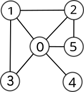

{{initexo(0)}}

[sujet](../../data/2024/24-NSIJ1G1.pdf){. target="_blank"}


!!! example "{{ exercice() }}"
    {{
    correction(True,
    """
    ??? success \"Correction Q1\" 
        ```python
        voisins = [[1, 2, 3, 4],
                [0, 2, 3],
                [0, 1],
                [0, 1],
                [0]]
        ```
    """
    )
    }}

    {{
    correction(True,
    """
    ??? success \"Correction Q2\" 
        {: .center .autolight}
            
    """
    )
    }}

    {{
    correction(True,
    """
    ??? success \"Correction Q3\" 
        ```python
        voisins = [[1, 2, 3, 4, 5],
                [0, 2, 3],
                [0, 1, 5],
                [0, 1],
                [0],
                [0, 2]]
        ```
        
    """
    )
    }}

    {{
    correction(True,
    """
    ??? success \"Correction Q4\" 
        ```python
        import random
        def voisin_alea(voisins, s):
            alea = random.randrange(len(voisins[s]))
            return voisins[s][alea]
        ```
        
    """
    )
    }}

    {{
    correction(True,
    """
    ??? success \"Correction Q5\" 
        La fonction `marche_alea` s'appelle elle-même dans sa propre définition, elle est donc récursive.
        
    """
    )
    }}

    {{
    correction(True,
    """
    ??? success \"Correction Q6\" 
        Cette fonction modélise la propagation aléatoire du virus. Elle renvoie le dernier ordinateur infecté.

        
    """
    )
    }}

    {{
    correction(True,
    """
    ??? success \"Correction Q7\"
        ```python
        def simule(voisins, i, n_tests, n_pas) :
            results = [0] * len (voisins)
            while n_tests > 0 :
                j = marche_alea(voisins, i, n_pas)
                results[j] = results[j] + 1
                n_tests = n_tests - 1
            return [s/n_tests for s in results]
        ``` 
        
    """
    )
    }}

    {{
    correction(True,
    """
    ??? success \"Correction Q8\"
        C'est l'ordinateur 0 qui semble avoir la plus grande probabilité d'être infecté. C'est donc lui qu'il faut protéger. 
        
    """
    )
    }}

    {{
    correction(True,
    """
    ??? success \"Correction Q9\"
        On peut par exemple effectuer un parcours en largeur et compter le nombre d'étapes nécessaires pour visiter tous les ordinateurs du réseau. 
        
    """
    )
    }}

!!! example "{{ exercice() }}"
    {{
    correction(True,
    """
    ??? success \"Correction Q1\" 
        Le masque équivalent au /16 est 255.255.0.0       
    """
    )
    }}


    {{
    correction(True,
    """
    ??? success \"Correction Q2\" 
        L'adresse de réseau de L2 est 172.16.0.0      
    """
    )
    }}

    {{
    correction(True,
    """
    ??? success \"Correction Q3\" 
        L'adresse de diffusion de L2 est 172.16.255.255      
    """
    )
    }}

    {{
    correction(True,
    """
    ??? success \"Correction Q4\" 
        Le nombre de machines pouvant être connectées est $256^2-2=65534$. (il faut enlever l'adresse du réseau et l'adresse de diffusion)       
    """
    )
    }}

    {{
    correction(True,
    """
    ??? success \"Correction Q5\" 
        Le chemin est L1 - A - H - D - L2.    
    """
    )
    }}

    {{
    correction(True,
    """
    ??? success \"Correction Q6\" 
        Suivant le protocole RIP, les deux trajets possibles sont L1 - A - H - C - D - L2 ou L1 - A - B - C - D - L2.    
    """
    )
    }}

    {{
    correction(True,
    """
    ??? success \"Correction Q7\" 
        Si on choisit le trajet L1 - A - H - C - D - L2, il faut modifier la table de routage du routeur H. Il faut lui indiquer l'adresse `53.10.10.10` en passerelle et l'adresse `53.10.10.9` en interface.

        Si on choisit le trajet L1 - A - B - C - D - L2, il faut modifier la table de routage du routeur A. Il faut lui indiquer l'adresse `193.55.24.2` en passerelle et l'adresse `193.55.24.2` en interface.   
    """
    )
    }}

    {{
    correction(True,
    """
    ??? success \"Correction Q8\" 
        - Pour 1 Gbit/s, $c=\\frac{10^9}{10^9}=1$
        - Pour 10 Gbit/s, $c=\\frac{10^9}{10^{10}}=0,1$
        - Pour 100 Mbit/s, $c=\\frac{10^9}{10^8}=10$
    """
    )
    }}

    {{
    correction(True,
    """
    ??? success \"Correction Q9\"
        Avec le protocole OSPF, le meilleur chemin est L1 - A - G - F - E - D - L2, pour un coût total de 1,3. 
        
    """
    )
    }}

    {{
    correction(True,
    """
    ??? success \"Correction Q10\"
        Le nouveau chemin est L1 - A - H - F - E - D - L2, pour un coût total de 2,2.
        
    """
    )
    }}

!!! example "{{ exercice() }}"
    {{
    correction(True,
    """
    ??? success \"Correction Q1\"
        Utiliser une base de données relationnelle permet de garantir l'intégrité de la base, et d'éviter (par exemple) les doublons.
        
    """
    )
    }}

    {{
    correction(True,
    """
    ??? success \"Correction Q2\" 
        Pour être utilisé comme clé primaire, un attribut doit identifier de manière unique l'enregistrement auquel il fait référence.    
    """
    )
    }}

    {{
    correction(True,
    """
    ??? success \"Correction Q3\"
        La clé étrangère `id_client` permet de relier la table `Reservation` à la table `Client`. La clé étrangère `id_emplacement` permet de relier la table `Reservation` à la table `Emplacement`.  
        
    """
    )
    }}

    {{
    correction(False,
    """
    ??? success \"Correction Q4\" 
        Emplacement(<ins>id_emplacement</ins>:INT, nom:STRING, localisation:STRING, tarif\_journalier:INT)   
    """
    )
    }}

    {{
    correction(False,
    """
    ??? success \"Correction Q5\" 
        ```python
        1 myrtille A4
        4 mandarine B1
        6 melon A2
        ```
        
    """
    )
    }}

    {{
    correction(False,
    """
    ??? success \"Correction Q6\" 
        ```sql
        SELECT nom, prenom
        FROM Client
        WHERE ville = 'Strasbourg'
        ```
        
    """
    )
    }}

    {{
    correction(False,
    """
    ??? success \"Correction Q7\" 
        ```sql
        INSERT INTO Client
        VALUES (42, 'CODD', 'Edgar', '28 rue des Capucines', 'Lyon', 'France', '0555555555')
        ```
        
    """
    )
    }}

    {{
    correction(False,
    """
    ??? success \"Correction Q8\" 
        ```sql
        SELECT Client.nom, Client.prenom, Reservation.nombre_personne, Reservation.date_arrivee, Reservation.date_depart, Emplacement.tarif_journalier
        FROM Reservation
        JOIN Client ON Client.id_client = Reservation.id_client
        JOIN Emplacement ON Emplacement.id_emplacement = Reservation.id_emplacement
        WHERE Reservation.id_reservation = 18
        ```
        
    """
    )
    }}

    {{
    correction(False,
    """
    ??? success \"Correction Q9\" 
        Le terme `self` est utilisé pour signifier l'objet en cours de construction dans la méthode constructeur et les différentes méthodes. 
    """
    )
    }}

    {{
    correction(False,
    """
    ??? success \"Correction Q10\" 
        ```python
        client01 = Client('CODD', 'Edgar', '28 rue des Capucines', 'Lyon', 'France', '0555555555')
        ```
        
    """
    )
    }}

    {{
    correction(False,
    """
    ??? success \"Correction Q11\" 
        ```python
        def montant_a_regler(triplet):
            ''' renvoie le montant en euros a regler pour cette reservation '''
            client, reservation, emplacement = triplet
            return emplacement.tarif_journalier*reservation.nb_jours() + reservation.nombre_personne*2.2*reservation.nb_jours()
        ```
        
    """
    )
    }}

    {{
    correction(False,
    """
    ??? success \"Correction Q12\" 
        La variable `annee` est de type `String`. Or à la ligne 25 on essaie de faire une comparaison de cette variable avec les nombres 2018 et 2024. Cela va provoquer une erreur.    
    """
    )
    }}

    {{
    correction(False,
    """
    ??? success \"Correction Q13\" 
        Il suffit, à la ligne 25, de remplacer `annee` par `int(annee)`.   
    """
    )
    }}

    {{
    correction(False,
    """
    ??? success \"Correction Q14\" 
        Vérification des mois :
        ```python
        if mois not in calendrier:
            return False
        ```    

        Vérification du numéro :
        ```python
        if len(numero) != 3 or not que_des_chiffres(numero):
            return False
        ``` 
        
    """
    )
    }}