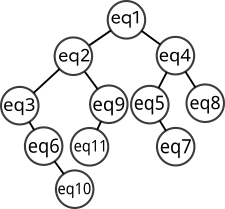
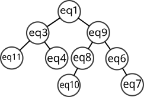

{{initexo(0)}}

[sujet](../../data/2024/24-NSIJ1ME.pdf){. target="_blank"}

!!! example "{{ exercice() }}"
    {{
    correction(True,
    """
    ??? success \"Correction Q1\" 
        Le fait que la liste des prédécesseurs de s2 soit vide s'explique par le fait qu'aucun site ne pointe vers s2.
    """
    )
    }}

    {{
    correction(True,
    """
    ??? success \"Correction Q2\" 
        ```python
        s4.predecesseurs = [(s1,1), (s2,2)]
        s5.predecesseurs = [(s1,2), (s3,3), (s4,6)]
        ``` 
    """
    )
    }}

    {{
    correction(True,
    """
    ??? success \"Correction Q3\" 
        `s2.successeurs[1][1]` vaut 5 et signifie que s2 a 5 liens qui pointent vers s3.
    """
    )
    }}

    {{
    correction(True,
    """
    ??? success \"Correction Q4\" 
        Le site 1 a une popularité de 6. En effet le site 2 apporte 4 liens et le site 4 apporte 2 liens.
    """
    )
    }}

    {{
    correction(True,
    """
    ??? success \"Correction Q5\" 
        ```python
        def calculPopularite(self):
            self.popularite = 0
            for cpl in self.predecesseurs:
                self.popularite += cpl[1]
            return self.popularite
        ```  
    """
    )
    }}

    {{
    correction(True,
    """
    ??? success \"Correction Q6\" 
        Le fait d'enlever un élément en tête de liste et d'en rajouter en fin de liste est caractéristique d'une file. 
    """
    )
    }}

    {{
    correction(True,
    """
    ??? success \"Correction Q7\" 
        Ce parcours est un parcours en largeur.
    """
    )
    }}

    {{
    correction(True,
    """
    ??? success \"Correction Q8\" 
        `parcoursGraphe(s1)` renverra la liste `[s1, s3, s4, s5]`.
    """
    )
    }}

    {{
    correction(True,
    """
    ??? success \"Correction Q9\" 
        ```python
        def lePlusPopulaire(listeSites):
            maxPopularite = 0
            siteLePlusPopulaire = listeSites[0]
            for site in listeSites:
                if site.popularite > maxPopularite:
                    maxPopularite = site.popularite
                    siteLePlusPopulaire = site
            return siteLePlusPopulaire
        ```
    """
    )
    }}

    {{
    correction(True,
    """
    ??? success \"Correction Q10\" 
        La ligne de code `lePlusPopulaire(parcoursGraphe(s1)).nom` renvoie `'site3'` car le site 3 est le plus populaire parmi tous les sites visités lors du parcours en largeur depuis le site1. 
    """
    )
    }}

    {{
    correction(True,
    """
    ??? success \"Correction Q11\" 
        Ce code n'est pas adapté à un très grand nombre de sites car le graphe deviendrait vite très lourd à manipuler, notamment pour le parcours en largeur.
    """
    )
    }}


!!! example "{{ exercice() }}"
    {{
    correction(True,
    """
    ??? success \"Correction Q1\" 
        Un SGBD assure l'intégrité de la base de données et évite (par exemple) la redondance des données. 
    """
    )
    }}

    {{
    correction(True,
    """
    ??? success \"Correction Q2\" 
        Suivant le protocole RIP, la route suivie serait Bureau n°1 - B - E - A - Prestataire. 
    """
    )
    }}

    {{
    correction(True,
    """
    ??? success \"Correction Q3\" 
        Suivant le protocole OSPF, les deux routes possibles seraient Bureau n°2 - C - I - G - F - D - A - Prestataire et Bureau n°2 - C - I - H - F - D - A - Prestataire, pour un coût équivalent de 2,3.
    """
    )
    }}

    {{
    correction(True,
    """
    ??? success \"Correction Q4\" 
        L'attribut `id_client` a été choisi comme clé primaire de la relation `clients` car il authentifie de manière unique chaque client.    
    """
    )
    }}

    {{
    correction(True,
    """
    ??? success \"Correction Q5\" 
        Une clé étrangère est une clé primaire d'une autre table. 

        Dans la table `reservations`, `id_client` est une clé étrangère faisant référence à la clé primaire `id_client` de la table `clients`. Toujours dans la table `reservations`, `nom_croisiere` est une clé étrangère faisant référence à la clé primaire `nom` de la table `croisieres`.

        Dans la table `croisieres`, les atttributs `escale_1`, `escale_2`, `escale_3` et `escale_4` sont des clés étrangères faisant référence à la clé primaire `nom` de la table `villes`.

        
    """
    )
    }}

    {{
    correction(True,
    """
    ??? success \"Correction Q6\" 
        Le nom des escales 'Puerto sebo', 'Puerto kifecho', 'Puerto kifebo' et 'Puerto repo' n'existent pas dans la table `villes`. Or cela est nécessaire car ces attributs sont des clés étrangères. Il faut donc d'abord rentrer ces villes dans la table `villes` avant d'exécuter le code donné.
    """
    )
    }}

    {{
    correction(True,
    """
    ??? success \"Correction Q7\" 
        La première requête sert à récupérer l'identifiant de Jean Barc, qui est sans doute 1243. La deuxième requête sert à récupérer les identifiants de toutes les réservations de Jean Barc.    
        
    """
    )
    }}

    {{
    correction(True,
    """
    ??? success \"Correction Q8\" 
        ```sql
        SELECT id_reservation
        FROM reservations
        JOIN clients ON clients.id_client = reservations.id_client
        WHERE clients.nom = 'Barc' AND clients.prenom = 'Jean' AND clients.date_naissance = '1972/06/29' AND clients.pays = 'Allemagne';
        ```   
    """
    )
    }}

    {{
    correction(True,
    """
    ??? success \"Correction Q9\" 
        ```sql
        UPDATE reservations
        SET nom_croisiere = 'Croisiere Puerto'
        WHERE id_reservation = 20456
        ```   
    """
    )
    }}

    {{
    correction(True,
    """
    ??? success \"Correction Q10\" 
        ```sql
        SELECT clients.nom, clients.prenom, clients.date_naissance
        FROM clients
        JOIN reservations ON clients.id_client = reservations.id_client
        WHERE reservations.nom_croisiere IN ('Croisiere Piano', 'Croisiere Puerto')
        ```   
    """
    )
    }}

!!! example "{{ exercice() }}"

    {{
    correction(True,
    """
    ??? success \"Correction Q1\" 
        ```python
        chien40 = Chien(40, 'Duke', 'wheel dog', 10)
        ```
    """
    )
    }}

    {{
    correction(True,
    """
    ??? success \"Correction Q2\" 
        ```python
        def changer_role(self, nouveau_role):
	        self.role = nouveau_role
        ```
    """
    )
    }}

    {{
    correction(True,
    """
    ??? success \"Correction Q3\" 
        ```python
        chien40.changer_role('leader')
        ```
    """
    )
    }}

    {{
    correction(True,
    """
    ??? success \"Correction Q4\" 
        ```python
        def retirer_chien(self, numero):
            nouvelle_liste = []
            for chien in self.liste_chiens:
                if chien.id_chien != numero:
                    nouvelle_liste.append(chien)
            self.liste_chiens = nouvelle_liste
        ```
    """
    )
    }}

    {{
    correction(True,
    """
    ??? success \"Correction Q5\" 
        ```python
        eq11.retirer_chien(46)
        ```
    """
    )
    }}

    {{
    correction(True,
    """
    ??? success \"Correction Q6\" 
        `convert('4h36')` va renvoyer le nombre `4.6` 
        
    """
    )
    }}

    {{
    correction(True,
    """
    ??? success \"Correction Q7\" 
        ```python
        def temps_course(equipe):
            total = 0
            for temps in equipe.liste_temps:
                total += convert(temps)
            return total
        ```
        
    """
    )
    }}

    {{
    correction(True,
    """
    ??? success \"Correction Q8\" 
        {: .center .autolight}
        
    """
    )
    }}

    {{
    correction(True,
    """
    ??? success \"Correction Q9\" 
        C'est un parcours infixe.
    """
    )
    }}

    {{
    correction(True,
    """
    ??? success \"Correction Q10\" 
        La fonction `inserer` est récursive car elle s'appelle elle-même dans sa propre définition.    
    """
    )
    }}

    {{
    correction(True,
    """
    ??? success \"Correction Q11\" 
        ```python
        def inserer(arb, eq):
            if convert(eq.temps_etape) < convert(arb.racine.temps_etape):
                if arb.gauche is None:
                    arb.gauche = Noeud(eq)
                else :
                    inserer(arb.gauche, eq)
            else :
                if arb.droit is None:
                    arb.droit = Noeud(eq)
                else :
                    inserer(arb.droit, eq)
        ```    
    """
    )
    }}

    {{
    correction(True,
    """
    ??? success \"Correction Q12\" 
        ```python
        def est_gagnante(arbre):
            if arbre.gauche == None:
                return arbre.racine.nom_equipe
            else:
                return est_gagnante(arbre.gauche)
        ```   
    """
    )
    }}

    {{
    correction(True,
    """
    ??? success \"Correction Q13\" 
        {: .center .autolight}
           
    """
    )
    }}

    {{
    correction(True,
    """
    ??? success \"Correction Q14\" 
        ```python
        def rechercher(arbre, equipe):
            if arbre == None:
                return False
            if arbre.racine == equipe:
                return True
            if convert(equipe.temps_etape) < convert(arbre.racine.temps_etape):
                return rechercher(arbre.gauche, equipe)
            else :
                return rechercher(arbre.droit, equipe)
        ```    
    """
    )
    }}