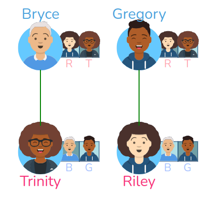
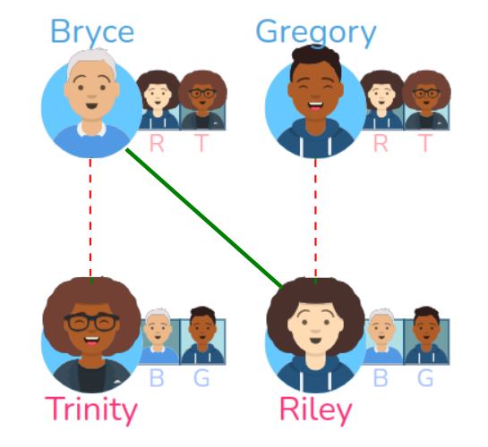
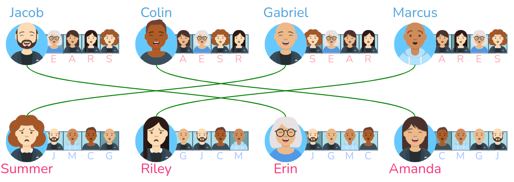
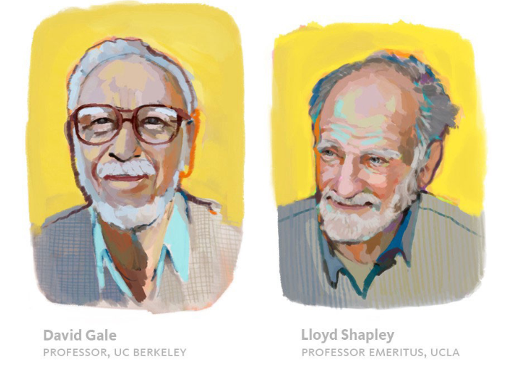
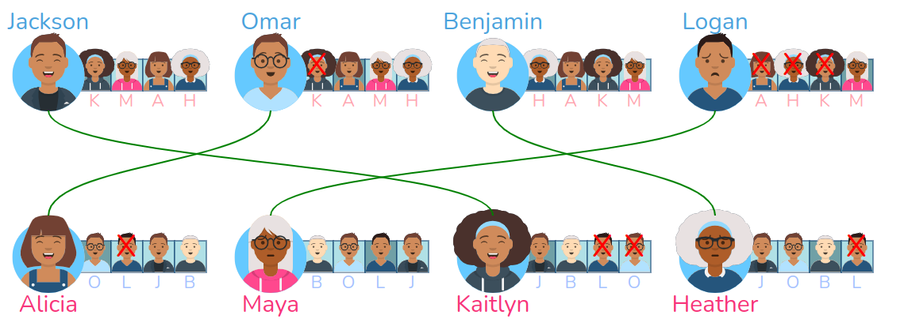
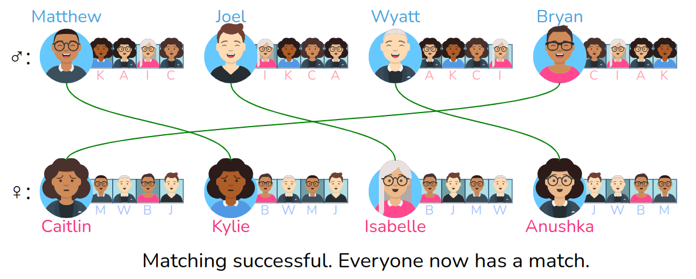

# Gale-Shapley et l'algorithme de Parcoursup

{: .center}


L'affectation des lycéens dans l'enseignement supérieur (par l'algorithme APB jusqu'en 2018, par l'algorithme Parcoursup depuis) fait intervenir un algorithme *d'appariement*. 
!!! quote "Appariement" 
    *Action d'apparier, d'unir par couple, d'assortir par paire.*


Considérons que les élèves aient fait un classement de leurs formations préférées (**ce n'est pas le cas dans Parcoursup**, nous y reviendrons).  
Considérons aussi que ces formations aient classé ces élèves au vu de leur dossier.  
L'algorithme d'appariement va avoir pour but d'associer chaque élève à une formation, avec les contraintes suivantes :

- chaque formation veut recevoir les élèves les mieux placés dans leur classement.
- chaque élève veut intégrer la formation la mieux placée dans son classement.

## 1. Études des appariements possibles

Pour illustrer les problématiques liées à l'appariement, nous allons nous placer dans la situation suivante : au lieu de parler d'élèves et d'établissements d'enseignement supérieur, nous allons parler d'hommes et de femmes.

:arrow_right: **Situation d'étude**

- On dispose d'une liste de $n$ hommes et de $n$ femmes.
- Chaque homme a classé les $n$ femmes par ordre de préférence.
- Chaque femme a classé les $n$ hommes par ordre de préférence.
- L'appariement consiste à créer $n$ mariages entre un homme et une femme.


### 1.1 Notion de mariages instables

!!! tip "Mariages instables"
    Deux mariages sont dits **instables** si, dans chacun des deux couples, il existe la possibilité de quitter son conjoint actuel pour quelqu'un mieux classé dans ses préférences.


!!! note "Exemple de mariages instables"
    Considérons 4 personnes : 2 hommes (Bryce, Gregory) et 2 femmes (Trinity et Riley).

    On leur a demandé de classer les deux personnes du sexe opposé par ordre de préférence. Voilà le résultat :
    
    {: .center width=60%}

    Bryce préfère Riley à Trinity, Gregory préfère Riley à Trinity, Trinity préfère Bryce à Gregory, Riley préfère Bryce à Gregory.

    Considérons maintenant qu'un algorithme d'appariement a formé les couples suivants : Bryce-Trinity et Gregory-Riley.
    

    {: .center width=40%}
    
    Mais alors :

    - Bryce est avec Trinity alors qu'il préfère Riley.
    - Riley est avec Gregory alors qu'elle préfère Bryce.

    :arrow_right: le couple Bryce-Riley crée donc deux mariages **instables**, car leur intérêt est de briser leur couple actuel et de partir ensemble.

    Par abus de langage, on pourra dire que le couple Bryce-Riley est un couple instable (car leurs mariages respectifs sont instables).

    {: .center width=40%}

!!! abstract "Exercice 1"
    La configuration ci-dessous contient-elle des mariages instables ?

    {: .center}

    {{
    correction(True,
    """
    ??? success \"Correction\" 
        Le couple Christopher-Evelyn est un couple instable.
    """
    )
    }}

!!! abstract "Exercice 2"
    À l'adresse [https://uw-cse442-wi20.github.io/FP-cs-algorithm/](https://uw-cse442-wi20.github.io/FP-cs-algorithm/){. target="_blank"}, allez jusqu'à la zone «Identify Unstable Pairs» et entraînez-vous à repérer les mariages instables.


1.2 Notion de mariage stable


!!! tip "Mariages stables"
    Un ensemble de mariages sera dit **stable** s'il n'existe aucun couple instable parmi tous les mariages.

    {: .center}

    La situation ci-dessus est stable, car aucun couple n'est instable.
    


Le travail des algorithmes d'appariement va être d'essayer d'arriver à une situation stable.


## 2. Algorithme de Gale-Shapley

{: .center width=40%}

David Gale (1921-2008) et Lloyd Shapley (1923-2016), deux universitaires américains, ont présenté en 1962 un algorithme d'appariement qui porte leur nom. ([lien vers la publication originale](https://www.eecs.harvard.edu/cs286r/courses/fall09/papers/galeshapley.pdf){. target="_blank"}).

Cette publication vaudra le prix Nobel d'économie à Lloyd Shapley en 2012 (conjointement avec Alvin Roth), David Gale étant décédé en 2008. 
Leur algorithme est aujourd'hui utilisé quotidiennement pour tous les problèmes d'appariemment : dans le milieu universitaire (comme nous le voyons), mais aussi dans le milieu médical. Son application a ainsi permis une très forte augmentation des greffes d'organes, en optimisant l'adéquation donneur-receveur.


!!! success "Résultat démontré par Gale-Shapley"
    Si les deux ensembles à associer sont de même taille (ici : s'il y a autant d'hommes que de femmes), alors il existe toujours **au moins un appariement stable**.

Gale et Shapley ont détaillé l'algorithme permettant de fabriquer un de ces appariements stables :


!!! tip "Algorithme de Gale-Shapley :heart: :heart: :heart:"
    - Tant qu'il existe un homme n'ayant pas trouvé de femme :
        - chaque homme libre se propose à la femme de son classement la mieux classée parmi celles à qui il n'a pas encore proposé.
        - si la femme est libre, elle accepte.
        - si elle n'est pas libre mais que l'homme qui vient de lui faire une proposition est mieux classé que son mari actuel, elle brise son couple actuel et accepte la proposition qui vient de lui être faite.


À noter qu'il n'y a pas, en règle générale, un seul appariement stable, mais plusieurs. L'algorithme de Gale-Shapley permet d'en trouver un en particulier.

!!! abstract "Illustration"
    Vous pouvez voir le déroulement de l'algorithme sur le site [https://uw-cse442-wi20.github.io/FP-cs-algorithm/](https://uw-cse442-wi20.github.io/FP-cs-algorithm/){. target="_blank"}, dans la partie **The solution**.

## 3. Implémentation en Python

Nous allons partir de la situation suivante :

{: .center}

??? abstract "Exercice 3"
    Compléter le code ci-dessous.

    ```python linenums='1' hl_lines='29 39 40 41 52 53 62'
    hommes = ['J', 'O', 'B', 'L']
    femmes = ['A', 'M', 'K', 'H']

    prefs = {'J':['K', 'M', 'A', 'H'],
            'O':['K', 'A', 'M', 'H'],
            'B':['H', 'A', 'K', 'M'],
            'L':['A', 'H', 'K', 'M'],
            'A':['O', 'L', 'J', 'B'],
            'M':['B', 'O', 'L', 'J'],
            'K':['J', 'B', 'L', 'O'],
            'H':['J', 'O', 'B', 'L']}

    refus = {h:[] for h in hommes}

    couple = {p:None for p in hommes + femmes}

    hommes_maries = []

    while len(hommes_maries) < len(hommes):
        
        for h in hommes:
            print('--------------------')
            print('Affectation de', h, ":")
            
            if couple[h] is not None:
                print("déjà en couple")
                
            else:
                for f in ... :
                    if couple[h] is not None:
                        break
                    print(h, "propose à", f)
                    
                    if f in refus[h]:
                        print(f, 'a déjà refusé, stop')
                        
                    elif couple[f] is None:
                        print(f, 'est libre, go')
                        couple[f] = ...
                        couple[h] = ...
                        hommes_maries.append(...)          
                    
                    else:
                        print(f, 'est prise, étude...')
                        h_actuel = couple[f]
                        liste_prefs = prefs[f]
                        if liste_prefs.index(h) < liste_prefs.index(h_actuel):
                            
                            print(h, "est mieux classé que", h_actuel, "dans les prefs de", f)
                            print(h_actuel, "est viré")
                            hommes_maries.remove(...)
                            couple[...] = None
                            refus[...].append(f)
                            
                            print(h, "est le nouveau mari de", f)
                            hommes_maries.append(...)
                            couple[f] = h
                            couple[h] = f
                            
                        else:
                            print(h, "est moins bien classé que", h_actuel, "dans les prefs de", f, "il reste celibataire")
                            refus[...].append(...)
                            break                
                
    print('--------------------')
    print("tout le monde est marié, fin de l'algo")
    for h in hommes:
        print(h, '-', couple[h])

    ```

    ??? success "Correction" 

        ```python linenums='1' hl_lines='29 39 40 41 52 53 62'
        hommes = ['J', 'O', 'B', 'L']
        femmes = ['A', 'M', 'K', 'H']

        prefs = {'J':['K', 'M', 'A', 'H'],
                'O':['K', 'A', 'M', 'H'],
                'B':['H', 'A', 'K', 'M'],
                'L':['A', 'H', 'K', 'M'],
                'A':['O', 'L', 'J', 'B'],
                'M':['B', 'O', 'L', 'J'],
                'K':['J', 'B', 'L', 'O'],
                'H':['J', 'O', 'B', 'L']}

        refus = {h:[] for h in hommes}

        couple = {p:None for p in hommes + femmes}

        hommes_maries = []

        while len(hommes_maries) < len(hommes):
            
            for h in hommes:
                print('--------------------')
                print('Affectation de', h, ":")
                
                if couple[h] is not None:
                    print("déjà en couple")
                    
                else:
                    for f in prefs[h]:
                        if couple[h] is not None:
                            break
                        print(h, "propose à", f)
                        
                        if f in refus[h]:
                            print(f, 'a déjà refusé, stop')
                            
                        elif couple[f] is None:
                            print(f, 'est libre, go')
                            couple[f] = h
                            couple[h] = f
                            hommes_maries.append(h)          
                        
                        else:
                            print(f, 'est prise, étude...')
                            h_actuel = couple[f]
                            liste_prefs = prefs[f]
                            if liste_prefs.index(h) < liste_prefs.index(h_actuel):
                                
                                print(h, "est mieux classé que", h_actuel, "dans les prefs de", f)
                                print(h_actuel, "est viré")
                                hommes_maries.remove(h_actuel)
                                couple[h_actuel] = None
                                refus[h_actuel].append(f)
                                
                                print(h, "est le nouveau mari de", f)
                                hommes_maries.append(h)
                                couple[f] = h
                                couple[h] = f
                                
                            else:
                                print(h, "est moins bien classé que", h_actuel, "dans les prefs de", f, "il reste celibataire")
                                refus[h].append(f)
                                break                
                    
        print('--------------------')
        print("tout le monde est marié, fin de l'algo")
        for h in hommes:
            print(h, '-', couple[h])

        ```

        {: .center}


## 4. Qualité de la solution proposée par l'algorithme de Gale-Shapley

La situation initiale est parfaitement symétrique : les hommes ont établi un classement, les femmes également. 

Mais l'algorithme de Gale-Shapley n'est **pas** symétrique : ce sont les hommes qui proposent, dans l'ordre décroissant de leur choix. 
La conséquence est importante :

!!! note ":star: Optimalité de la solution trouvée :star:"
    L'algorithme de Gale-Shapley donne :

    - pour les hommes : la **meilleure solution possible** parmi tous les mariages stables.
    - pour les femmes : la **pire solution possible** parmi tous les mariages stables.

    Le choix de «qui va faire ses propositions» parmi les deux groupes est donc crucial avant de lancer l'algorithme, car le groupe qui propose est plus avantagé dans le résultat final.

Nous allons l'illustrer à partir une situation initiale identique, et les deux configurations que donne l'algorithme suivant si ce sont les hommes qui proposent (exemple 1) ou bien les femmes (exemple 2)

:arrow_right: **Exemple 1 : si les hommes proposent**

{: .center}

Analyse de la solution :

- Les hommes ont tous leur premier choix.
- Les femmes ont respectivement leur choix n°3, 3, 2 et 2.

:arrow_right: **Exemple 2 : si les femmes proposent**

{: .center}

Analyse de la solution :

- Les hommes ont respectivement leur choix n°4, 4, 2 et 2.
- Les femmes ont respectivement leur choix n°1, 2, 1 et 1.


### 5. Le lien avec Parcoursup
L'algorithme de Parcoursup est basé sur l'algorithme de Gale-Shapley. Mais il faut apporter quelques précisions importantes.


:arrow_right: **Rappel : l'algorithme de Parcoursup n'est que l'algorithme global**

Il récupère les classements effectués en interne par tous les établissements de l'enseignement supérieur. 

L'algorithme global de Parcoursup est public (vous pouvez le trouver [ici](https://gitlab.mim-libre.fr/parcoursup/algorithmes-de-parcoursup){. target="_blank"}). Les algorithmes de classement internes à chaque établissement ne le sont pas forcément.

:arrow_right: **Dans Parcoursup, les vœux ne sont pas classés**

Mais alors, comment peut-on appliquer Gale-Shapley, qui repose sur le classement des deux parties ?

Le classement des vœux de chaque candidat se fait au moment de l'acceptation ou du refus des vœux acceptés. À chaque tour de Parcoursup, le candidat donne une indication sur ses préférences, et l'algorithme converge donc vers sa solution définitive.

Si on obligeait les candidats à classer leur vœux, on serait dans le cas d'un Gale-Shapley «pur» : les résultats serait immédiats. C'était le cas avec l'algorithme qui précédait Parcoursup, l'algorithme APB.

De plus, l'algorithme de Parcoursup doit obéir à des contraintes supplémentaires qui ne figurent pas dans Gale-Shapley:

- Certaines formations se doivent de proposer à un taux minimum de boursiers (fixé par les Rectorat). Les dossiers des boursiers sont donc éventuellement remontés artificiellement sur la liste d'appel pour parvenir au taux minimum.
- Certaines formations se doivent de proposer à un taux maximum d'élèves hors-académie (fixé les Rectorat). Là encore, la liste d'appel initiale est modifiée pour respecter ce taux maximum.


:arrow_right: **Dans Parcoursup, les établissements jouent le rôle des hommes, les candidats jouent le rôle des femmes**

Ce sont les établissements qui proposent (en appelant le 1er de leur liste, puis le 2ème, ...).  
La conséquence est importante : la solution donnée par l'algorithme est donc **optimale** pour les établissements et non pour les candidats.

Que se passerait-il si on inversait, afin de rendre la solution optimale pour les candidats ?

Il faut se souvenir des situations rencontrées plus haut, lorsqu'on a apparié des hommes (qui proposaient) à des femmes : il arrivait que des couples établis soient cassés lorsqu'un homme mieux classé se proposait à une femme pourtant déjà mariée.

Comme Parcoursup fonctionne sur plusieurs mois (à cause de la non-hiérachisation des vœux), cela reviendrait à ce qu'un candidat ait une réponse positive d'un établissement, mais que cette réponse soit annulée quelques jours plus tard parce qu'un meilleur candidat aura fait une proposition à cet établissement... Ceci est difficilement envisageable d'un point de vue psychologique.

Dans le cas de l'affectation des étudiants à l'issue de la première année de PASS, les vœux sont hiérarchisés et Gale-Shapley fonctionne donc de manière immédiate : ce sont donc les étudiants qui proposent, et l'algorithme aboutit donc à une solution optimale pour les étudiants. ([source](https://fr.wikipedia.org/wiki/Algorithme_d%27affectation_de_candidats_apr%C3%A8s_concours_multiples){. target="_blank"})


:arrow_right: **Finalement, pourquoi les vœux Parcoursup des candidats ne sont-ils pas hiérarchisés ?**

- Les avantages :
    - On pourrait placer les élèves en situation de «proposeurs» dans l'algorithme de Gale-Shapley et donc leur garantir une solution optimale.
    - Les résultats seraient immédiats et génèreraient donc moins de stress pour les candidats.
    - On pourrait faire des statistiques sur la satisfaction des lycéens. (avantage côté citoyens)

- Les inconvénients :
    - Les lycéens devraient faire leurs choix définitifs très tôt dans l'année en hiérarchisant leurs vœux.
    - On pourrait faire des statistiques sur la satisfaction des lycéens. (inconvénient côté politique...)

!!! quote "bibliographie"
    - [Vidéo de David Louapre (Science étonnante)](https://www.youtube.com/watch?v=dO1pLi2Dedw){. target="_blank"}
    - [Note de blog au sujet de cette vidéo](https://scienceetonnante.com/2020/01/09/parcoursup/){. target="_blank"}
    - [Article d'Interstices](https://interstices.info/dapb-a-parcoursup-quelles-methodes-daffectation-post-bac/){. target="_blank"}
    - [Wikipedia](https://fr.wikipedia.org/wiki/Algorithme_de_Gale_et_Shapley){. target="_blank"}