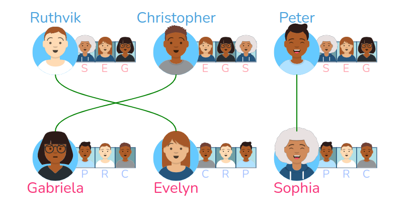

# Les algorithmes d'appariement

!!! quote "Appariement" 
    *Action d'apparier, d'unir par couple, d'assortir par paire.*

L'affectation des élèves dans l'enseignement supérieur (par l'algorithme APB jusqu'en 2020, par l'algorithme Parcoursup depuis) fait intervenir un algorithme *d'appariement*. Il s'agit d'associer, de la meilleure manière possible, les élèves à leur formation préférée.

Considérons que les élèves aient fait un classement de leurs formations préférées (**ce n'est pas le cas dans Parcoursup**, nous y reviendrons). Considérons aussi que ces formations aient classé ces élèves au vu de leur dossier. L'algorithme d'appariement va avoir pour but d'associer chaque élève à une formation, sans qu'un élève ait pris la place d'un autre tout en étant moins bien classé que lui.

L'algorithme de Gale-Shapley permet de résoudre ce problème.

## L'algorithme de Gale-Shapley

La présentation classique de cet algorithme fait intervenir non pas des élèves et des formations, mais des couples garçons-filles à associer.

Cet algorithme est appelé «algorithme des mariages stables».

Mais qu'est-ce qu'un mariage stable ?

### Notion de «mariage stable»

{: .center}

