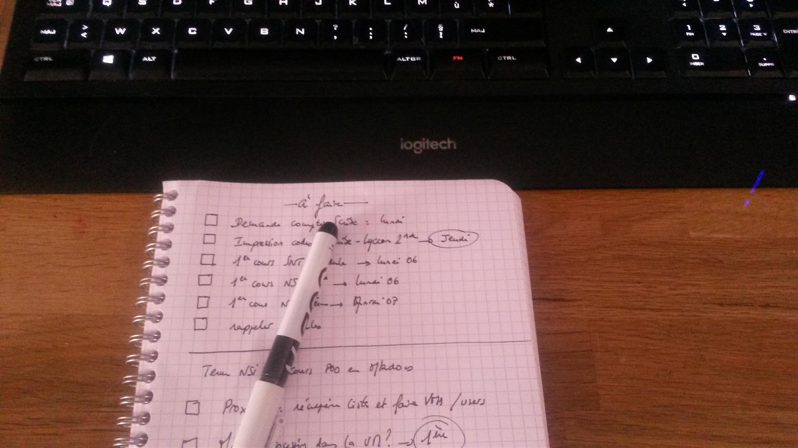

# Conseils de travail


## Conditions matérielles

Il est conseillé de travailler avec 3 espaces:

- l'écran de l'ordinateur partitionné avec les 2 premiers espaces: ce site et un IDE (Thonny par exemple);

{: .center}

!!! danger "C'est en codant qu'on apprend à coder"
    **Tous** les exemples de code dans le cours doivent être **retapés** (résistez à l'envie du copier-coller) dans Thonny, soit en fenêtre de script, soit en console.

    Cela permet de :

    - mémoriser la syntaxe ;
    - vérifier si le code proposé ne contient pas d'erreur ;

    et le plus important :

    - **faire ses propres tests et modifications** pour vérifier sa bonne compréhension. 

- et un troisième espace essentiel : un petit cahier à spirale et un stylo !

{: .center width=50%}


## Script ou console ???

Thonny, comme la grande majorité des IDE Python, est composé de deux zones distinctes :

- la zone de script
- la console

{: .center width=50%}

La zone de script est **asynchrone**. Il ne se passera rien tant que vous n'aurez pas exécuté le script (par F5 par exemple).
C'est donc l'endroit où on va rédiger son programme.

La **console** est synchrone : elle répond dès que vous appuyez sur la touche Entrée. Elle sert donc aux petits tests rapides, ou bien tests post-exécution d'un code.

!!! note "Utilisation classique du couple script / console"
    1. On écrit son code dans la zone de script
    2. On l'exécute.
    3. On interroge la console pour connaître l'état des variables, pour utiliser les fonctions construites dans le script.

Pour les extraits de code présents sur ce site :

- tout le code qui est précédé d'une numérotation de ligne est à écrire en zone de script.

Exemple :
```python linenums='1'
def accueil(n):
   for k in range(n):
       print("bonjour") 
```

- tout le code qui est précédé ```>>>``` est à taper en console.

Exemple :
```python
>>> accueil(5)
```

## Dossiers, fichiers et versionning

Cette année en NSI nous allons manipuler un certain nombre de fichiers. Il est important de les nommer et les classer de façon rigoureuse pour les retrouver rapidement et les partager.


!!! tip "Conseils"
    - Utilisez des dossiers pour classer vos fichiers. Il n'y en a jamais assez.
    - Prenez l'habitude de faire plusieurs sauvegardes de vos documents (sur le réseau du lycée, sur l'ENT, sur clé USB).
    - Évitez dans les noms de fichiers et de dossiers **les espaces** (utilisez plutôt _ ) ainsi que **les caractères accentués** et les caractères spéciaux.
    - Un nom de fichier doit être parlant (un peu comme une variable en fait). On évitera de nommer ses codes Python `python1.py`, `python2.py`, `python3.py`, etc. Mais plutôt `1NSI_T4_tri_selection.py` par exemple pour un exercice de programmation sur le tri par selection au thème 4.
    - Lorsqu'on travaille sur un projet ou un programme conséquent, il peut être utile de conserver des archives du travail à plusieurs étapes de l'élaboration, plutôt que de ne conserver que la dernière version. À cet effet on pourra numéroter : `1NSI_projet_morpion_v1.py`, puis `1NSI_projet_morpion_v2.py`, `1NSI_projet_morpion_v3.py`, etc.


## Usage du clavier

Utiliser le clavier est souvent bien plus pratique et surtout plus rapide qu'utiliser la souris. Encore faut-il apprendre à l'apprivoiser...

!!! tip "La sélection au clavier"
    Outre les touches `DEBUT` et `FIN` qui permettent d'atteindre rapidement le début ou la fin d'une ligne, les flèches directionelles servent évidemment à se déplacer dans du texte. Mais combinées:

    - à la touche `CTRL` : elles permettent de se déplacer de mot en mot;
    - à la touche `MAJ` : elles permettent de sélectionner un caractère;
    - aux touches `MAJ` **et** `CTRL`: elles permettent de sélectionner une mot.

    De même, en se plaçant en début d'une ligne et en combinant la touche `MAJ` et `FIN`, on sélectionne la ligne entière.


!!! tip "Les raccourcis clavier"
    Il existe de très nombreux raccourcis clavier qui permettent d'exécuter des tâches courantes sans passer par les menus du logiciel. Certains sont (quasi-)universels, c'est-à-dire que ce sont les mêmes sur tous les logiciels, d'autres sont spécifiques à chaque logiciel. Il est important d'en connaître quelques-uns pour être plus efficace.

    === "Les universels"
        - La triplette magique `CTRL+X`, `CTRL+C`, `CTRL+V` pour couper, copier, coller;
        - `CTRL+O` pour ouvrir un fichier
        - `CTRL+N` pour créer un nouveau document;
        - `CTRL+S` pour sauvegarder le document en cours;
        - `CTRL+MAJ+S` pour sauvegarder en précisant le nom du fichier;
        - `CTRL+Z` pour annuler la dernière action, `CTRL+Y` ou `CTRL+MAJ+Z` pour la rétablir;
        - `CTRL+W` pour fermer un onglet;
        - `CTRL+Q` ou `ALT+F4` pour fermer le logiciel;
        - `CTRL+A` pour sélectionner tout (All).
    
    === "IDE"
        À chercher de suite lorsqu'on utilise un nouvel IDE, les raccourcis pour les actions suivantes (entre parenthèses ceux de Thonny):

        - exécuter le code (`F5`)
        - commenter/décommenter une ligne (`CTRL+M`)

    === "Navigateur Web"
        - `CTRL+T` pour ouvrir un nouvel onglet;
        - `CTRL+H` pour ouvrir l'historique;
        - combiner `CTRL` + clic pour forcer l'ouverture d'un lien dans un nouvel onglet;
        - combiner `MAJ` + clic pour forcer l'ouverture d'un lien dans une nouvelle fenêtre;

??? abstract "sources"
    - site de [Cédric Gouygou](https://cgouygou.github.io/1NSI/)