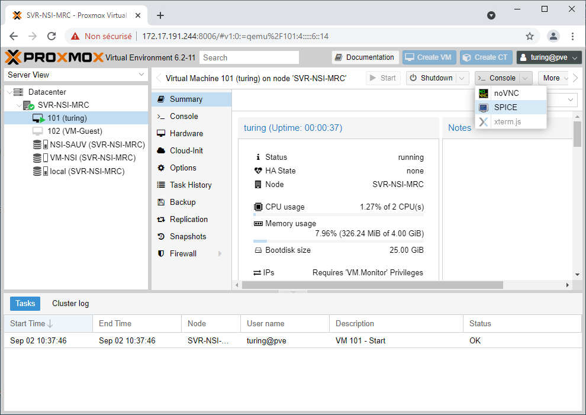

# Utilisation des VMs au lycée

{: .center width=50%}


## Principe
Afin de pouvoir travailler sous le système d'exploitation libre Linux sur les machines du lycée (sous Windows), nous utilisons la solution de virtualisation Proxmox. De manière simplifiée : 

- un serveur (assez puissant) se trouve dans la salle serveur du lycée.
- sur cet ordinateur, un grand nombre de systèmes d'exploitation peuvent être démarrés indépendamment.
- l'un d'entre eux porte votre nom : c'est votre machine virtuelle (votre VM).
- vous vous connectez à votre VM depuis un navigateur de n'importe quel ordinateur du lycée.
- cet ordinateur (appelé *hôte*) ne va faire que recevoir le flux vidéo venu du serveur (et lui envoyer les interactions utilisateurs : souris, clavier)
- en mettant ce flux vidéo en plein écran, on a l'illusion d'être sous un nouveau système d'exploitation. Nous allons donc travailler sous Linux, tout en restant en réalité sous Windows.

## Méthode

1. Sur le bureau Windows, ouvrir le dossier ```Programmation```.
2. Cliquer sur ```Proxmox NSI```. 
3. Un navigateur s'ouvre, mais une alerte de sécurité apparaît. Cliquer sur ```Paramètres avancés```  puis sur ```Continuer vers le site 172.17.191.244``` 
4. Sur la fenêtre de connexion ```Proxmox VE Login```, renseigner ses identifiants et sélectionner ```Realm Proxmox VE authentication server```.
{: .center}
5. Un messade d'avertissement apparaît. Cliquer ```ok``` pour l'ignorer.
6. Sélectionner sa machine virtuelle (VM) dans la colonne de gauche.
7. Cliquer sur ```Start``` pour démarrer la VM.
8. Cliquer sur le bouton ```Console``` et choisir ```Spice```.
{: .center}
9. Cliquer sur le fichier ```telechargement.vv``` apparu en bas à gauche.
10. Attendre (un peu).
11. Si rien ne se passe au bout d'une dizaine de secondes, fermer la fenêtre et cliquer de nouveau sur Spice pour retélécharger un nouveau fichier.
12. Remplir ses identifiants dans la fenêtre de connexion :
    - login : eleve 
    - mdp : *donné à l'oral*
    {: .center}

13. Basculer l'affichage en plein écran
{: .center}
14. Au premier lancement d'un navigateur, remplir ses identifiants Scribe, permettant d'accéder à internet.
{: .center}

