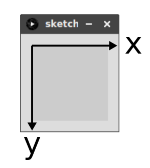

# Processing


{align=right} 
Processing est un outil de création multimédia utilisant le code informatique. Simple de prise en main, il a été créé par des artistes pour des artistes. On peut utiliser le langage Python pour entrer les instructions.

Nous l'utiliserons pour ajouter du graphisme à nos créations...

??? info "Documentation"
    - [Le site officiel (anglais)](https://processing.org/){:target="_blank"} 
    - [Un manuel d'utilisation (français)](https://fr.flossmanuals.net/processing/introduction/){:target="_blank"} 


{: .center} 


## Les bases de Processing

### Repère

À l'exécution de tout script Processing, une fenêtre s'affiche avec une zone de dessin. Sa taille se définit à l'aide de la fonction `size`. Par exemple, pour créer une zone de dessin de 300 pixels sur 200 pixels, on utilisera:

```python
size(300, 200)
```

Chaque pixel de cette zone est repérée par des coordonnées dans le repère suivant, dont l'origine se situe en haut à gauche et l'axe des ordonnées est **orienté vers le bas**.

{: .center} 

### Tracés

!!! info "Tracés de base"
    - `point` : permet de dessiner un point (pixel). En paramètre, les coordonnées du point.
    - `line`: permet de tracer une ligne entre deux points. En paramètres, les coordonnées des deux points.
    - `rect`: permet de tracer un rectangle. En paramètres, les coordonnées du sommet haut-gauche, puis la largeur et la hauteur du rectangle.
    - `ellipse`: permet de tracer une ellipse. En paramètres, les coordonnées du centre, puis la largeur et la hauteur (mettre la même valeur pour un cercle).

??? note "Exemples"
    Copier-coller le code suivant et faire varier les paramètres pour bien les comprendre.

    ```python
    size(200, 200)
    point(10, 60)
    line(10, 10, 100, 150)
    rect(80, 10, 20, 50)
    ellipse(150, 100, 80, 40)
    ```

### Couleurs

!!! info "Pinceau"
    - `background`: permet de définir la couleur du fond de la zone de dessin. En paramètres, les trois composantes RGB de la couleur.
    - `stroke`: permet de définir la couleur du pinceau (noir par défaut) pour le contour de la forme. En paramètres, les trois composantes RGB de la couleur.
    - `noStroke`: permet de dessiner une forme sans coutour (pas de paramètre).
    - `strokeWeight`: permet de définir la largeur du pinceau. En paramètre, le nombre de pixel.
    - `fill`: permet de définir la couleur de remplissage de la forme. En paramètres, les trois composantes RGB de la couleur.
    
??? note "Exemples"
    Copier-coller le code suivant et faire varier les paramètres pour bien les comprendre.

    ```python
    size(200, 200)
    background(255, 255, 255)
    stroke(255, 0, 0)
    point(10, 60)
    line(10, 10, 100, 150)
    stroke(0, 127, 255)
    strokeWeight(5)
    rect(80, 10, 20, 50)
    noStroke()
    fill(204, 153, 204)
    ellipse(150, 100, 80, 40)
    ```

### Exercices

!!! example "{{ exercice() }}"
    {align=right width=100px}

    Écrire un programme qui affiche le drapeau français, comme ci-contre, dans une zone de 300 x 200 pixels.

!!! example "{{ exercice() }}"
    Écrire un programme qui trace un quadrillage (espacement de 20 pixels).

    **Contrainte:** en seulement 3 lignes (sans compter éventuellement `size`.


!!! example "{{ exercice() }}"
    Afficher une croix verte de longueur 50 centrée au point (60 ; 40), et un cercle rouge de diamètre 30 centré en (150 ; 100). On prendra 10 pixels comme épaisseur.

!!! example "{{ exercice() }}"
    Créez un programme permettant d’afficher 100 disques à l’écran. La taille de chaque disque devra être aléatoire (mais comprise entre 20 et 50). La couleur de chaque disque devra aussi être aléatoire.

    Avec Processing, il est très simple d’avoir un nombre aléatoire : `random(a,b)` permet d’obtenir un nombre aléatoire entre `a` et `b`.

??? abstract "source"
    - site de [Cédric Gouygou](https://cgouygou.github.io/1NSI/)
    