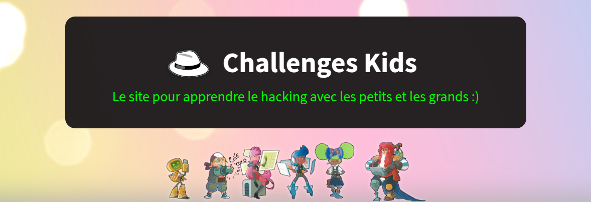

# Entraînement aux CTF
{{initexo(0)}}


Nous allons nous entraîner sur l'excellent site [https://www.challenges-kids.fr/index.php](https://www.challenges-kids.fr/index.php){. target="_blank"}

{: .center}


!!! example "{{ exercice() }} : stéganographie"
    [https://www.challenges-kids.fr/categories/stegano/chall1/](https://www.challenges-kids.fr/categories/stegano/chall1/){. target="_blank"}
    

    {{
    correction(False,
    """
    ??? tip \"Indice\" 
        Dans le pied de la page, passer la police en noir fait apparaître le flag.
    """
    )
    }}
    

!!! example "{{ exercice() }}: cryptographie 1"
    [https://www.challenges-kids.fr/categories/crypto/chall1/](https://www.challenges-kids.fr/categories/crypto/chall1/){. target="_blank"}

    Vous pouvez utiliser le site [https://gchq.github.io/CyberChef/](https://gchq.github.io/CyberChef/){. target="_blank"} et l'outil ROT13.


    {{
    correction(False,
    """
    ??? tip \"Indice\" 
        Le décalage est de 13.
    """
    )
    }}


!!! example "{{ exercice() }}: web"
    [https://www.challenges-kids.fr/categories/web/chall2/](https://www.challenges-kids.fr/categories/web/chall2/){. target="_blank"}
    
    {{
    correction(False,
    """
    ??? tip \"Indice\" 
        ```Ctrl-U``` pour afficher le code-source. 
    """
    )
    }}


!!! example "{{ exercice() }}: cryptographie 2"
    [https://www.challenges-kids.fr/categories/crypto/chall4/](https://www.challenges-kids.fr/categories/crypto/chall4/){. target="_blank"}

    Vous pouvez utiliser le site [https://gchq.github.io/CyberChef/](https://gchq.github.io/CyberChef/){. target="_blank"}.


    {{
    correction(False,
    """
    ??? tip \"Indice\" 
        L'outil est From Hex.
    """
    )
    }}


!!! example "{{ exercice() }}: réseau"
   
    [https://www.challenges-kids.fr/categories/network/chall2/](https://www.challenges-kids.fr/categories/network/chall2/){. target="_blank"}

    {{
    correction(False,
    """
    ??? tip \"Indice\" 
        Conversion hexadécimal vers décimal
    """
    )
    }}


!!! example "{{ exercice() }}: culture"
    [https://www.challenges-kids.fr/categories/culture/chall3/](https://www.challenges-kids.fr/categories/culture/chall3/){. target="_blank"}

    {{
    correction(False,
    """
    ??? tip \"Indice\" 
        Voir les annonceurs
    """
    )
    }}    


- Lien vers votre VM : [https://172.17.191.244:8006](https://172.17.191.244:8006){. target="_blank"}