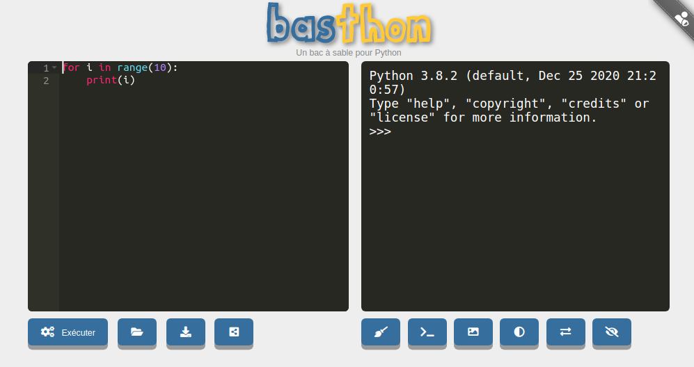

# Travailler en Python : aspects pratiques

## 1. Python, c'est quoi ?

C'est un langage de programmation inventé en 1991 par [Guido Van Rossum](https://fr.wikipedia.org/wiki/Guido_van_Rossum).

Ce langage est un des langages les plus utilisés actuellement (avec le C, le Java, le Javascript ...), notamment dans le monde scientifique. Il est aussi parfaitement adapté à la découverte de la programmation, de par sa clarté et sa concision. (il a aussi bien sûr beaucoup de défauts !)

## 2. Quel environnement de travail ?
Comme tous les langages de programmation, il n'existe pas **un** logiciel permettant de coder en Python, mais un très (très) grand nombre de logiciels différents, qu'on regroupe sous le nom d'IDE (interfaces de développement)

Parmi eux, je conseille Thonny :

### 2.1  Pour installer sur son pc perso : Thonny

{: .center}

1. Rendez vous sur la page [https://thonny.org/](https://thonny.org/)

2. Téléchargez et installez la version qui correspond à votre système d'exploitation (Windows, Mac, Linux).

### 2.2 Directement en ligne : Basthon

Rendez-vous sur la page [https://console.basthon.fr/](https://console.basthon.fr/)

