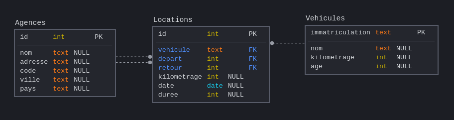

# Exercices sur le langage SQL

## Exercice 1
*(d'après Prépabac NSI, Terminale, G.CONNAN, V.PETROV, G.ROZSAVOLGYI, L.SIGNAC, éditions HATIER.)*

On veut créer une base de données ```baseHopital.db```  qui contiendra les trois tables suivantes :

|  | Patients |
|-----|----|
| ```Int```  | id |
| ```Text```  | nom |
| ```Text```  | prenom |
| ```Text```  | genre |
| ```Int```  | annee_naissance |


|  | Ordonnances |
|-----|----|
| ```Int```  | code |
| ```Int```  | id_patient |
| ```Int```  | matricule_medecin |
| ```Text```  | date_ord |
| ```Text```  | medicaments |

|  | Medecins |
|-----|----|
| ```Int```  | matricule |
| ```Text```  | nom_prenom |
| ```Text```  | specialite |
| ```Text```  | telephone |


On suppose que les dates sont données sous la forme ```jj-mm-aaaa```.

1. Donner les commandes SQLite permettant de créer ces tables.

<details><summary> <em>correction :</em>  </summary>
<p>

CREATE TABLE Patients(
    id INTEGER PRIMARY KEY AUTOINCREMENT,
    nom TEXT,
    prenom TEXT,
    genre TEXT,
    annee_naissance INTEGER
);

CREATE TABLE Ordonnances(
    code INTEGER PRIMARY KEY,
    id_patient INTEGER,
    matricule_medecin INTEGER,
    date_ord TEXT,
    medicaments INTEGER
);

CREATE TABLE Medecins(
    matricule INTEGER  PRIMARY KEY,
    nom_prenom TEXT,
    specialite TEXT,
    telephone TEXT
);


</p>
</details>

2. Mme Anne Wizeunid, née en 2000 et demeurant 3 rue des Pignons Verts 12345 Avonelit doit être enregistrée comme patiente. Donner la commande SQLite correspondante.

<details><summary> <em>correction :</em>  </summary>
<p>
INSERT INTO Patients VALUES (NULL, "Wizeunit", "Anne", "F", 2000);

Commentaire : NULL sert ici à ne rien mettre là où le SGBD gère tout seul la clé primaire en autoincrement. (hors-programme)
</p>
</details>

3. Le patient numéro 100 a changé de genre et est maintenant une femme. Donner la commande SQLite modifiant en conséquence ses données.

<details><summary> <em>correction :</em>  </summary>
<p>
UPDATE Patients SET genre = 'F' WHERE id = 100 ;

</p>
</details>


4. Par souci d'économie, la direction décide de se passer des médecins spécialisés en épidémiologie. Donner la commande permettant de supprimer leurs fiches.

<details><summary> <em>correction :</em>  </summary>
<p>
DELETE FROM Medecins WHERE specialite = "épidémiologie";

</p>
</details>


5. Donner la liste des patient(e)s ayant été examiné(e)s par un(e) psychiatre en avril 2020.
 
 <details><summary> <em>correction :</em>  </summary>
<p>
SELECT p.nom, p.prenom FROM Patients AS p 
<br>
JOIN Ordonnances AS o ON p.id = o.id_patient
<br>
JOIN Medecins AS m ON o.matricule_medecin = m.matricule
<br>
WHERE m.specialite = "psychiatrie" AND o.date_ord LIKE "%04-2020%"

</p>
</details>

## Exercice 2

Questions interactives à réaliser sur le site sqlzoo.net

1. Travail sur SELECT, (base de données Nobel) [ici](https://sqlzoo.net/wiki/SELECT_from_Nobel_Tutorial)

Correction : voir [https://github.com/jisaw/sqlzoo-solutions/blob/master/select-from-nobel.sql](https://github.com/jisaw/sqlzoo-solutions/blob/master/select-from-nobel.sql)

2. Travail sur SUM et COUNT, (base de données World) [ici](https://sqlzoo.net/wiki/SUM_and_COUNT)

Correction : voir [https://github.com/jisaw/sqlzoo-solutions/blob/master/sum-and-count.sql](https://github.com/jisaw/sqlzoo-solutions/blob/master/sum-and-count.sql)

3. Travail sur JOIN, (base de données Euro2012) [ici](https://sqlzoo.net/wiki/The_JOIN_operation)

Correction : voir [https://github.com/jisaw/sqlzoo-solutions/blob/master/join.sql](https://github.com/jisaw/sqlzoo-solutions/blob/master/join.sql)

## Exercice 3
_basé sur le travail de G.Viateau (Bayonne)_

On considère ci-dessous le schéma de la base de données du stock d'un supermarché :


1. Quelle requête SQL donne le prix d'achat du produit dont le ```nom_court``` est «Liq_Vaiss_1L» ?

<details><summary> <em>correction :</em>  </summary>
<p>
SELECT prix_achat FROM Produits WHERE nom_court = 'Liq_Vaiss_1L' ;
</p>
</details>


2. Quelle requête donne l'adresse, le code postal et la ville du fournisseur dont le nom est «Avenir_confiseur» ?

<details><summary> <em>correction :</em>  </summary>
<p>
SELECT adresse, cp, ville FROM Fournisseurs WHERE nom = 'Avenir_confiseur';
</p>
</details>


3. Quelle requête donne les produits étant en rupture de stock ?

<details><summary> <em>correction :</em>  </summary>
<p>
SELECT Produits.nom FROM Produits
<br>
JOIN Stocks ON Produits.id = Stocks.produit
<br>
WHERE Stocks.quantite = 0;

</p>
</details>


4. Quelle requête donne la liste de toutes les ampoules vendues en magasin ? On pourra faire l'hypothèse que le nom du produit contient le mot «ampoule»

<details><summary> <em>correction :</em>  </summary>
<p>
SELECT nom FROM Produits WHERE nom LIKE "%ampoule%";
</p>
</details>


5. Quelle requête permet d'avoir le prix moyen de ces ampoules ?

<details><summary> <em>correction :</em>  </summary>
<p>
SELECT AVG(prix_vente) FROM Produits WHERE nom LIKE "%ampoule%";
</p>
</details>


6. Quelle requête permet d'identifier le produit le plus cher du magasin ?

<details><summary> <em>correction :</em>  </summary>
<p>
SELECT nom_court FROM Produits ORDER BY prix_vente DESC LIMIT 1;
<br>
ou
<br>
SELECT nom FROM Produits WHERE prix_vente = (SELECT MAX(prix_vente) FROM Produits);
</p>
</details>


7. Quelle requête renvoie les noms des produits dont la date de péremption est dépassée ? _(on pourra utiliser la fonction SQL ```NOW()``` qui renvoie la date actuelle )_

<details><summary> <em>correction :</em>  </summary>
<p>
SELECT p.nom FROM Produits AS p
<br>
JOIN Stocks AS s ON s.produits = p.id
<br>
WHERE s.date_peremption < NOW();
</p>
</details>


## Exercice 4
_site réalisé par J. Le Coupanec (Académie de Rennes)_

Sur la page [http://nsi.colbert.bzh/sql/](http://nsi.colbert.bzh/sql/), suivez le parcours des deux TPs :
- TP1 : Gestion d'un réseau d'agences de location de voitures.
La base de données [locations.db](data/locations.db) contient les tables ```Agences```,```Locations```, ```Vehicules```.


<br>
<br>


- TP2 : Le championnat de France 2015-2016
La base de données [soccer.db](data/soccer.db) contient les tables ```Team```,```Match```, ```Event```, ```Player```.  


