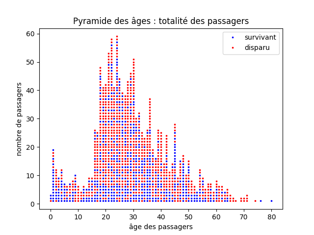
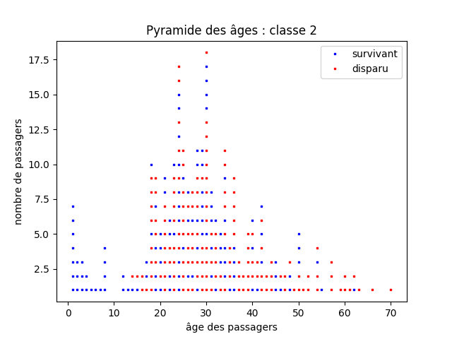

# Étude des passagers du Titanic

{: .center}


## 1. Le fichier titanic.csv
1. Téléchargez le fichier [titanic.csv](https://github.com/glassus/snt/raw/master/Theme4_Donnees_structurees/data/titanic.csv)
2. Ouvrez le avec **un éditeur de texte** (le Bloc-Notes de Windows, par exemple).
3. Que remarque-t-on sur la structure de ce document ?


>Les fichiers CSV (pour Comma Separated Values) sont des fichiers-texte (ils ne contiennent aucune mise en forme) utilisés pour stocker des données, séparées par des virgules (ou des points-virgules, ou des espaces...).

## 2. Utilisation d'un tableur
1. Ouvrez LibreOffice Calc
2. Depuis Calc, ouvrez le fichier ```titanic.csv``` .
3. Combien y a-t-il de passagers dans cette liste. Cela correspond-il à la totalité des passagers enregistrés sur le Titanic ?
4. Cliquez sur ```Données / Autofiltre ```et répondez à la question suivante : quel est le nom du passager de sexe masculin, âgé de 26 ans, ayant embarqué à Cherbourg en 1ère classe ?


## 3. Exploitation avec Python
Il est possible d'exploiter en Python les données d'un fichier csv. On peut, par exemple, utiliser le module csv.

### 3.1 Récupération des données
1. Dans Thonny, copiez-coller le code ci-dessous :

```python
import csv
f = open('titanic.csv', "r", encoding = 'utf-8')
donnees = csv.DictReader(f)
passagers = []
for ligne in donnees:
    passagers.append(dict(ligne))
    
f.close()
```
2. Exécutez ce code, puis tapez ```passagers``` en console.
La structure (complexe) de la variable ```passagers``` est appelée une **liste de dictionnaires**.

3. Tapez ```passagers[0]``` en console et observez le résultat.
4. Tapez ```passagers[12]['Nom']``` en console et observez le résultat.

### 3.2 Début d'analyse
1. Copiez-collez-exécutez le code ci-dessous :
```python
s = 0
for passager in passagers :
    if int(passager["survivant"]) == 1 :
        s = s + 1
print(s)
```
Que calcule ce code ?

2. Modifiez le code ci-dessus pour qu'il donne le nombre de passagers de troisième classe.
3. Miss Louise LAROCHE a-t-elle survécu au naufrage ?

### 3.3 Fonctions avancées

#### 3.3.1 Taux de survie en fonction de la classe

1. Copiez-collez-exécutez le code ci-dessous :
```python
def survie_classe(classe):
    surv = 0
    tot = 0
    for passager in passagers :
        if int(passager["classe"]) == classe :
            tot = tot + 1
            if int(passager["survivant"]) == 1 :
                surv =  surv + 1
    return surv / tot
```
2. À l'aide de cette fonction, donnez le taux de survie en 1ère, 2ème et 3ème classe.

#### 3.3.2 Taux de survie en fonction du genre

Modifiez le code précédent pour créer une fonction ```survie_genre(sexe)``` où ```sexe``` sera le paramètre ```"male"``` ou ```"female"```, rentré par l'utilisateur.

Exemple d'appel de la fonction :
```python
>>> survie_genre("male")
```

#### 3.3.3 Taux de survie en fonction du genre ET de la classe

Modifiez le code précédent pour créer une fonction ```survie_genre_classe(sexe, classe)``` où 
- ```sexe``` sera le paramètre ```"male"``` ou ```"female"```
- ```classe``` sera le paramètre ```1```, ```2``` ou ```3```

Exemple d'appel de la fonction :
```python
>>> survie_genre_classe("male", 2)
```


### 3.4 Exploitation graphique

#### 3.4.1 Pyramide des âges totale

Le code suivant permet de générer la pyramide des âges de la totalité des passagers, en faisant apparaître d'une couleur différente les survivants et les disparus.

```python
import matplotlib.pyplot as plt

cumul_age = [0]*81
points = []

for p in passagers:
    age = int(p["age"])
    cumul_age[age] += 1
    points.append((age,cumul_age[age], p["survivant"]))

X = [k[0] for k in points if k[2] == '1']
Y = [k[1] for k in points if k[2] == '1']

plt.plot(X,Y,'bs', label = 'survivant', markersize = 2) 

X = [k[0] for k in points if k[2] == '0']
Y = [k[1] for k in points if k[2] == '0']

plt.plot(X,Y,'rs', label = 'disparu', markersize = 2)

plt.xlabel('âge des passagers')
plt.ylabel('nombre de passagers')
plt.legend(loc = 'upper right')
plt.title('Pyramide des âges : totalité des passagers')

plt.show()
```


{: .center}


#### 3.4.2 Pyramide des âges par classe

```python
import matplotlib.pyplot as plt

cumul_age = [0]*81
points = []

for p in passagers:
    if p['classe'] == '1':
        age = int(p["age"])
        cumul_age[age] += 1
        points.append((age,cumul_age[age], p["survivant"]))

X = [k[0] for k in points if k[2] == '1']
Y = [k[1] for k in points if k[2] == '1']

plt.plot(X,Y,'bs', label = 'survivant', markersize = 2) 

X = [k[0] for k in points if k[2] == '0']
Y = [k[1] for k in points if k[2] == '0']

plt.plot(X,Y,'rs', label = 'disparu', markersize = 2)

plt.xlabel('âge des passagers')
plt.ylabel('nombre de passagers')
plt.legend(loc = 'upper right')
plt.title('Pyramide des âges : classe 1')

plt.show()
```

{: .center}


En faisant de légères modifications, on obtient aussi :

{: .center}


{: .center}
